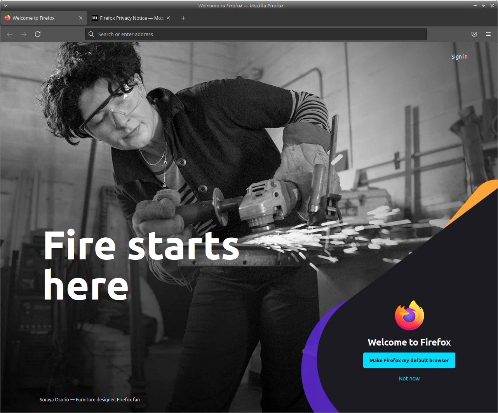
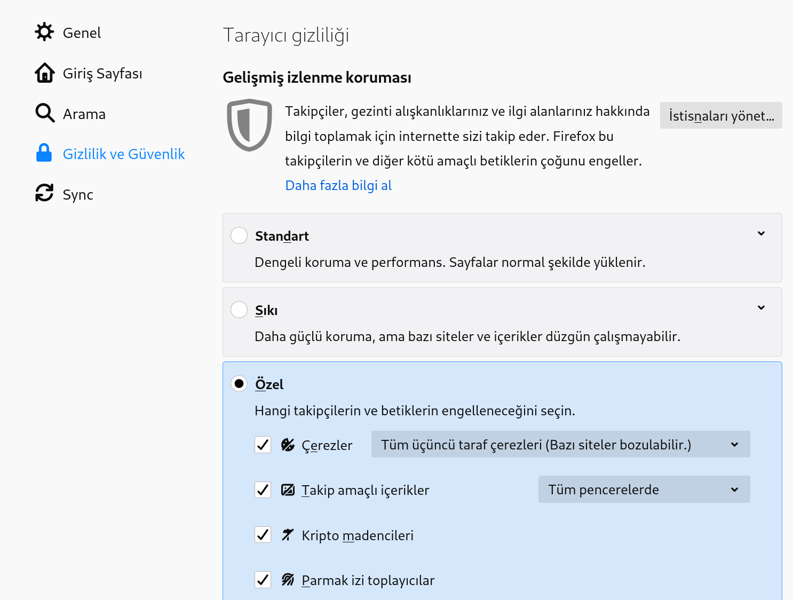
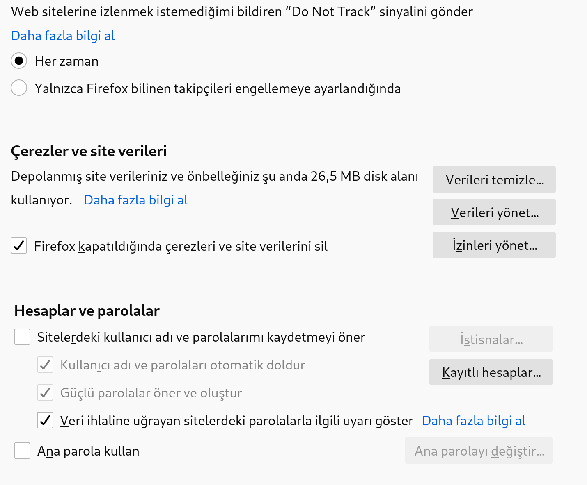
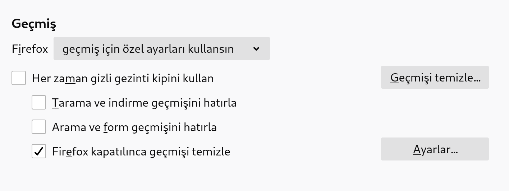
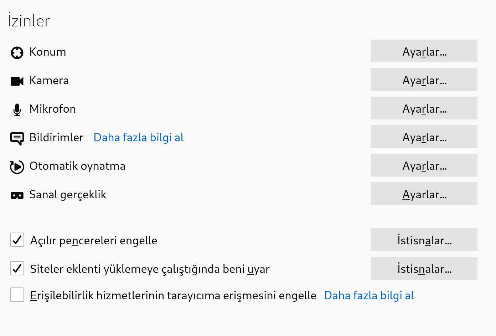
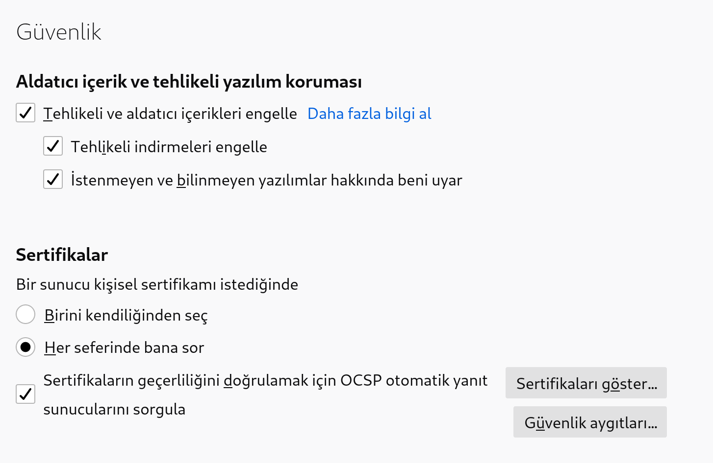
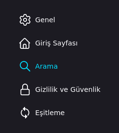
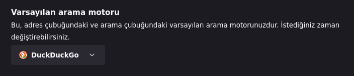
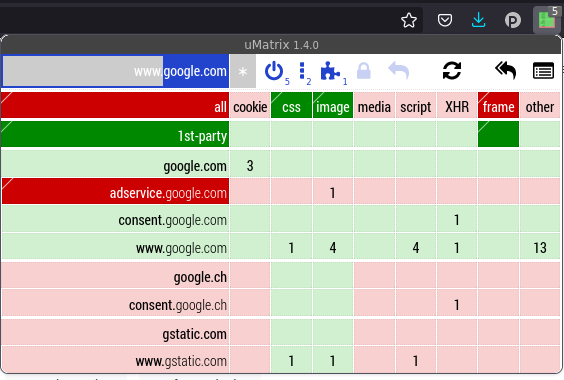

# Güvenli Web Gezintisi

<!-- toc -->

Bilişim güvenliği bilgisayarınız kadar bu bilgisayarla eriştiğiniz diğer bilgisayar ve hizmetleri de kapsamakta. Bu bakımdan günümüzde İnternet ile en sık temas edilen alan web sayfaları. Web'de gezinmek için bir tarayıcı kullanmak gerekli olduğundan bu tarayıcının genelde devletlerin ve şirketlerin elinde tehlikeli bir yer haline gelmiş Web'de sizi takip edilmekten ve zararlı sonuçlardan koruması gerekli.

Aynı şekilde Web'deki gezintilerde güvenli kalabilmek sizin farkındalığınıza bağlı. Bir sitenin veya bir bağlantının kötücül olup olmadığını anlamak biraz deneyim, bilgi ve sağduyu gerektirmekte. Bu neden ile teknoloji anonimliğinize ve güvenliğinize çok katkı verebilecek olsa da son noktada kullanıcının bilinçli kullanımı önem kazanmakta. Keza günümüzdeki web siteleri anonimliğinizi ve güvenliğinizi korumaya çalıştığınızda sizi cezalandırmaya veya bozulmaya eğilimli olduğundan ilk sorunda tüm güvenlik tedbirlerini kapatacaksanız pek güvende kalacak sayılmazsınız.

## Web tarayıcınızı seçin

Öncelikle bir tarayıcı tercih etmeniz ve bunu bilgisayarınıza kurmanız gerekli. Diğer tüm bilişim sistemlerinde olduğu gibi özgür bir yazılım olan Mozilla Firefox'u kullanmanızı öneriyoruz.

[Firefox'u buraya tıklayarak indirebilir.](https://getfirefox.com) veya aşağıdaki komutları kullanarak GNU/Linux dağıtımınızın yazılım deposundan kurabilirsiniz.

Debian tabanlı dağıtımlar için: `sudo apt-get install firefox`

RPM tabanlı dağıtımlar için: `sudo yum install firefox`



## Firefox güvenlik ayarlarını yapın

### Üçüncü taraf çerezleri devre dışı bırakın

Üçüncü parti çerezler, siz İnternet'te gezinirken davranışlarınızı izlemek için reklam ağları tarafından kullanılan tanımlayıcılardır. Bu çerezler tarayıcınızın buna ayrılan bir alanına yerleştirilir ve siz girdiğiniz siteden ayrıldıktan sonra da orada kalmaya devam eder. Her gezdiğiniz sayfada bu çerezler reklam (Google, FB vs.) şirketlerince okunarak tarama alışkanlıklarınız ve nelerle ilgilendiğiniz takip edilir. Tarayıcılar bu takip sistemlerini kısıtlamakta ilerlese de üçüncü taraf çerezlerin tarayıcınızda hiç işi olmadığından engellenmeleri güvenliğiniz için önemli bir adımdır. Bunun için;

1. Sandviç menüden Tercihler'e girin. Gizlilik ayarlarını yapmak için Gizlilik ve Güvenlik'e tıklayın. Gelişmiş izleme koruması başlığı altındaki Üçüncü sırada olan "Özel" seçeneğini seçin.

2. En yüksek düzeyde güvenlik için sırasıyla Çerezler, Takip amaçlı içerikler, Kripto madencileri, Parmak izi toplayıcılar seçeneklerinin hepsini işaretleyerek engellenmelerini sağlayın.

3. Çerezler'in yanındaki menüden "Tüm üçüncü taraf çerezleri"ni seçin. Hemen altındaki menüden "Tüm pencerelerde" seçeneğini seçin.



4. Aşağı inince göreceğiniz "Web sitelerine Do Not Track (İzlemeyin) sinyali gönder" ibaresinin altında "Her zaman" seçeneğini tıklayın.



5. Çerezler ve site verilerinin altında "Firefox kapatıldığında çerezleri ve site verilerini sil" seçeneğini işaretleyin.
6. Gezinme geçmişinizin temizlendiğinden emin olmak için; Geçmiş ayarlarının olduğu yerdeki menüden "Firefox geçmiş için özel ayarlar kullansın" seçeneğini işaretleyin. Altındaki kutucuklardan "Firefox kapatılınca geçmişi temizle"yi tıklayın.



7. İzinler başlığının altında "Açılır pencereleri engelle" ve "Siteler eklenti yüklemeye çalıştığında beni uyar" seçeneklerini seçin.



8. Firefox veri toplama ve kullanma izinleri başlığının altındaki hiçbir kutucuğu işaretlememenizi öneririz.

9. Aldatıcı içerik ve tehlikeli yazılım koruması başlığının altındaki kutucukların hepsini işaretleyin.

10. Sertifikalar başlığının altında "Her seferinde bana sor" ve "Sertifikaların geçerliliğini doğrulamak için OCSP otomatik yanıt sunucularını sorgula" seçeneklerini işaretleyin.



### Varsayılan arama motorunuzu değiştirin

Günümüzde neredeyse her kullanıcının ilk girdiği sayfa bir arama motoru. Bu alanda Google hala açıkara bir üstünlüğe sahip olsa da mahremiyet düşmanlığı ve kötücül arama tercihleri sebebi ile arama mahremiyetine önem veren alternatifleri hızla gelişmekte. Bu arama motorları çeşitli derecede başarılara sahip olmakla kimi ender zamanlarda Google'ı aratabilir. Lakin Google'a ancak başka hiç bir çareniz kalmayınca dönmenizi öneririz. Keza hem Google'ı kullanarak varlığını devam ettirmesine katkı sağlamış hem de sizi takip etmeleri için bir fırsat yaratmış olursunuz.

Çeşitli alternatif arama motoru bugün için kullanılabilir durumda. Bunlar çeşitli seviyelerde başarılı olmakla birlikte en özgürlük ve mahremiyet yanlısından en azına doğru aşağıdaki şekilde sıralanabilir.

* **[Searx:](https://searx.space/)** Searx dağıtık bir arama motoru. Bu anlamda belirli bir Searx yok, pek çok farklı kişi tarafından barındırılan temsiller bulunmakta. Searx bir arama motorunun getirebileceği tüm mahremiyet araçlarını taşımakta. Sonuçları her ne kadar yerelleştirilmiş aramalarda eksik kalabilecek olsa da pek çok genel amaçlı aramada istenen sonucu verecektir. Bir aramaya başlamak ve mahremiyetinizi korumak için en iyi seçenek sayılabilir. [Dilediğiniz bir Searx temsilini](https://searx.space/) seçerek ilk aramanızı yapabilirsiniz.

* **[MetaGer:](https://metager.org)** Şayet Searx gibi dağıtık ve kendi sunucunuzda çalıştırabileceğiniz bir arama motoru çok radikal bir araç ise Avrupalı bir Dernekçe çalıştırılan arama motoru ilginizi çekebilir. Şirketlerin sahip olacağı kar güdüsünün olmadığı bir ortamda şeffaflıkla çalışan bir arama motoru mahremiyet ve güvenlik beklentilerinizi karşılayabilir.

* **[DuckDuckGo:](https://duckduckgo.com)** Mahremiyeti arama motorlarında bir beklenti haline getiren en ana akım arama motoru DuckDuckGo. Geniş bir kullanıcı kitlesine ve görece bilenmiş bir motora sahip. Bu bakımdan pek çok insanın başka bir arama yapmasını gerektirmeyecek kadar iyi sonuçlar verebilmekte. [Spread Privacy](https://spreadprivacy.com/why-use-duckduckgo-instead-of-google/) DDG tarafından yürütülen bir mahremiyet rehberi. Burada kendilerine neden güvenebileceğinize dair açıklamalarını okuyabilirsiniz. Şayet DuckDuckGo'yı en minimal ve güvenli şekilde kullanmak isterseniz [Javascript içermeyen lite](https://html.duckduckgo.com/html) sayfasından kullanabilirsiniz.

Firefox'ta varsayılan arama motorunuzu belirlemek için ayarlara gelip sağ menüden search (arama) seçeneğini seçip ardından ilgili bölümden DuckDuckGo'yu seçebilirsiniz.





## Tarayıcı eklentileri

Tarayıcılara çeşitli işlevler kazandırmak için eklentiler kurulabilmekte. Eklentiler ile tarayıcıların almadıkları kimi tedbirlerin alınması veya bu tedbirlerin kullanımının kolaylaştırılması mümkün. Bunların başında reklamların ve üçüncü taraf javascriptlerin çalışmasının engellenmesi/sınırlandırılması, çerez yönetimi ve şifreleme kontrolü bulunuyor. 

### Başlıca eklentiler

Aşağıdaki eklentiler, herkesin sürekli olarak kullanmasını önerdiğimiz başlıca eklentiler.


|||
|---|---|
||[uBlock Origin](https://github.com/gorhill/uBlock) reklam ve gözetim ağlarının çoğunu engeller.|
||[HTTPS Everywhere](https://www.eff.org/https-everywhere), Tarayıcınız ile girdiğiniz web sitelerini desteklemesi durumunda şifreli HTTPS bağlantısı kurmaya zorlar. Şayet şifreli bağlantı mümkün değil ise bu konuda size bir uyarı göstererek tercihinizi sorar.|
||[Privacy Badger](https://www.eff.org/privacybadger) sizi izleme eğiliminde olan takipçileri dinamik olarak tespit eder ve engeller. Privacy Badger reklam engelleyici olmadığı için uBlock alternatifi değildir, ancak uBlock'un varsayılan modda sahip olmadığı güvenlik özelliklerine sahiptir.|
||[Cookie Autodelete](https://github.com/Cookie-AutoDelete) Web sayfalarını ziyrate ettiğinizde tarayıcınıza işlevlerin yerine getirilmesi için yerleştirilen ve çoğu zaman sizi takip etmekte de kullanılan çerezleri sayfayı terk etmeniz üzerine siler. Bu sayede arkanızda bir çerez izi bırakmadan web de gezinebilirsiniz.

### Gelişmiş takip sistemleri ve gerekli eklentiler

Bu bölümde anlatılan eklentiler tarayıcınızın ve doğal olarak web gezintinizin mahremiyetini ve güvenliğini daha da arttırabilir. Lakin kullanıcıların takibi için kullanılan daha detaylı ve kimi zaman web sayfalarının çalışması için gereken işlevleri de engelleyebileceği için tamamen sorunsuz bir tarama deneyimine engel olabilir. Kimi zaman çalışmayan web sayfalarını çalıştırmak için eklentilerin ayarlarını özelleştirmek gibi zahmetli görülecek anlar yaratabilir. Aşağıda bu bölümde önereceğimiz eklentilerle engellenmeye çalışılan web takip sistemlerinin bazıları şunlardır;

* __HTTP User-Agent:__ Tarayıcınız ziyaret ettiğiniz sitelere "user-agent" adı altında tarayıcı, işletim sistemi ve ilgili bilgileri gönderir. Bu web sayfalarının tarayıcınıza uygun olarak düzenlenmesini sağladığı gibi cihazınıza has belirgin özellikler aracılığı ile takip edilmenize de sebep olabilir. Bu noktada Windows ve Chrome kullanan kalabalıktan ayrıldığınız anda belirgin bir hedef haline gelirsiniz. Özellikle bir GNU/Linux dağıtımı ve Firefox kullanıyorsanız. Bu amaçla kalabalığa karışmak için bu değerin en yaygın değerlere çevrilmesi gereklidir.
* __HTML5 Canvas:__ HTML5 Canvas takibi tarayıcıların geleneksel yöntemlerin yeterli olmaması üzerine geliştirdikleri bir takip sistemi. Tarayıcınızın web sayfasını ekranınıza çizmesine yarayan sistemin kötüye kullanılması ile gerçekleşen bu takibi tamamen engellemek mümkün olmasa da kimi eklentiler ile ciddi şekilde azaltılması mümkün.
* __JavaScript:__ JavaScript modern web'in var olmasının ve aynı zamanda günümüzde bu kadar sorunlu olmasının da sebebi. JS ile web siteleri pek çok etkileşimli özelliği kullanıcılarına sunabilmekte ama her yazılım gibi kullanıcıların cihazında çalışan bu kod kötüye kullanıma da açıktır. Tarayıcınızda girdiğiniz web sitesinden veya harici kaynaklardan yüklenen JS ile hakkınızda takip yapılması mümkün. Bunu engellemenin en kesin yolu JS kodlarının tarayıcınızda çalışmasını tamamen engellemektir ama geldiğimiz günde bu pek çok sayfayı tamamen bozacağından bunu kontrollü ve seçici olarak yapmak gerekmekte.

### Tavsiye edilen gelişmiş eklentiler

* [µMatrix](https://addons.mozilla.org/en-US/firefox/addon/umatrix/) seçici olarak sayfaların yüklediği javaScriptler dahil tüm elementleri ve üçüncü-taraf kaynakları kontrol etmenizi sağlar. Kullanımı başta karmaşık gelecek ise de uMatrix basitçe girdiğiniz sayfanın tüm elementlerini bloklar halinde önünüze serer.



uMartix her satırda elementlerin yüklendiği alan adlarını, her sütunda da yüklenen elementleri ve sayısını göstermekte. Bunları her kutunun üst veya altına tıklayarak engelleyip izin verebileceğiniz gibi tümden bir satır ve sütuna en uçlardaki kutulardan da aynı şekilde izin verebilirsiniz. Sayfayı yenilediğinizde izin verdiğiniz veya engellediğini elementlerle birlikte sayfa dilediğiniz şekilde tekrar yüklenecektir. Belirli bir sayfa için bu değişiklikleri kalıcı kılmak isterseniz asmakilit simgesine tıklayarak değişikliklerinizi kaydedebilirsiniz.

* [Canvas Blocker](https://addons.mozilla.org/en-US/firefox/addon/canvasblocker/) HTML5 canvas desteğini belirli siteler için devre dışı bırakmanızı sağlar. CanvasBlocker'i ilk kurduğunuzda karşınıza gelen sayfadan ihtiyacınız olan güvenlik seviyesini seçerek "apply" düğmesi ile tercihinizi kaydedebilirsiniz.

* [CleanURLs](https://addons.mozilla.org/en-US/firefox/addon/clearurls/) Kimi siteler, çoğu zaman sizi çeşitli sebeplerle takip etmek üzere bağlantılara takip parametreleri yerleştirebilirler. Bu bağlantılara tıklamanız üzerine gittiğiniz sayfa bağlandıda bulunan bilgiye bağlı olarak sizin kim olduğunuzu, nereden geldiğinizi öğrenebilir. Bu şekilde takip edilmemek için bağlantıları elle olması gerektiği hale getirebileceğiniz gibi CleanURLs eklentisi ile bu işlemi otomatize de edebilirsiniz.

### Eklentilerin sayfaları bozması

Kimi sayfalar sizi takip etmeye veya gerekmedik yerlerde takip için kullanılan teknolojileri kullanmaya o kadar yer ayırmışlardır ki aldığınız tedbirler bu sayfaların kısmen veya tamamen çalışmasına engel olabilir. Bu durumda özellikle o sayfaya güveniyoranız veya başka çareniz yok ise bu bozukluğu gidermek isteyebilirsiniz. Yukarıda belirtilen kadar eklenti kurulduktan sonra kimi zaman hangi eklentinin ilgili sayfayı bozduğunu anlamak kolay olmayabilmekte. Bunun aşmanın en hızlı yolu Firefox'u güvenli modda eklentiler olmadan çalıştırmak. Bu tüm tedbirlerinizi berteraf edeceği için gerekmedikçe kullanılmaması önerilir. Bunun için Firefox menüsünden `yardım` sekmesinden `sorun giderme modu` seçeneğini seçebilirsiniz.

## Firefox'un Ayarlarını Güçlendirmek

Firefox ne yazık ki tam anlamı ile kullanıcı güvenliğini ve mahremiyetini koruyacak ayarlarla gelmemekte. [Mozilla Vakfı](https://foundation.mozilla.org/en/) genellikle kullanıcıların kolaylık beklentileri ile en yüksek güvenlik ve mahremiyet standartları arasında  bir ortayol arama çabasında bulunmakta. Bu ortayol çabasını kendi güvenliğiniz lehine çevirmek için Firefox'un kimi gizli ayarlarını düzeltmeniz gerekli. Bunun için sırası ile aşağıdaki işlemleri uygulayabilirsiniz:

Öncelikle Firefox'u çalıştırıp adres çubuğuna aşağıdaki satırı yazıp giriş yapın:

`about:config`

Sizi satırlar dolusu bir tablo ve bir arama çubuğu karşılayacak. Aşağıdaki ayarlardan düzenlemek istediklerinizi arama çubuğuna yazıp belirtilen değişikliği yapabilisiniz.


[WebRTC](https://en.wikipedia.org/wiki/WebRTC) günümüzde Jitsi gibi pek çok tarayıcı üzerinden çalışan yazılımın kullandığı bir teknoloji. Lakin aynı zamanda tasarım itibari ile tarayıcınızın cihazınıza ait gerçek IP adresini sızdırmasına da sebep olmakta. Bu sebeple özellikle VPN ve TOR kullandığınız bir kurulumda WebRTC'nin devre dışı bırakılması önem arzediyor. Kimi web yazılımlarını bu sebepten dolayı çalışmayabilir.

`media.peerconnection.enabled`

Bu satıra çift tıklayarak `false` yazmasını sağlayın

[Fingerprint veya parmakizi](https://en.wikipedia.org/wiki/Device_fingerprint#Browser_fingerprint) tarayıcıların cihaza özel yapılandırmalardan kullanıcıları takip etmeye yarayan bir yöntem. Firefox bunu varsayılan olarak engellemek üzerine ayarlı. Lakin yine de kontrol etmek isteyebilirsini.

`privacy.resistfingerprinting` "true" olmalıdır.

Firefox'un doldurduğunuz formların içeriklerini hatırlayıp kaydetmesini mahremiyetiniz için tercih etmeyebilirsiniz. Keza bu bilgiler cihazınızda duracağından sizin için bir risk oluşturabilir. Bu özelliği kapatmak için aşağıdaki ayarı değiştirebilirsiniz.

`browser.formfill.enable` "false" olmalıdır.

Web'de gezindiğiniz sayfaların cihazınızın konumuna erişmesi sizin için bir mahremiyet riski olabilir. Firefox'un bu talepleri kendiliğinden berteraf etmesi için aşağıdaki ayarı değiştirebilirsiniz.

`geo.enabled` "false" olmalıdır.

Telemetri tarayıcınızın kimi eylemlerini bildirmesine sebep olabilir. Bu girdiğiniz sitelerin sizin hakkınızda bilgi edinmesine ve sizi takip etmelerini sağlayabilir. Bu telemetrileri kapatmanız tavsiye edilir. Aşağıdaki satırları bulup "false" olarak işaretleyebilirsiniz.

```
toolkit.telemetry.archive.enabled
toolkit.telemetry.bhrping.enabled
toolkit.telemetry.firstshutdownping.enabled
toolkit.telemetry.newprofileping.enabled
toolkit.telemetry.unified
toolkit.telemetry.updateping.enabled
toolkit.telemetry.shutdownpingsender.enabled
toolkit.telemetry.shutdownpingsender.enabledFirstSession
toolkit.telemetry.pioneer-new-studies-available
```
Firefox tarama deneyiminizi iyileştirmek için çeşitli içerikleri siz açıkça talep etmeseniz de yüklemeye çalışabilir veya tarama geçmişinizi girdiğiniz sitelere iletebilir. Bu hareketlerinizi ifşa ettiğinden mahremiyetiniz için bir sakınca oluşturabilir. Bu ayarları değiştirerek Firefox'un sadece talep ettiğiniz içeriklere erişmesini sağlayabilirsiniz.

`network.dns.disableprefetch` "true" olmalıdır.

`network.prefetch-next` "false" olmalıdır.

`dom.webnotifications.enabled` "false olmalıdır.

`network.http.sendRefererHeader` "0" olmalıdır.

`network.http.referer.XOriginPolicy` "2" olmalıdır.

`security.ssl.disable_session_identifiers` arama çubuğuna yazdıktan sonra "bolean" seçeneğini seçip + simgesine tıklayın ve değerin "true" olduğunu kontrol edin.

İnternetin ve Web'in temel şifreleme teknolojisi olan [TLS](https://en.wikipedia.org/wiki/Transport_Layer_Security) pek çok geçmişten kalan ve artık güvenli sayılmayan bağlantı standardını hala yaşatmaktadır. Eski sistemlerin desteklenmesi için süren bu uygulama sizin için bir güvenlik riski teşkil edebilir. Bu ayarları değiştirdiğinizde pek çok büyük şirketin ve kimi devlet kurumlarının sitelerinin çalışmaması sonucu ile karşılaşabilirsiniz. Güvenli bağlantı kurmayan bu sitelere erişmek için bu ayarları geçici olarak kaldırmanız gerekebilir.

`security.ssl3.rsa_des_ede3_sha` "false" olmalıdır.

`security.ssl.require_safe_negotiation` "true olmalıdır.

`security.tls.version.min` "3" değerinde olmalıdır.

`security.tls.enable_0rtt_data` "false" olmalıdır. Bu değer ile her şifreli bağlantı ile yeni bir anahtar oluşturulur.

[WebGL](https://en.wikipedia.org/wiki/WebGL) Web yazılımlarının cihazınızın grafik işlemcisine erişebilmesini sağlayan bir teknoloji. Bu çeşitli güvenlik sorunlarını da birlikte getirdiğinden bu ayarı kapatmanız güvenliğinizi arttırabilir.

`webgl.disabled` "true" olmalıdır.

Tarayıcınızın bilgisayarınızın batarya durumunu ziyaret ettiğiniz web sitelerine iletmesinin bir anlamı var mı gerçekten?

`dom.battery.enabled` "false" olmalıdır.

Firefox hesaplarını kullanmıyorsanız kapatmanız mahremiyetiniz için iyi olacaktır.

`identity.fxaccounts.enable` "false" olmalıdır.

Web'de görüntülemek istediğiniz PDF'leri görüntülemek için JavaScript kullanmanız gerekmediğinden bu özelliği güvenliğiniz için kapatmak yerinde olur.

`pdfjs.enableScripting` "false" olmalıdır.

Bezner şekilde Mozilla'nın FireFox'a zorla gömdüğü mülk bir yazılım olan Pocket'i devredışı bırakmak tercih edilebilir.

`browser.newtabpage.activity-stream.section.highlights.includePocket` false olmalıdır.

### Güvenlik ayarlarının sayfaları bozması

Bu bölümde anlatılan ayarlar kimi sayfaların bozulmasına sebep olabilir. Örneğin önerilen özgür bir konferans yazılımı olan Jitsi WebRTC teknolojisini kullanmakta fakat yerel IP adresinizin ifşa olmaması için yukarıda yapılan ayarlar bu özelliği kapatmakta. Bu sorunlarla karşılaşılması durumunda sorunu düzeltmek için kimi ayarları kapatmanız gerekli olacaktır.

Bunu yapmanın en kolay yolu [Privacy Settings](https://addons.mozilla.org/en-US/firefox/addon/privacy-settings/) ile burada belirtilen kimi ayarları kapatıp açmaktır. Bu eklenti size hem belirli ayarları değiştirmeyi hem de tercih edilecek seviyeye bağlı olarak standart ayarları anlık olarak yapma seçeneği sunacaktır.

Şayet Privacy Settings eklentisi ile sorunu çözemez veya kesin ve hızlı bir çözüme ihtiyaç duyarsanız Firefox'u yeni gibi başlatmayı seçebilirsiniz. Bunu yaptığınız ayarları kaybetmeden yapabileceğiniz en iyi yol Firefox'un `home` dizininizde bulunan `.mozilla` dizininde tekrar adlandırıp Firefox'u başlatmaktır. Bunu yaptığınızda yeni bir `firefox` dizini oluşacak ve Firefox ilk kurulum ayarlarında açılacaktır. İşinizi bitirdikten sonra basitçe yeni oluşan Firefox dizinini silip adını değiştirdiğiniz eski dizine orjinal adını tekrar vermekle eski duruma geri dönebilirsiniz.
