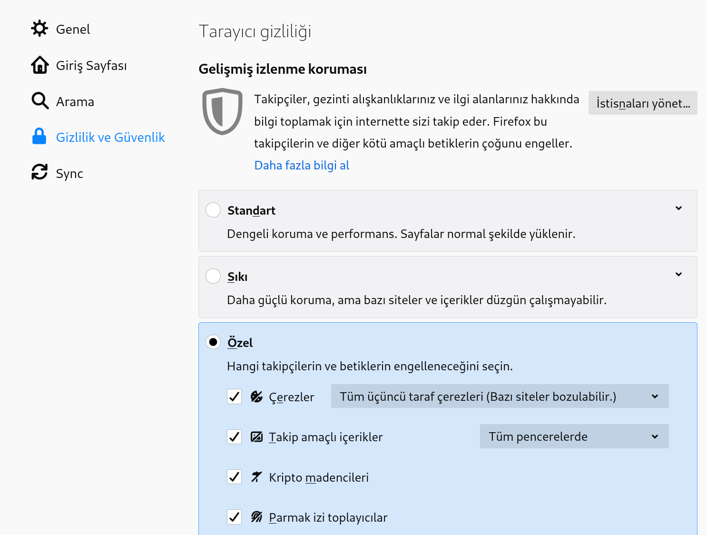
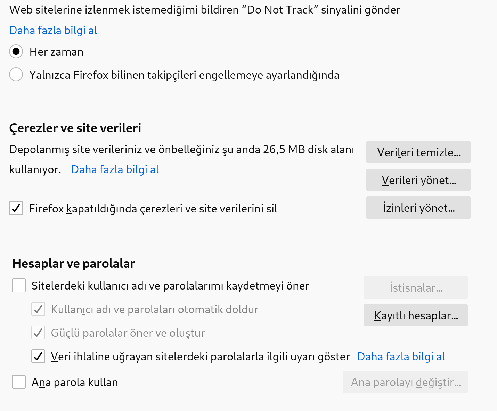
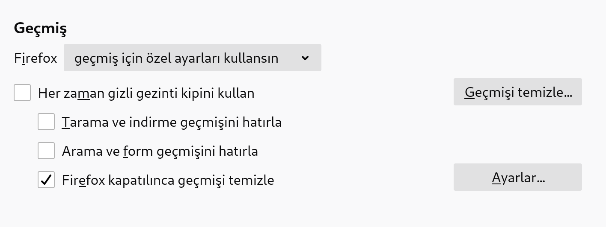
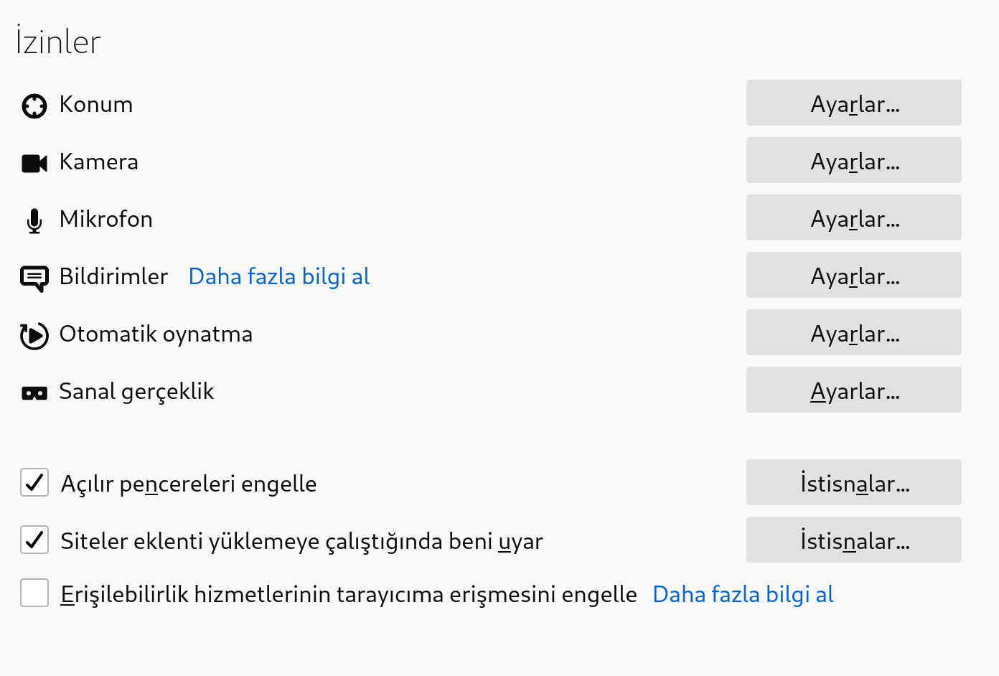
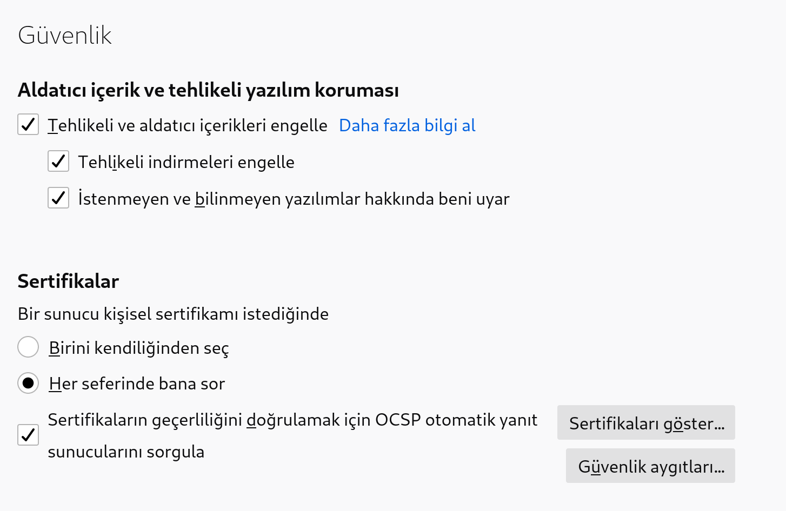

# Güvenli Web Gezintisi

## Web tarayıcınızı seçin

En bilindik dört tarayıcı, Firefox, Chrome, Internet Explorer ve Safari, yakın geçmişte ciddi güvenlik sorunları açığa çıkardı. Tercihiniz ne olursa olsun, en güncel sürümü kullandığınızdan emin olmalısınız.

Bu dört tarayıcı da [[browser-score-card]] düşük puanlar aldı. Yine de, bu tarayıcılar aşağıda belirttiğimiz belli başlı eklentiler kullanılarak iyileştirilebilir.

Alternatif olarak, Firefox'un, Tor Projesi tarafından daha güvenli ve anonim olmak için özelliştirilmiş versiyonu olan [Tor Tarayıcısı](https://www.torproject.org/download/download-easy.html.en)'nı kullanabilirsiniz.

## Firefox'ta Ayarlarınızı Yapın

### Üçüncü taraf çerezleri devre dışı bırakın

Üçüncü parti çerezler, siz internette gezinirken davranışlarınızı izlemek için reklam ağları tarafından kullanılan tanımlayıcılardır.

1. Sandviç menüden Tercihler'e girin. Gizlilik ayarlarını yapmak için Gizlilik ve Güvenlik'e tıklayın. Gelişmiş izleme koruması başlığı altındaki Üçüncü sırada olan "Özel" seçeneğini seçin.

2.En yüksek düzeyde güvenlik için sırasıyla Çerezler, Takip amaçlı içerikler, Kripto madencileri, Parmak izi toplayıcılar seçeneklerinin hepsini işaretleyerek engellenmelerini sağlayın. 

3. Çerezler'in yanındaki menüden "Tüm üçüncü taraf çerezleri"ni seçin. Hemen altındaki menüden "Tüm pencerelerde" seçeneğini seçin.

4. Aşağı inince göreceğiniz "Web sitelerine Do Not Track(İzlemeyin) sinyali gönder" ibaresinin altında "Her zaman" seçeneğini tıklayın.

5. Çerezler ve site verilerinin altında "Firefox kapatıldığında çerezleri ve site verilerini sil" seçeneğini işaretleyin. 

6. Gezinme geçmişinizin temizlendiğinden emin olmak için; Geçmiş ayarlarının olduğu yerdeki menüden "Firefox geçmiş için özel ayarlar kullansın" seçeneğini işaretleyin. Altındaki kutucuklardan "Firefox kapatılınca geçmişi temizle"yi tıklayın.

7. İzinler başlığının altında "Açılır pencereleri engelle" ve "Siteler eklenti yüklemeye çalıştığında beni uyar" seçeneklerini seçin.

8. Firefox veri toplama ve kullanma izinleri başlığının altındaki hiçbir kutucuğu işaretlememenizi öneririz.

9. Aldatıcı içerik ve tehlikeli yazılım koruması başlığının altındaki kutucukların hepsini işaretleyin.

10. Sertifikalar başlığının altında "Her seferinde bana sor" ve "Sertifikaların geçerliliğini doğrulamak için OCSP otomatik yanıt sunucularını sorgula" seçeneklerini işaretleyin.

### Varsayılan arama motorunuzu değiştirin

Yine tercihlerden "Arama" kısmına gelin. Varsayılan arama motoru olarak [duckduckgo.com](https://duckduckgo.com)'yu seçin. Riseup arama motoru olarak DuckDuckGo'yu öneriyor. [Masaüstü](https://duck.co/help/desktop/adding-duckduckgo-to-your-browser) veya [mobil](https://duck.co/help/mobile) tarayıcılar için kurulum talimatlarını inceleyin.

## Tarayıcı eklentileri

Eklentiler aksi belirtilmedikçe Firefox ve Chrome ile uyumludur.

### Başlıca eklentiler

Aşağıdaki eklentiler, herkesin sürekli olarak kullanmasını önerdiğimiz başlıca eklentilerdir. Stabil ve açık kaynak olan bu eklentiler, web sitelerinin bozulmasına çok nadir sebep olurlar.

|||
|---|---|
||[uBlock Origin](https://github.com/gorhill/uBlock) ([Chrome](https://chrome.google.com/webstore/detail/ublock-origin/cjpalhdlnbpafiamejdnhcphjbkeiagm), [Firefox](https://addons.mozilla.org/en-US/firefox/addon/ublock-origin/)) reklam ve takipçi ağların çoğunu engeller. Adblock Plus veya Disconnect'e benzerdir ama daha iyi ve daha hızlı çalışır.|
||[HTTPS Everywhere](https://www.eff.org/https-everywhere), destekleyen web sitelerinde otomatik olarak güvenli TLS bağlantılarına geçiş yapar. Gezinti içeriğinizin gözetilmesine karşı korunmanıza yardımcı olur. Hangi siteleri ziyaret ettiğinizi gizlemez (ayriyeten [Tor](tor.md) veya VPN kullanmıyorsanız).|
||[Privacy Badger](https://www.eff.org/privacybadger) sizi izleme eğiliminde olan takipçileri dinamik olarak tespit eder ve engeller. Privacy Badger reklam engelleyici olmadığı için uBlock alternatifi değildir, ancak uBlock'un varsayılan modda sahip olmadığı güvenlik özelliklerine sahiptir.|

Kullanım notları;

- IP adres sızıntıları; Tüm tarayıcılar sesli ve görüntülü konferanslar sırasında gerçek IP adresinizi sızdırır. Eğer VPN veya Tor ile birlikte sesli veya görüntülü konuşma gerçekleştiriyorsanız, uBlock ayarlarında WebRTC IP sızıntılarını engelleyen ayarı aktif etmelisiniz.
- uBlock gelişmiş mod; Eğer uBlock'u [gelişmiş modda](https://github.com/gorhill/uBlock/wiki/Advanced-user-features) kullanıyorsanız, ayriyeten Privacy Badger kullanmanız gerek yoktur.

### Gelişmiş Eklentiler

Bu eklentiler kullanımları zor olduğundan veya web sitelerinde bozulmalara yol açabileceğinden için ileri düzey kullanıcılar içindir.

Bu eklentiler web tarayıcılarının çalışma şekillerinden kaynaklanan temel mahremiyet kusurlarının üzerinden gelmeye çalışır. Ancak, pek çok web sitesi basit işlevler için bu kusurlardan faydalanır, bu yüzden bu kusurları gidermek zaman zaman web sitelerinin çalışmamasına sebep olabilir.

Bahsedilen kusurların bazıları şunlardır;

* __HTTP Referrer:__ Bir linke tıkladığınızda, tarayıcınız bulunduğunuz sitenin konumunu yeni siteye gönderir. Hassas ve kişiyi tanımlayan bilgiler site URLinde bulunabileceğinden, HTTP Referer kapatılmalıdır. Bunu sadece bir eklenti kullanarak gerçekleştirebilirsiniz.
* __HTTP User-Agent:__ Tarayıcınız ziyaret ettiğiniz her web sitesine, tarayıcınıza özel bir "User-Agent" bilgisi gönderir. Bu bilgi çevrimiçi etkinliğinizi belirlemek için diğer veriler ile birlikte kullanılabilecek pek çok benzersiz veri içerir. Tor Tarayıcı'da kullanılanlar gibi daha genel bir değer kullanmak daha iyidir.
* __HTML5 Canvas:__ Pek çok site tarayıcınızın benzersiz bir parmakizini almak ve sizi izlemek için HTML5 Canvas kullanmaya başladı. Şu anda bu özelliği devre dışı bırakmak için bir yol olmasa da, bazı eklentiler ile önüne geçilebilir.
* __JavaScript:__ JavaScript günümüzde pek çok web sitesi için temel bir bağımlılıktır, ama zaman zaman devre dışı bırakmak isteyebilirsiniz. JavaScript aktifken, web sitelerinin tarayıcı parmakizinizi oluşturması ve sizi izlemesi çok daha kolaydır. Ayrıca tarayıcı güvenlik kusurlarının pek çoğu JavaScript kaynaklıdır.

Firefox için:

* [µMatrix](https://addons.mozilla.org/en-US/firefox/addon/umatrix/) seçici olarak JavaScript'i, eklentileri veya diğer kaynakları engellemenize ve üçüncü-taraf kaynakları kontrol etmenizi sağlar. Bunun yanında mahremiyetinizi korumak için user-agent maskeleme, referer engelleme gibi ek özellikler sunar. NoScript ve RequestPolicy yerine kullanılabilir.
* [Canvas Blocker](https://addons.mozilla.org/en-US/firefox/addon/canvasblocker/) HTML5 canvas desteğini belirli siteler için devre dışı bırakmanızı sağlar.

Chrome için:

* [µMatrix](https://chrome.google.com/webstore/detail/%C2%B5matrix/ogfcmafjalglgifnmanfmnieipoejdcf) seçici olarak JavaScript'i, eklentileri veya diğer kaynakları engellemenize ve üçüncü-taraf kaynakları kontrol etmenizi sağlar. Bunun yanında mahremiyetinizi korumak için user-agent maskeleme, referer engelleme gibi ek özellikler sunar. NoScript ve RequestPolicy yerine kullanılabilir.
* [CanvasFingerPrintBlock](https://chrome.google.com/webstore/detail/canvasfingerprintblock/ipmjngkmngdcdpmgmiebdmfbkcecdndc) HTML5 canvas desteğini belirli siteler için devre dışı bırakmanızı sağlar (eklenti kaynak kodu kapalıdır).

### Zararlı veya önerilmeyen eklentiler

Popüler olmalarına rağmen, bu eklentileri kullanmaktan kaçınmanızı öneriyoruz.

* [Adblock Plus](https://adblockplus.org/) reklam ve takipçileri engellemek için en iyi eklentilerden biriydi. Ancak, şu an reklamverenlerin kendi filtrelerini atlamaları için bir rüşvet programı yürütüyorlar. Ayrıca, uBlock kullandığı teknoloji açısından daha iyidir.
* [Disconnect](https://disconnect.me/disconnect) uBlock gibi çalışır ve kaynağı açıktır. uBlock kullanıyorsanız, uBlock'ta olmayan bazı görselleştirmeler sunmasına rağmen Disconnect gereksizdir.
* [Ghostery](https://www.ghostery.com) uBlock gibi çalışır, ancak varsayılan olarak pek çok takipçiye izin verir ve kaynak kodu özel mülktür.
