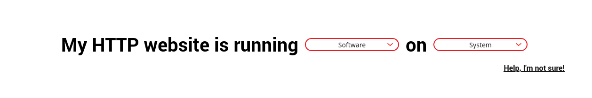

# Let's Encrypt

  
**Let's Encrypt**, kar amacı gütmeyen bir _sertifika otoritesidir_. Let's Encrypt sayesinde ücretsiz olarak SSL/TLS sertifikası edinebilirsiniz.

SSL/TLS sertifikaları, normalde ortak olarak kabul edilmiş bilinen sertifika otoriteleri tarafından belirli bir ücret karşılığında edinilebilirdi. Let's Encrypt, SSL/TLS sertifikalarını herkes için erişilebilir hale getirmiştir. 2020 Şubat ayı itibarıyla, Let's Encrypt **1 milyar** sertifika dağıtmıştır. Firefox istatistiklerine göre, Let's Encrypt'ten önce erişilen web sitelerinin yalnızca %26'sı SSL/TLS sertifikasına sahipken, bugün bu oran %85'e ulaşmıştır. [^1]

## Let's Encrypt ile SSL/TLS sertifikası almak

Let's Encrypt ile sertifika edinmek için, [EFF](https://eff.org) tarafından geliştirilen [CertBot](https://certbot.eff.org) aracını kullanabilirsiniz. 

CertBot, sertifikanızı otomatik olarak oluşturup gereken web sunucunuza kuracaktır.

Öncelikle <https://certbot.eff.org> adresine girip, alt kısımda bulunan menüden web sunucunuzu ve kullandığınız işletim sistemini/dağıtımı seçin.

**Not:** _Bu noktadan itibaren, Ubuntu üzerinde Nginx kullandığınız varsayılacaktır._



Daha sonra gelen sayfadaki yönergeleri takip edebilirsiniz. 

Sunucunuza SSH ile bağlandıktan sonra, sırasıyla aşağıdaki komutları çalıştırın:

```
sudo apt-get update
sudo apt-get install software-properties-common
sudo add-apt-repository universe
sudo apt-get update
sudo apt-get install certbot python3-certbot-nginx
```

Certbot sisteminize kurulacaktır. Nginx üzerindeki web sitenizin yapılandırmasında, `server_name`'inizin doğru ayarlandığına emin olun. Ayrıca, alan adınızın A kaydının Certbot'u çalıştırdığınız sunucuya yönlenmiş olduğuna emin olun.

Daha sonra aşağıdaki komut ile Certbot'u çalıştırın:

`sudo certbot --nginx`

Certbot, size bir e-posta adresi soracaktır. Bu e-posta adresine, yenilenemeyen sertifikalarınızla ilgili bilgilendirmeler gönderilecektir. E-postanızı yazdıktan sonra, EFF bültenini almak isteyip istemediğiniz sorulacaktır, tercihinize göre cevaplayıp devam ettiğinizde Nginx yapılandırma dosyalarınızda bulunan alan adlarınız listelenecektir. 

Bir sertifikaya, birden fazla alan adı tanımlanabilmektedir. Ama bu noktada, alan adlarınızdan herhangi birisi eğer düşerse, sertifikanızın yenilenmeyeceğini unutmayın. Dolayısıyla sadece alt alan adlarını tek sertifikada toplamanız tavsiye edilmektedir.

Çıkan listedeki alan adlarının numaralarını virgülle ayırarak yazın, sertifikanız oluşturulacaktır.

Bu noktada, alan adınızın varsayılan olarak HTTPS'e yönlendirmek isteyip istemediğinizi soracaktır. Özel bir sebebiniz yoksa, `2` yazarak yönlendirme yapmanız şiddetle tavsiye edilir.

Tüm bu adımları tamamladığınızda, SSL/TLS sertifikanız oluşturulmuş olacak. Web tarayıcınıza <https://alanadiniz.tld> girerek sertifikanızın çalışıp çalışmadığını doğrulayabilirsiniz.

Sertifikanız 90 gün süreyle verilir ve Certbot tarafından otomatik olarak yenilenir. Tebrik ederiz!
 
[^1]: https://letsencrypt.org/stats/
