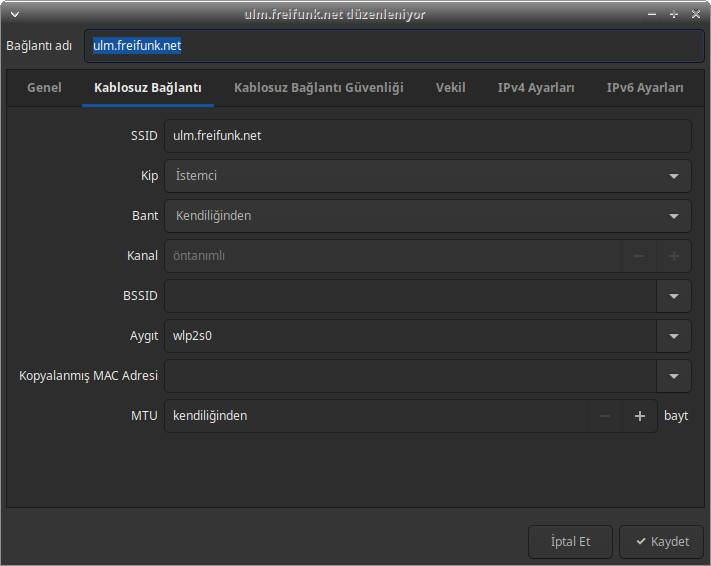
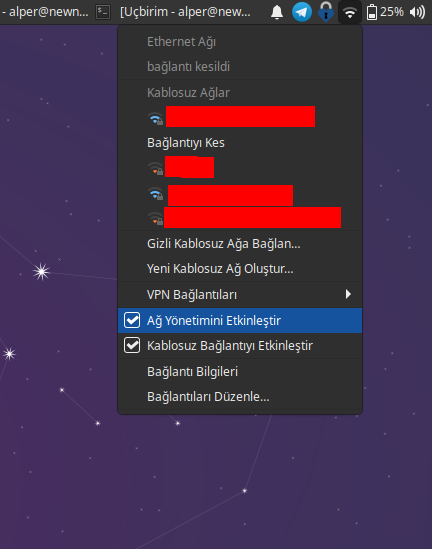

# MAC Adresi Değişikliği

[MAC adresi](https://en.wikipedia.org/wiki/MAC_address) ağ aygıtlarını eşsiz şekilde tanımlayan bir kimlik bilgisidir. Yönlendiriciler gibi ağ aygıtlarının ağda bulunan cihazları birbirinden ayırmasına ve paketleri doğru istemcilere yönlendirmesine imkan sağlamaktadır. Lakin kullanıcıya ve cihaza ait her eşsiz değer gibi bağlanılan ağları kontrol edenler veya WiFi sinyallerini inceleyebilenler için bir takip imkanı da ortaya çıkarmakta.

Bu sebepten ağ bağlantısı kuran ve özellikle bunu kablosuz gerçekleştiren cihazlar için MAC adresinizin gerekmedikçe aynı kalmaması sizin takip edilme ihtimalinizi azaltacaktır.

MAC adresi ağ aygıtlarının sunduğu hizmetlerin çalışması için de gerekli. Şayet bağlandığınız ağın sizi yetkilendirme veya Captive Portal gibi sebeplerden tanıması gerekiyorsa MAC adresinizi değiştirmeniz bu yetkilendirmeyi ortadan kaldıracağından hangi ağlarda bunu yapmak istediğinize dikkatli karar vermeniz gereklidir.

## GNU/Linux

GNU/Linux'da MAC adresi değiştirmek için `macchanger` adlı pakete ihtiyacınız olacak. Çoğu dağıtımda dahili olarak gelmediğinden aşağıdaki komutlarla kurabilirsiniz.

Debian tabanlı dağıtımlar için: `sudo apt-get install macchanger`

RPM tabanlı dağıtımlar için: `sudo yum install macchanger`

Macchanger bir komut satırı yazılımı olduğundan uçbirimden kullanmanız gerekecek.

`macchanger --help` komutu size aşağıdaki çıktıyı verecektir.


```
GNU MAC Changer
Usage: macchanger [options] device

  -h,  --help                   Print this help
  -V,  --version                Print version and exit
  -s,  --show                   Print the MAC address and exit
  -e,  --ending                 Don't change the vendor bytes
  -a,  --another                Set random vendor MAC of the same kind
  -A                            Set random vendor MAC of any kind
  -p,  --permanent              Reset to original, permanent hardware MAC
  -r,  --random                 Set fully random MAC
  -l,  --list[=keyword]         Print known vendors
  -b,  --bia                    Pretend to be a burned-in-address
  -m,  --mac=XX:XX:XX:XX:XX:XX
       --mac XX:XX:XX:XX:XX:XX  Set the MAC XX:XX:XX:XX:XX:XX

Report bugs to https://github.com/alobbs/macchanger/issues
```
Buradaki önemli parametreler ve işlevleri şu şekilde:

* `--another`: Cihazınızda tanımlı olan MAC adresine benzer yeni bir MAC adresi üretir.
* `--permanent`: Cihazınızın MAC adresini orjinal MAC adresine döndürür.
* `--random`: Tamamen rastgele bir MAC adresi oluşturur.
* `--bia`: Cihazın MAC adresinin değiştirildiğini belli etmez.
* `--ending`: Cihazın markasına uygun MAC adres oluşturur.

Macchanger ile işlem yapmadan önce cihazınızla ilgili iki işlem daha yapmanız gerekli. Bunlardan ilki MAC adresini değiştireceğiniz aygıtın adını öğrenmek diğeri de ağ aygıtlarını kapatmak.

### Aygıt adını öğrenmek

Ağ aygıtınızın adını öğrenmek için neredeyse her dağıtımda `ip a` komutunu kullanabilirsiniz. Aşağıdaki gibi bir çıktı alacaksınız:

```
1: lo: <LOOPBACK,UP,LOWER_UP> mtu 65536 qdisc noqueue state UNKNOWN group default qlen 1000
    link/loopback 00:00:00:00:00:00 brd 00:00:00:00:00:00
    inet 127.0.0.1/8 scope host lo
       valid_lft forever preferred_lft forever
    inet6 ::1/128 scope host 
       valid_lft forever preferred_lft forever
2: enp0s25: <NO-CARRIER,BROADCAST,MULTICAST,UP> mtu 1500 qdisc fq_codel state DOWN group default qlen 1000
    link/ether xx:xx:xx:xx:xx:xx brd ff:ff:ff:ff:ff:ff
3: wlp2s0: <BROADCAST,MULTICAST,UP,LOWER_UP> mtu 1500 qdisc noqueue state UP group default qlen 1000
    link/ether xx:xx:xx:xx:xx:xx brd ff:ff:ff:ff:ff:ff
    inet 192.168.1.105/24 brd 192.168.1.255 scope global dynamic noprefixroute wlp2s0
       valid_lft 85820sec preferred_lft 85820sec
    inet6 fde8:342f:910a:0:b98d:52b:15b8:8b9/64 scope global temporary dynamic 
       valid_lft 86389sec preferred_lft 14389sec
    inet6 fde8:342f:910a:0:4e81:87ba:a068:4f7e/64 scope global dynamic mngtmpaddr noprefixroute 
       valid_lft 86389sec preferred_lft 14389sec
    inet6 fe80::3726:985a:a2e5:5509/64 scope link noprefixroute 
       valid_lft forever preferred_lft forever
```
Bu çıktı karmaşık görünebilir ama iki parametreye ihtiyaç olacak basitçe.

* 2. numarada `enp0s25` isimli aygıt kablolu ağ aygıtının adı.
* 3. numaradaki `wlp2s0` isimli aygıt ise kablosuz ağ aygıtının adı.

Basitçe `nmcli` komutu dağıtımınızda mevcutsa size daha derli toplu bir çıktı verecektir.

Şayet uçbirim ile uğraşma istemiyorsanız dağıtımınızın ayarlarına girip ağ aygıtlarını seçip detaylarını incelediğinizde aygıtın adını orada da bulabilirsiniz.



### Ağ aygıtını devredışı bırakmak

Hangi aygıtın MAC adresini değiştireceğinize karar verdikten sonra değiştireceğiniz aygıtın devredışı bırakılması gerekiyor. Bunu uçbirimden yapmak isterseniz aşağıdaki komutu kullanabilirsiniz:

Wifi'ı devredışı bırakmak için: `nmcli radio wifi off`

Tüm ağı devredışı bırakmak için: `nmcli networking off`

Bu işlemi de uçbirimden yapmak istemiyorsanız dağıtımınızın ağ ayarlarından hem WiFi hem de ağ aygıtlarının tamamını devredışı bırakabilirsiniz.



### MAC adresi değiştirmek

MAC adresini tamamen rastgele değiştirmek en iyi seçeneklerden biri olacaktır. Bunun için aşağıdaki komutu kullanabilirsiniz.

`sudo macchanger --random [ağ aygıt adı]`

Şayet işlem başarılı olursa aşağıdaki çıktıyı alacaksınız:

```
Current MAC:   1a:0d:33:53:bf:97 (Samsung Electronics Co.,LTD)
Permanent MAC: 1a:0d:33:53:bf:97 (Samsung Electronics Co.,LTD)
New MAC:       86:40:e5:7b:3e:c1 (unknown)
```

Bu noktada `--bia` ve `--ending` parametrelerini ekleme kararı alınabilir. Bu durum tamamen içinde bulunduğunuz koşulun gerekliliklerine bağlı.

### Orjinal MAC adresine dönmek

Bunun için basitçe aşağıdaki komutu çalıştırabilirsiniz:

`sudo machanger --permanent [ağ aygıtı]`

## Android

Modern Android cihazlar wifi kartının MAC adresini rastgele değiştirme seçeneğine hali hazırda sahipler. Bu seçeneği `Ayarlar > Ağ ve internet > Kablosuz > ağ ismi > Gelişmiş > Gizlilik` altında bulabilirsiniz. `Tamamen rastgele MAC adresi` seçeneğini seçerseniz cihazınız seçtiğiniz ağa her bağlandığında yeni bir MAC adresi kullanacaktır.


