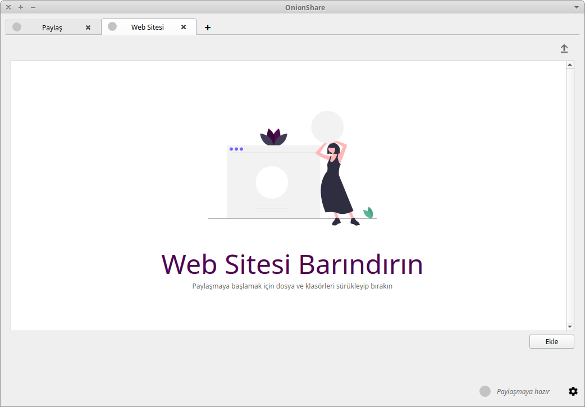

# OnionShare ile Tor üzerinden dosya paylaşımı


OnionShare, Tor üzerinden dosya paylaşımı yapabilmenizi, web sitesi servis edebilmenizi ve mesajlaşabilmenizi sağlayan bir özgür yazılımdır. Tor'un yapısı sayesinde tüm paylaşımlarınız ve mesajlarınız arada merkezi bir sunucu olmaksızın P2P (Peer to Peer) olarak iletilir.

<!-- toc -->

## Kurulum

### GNU/Linux

OnionShare, GNU/Linux için Snap ya da Flatpak paketleri halinde dağıtılmaktadır. Bu örnekte snap kullanılacaktır. Eğer sisteminizde snap yoksa, [buraya tıklayarak](https://snapcraft.io/docs/installing-snapd) nasıl kuracağınızı öğrenebilirsiniz.

Eğer sisteminizde "Snap Store" kuruluysa, OnionShare'ı [buraya tıklayarak](snap://onionshare) Snap Store üzerinden indirebilirsiniz.

Bir uçbirim (terminal) penceresi açıp aşağıdaki komutu çalıştırın:

```bash
sudo snap install onionshare
```

Bu komutun ardından snap OnionShare'ı kuracaktır.

### Mac OS

[_Bu bölüme katkı verebilirsiniz_](https://git.oyd.org.tr/oyd/guvenlik)

### Windows

[_Bu bölüme katkı verebilirsiniz_](https://git.oyd.org.tr/oyd/guvenlik)

## Tor'a bağlanma

OnionShare açıldıktan sonra öncelikle Tor ağına bağlanmaya çalışacaktır. Eğer bağlanamazsa sağ alttaki dişliye tıklayın. Aşağıdaki gibi bir pencere açılacaktır:


Buradaki "Tor köprü desteği" kısmındaki ayarı "Yerleşik obfs4 değiştirilebilir taşıyıcıları kullan" seçeneğiyle değiştirin ve "Tor bağlantısını test et" butonuna basın. OnionShare Tor'a bağlanmayı deneyecek ve eğer başarılı olursa aşağıdaki gibi bir pencere çıkacaktır:


## Dosya gönderme

OnionShare ile Tor üzerinden dosya paylaşmaya başlamak için, ana menüden "Dosya paylaşın" seçeneğine tıklayın:


Ardından açılan pencereye paylaşmak istediğiniz dosyaları sürükleyin ya da sağ alttaki "Ekle" butonuna basın:


Dosyalarınızı ekledikten sonra "Paylaşmaya başla" düğmesine basın. Eğer dosyalarınızı birden fazla kişi indirecekse veya tek tek indirilmesine izin vermek istiyorsanız, "Dosyalar gönderildikten sonra paylaşmayı durdur" seçeneğini kaldırın.


Eğer isterseniz, dosyalarınızın paylaşılacağı bir zaman aralığı da belirleyebilirsiniz. Bunun için "Gelişmiş ayarları göster" bağlantısına tıklayıp aşağıdaki gibi saatleri ayarlayabilirsiniz:


Paylaşım başladığında, aşağıdaki gibi bir bağlantı gösterilecektir. Bu bağlantıyı dosyayı almasını istediğiniz kişilere gönderdiğinizde, paylaştığınız kişiler bağlantıyı Tor tarayıcısına yapıştırıp dosyayı indirebilirler.


Gönderdiğiniz bağlantıya Tor tarayıcısı aracılığıyla giren kişiler aşağıdaki gibi bir sayfayla karşılaşır ve buradan dosyalarınızı indirebilir:


Dosyalarınızın indirilme durumunu sağ taraftaki yukarı ok butonuna basarak görebilirsiniz:


## Dosya alma

OnionShare ile başkalarına dosya gönderebileceğiniz gibi, başka birisinin size dosya göndermesini de sağlayabilirsiniz. Bunun için ana menüden "Dosya alın" seçeneğine tıklayın. Daha sonra dosyaların kaydedileceği yeri seçin ve "Alma modunu başlat" butonuna basın:


Ardından çıkan bağlantıyı dosya gönderecek kişilerle paylaşın. 


Bu bağlantıya Tor tarayıcısı ile erişenler, aşağıdaki gibi bir ekranla karşılaşacaklar:


Buraya dosya yüklendiğinde, gönderilen dosya bir önceki adımda belirttiğiniz dizine kaydedilecektir.

## Web sitesi servis etme

OnionShare'ın bir web sitesi barındırma özelliği de mevcuttur. Bu yöntemle servis ettiğiniz web sitelerine, aynı diğer ".onion" web siteleri gibi Tor tarayıcısı üzerinden erişilebilir. Ancak sürekli canlıda olmasını istediğiniz bir web siteniz varsa, OnionShare yerine kuracağınız bir sunucu üzerinden bunu yapmanız daha sağlıklı olacaktır. 

Web sitesi servis etmek için ana menüden "Web sitesi barındırın" seçeneğini seçin. Çıkan sayfaya servis etmek istediğiniz web sitesinin dosyalarını sürükleyin ya da "Ekle" butonundan tek tek ekleyin:



Dosyalarınızı ekledikten sonra, sitenizin erişilebilirliğini artırmak için "Parola kullanma" seçeneğini seçin. Eğer web siteniz dış kaynaklardan veri çekiyorsa (ör. Google fontları, JS CDN vb.) "İçerik Politikası Başlığı gönderme" seçeneğini de seçin. Ayarları tamamladıktan sonra "Paylaşmaya başla" butonuna basın:


OnionShare'ın size verdiği bağlantıya giren herkes web sitenize erişebilir:

  


## Mesajlaşma

OnionShare üzerinden mesajlaşma da mümkündür, ancak mesajlarınız herhangi bir şekilde şifrelenmediği için (Tor'un kendi şifreleme sistemi hariç) kullanmanız tavsiye edilmemektedir.

Mesajlaşma odası açmak için ana menüden "Anonim olarak sohbet edin" seçeneğini seçin ve açılan sayfada "Sohbet sunucusunu başlat" butonuna basın:


Daha sonrasında sohbet odasına insanları davet etmek için çıkan bağlantıyı paylaşın:


Daha sonra Tor tarayıcısı üzerinden odaya girin. Sol taraftaki kutudan takma adınızı değiştirebilirsiniz, sohbete giren kullanıcılar o kutunun altında görünecektir:


