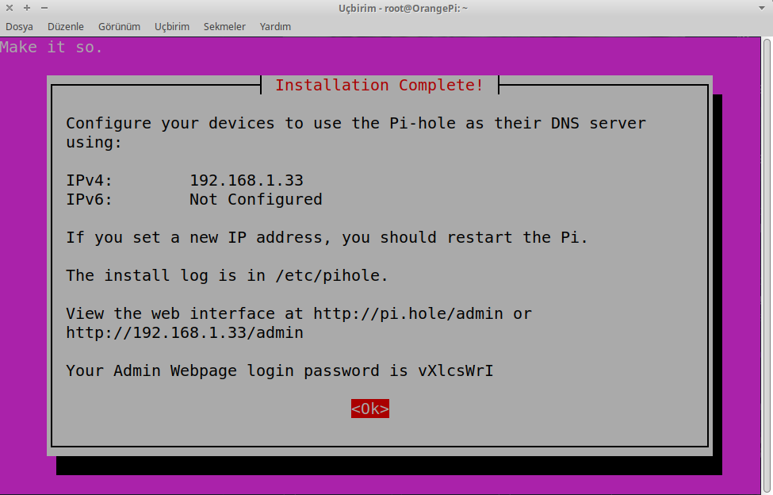

# Pi Hole ile Ev Ağını Güvene Almak


<!-- toc -->

## Pi Hole nedir?

Pi Hole, ev ağları gibi özel ağlarda kullanmak için geliştirilmiş, ağ seviyesinde reklam ve takipçileri engellemenize yarayan özgür bir yazılımdır. Pi Hole sayesinde ağınıza bağlanan tüm cihazların DNS istekleri Pi Hole üzerinden geçerek filtrelenir ve reklam/takip amaçlı istekler engellenmiş olur. Tarayıcılar gibi geniş spektrumlu engelleyicilerin kullanılamadığı uygulamaları veya PlayStation gibi eklenti desteği bulunmayan cihazları da reklam ve takip amaçlı isteklere karşı koruyabilirsiniz. 

## Ön gereksinimler

- Bir adet tek kart bilgisayar (Raspberry Pi, Orange Pi vs.)
- Raspbian, Ubuntu 16.04+ ya da Debian 9+
- 512 MB RAM
- Ethernet kablosu
- Cihaza atanmış statik IP (DHCP tarafından)

Eğer halihazırda bu işe özgüleyebileceğiniz bir tek kart bilgisayarınız yoksa, fiyat açısından Orange Pi Zero kullanmanız tavsiye edilmektedir. Yaklaşık 180 TL civarında Türkiye'den tek başına, 160 TL bandında ise AliExpress'ten kutusu ve ek kartıyla birlikte temin edebilirsiniz. _(Son fiyat güncellemesi: 24 Şubat 2021)_  

## Kurulum


Tek kart bilgisayarınızı Ethernet kablosu ile ağa bağladıktan sonra, kullandığınız yönlendiricinin paneline giriş yapıp hangi IP adresini aldığını kontrol edin. Yönlendirici paneliniz genellikle `192.168.1.1` adresinde (bulunduğunuz subnetin ilk IP adresi) bulunur, eğer erişemezseniz yönlendiricinizin modelini web'de arayarak ayrıntılı bilgi edinebilirsiniz.


Eğer bu yöntemi kullanmak istemezseniz, GNU/Linux üzerinde kullanabileceğiniz `netdiscover` yazılımı da işinizi görecektir. `sudo netdiscover` komutunu çalıştırdıktan sonra aşağıdaki gibi Pi Hole kuracağınız cihazın IP adresini öğrenebilirsiniz:


Sonrasında cihazınıza bir adet statik IP adresi atamanız gerekecek, yönlendiricinizin modeline göre farklı bir arayüzle karşılaşabilirsiniz. Bu sebepten gerektiğinde web'de arama yaparak ilerlemenizi öneririz. 


Yukarıda görüldüğü gibi `192.168.1.254` adresi Pi Hole kuracağımız cihaza atanmış oldu. Ancak bu değişiklik cihazı yeniden başlattığınızda geçerli olacak, dolayısıyla ilk bağlantıda hala bir önceki menüde gördüğünüz IP adresini kullanmanız gerekiyor.

Bir uçbirim (terminal) açıp SSH ile cihazınıza bağlanın:

```bash
ssh root@192.168.1.194
```

Buradaki örnekte cihaz olarak Orange Pi Zero kullanıldığı için kullanıcı adı root olarak alınmıştır. Eğer Raspberry Pi kullanacaksanız, varsayılan kullanıcı adı `pi`, varsayılan parola ise `raspberry`'dir.

Eğer Windows kullanıyorsanız, SSH için [PuTTY](https://www.putty.org/) kullanabilirsiniz.

Eğer cihazınıza ilk defa bağlanıyorsanız, sorulan soruya `yes` cevabını verin. Aşağıdaki gibi bir prompt görüyorsanız cihazınıza başarıyla bağlanmış olacaksınız:

```
root@OrangePI:~ # 

# ya da Raspberry Pi için

pi@raspberry:~ $
```

Aşağıdaki komutu çalıştırarak kuruluma başlayabilirsiniz:


```bash
curl -sSL https://install.pi-hole.net | bash
```

Bu komutu çalıştırdığınızda şöyle bir görüntü sizi karşılayacak ve ardından bir süre gerekli paketler kurulacak. https://it-explain.com/linux-random-mac-address-on-boards-orangepi-nanopi/


Bir süre sonra karşınıza bir ncurses menü gelecek ve bağış yapmanızı hatırlatan veya statik IP'ye ihtiyaç duyduğunuzu söyleyen çeşitli uyarılarda bulunacak. Bunlara OK cevabını verip devam edin. Sonrasında şöyle bir soruyla karşılaşacaksınız:


Bu noktada eğer kablolu bağlantı üzerinden iletişim kurmak istiyorsanız (şiddetle tavsiye edilir) eth0 seçeneğini seçip devam edin.


Bir sonraki adımda yukarıdaki DNS sağlayıcı seçimi ile karşılaşacaksınız. Arzu ettiğiniz bir DNS sağlayıcıyı seçebilirsiniz, ancak mahremiyetiniz ve daha iyi bir deneyim için [OpenNIC](https://opennic.org) üzerinden hizmet almanız şiddetle tavsiye edilir. OpenNIC kullanmak için "Custom" seçeneğini seçin ve tarayıcınızdan OpenNIC'in web sitesi olan <https://opennic.org> adresine girin. OpenNIC ana sayfasında size en yakın DNS sunucularını sıralayacaktır.


Buradan aldığınız DNS sunucu bilgilerini aşağıdaki gibi girebilirsiniz.


Daha sonrasında çıkan liste ayarını olduğu gibi bırakın ve devam edin.


Yukarıdaki menüde varsayılan olarak hem IPv4 hem de IPv6 üzerinden gelecek istekler engellenecektir. IPv6 Türkiye'de kullanılamadığından, arzu ederseniz kaldırabilirsiniz; ancak AirVPN gibi VPN servis sağlayıcıları veya Freifunk gibi ağlar IPv6 adreslemesi yapmaktadır.


Bir sonraki adımda statik IP'nizi onaylayın ve devam edin, ardından çıkan uyarıyı da onaylayın. Web yönetim arayüzünün yüklenip yüklenmeyeceği sorusuna "Evet" cevabını verin ve devam edin. Ardından sorulan tüm sorulara varsayılan cevaplarını verin ve kurulumu bitirin.

Her şey kurulduğunda aşağıdaki gibi bir uyarıyla karşılaşacaksınız:



### MAC adresi sabitleme

Bazı durumlarda, özellikle Orange Pi cihazlarda her açılışta MAC adresi rastgele seçilebilmektedir. Bunun için cihazınızın MAC adresini sabitlemeniz gerekir, bu işlemi aşağıdaki komutu çalıştırıp dosyayı düzenleyerek yapabilirsiniz:

```
nano /etc/network/interfaces.d/eth0
```

Açtığınız dosyaya mevcut MAC adresinizi aşağıdaki gibi ekleyin:

```
auto eth0
iface eth0 inet dhcp
    hwaddr 02:42:61:cd:c5:a2
```

Ctrl+O ve Ctrl+X kısayollarıyla kaydedip çıkın.


## Yönlendirici ayarları

Şimdi yönlendiricinizdeki DNS ayarlarını Pi Hole'a yönlendirmeniz gerekiyor. Bunun için yine yönlendiricinizin yönetim paneline girin ve DNS yapılandırmasını bulun:


Daha sonra Pi Hole'un kurulu olduğu cihazın IP adresini ekleyin:


Kaydedip çıkın. İşlem tamamlandığında <http://pi.hole> adresine tarayıcınızdan erişebilmeniz gerekir. Eğer erişemiyorsanız yönlendiricinizi yeniden başlatın.


## Web arayüzü


Tarayıcınızı açıp adres çubuğuna Pi Hole cihazınıza atadığınız IP adresini yazdığınızda veya <http://pi.hole> adresine girdiğinizde aşağıdaki gibi bir ekranla karşılaşacaksınız:


Daha sonrasında "Did you mean to go to the admin panel?" bağlantısına tıkladığınızda yönetim paneli karşınıza çıkacak:


Buradan "Login" seçeneğini seçip kurulumda size verilen parolayı girin. Eğer parolayı hatırlamıyorsanız, Pi Hole cihazınıza erişip `pihole -a -p` komutunu çalıştırırsanız yeniden parola oluşturabilirsiniz.


Giriş yaptıktan sonra şöyle bir panel sizi karşılayacak:


Buradan bazı alan adlarına izin verebilir, yeni alan adlarını kara listenize ekleyebilirsiniz. Bunun haricinde yerel DNS kayıtları oluşturabilir, örneğin `masaustu.lan` alan adının masaüstü bilgisayarınıza yönlenmesini sağlayabilirsiniz.

## Bilinen sorunlar ve çözümler
#### Pi Hole kendi kendine çalışmayı durduruyor

Pi Hole'un bazı durumlarda kendi kendine çalışmayı durdurup isteklere yanıt vermemesi durumu oluşabilmektedir. Bu durum, sistem saatinizin ayarlı olmamasından kaynaklanmaktadır. Sorunu aşağıdaki komutu kullanarak `ntp` servisini kurup, sistem saatinizi zaman sunucularıyla senkronize ederek çözebilirsiniz.

```
sudo apt-get install ntp
```

## Sonuç

Artık Pi Hole sayesinde daha güvenli bir ağa sahip oldunuz, ancak Pi Hole'un yetenekleri bununla sınırlı değil elbette. [Resmi web sitesinde](https://pi-hole.net) yer alan belgelerde, tüm trafiği Tor üzerinden yönlendirmekten Pi Hole üzerinde basit bir web sunucusu çalıştırmaya kadar pek çok ek özelliği nasıl kullanabileceğiniz anlatılıyor. Keyifli okumalar dileriz.

----

Pi Hole web sitesi: <https://pi-hole.net>
