# Tor

"The Onion Routing" kelimelerinin baş harflerinden türetilmiş bir kısaltma kullanan tor ağı, trafiğini gönüllüler tarafından oluşturulan ağ noktaları (TOR Relay) üzerinden şifrelenmiş bir biçimde yönlendirerek kullanıcılarına internet üzerinde belirli konularda anonimlik sağlayan özgür bir ağ projesidir.

<https://www.metrics.torproject.org> adresinden Tor ağ noktalarnı araştırabilir, en performanslı çalışanlarını inceleyebilirsiniz. (Muhtemelen yazının henüz bu aşamasındayken verdiğimiz linke giremeyeceksiniz. Çünkü ülkemizde Tor ağı ve Tor ağını tanıtan proje sitesi <https://www.torproject.org> yaklaşık olarak 19 Aralık 2016 tarihinden beridir yasaklı.)

## Tor Ağı Nasıl Çalışır ? 

Tor ağının başlıca amacı; kullanıcılarının internet üzerindeki kimliklerini ve aktivitelerini ağ trafiğini rastgele bağlantı noktaları üzerinden sektirerek her türlü otorite gözetiminden korumaktır.

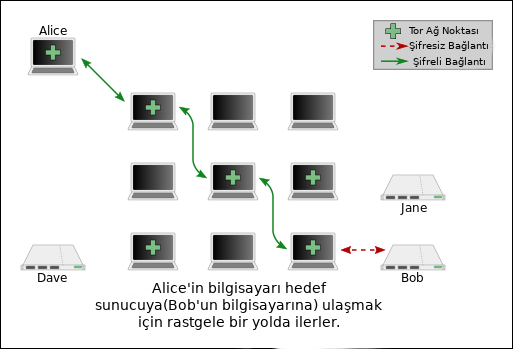

Her bağlantı noktasını bir kaldırım taşı olarak düşünürseniz. Tor ağı sizin ve bağlanmak istediğiniz hedefin arasında rastgele kaldırım taşlarından oluşturulmuş bir yol yaratır. Böylelikle sizden çıkan trafiğin nereye gittiği veya karşıdan gelen bilginin kime geldiğini sadece giriş ve çıkış noktaları bilebilir. (Bu aynı zamanda bir Tor ağı zayıflığıdır ve ileriki başlıklarda değinilecektir.)

Buraya kadar genel işleyişi anlayıp benimsediyseniz yavaş yavaş tarayıcı kurulumuna geçebiliriz.

## Tor Browser 

Öncelikle ehemmiyetle belirtmeliyiz ki Tor Browser bilgisayarınızın tüm trafiğini Tor ağı üzerinden yollamaz.
Örnekle açıklamak gerekirse; Tor Browser üzerinden bağlanıp, arkaplanda "X" bir mesajlaşma programı kullanıyorsanız. Üzgünüz ki "X" programı üzerinden giden trafikte anonim değilsiniz.

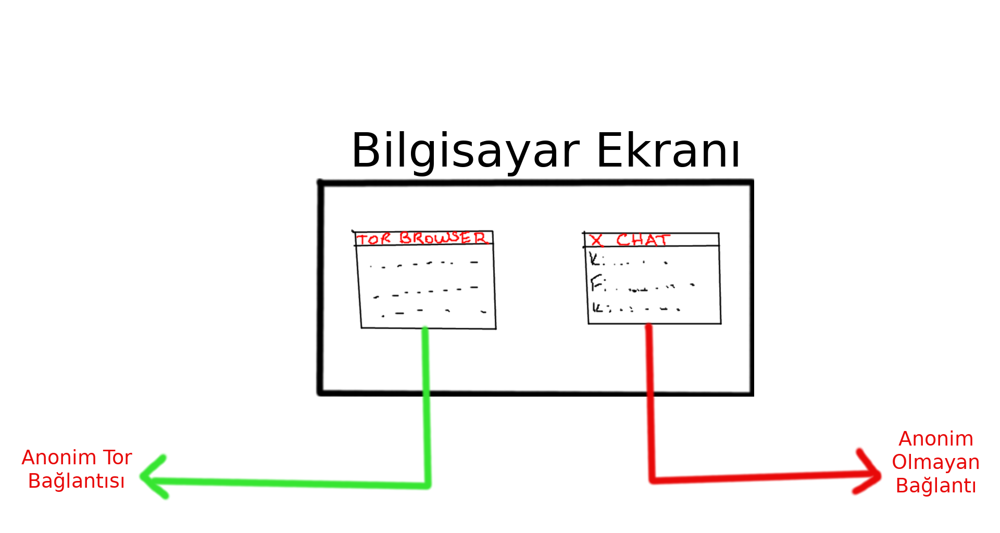

Tor browser, Mozilla Firefox'un modifikasyona uğratılmış bir halidir.

Daha sonradan kurulumu yarıda kesip bilgi vermemek adına şimdiden açıklama gereği hissediyoruz. Ülkemizde Tor ağı engellenmiş durumda olduğundan  "Bridges"(köprüler) üzerinden bağlanılabiliyor. 

Bütün gönüllü Tor ağ noktalarının IP adresleri internette açık bir şekilde listelenmektedir. Böylelikle otoriteler(kurumlar, kuruluşlar veya devletler) bu IP adreslerini blokladıklarında tor ağına giriş yapamazsınız. Tabiki bağlanmak imkansız değil. Bu köprüler Tor Project'in web sitesinde bahsedildiği üzere, ana Tor dizininde bulunmazlar. Halka açık olarak yayınlanan bir liste bulunmadığından otoritelerin bütün bu IP adreslerini bulup engellemesi neredeyse imkansızdır.

Köprü kullandığınızda temel olarak öncelikle her zamanki gibi halka açık bir Tor ağ noktasına değil, bir köprüye bağlanırsınız. Daha sonra bağlandığınız köprü sizi şifreli bir bağlantı ile halka açık bir Tor ağ noktasına bağlar ve böylelikle Tor ağına girişiniz gerçekleşmiş olur.

Öncelikle Tor Browser'ı indirmek için [EFF Tor](https://tor.eff.org/download/languages/) sayfasında bağlanalım.

Size uygun olan dosyayı indiriniz. Şu anda biz, Debian x86_64 kullandığımız için:

### GNU/Linux
*Türkçe (tr) 64-bit*

*tor-browser-linux64-8.5.5_tr.tar.xz*

dosyasını indiriyoruz.

Ardından indirilen dosyanın bulunduğu dizine gidip sıkıştırılmış dosyayı aynı dizinde farklı bir klasöre çıkartıyoruz. 

Terminal kullanıyorsanız bunu

`tar -xvf tor-browser-linux64-8.5.5_tr.tar.xz`

komutuyla yapabilirsiniz.

Oluşturulan klasör içinde "start-tor-browser.desktop" isimli bir dosya ve "Browser" isimli bir dizin olmalı.

*start-tor-browser.desktop* isimli dosyaya çift tıkladığınızda "Güvenilmeyen uygulama" konulu bir uyarı alabilirsiniz. "Güven ve başlat" butonuna tıklayıp kurulumu başlatıyoruz.

Karşınıza şöyle bir ekranın gelmesi gerekiyor.
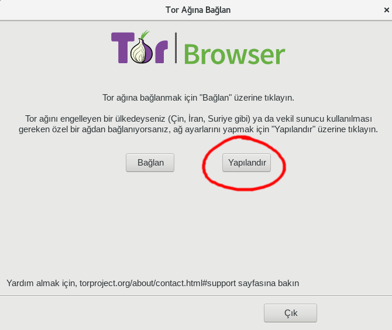

"Yapılandır" butonuna basarak devam ediniz.

Karşınıza gelen ayarlardan,
"Bulunduğum ülkede Tor engelleniyor" seçeneğini işaretleyin ve ardından çıkan seçeneklerden "Bir hazır köprü seçin" e tıklayıp türünü "obfs4" olarak değiştirin.

Herşeyi düzgünce yaptığınıza eminseniz nihayetinde "Bağlan" tuşuna basarak Tor bağlantınızı başlatabilirsiniz.

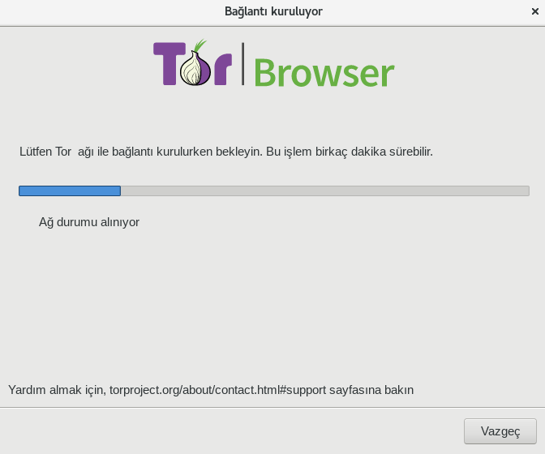

Tarayıcınız açılır açılmaz güncel olmadığı ile alakalı bir uyarı alabilirsiniz. Endişelenmeyin, sol üstte bulunan Tor butonundan "Tor Browser Güncelleme Denetimi" seçeneğini işaretleyerek en güncel sürüme yükseltebilirsiniz. 

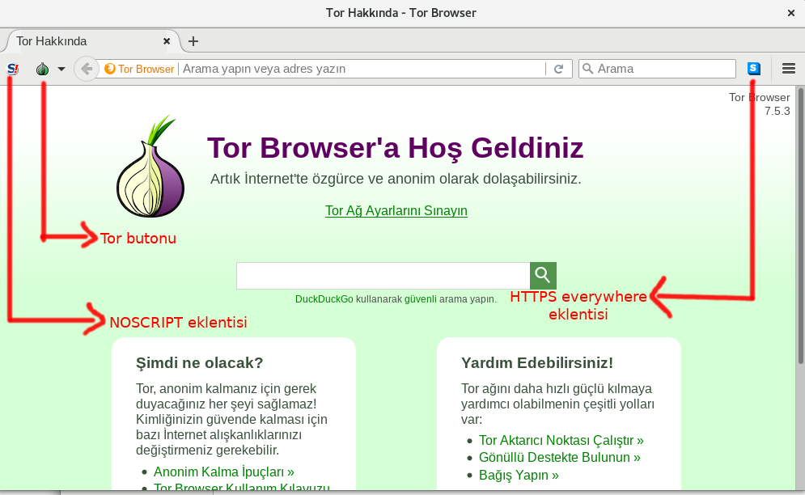

Kurulum ve güncelleştirmemiz bittiğine göre artık tarayıcıyı kullanabilirsiniz.

*!...Unutmayın sadece tarayıcı üzerinde yaptığınız işlemlerde Tor ağına bağlısınız...!*

Uyarılar:
1- Tor Browser'ı tam ekran kullanmayın.

2- Tor Browser'ı kendi dilinizde kullanmayın. Eğer biliyorsanız İngilizce veya başka dillerde kullanabilirsiniz.

3- User-Agent'ınızı değiştirecek güvenli pluginler kullanabilirsiniz.

4- Sistem saatinizin ülkenizden ileri veya geri olmasına dikkat edebilirsiniz.

5- Herhangi bir web sitesinin sizden alabileceği teknik bilgileri  <http://ipleak.com/full-report/> adresine girerek bakabilirsiniz.

## Tüm Trafiği Tor Ağından Geçirmek

Öncelikle boş bir terminal açıp **"su"** komutunu yazarak **"Super User" **yetkisi kazanıp, daha sonra bu yetki ile tor ağını kuracağız.
Parolanızı giriniz ve ardından **"apt-get install tor"** yazıp "enter" tuşuna basıyoruz.

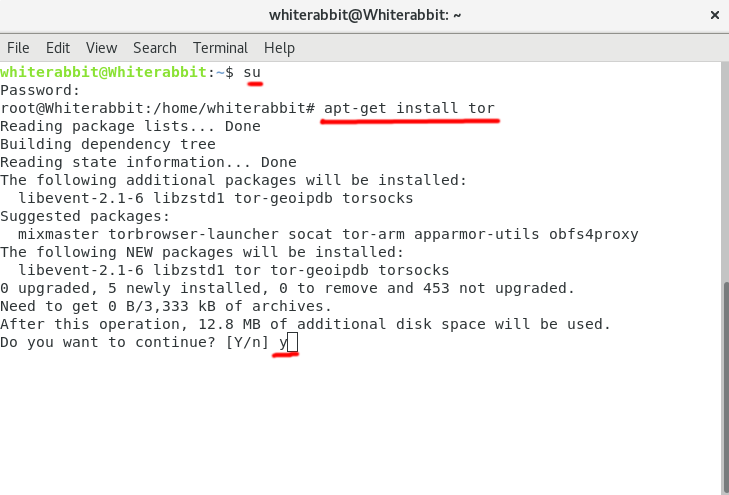

Çıkan ekranda **"Y"** ile onaylayıp kurulumu başlatabilirsiniz. Kurulum işlemi tamamlandığında karşınıza şöyle bir mesaj gelecek.

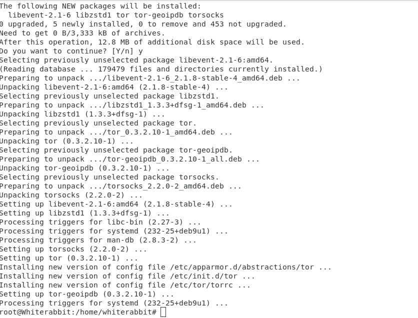

Terminal ekranına **"service tor status"** yazınız. Eğer yeşil yazıyla **"Active"** yazıyorsa, **"service tor stop"** diyerek durdurunuz.

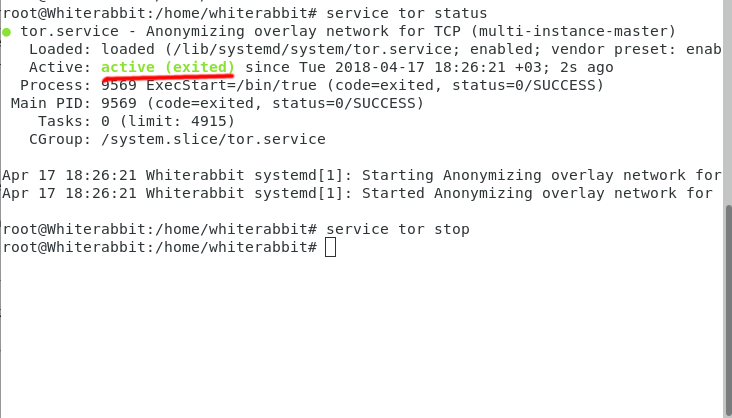

Daha sonra **obfsproxy** kurulumu gerekecek. **apt-get install obfs4proxy** yazarak aynı şekilde kurabilirsiniz.

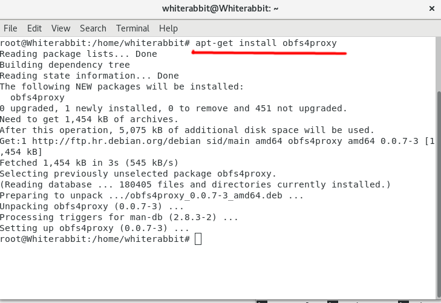

Şimdi **"/etc/tor/torrc"** dosya yolundaki konfigurasyon dosyasını düzenleyeceğiz. Ama öncesinde ülkemizde Tor ağı yasaklanmış olduğundan bağlanabilmek için **"Bridge"** almamız gerekecek.

Daha önceden indirmiş olduğumuz "Tor Browser" ile <https://bridges.torproject.org/> adresine bağlanıp **"Get Bridges"**  maddesine tıklıyoruz.

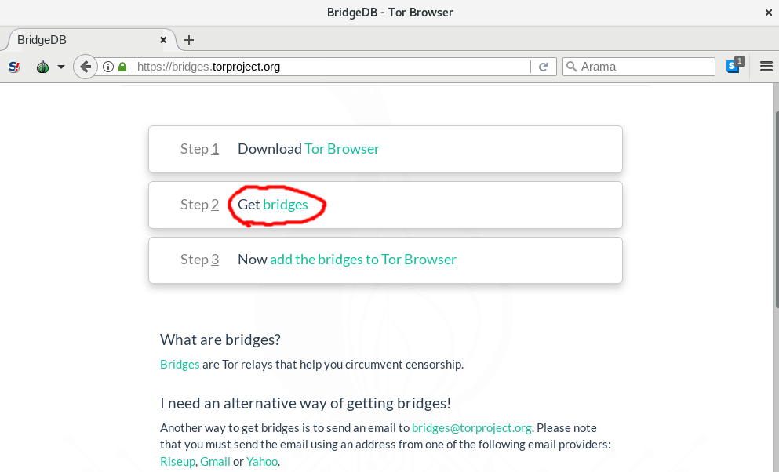

Açılan pencereden **"Pluggable transport"** seçeneğini **"obfs4"** olarak seçiyoruz ve "Get Bridges" butonuna basıyoruz.

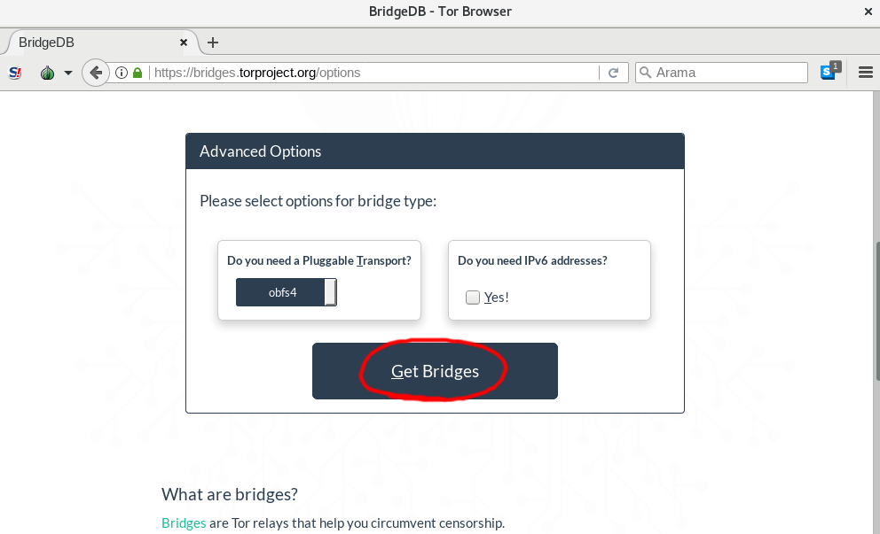

Karşınıza karışık bir **CAPTCHA** gelecek. Çözene kadar bırakmamanızı tavsiye ediyoruz. Biraz zordur kendisi...

Nihayetinde çözdüğünüzde karşınıza gelecek ekran aşağıdaki gibi olacaktır.

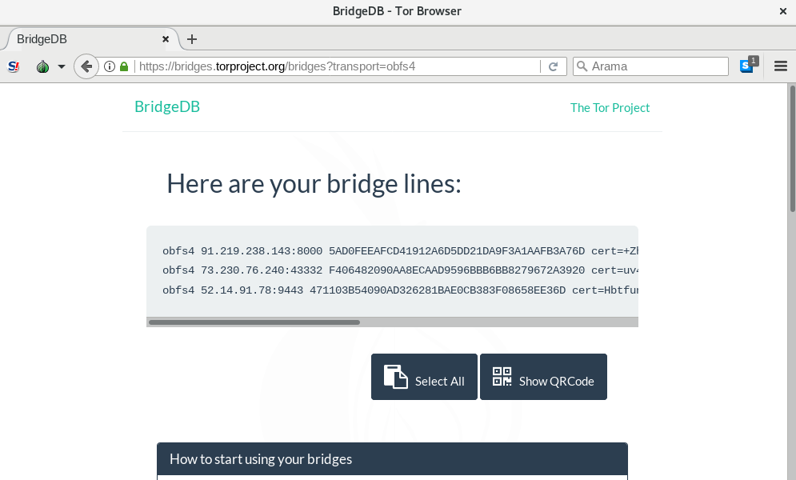

obfs4 Bridge_IPadresi:PORT FINGERPRINT sertifika

gibi bir kalıpta Tor Project tarafından size 3 adet bridge verilecek. Bu aldığınız bridge adresleri ile Tor'un konfigürasyon dosyasını düzenleyeceğiz.

Boş bir terminal açıp **"nano /etc/tor/torrc"** yazıyoruz. Bu küçük komut bize Tor'un konfigürasyon dosyası olan torrc yi nano editöründe açma imkanı verecek.

Açıldığında karşınıza yığınla yazı geldiğini göreceksiniz. Klavyenizin aşağı ok tuşu ile sayfada gezinip kendinize uygun bir yer bulduktan sonra (biz şahsen ilk bloğun sonunu seviyoruz) konfigürasyon dosyasını şu hale gelecek şekilde değiştiriniz.

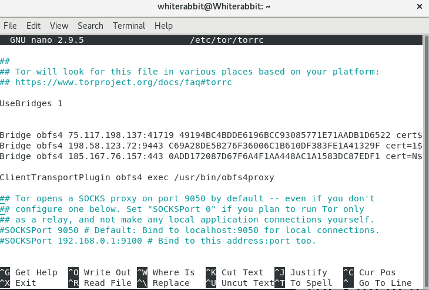

	UseBridges1
	
	Bridge obfs4 Kendi Bridge adresleriniz
	
	ClientTransportPlugin obfs4 exec /usr/bin/obfs4proxy

 
 **CTRL-X** tuşlarına basarak dosyadan çıkma işlemini başlatın ve **"Save Modified Buffer ?"** sorusuna **"Y"** ile cevap verdikten sonra "enter" tuşuna basınız.
 
 Daha sonra boş bir terminalde **"service tor status"** yazarak tor servislerinin **çalışmadığına** emin olunuz.

Çalışıyorsa yeşil olarak "Active",
çalışmıyorsa gri olarak "inactive(dead)" yazar.

Eğer çalışıyorsa **service tor stop**  yazarak durdurabilirsiniz.

Tor bağlantımızı ve köprülerimizi kontrol etmek için terminal satırına **"tor"** yazıp enter tuşuna basıyoruz ve 

**Tor has successfully opened a circuit. Looks like client functionality is working.**

**bootstrapped %100** 

Yazısını gördüğünüzde köprülerimiz tam ve fonksiyonel olarak çalışıyor demektir.

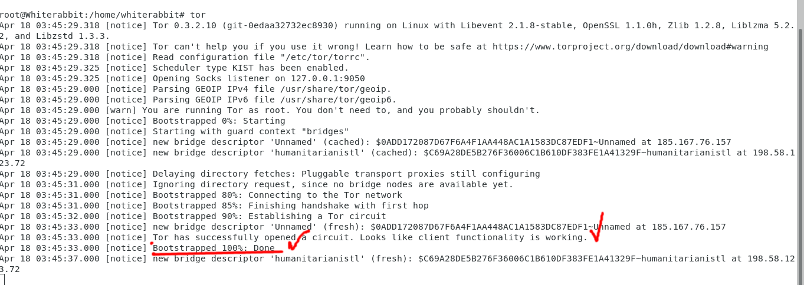

Şimdi artık bilgisayarınızda **9050**.porttan tor bağlantısı yapabiliyorsunuz. Fakat halen tam olarak hazır değilsiniz. Tüm bilgisayarınızın bağlantısını bu port üzerinden yönlendirmeniz gerekecek.

Öncelikle şu adresteki bash scriptini indiriniz. [Github](https://github.com/raffaele-forte/backbox-anonymous/blob/master/usr/sbin/anonymous) 

anonymous.sh isminde bir dosyamız var artık bilgisayarımızda. Terminalden **chmod 777 anonymous.sh** komutuyla izinlerini düzenliyoruz.

Daha sonra tekrar tor bağlantısının konfigürasyon dosyasını düzenleyeceğiz.

Boş ve Super User yetkisi olan bir terminalden "**nano /etc/tor/torrc/**" yazarak konfigürasyon dosyasını açıyoruz.

Dosyanın en alttan ikinci bloğundan sonra şu ayarları ekliyoruz:

	VirtualAddrNetwork 10.192.0.0/10
	TransPort 9040
	DNSPort 53
	AutomapHostsOnResolve 1

Yani şu şekilde olmalı:

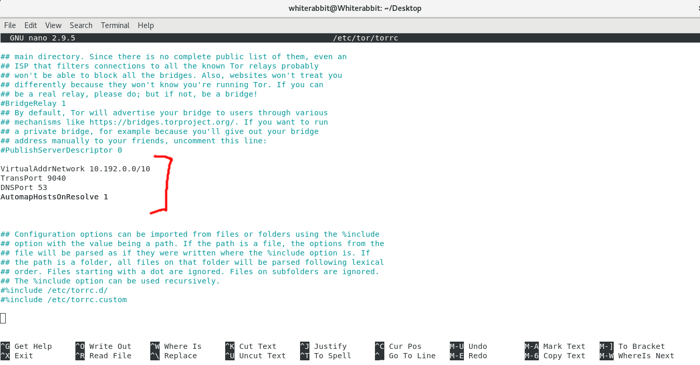

CTRL-X kombinasyonu ile dosyadan çıkmak istediğimizi belirtip "Y" ile de kaydetmek istediğimizi onaylayıp terminale dönüyoruz.

Şimdi macchange ver bleachbit e ihtiyacımız olacak. 

**apt-get install bleachbit**

**apt-get install macchanger**

Tek tek bunları kurduktan sonra indirdiğimiz anonymous.sh dosyasını **/usr/sbin** dizinin altına kopyalayınız. Eğer Super User yetkisi isterse Supe User yetkisi olan bir terminalden **nautilus** komutu ile Super User yetkisi olan bir dosya yöneticisi açabilirsiniz.

Artık herhangi bir terminalden ve dizinden anonymous.sh dosyasını çağırabileceğiz.

Terminalimizi açıyoruz. Önce tor servisini başlatıyoruz.

**service tor start**

Daha sonra 

**anonymous.sh start**

Komutunu giriyoruz ve bu script bize;

*Mac adresimizi değiştirmek istiyor muyuz ?*
*Bilgisayar hostname ini değiştirmek istiyor muyuz ?*
*Tüm trafiği TOR üzerinden çıkartmak istiyor muyuz ?*

gibi sorular soruyor. Onları da yanıtladıktan sonra ekran aşağı yukarı şöyle olmalı...

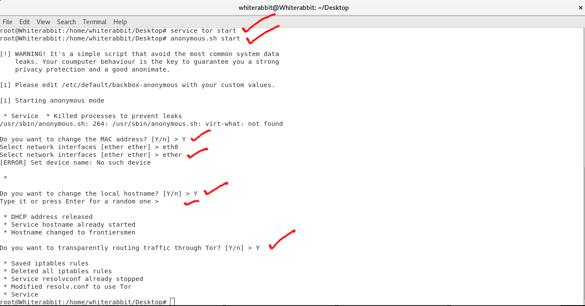

Ve kontrol için herhangi bir browser açıp <check.torproject.org> adresine giriyoruz.

Gördüğünüz gibi  eğer herşey yolunda gittiyse sizin ekranınızda da Mozilla Firefox sanki Tor Browsermış gibi Tor ağı üzerinden internete çıkacaktır.

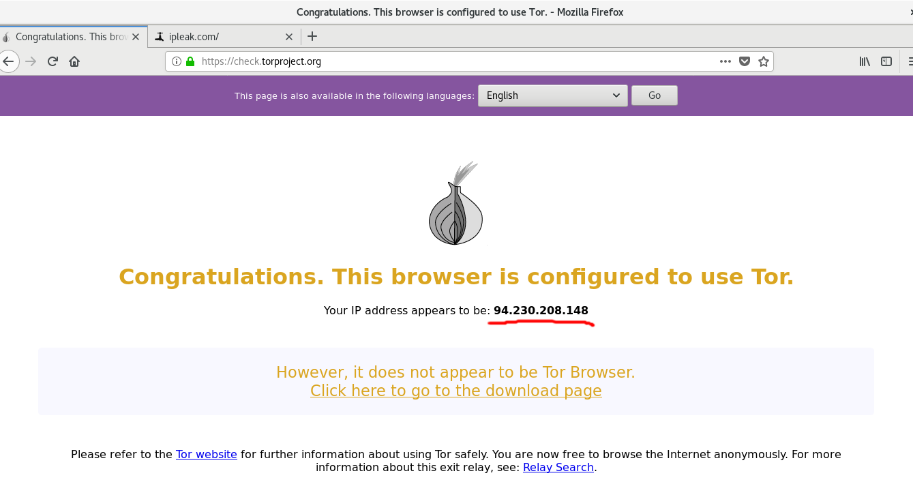

IP adresini de kontrol edelim.

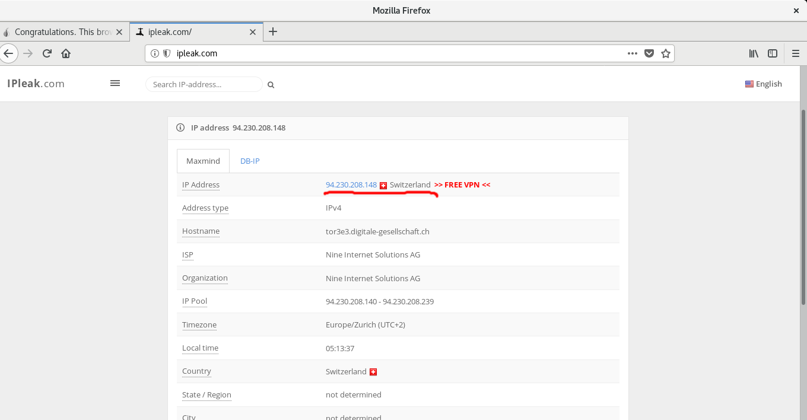

İsviçrede gözüküyor...

## Nyx kullanımı, Tor trafiğinin izlenmesi

Bu başlıkta kurduğumuz ve içinde bulunduğumuz Tor ağını daha derin olarak gözlemleyebilmenizi ve biraz daha kurcalayabilmenizi sağlayacak basit bir komut satırı programı olan "**Nyx**" i işleyeceğiz.

**Nyx**, eski adı "**ARM**" olan bir "Tor Ağı Gözlemleme(Monitoring)" programıdır. Gerçek zamanlı olarak bağlı olduğunuz Tor ağ noktalarını listeleyerek, trafiğinizi(upload ve download kullanımı), loglarınızı, konfigürasyon ayarlarınızı, Tor ağında sık sık kimlik değiştirebilmenizi ve daha Tor ağı ile ilgili bir çok şeyi tek bir yerden yönetebilmenize imkan verir.

<https://nyx.torproject.org> adresinden projeyi inceleyebilirsiniz.

Öncelikle kurulumuna başlayıp, kurduktan sonra biraz kurcalayacağız.

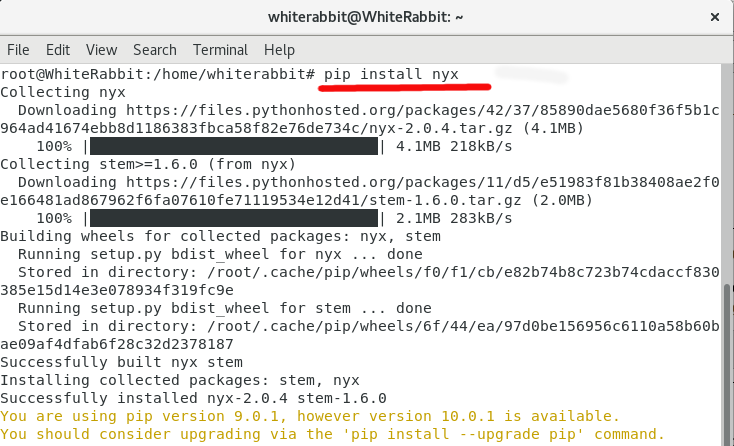

kurulumunu tamamladıktan sonra;

**anonymous.sh start** komutu ile tüm trafiği tor üzerinden yönlendirip temiz bir terminal açarak **nyx** yazıyoruz.

Karşınıza ilk olarak böyle bir ekran geldiyse herşeyi doğru yapmışsınızdır.

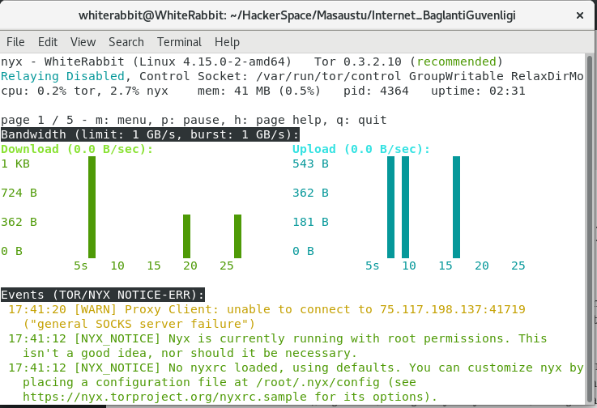

Bu gördüğümüz ekranda gerçek zamanlı olarak tor ağındaki Download ve Uploadlarınızı gözlemleyebilirsiniz. Ayrıca nyx ve tor ağının size teknik olarak çıkaracağı uyarılar ve hatalar da bu ekranda görüntülenir.

Klavyenizden sağ ok tuşuna basarak **NYX** ekranları arasında geçiş yapabilirsiniz. 

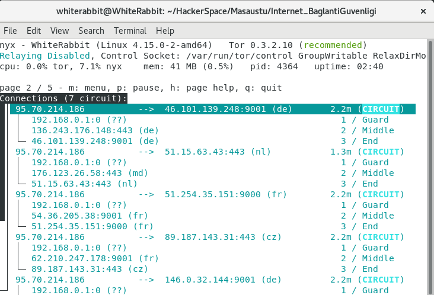

Karşınıza çıkan ekranda hangi ağ noktaları üzerinden tor ağına bağlandığınızı detaylı olarak inceleyebilirsiniz.

Tekrar sağ veya sol ok tuşları ile ekranlar arası geçir yaparsanız aşağıdaki gibi bir ekrana denk geleceksiniz.

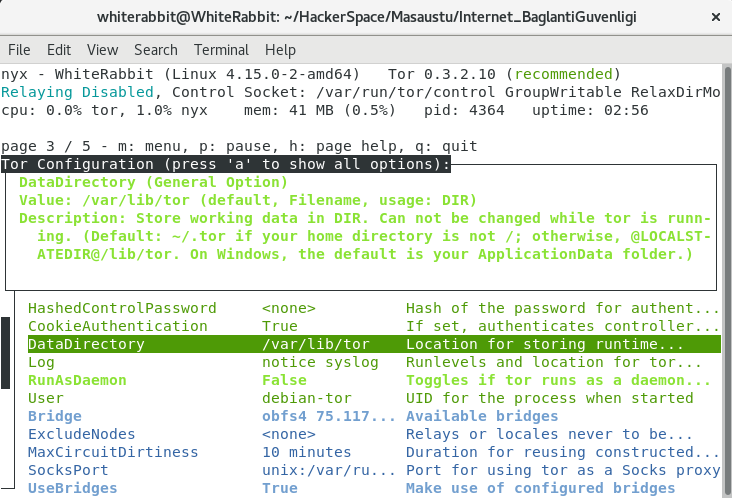

Bu kısım tor config dosyanızın nispeten biraz daha görselleştirilmiş halidir. Madde madde inceleyebilir, değişiklik yapabilirsiniz.

**NYX**'in herhangi bir ekranındaki iken "**m**" tuşuna basarak menüyü açabilirsiniz. Tor ağı yavaşladığında veya bağlı olduğunuz circuitleri değiştirmek istediğinizde **Menu>Actions>New identity** yolunu izleyebilirsiniz.

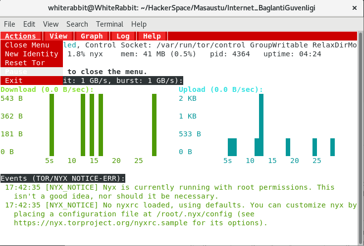

## Tor Ağının Zayıf Noktaları

Genel olarak Tor ağı güvenli sayılsa da tek başına %100 olarak güvenliği sağlamakta yetersizdir. Söz gelimi ilk bağlandığınız Tor ağ noktası sizin açık ip adresinizi biliyordur ve internete çıktığınız son Tor ağ noktası ise internette nasıl bir işlem yaptığınızı biliyordur.

**Exit node** yani bağlandığınız en son Tor ağ noktası olan bir kişi veya otorite, ip adreslerinden tek tek geri giderek gerçek ip adresinize ve dolayısı ile kimliğinize ulaşabilir.

Bütün bunlar bir yanda dursun;

Ağ dinleme(zehirleme) saldırıları olarak bilinen MITM saldırıları ile tor ağında giden parolalarınız vb. gizli kalması gereken bilgileriniz gittiği güvenli sandığınız o yolda başkaları tarafından rahatlıkla ele geçirilebilir. Burada toplum yararına olarak yapılan her projedeki gibi sistemin işlemesi için en büyük etkenin **güven** olduğunu görüyoruz. (siz yine de tor ağından kişisel hesaplarınıza girmeyiniz.)

Bu riskleri olabildiğince minimuma indirgemek için; "**Tor over VPN**" olarak tanımlanan VPN üzerinden Tor ağına girmek gibi yöntemler kullanılmıştır. Tabiki bu sefer de herhangi bir VPN otoritesi IP adresinizi açık olarak görebilir. Fakat Tor ağındaki riskleri minimuma indirgemiş olursunuz. Bu konuda da tamamiyle kullanmış olduğunuz VPN otoritesinin bilgilerinizi saklayıp satmadığından bir şekilde emin olmanız gerekmektedir. 

Veya daha da güvenlisi kendi sunucunuzu kiralayıp, üzerine bir OpenVPN servisi kurarak kendi VPN'inizi oluşturup onun üzerinden Tor ağına çıkabilirsiniz.

## Tor Kullanarak Açığa Çıkan Vakalar

Harvard üniversitesinde okuyan bir genç, vizelerine çalışmadığı için erteletmek amacıyla okuluna tor ağı üzerinden bomba tehdidi içeren bir mesaj yollar. Fakat yakalanır. 

Bunun nedeni ise aslında çok basit. Servis sağlayıcılarınız veya internete bağlandığınız kafe, üniversite vb ortamlarda hangi saatte tor ağına bağlanıldığını rahatlıkla görebilir. Fakat tor ağında neler yapıldığını göremez. Söz konusu olan genç, tor ağına okulunun wifi erişiminden bağlandığı ve gelen bomba tehdidi de tor ağından geldiği için mesajın atıldığı tarihte ve saatte okuldan sadece "1" bilgisayardan tor ağına bağlanıldığı fark edilir. Yapılan incelemelerde mesajın söz konusu bilgisayardan atıldığı tespit edilir ve kamera görüntülerinden tarih ve saat baz alınarak kimin tarafından kullanıldığı öğrenilir ve genç, cezaya çarptırılır. 
