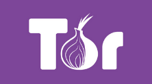
# Tor

<!-- toc -->

Tor, trafiğini gönüllüler tarafından oluşturulan ağ noktaları (Tor relay) üzerinden şifrelenmiş bir biçimde yönlendirerek kullanıcılarına İnternet üzerinde belirli ölçüde anonimlik sağlayan özgür bir ağ projesidir.

## Tor ağı nasıl çalışır?

Tor ağının başlıca amacı; kullanıcılarının internet üzerindeki kimliklerini ve aktivitelerini ağ trafiğini rastgele bağlantı noktaları üzerinden sektirerek her türlü otorite gözetiminden korumaktır.

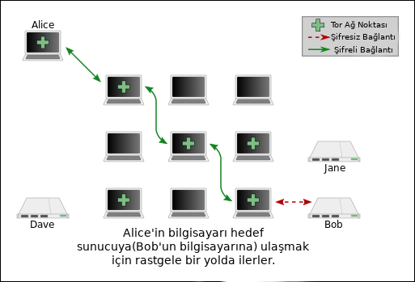

Her bağlantı noktasını bir kaldırım taşı olarak düşünürseniz, Tor ağı sizin ve bağlanmak istediğiniz hedefin arasında rastgele kaldırım taşlarından oluşturulmuş bir yol yaratır. Böylelikle sizden çıkan trafiğin nereye gittiği veya karşıdan gelen bilginin kime geldiğini sadece giriş ve çıkış noktaları bilebilir. (Bu aynı zamanda Tor ağının bir zayıflığıdır ve ileriki başlıklarda değinilecektir.)

Buraya kadar genel işleyişi anlayıp benimsediyseniz yavaş yavaş tarayıcı kurulumuna geçebiliriz.

## Tor Browser

Öncelikle şunu asla unutmayın, Tor Browser bilgisayarınızın tüm trafiğini Tor ağı üzerinden **geçirmez.**  
Örneğin, Tor Browser ile gezinirken, arkaplanda "X" bir mesajlaşma programı kullanıyorsanız, "X" programı üzerinden giden trafik Tor'dan geçmeyecek, dolayısıyla anonim olmayacaktır.

Tor Browser, Mozilla Firefox'un bir çatallamasıdır (fork).

Ülkemizde Tor ağının bilinen düğümleri engellenmiş durumda olduğundan Tor ağına köprüleri (bridges) kullanarak bağlanabiliyoruz.

**Türkiye'de Tor yasaklı DEĞİLDİR, çünkü "Tor'u yasaklamak" diye bir şey YOKTUR.**

Gönüllü olarak işletilen Tor düğümlerinin IP adresleri İnternet'te açık bir şekilde listelenmektedir. Böylelikle otoriteler (kurumlar, kuruluşlar veya devletler) bu IP adreslerini bloklayarak Tor ağına erişim engellemeye çalışmaktadır. Ancak bu durum Tor'u tamamen erişilemez hale getiremez. Tor'un engellenmeye çalışıldığı ülkelerde Tor'a erişim, **köprüler** aracılığıyla gerçekleşir. Bu köprüler, Tor Project'in web sitesinde bahsedildiği üzere, ana Tor dizininde bulunmazlar. Halka açık olarak yayınlanan bir liste bulunmadığından otoritelerin bütün bu IP adreslerini bulup engellemesi neredeyse imkansızdır.

Köprü kullanarak Tor ağına girmeye çalıştığınızda, öncelikle her zamanki gibi halka açık bir Tor düğümüne değil, bir köprüye bağlanırsınız. Daha sonra bağlandığınız köprü sizi şifreli bir bağlantı ile halka açık bir Tor ağ noktasına bağlar ve böylelikle Tor ağına girişiniz gerçekleşmiş olur.

Tor Browser'ı, Tor'un kendi web sitesi Türkiye'de erişime engelli olduğu için [EFF Tor](https://tor.eff.org/download/languages/) yansısından indirebilirsiniz.

Alternatif linkler:

* [GitHub](https://github.com/TheTorProject/gettorbrowser/releases/tag/torbrowser-release)
* [Archive.org](https://archive.org/details/@gettor)
* [Google Drive](https://drive.google.com/drive/folders/13CADQTsCwrGsIID09YQbNz2DfRMUoxUU) (mahremiyetinize saygı göstermez)

Bunların hiçbirine erişemiyorsanız, [gettor@torproject.org](mailto:gettor@torproject.org) adresine, işletim sisteminizi ve istediğiniz dili içeren aşağıdaki gibi bir e-posta atarsanız, indirme linkiniz attığınız e-postaya cevap olarak gelecektir. _Cevabın gelmesi bazen 1 saati bulabilmektedir._

`windows tr`

Bu noktadan itibaren işletim sisteminize göre:

### GNU/Linux

*Türkçe (tr) 64-bit*

`tor-browser-linux64-9.5.3_tr.tar.xz`

dosyasını indirin.

Ardından indirilen dosyanın bulunduğu dizine gidip sıkıştırılmış dosyayı  çıkartın.

Uçbirim kullanıyorsanız bunu

`tar -xJvf tor-browser-linux64-9.5.3_tr.tar.xz`

komutuyla yapabilirsiniz.

Oluşturulan dizin içinde "Tor Browser Setup" veya "start-tor-browser.desktop" isimli bir dosya ve "Browser" isimli bir dizin olmalı. "Tor Browser Setup"a çift tıklayarak Tor tarayıcısını başlatabilirsiniz.

_Not: "Tor Browser Setup" isimli dosyaya çift tıkladığınızda "Güvenilmeyen uygulama" konulu bir uyarı alabilirsiniz. "Güven ve başlat" butonuna tıklayıp kurulumu başlatıyoruz._

Karşınıza şöyle bir ekranın gelmesi gerekiyor.
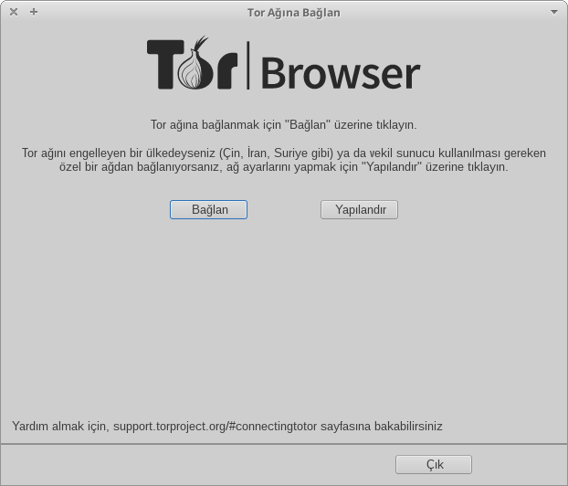

"Yapılandır" butonuna basarak devam ediniz.

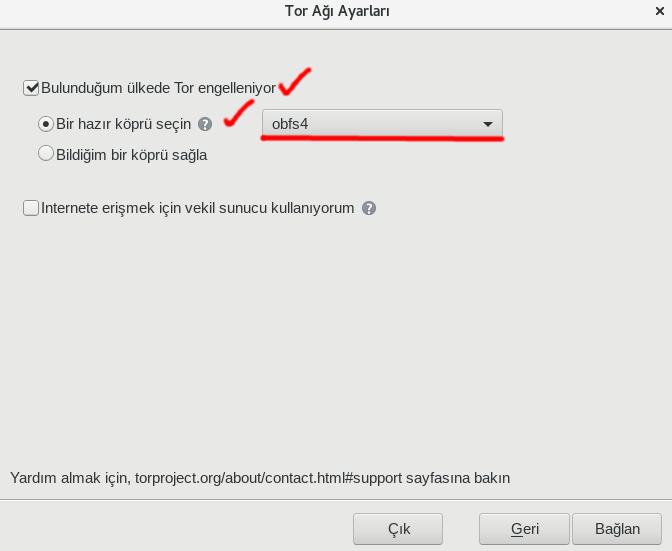

Karşınıza gelen ayarlardan,
"Bulunduğum ülkede Tor engelleniyor" seçeneğini işaretleyin ve ardından çıkan seçeneklerden "Bir hazır köprü seçin"e tıklayıp türünü "obfs4" olarak değiştirin.

Her şeyi doğru yaptığınıza eminseniz nihayetinde "Bağlan" tuşuna basarak Tor bağlantınızı başlatabilirsiniz.

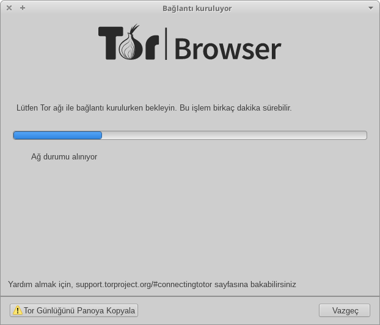

Tarayıcınız açılır açılmaz aşağıdaki gibi bir uyarı alacaksınız. Dil ayarınızı İngilizce yapmak anonimliğinizi artıracaktır, çünkü dünyadaki İnternet kullanıcılarının dörtte üçü İnternet'i İngilizce kullanmaktadır. Tercihinize göre "Evet" diyip devam edin.

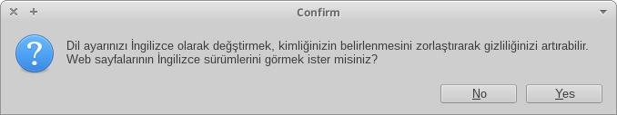

Kurulum ve güncelleştirmemiz bittiğine göre artık tarayıcıyı kullanabilirsiniz. Ufak bir test yapmak isterseniz, Özgür Yazılım Derneği'nin Tor adresine girebilirsiniz:

`http://oyd647g3rtaqoqf4ejv43zdjmhmfhhx6f474bonalquwezfjda4ybyyd.onion/`

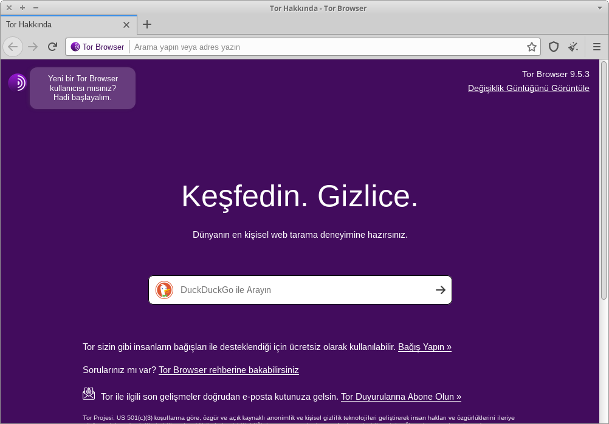

Yapmanız gereken birkaç ayar daha var. Sağ üst köşedeki kalkan düğmesine basıp, "Gelişmiş güvenlik düzeyi ayarları" menüsüne girin. Daha sonra burada, "Güvenlik Düzeyi"ni "Daha Güvenli" olarak seçin. Burada istiyorsanız "En Güvenli" seçeneğini de seçebilirsiniz, ancak JavaScript'lerin engelleneceğini, fontlar veya görseller gibi pek çok site bileşeninin doğru görüntülenemeyebileceğini unutmayın.

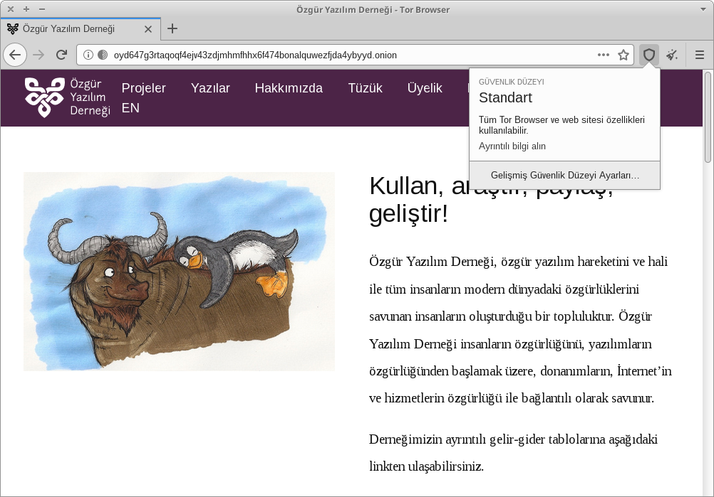

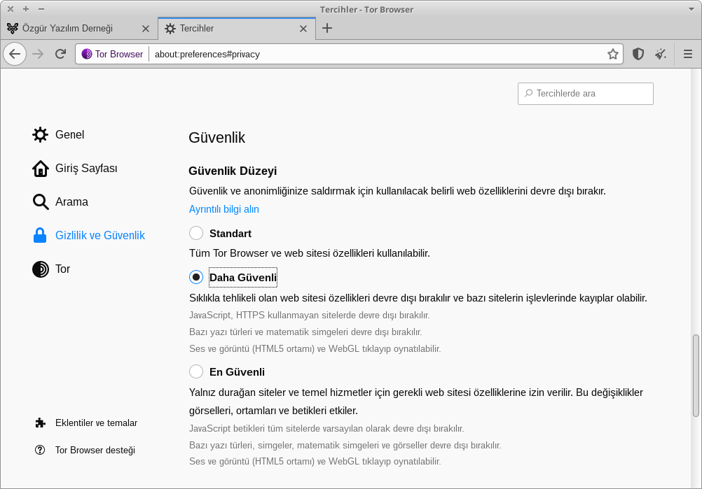

Bu sayfayı en yukarıya kaydırdığınızda, yani "Gizlilik ve Güvenlik" menüsünün en üstünde, "Onion Hizmetleri" başlığını göreceksiniz. Bu ayarı da "Her zaman" olarak değiştirin. Bu ayarı aktive ettiğinizde, eğer bir web sitesinin .onion uzantılı Tor servisi varsa, Tor tarayıcısı otomatik olarak .onion'lu servise bağlanacaktır. Bu özelliğin kullanılabilmesini sağlayan şey, "Onion-Location" HTTP başlığıdır, ayrıntılı bilgi için [burayı ziyaret edebilirsiniz](https://community.torproject.org/onion-services/advanced/onion-location/).

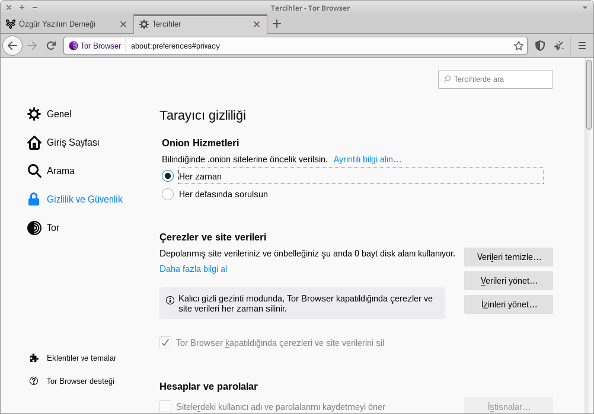

Bu ayarı açmadığınızda da, girdiğiniz sitenin .onion servisi varsa tarayıcınızın çubuğunda şöyle bir düğme çıkar:

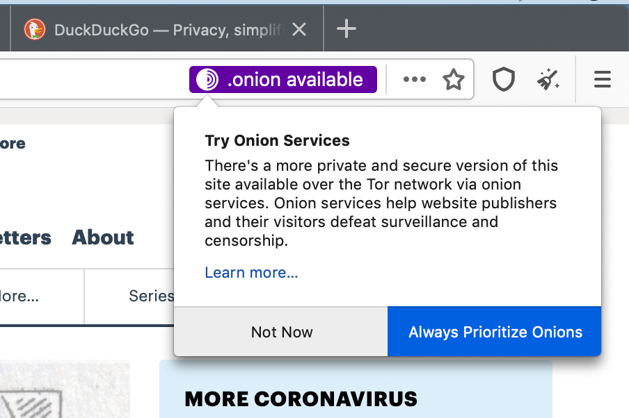

Bunu denemek için, Özgür Yazılım Derneği'nin sitesini kullanabilirsiniz. <https://oyd.org.tr>'ye gittiğinizde Tor tarayıcı ".onion available" uyarısı verecektir.

**UNUTMAYIN: Sadece Tor Tarayıcı üzerinden yaptığınız trafik Tor ağından geçecektir!!!**

**Uyarılar:**

1. Tor Browser'ı tam ekran kullanmayın.

2. Tor Browser'ı kendi dilinizde kullanmayın. Eğer biliyorsanız İngilizce veya başka dillerde kullanabilirsiniz.

3. Herhangi bir web sitesinin sizden alabileceği teknik bilgilere  <http://ipleak.com/full-report/> adresine girerek bakabilirsiniz.

4. **HİÇBİR ARAÇ SİZİ TAMAMEN ANONİM YAPMAZ.**


## Uygulamaları Tor üzerinden kullanmak (Tor proxy)

Telegram gibi uygulamaları Tor üzerinden kullanabilmeniz için öncelikle sisteminize `tor` paketini kurmanız gerekmektedir. Bunun için, bir Uçbirim açıp aşağıdaki komutları sırasıyla yazabilirsiniz:

```
sudo apt-get update
sudo apt-get -y install tor obfs4proxy
```

Daha sonra, `sudo systemctl stop tor` yazarak Tor servisini durdurun. Çünkü bağlanabilmek için köprülere ihtiyaç duyacaksınız.

Daha önceden indirmiş olduğunuz "Tor Browser" ile <https://bridges.torproject.org/> adresine bağlanıp "Get Bridges" maddesine tıklayın.


Açılan pencereden **"Pluggable transport"** seçeneğini **"obfs4"** olarak seçin ve "Get Bridges" butonuna basın.


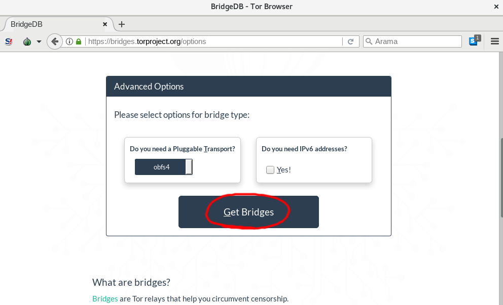

Karşınıza karışık bir **CAPTCHA** gelecek. Çözene kadar bırakmamanızı tavsiye ediyoruz. Biraz zor olabilir :)

Nihayetinde çözdüğünüzde karşınıza gelecek ekran aşağıdaki gibi olacaktır.

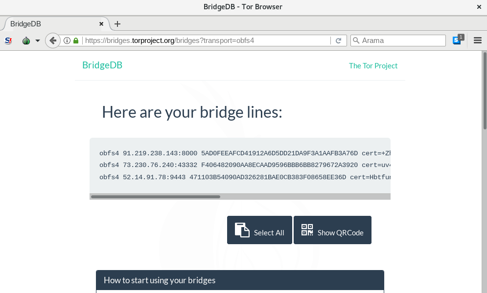

`obfs4 Bridge_IPadresi:PORT FINGERPRINT sertifika`

gibi bir format ile 3 adet köprünüz olacak.

Daha sonra, Uçbirim'de aşağıdaki komutu çalıştırın:

`sudo nano /etc/tor/torrc`

Şöyle bir ekran karşınıza gelecektir:

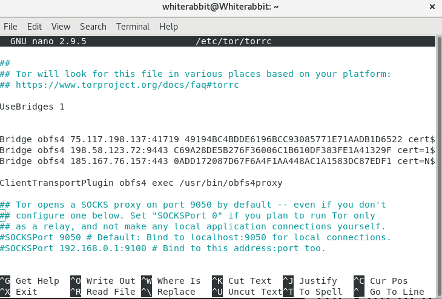

Uygun bulduğunuz bir yere, aldığınız köprüleri aşağıdaki formatla yerleştirin:

```
UseBridges 1

Bridge obfs4 <kendi bridge adresleriniz>

ClientTransportPlugin obfs4 exec /usr/bin/obfs4proxy
```

Sırasıyla Ctrl+O ve Ctrl+X yaparak çıkın.

Tor proxy'nizin çalışıp çalışmadığını Uçbirim'e `tor` yazıp deneyebilirsiniz.

```
Tor has successfully opened a circuit. Looks like client functionality is working.

bootstrapped %100
```

Yukarıdaki yazıyı görüyorsanız proxy çalışıyor demektir. Daha sonra aşağıdaki komutla Tor servisini başlatın:

`sudo systemctl start tor`

Artık **9050** numaralı portu kullanarak uygulamaları Tor'a bağlayabilirsiniz.

### Telegram'ı Tor üzerinden kullanmak

Telegram'ı Tor üzerinden kullanabilmek için, Telegram'ın sol üst köşesindeki sandviç menüye basıp, ayarlar menüsüne gelin.

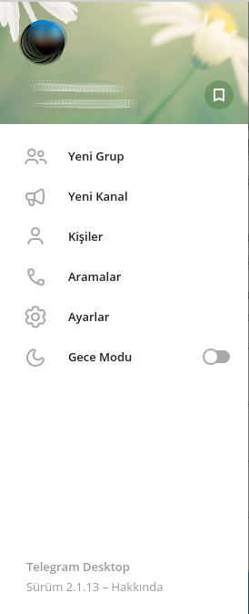

Daha sonra açılan menüden, "Gelişmiş" seçeneğine tıklayın.

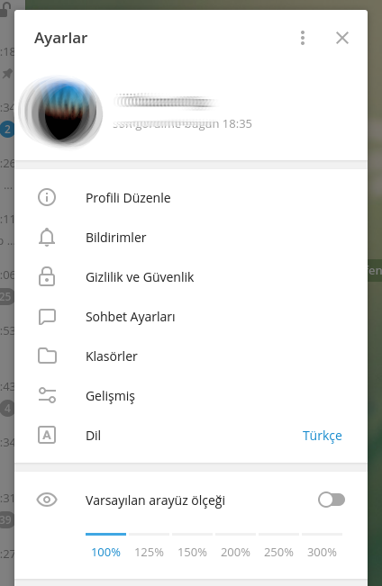

En üstte yer alan "Ağ ve vekil sunucusu" bölümündeki "Bağlantı türü"ne tıklayın.

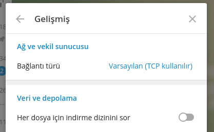

Açılan menüden, "Özel vekil sunucusu kullan" seçeneğine basın ve yapılandırmayı aşağıdaki gibi oluşturun:

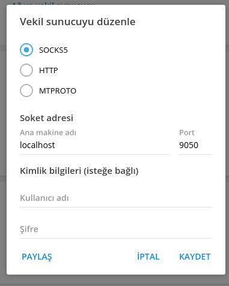

Sonuç olarak, eklediğiniz vekil sunucusu "çevrimiçi" olarak görünmelidir.

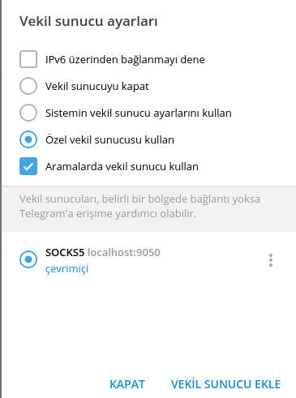

Tebrikler, Telegram'ı artık Tor üzerinden kullanıyorsunuz. Tor üzerinden yapılan sesli aramalar çok sık kesilmektedir, o yüzden "Aramalarda vekil sunucu kullan" seçeneğinin işaretini kaldırmanız arama kalitenizi artıracak, ancak trafiğinizin açıktan geçmesine sebebiyet verecektir.

## Android

Android üzerinde Tor kullanmak için, öncelikle özgür uygulama mağazası [F-Droid](https://f-droid.org)'i indirmeniz gerekmektedir. Bunun için cep telefonunuzdan <https://f-droid.org>'u ziyaret edebilir ya da aşağıdaki QR kodunu tarayabilirsiniz.


F-Droid'in sitesine girdiğinizde, "F-Droid'i indir" butonuna basın.

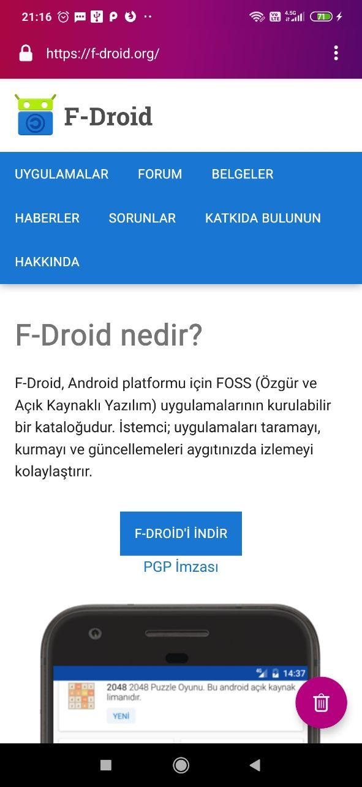

Sonrasında çok yüksek ihtimalle, tarayıcınızın uygulama kurma yetkisi olmadığına dair bir hata alacaksınız. "Ayarlar" butonuna basıp "Bu kaynaktan izin ver" seçeneğini aktif edin.

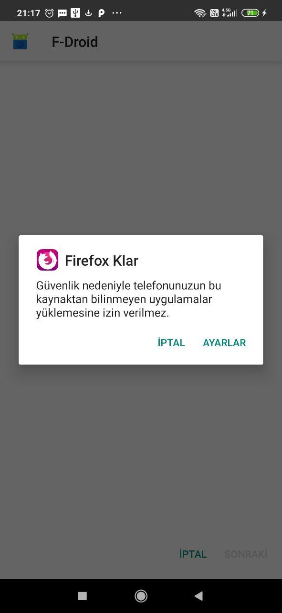
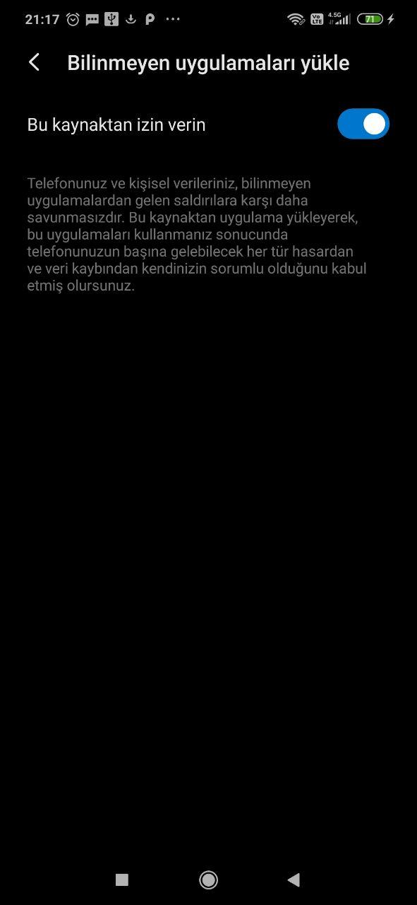

Daha sonra, F-Droid kurulacaktır. F-Droid'i ilk açtığınızda depoları güncelleyecektir, bunu `apt update` gibi düşünebilirsiniz. Daha sonrasında aşağıdaki gibi bir ekran bizi karşılayacak:

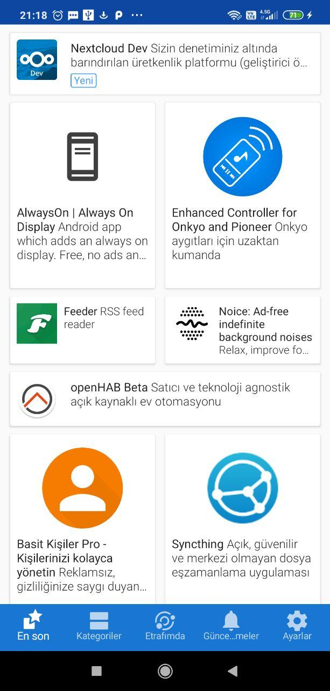

Tor Browser ve Orbot gibi araçlar, F-Droid'in orijinal deposunda değil, [The Guardian Project](https://guardianproject.org)'in deposunda bulunur. Bunun için bu depoyu aktive etmemiz gerekir. Aşağıdaki adımları izleyerek bu depoyu aktive edebilirsiniz. Ayarlar sekmesinden "Depolar" seçeneğine basıp, Guardian Project seçeneğini aktive edin.

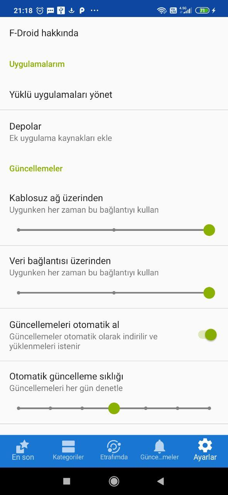
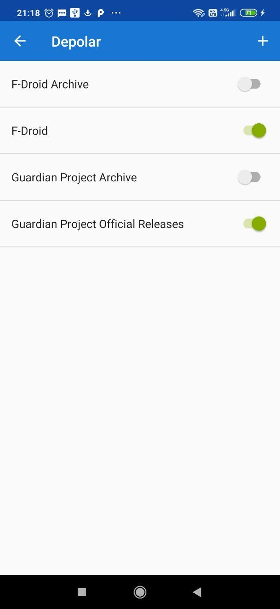

Daha sonra ekranı aşağı kaydırmaya çalışarak depoları güncelleyin ve aramaya "Tor Browser" yazın. "Yükle" butonuna basarak uygulamayı kurun. Bir önceki adımdaki izi süreci tekrar karşınıza çıkacaktır.

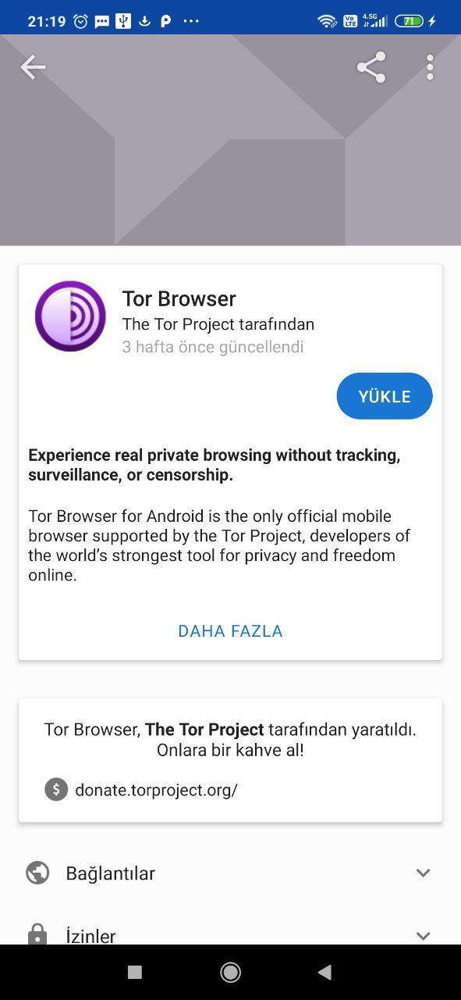

Tor Browser'ı başlatın. Sizi şöyle bir ekran karşılayacak:

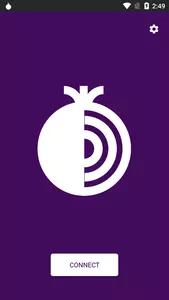

Sağ üstteki dişliye tıklayın ve aşağıdaki adımları izleyin:

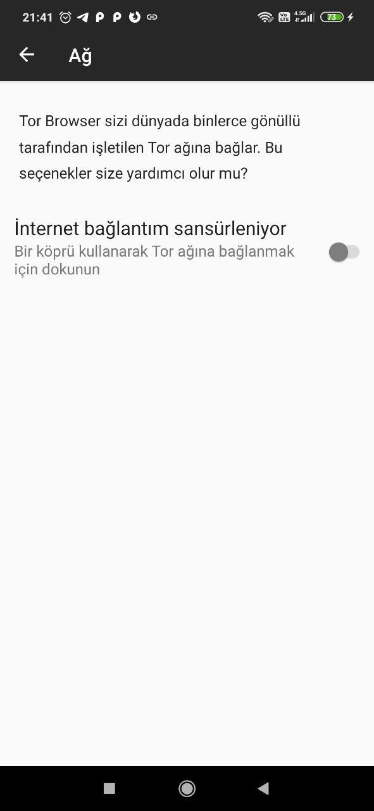
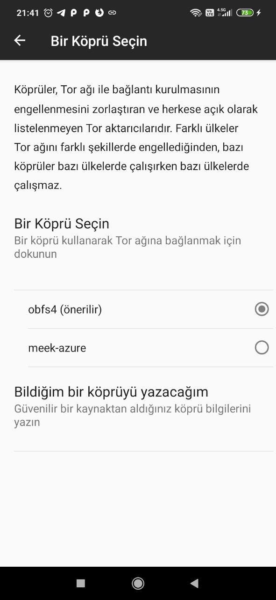

Daha sonra geri dönün ve "Bağlan" butonuna basın. Eğer aşağıdaki gibi bir ekranla karşılaştıysanız Tor bağlantısını kurdunuz.

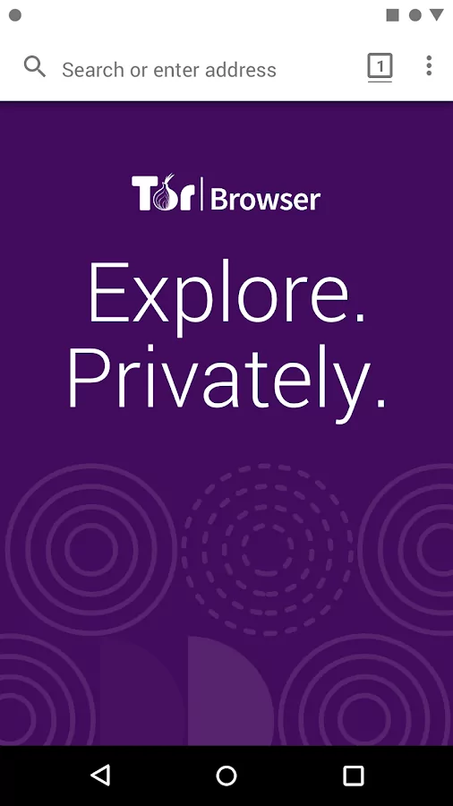

### Orbot ile uygulamaları Tor ile kullanmak

Twitter ve Telegram gibi uygulamaları Tor üzerinden kullanabilmek için, Orbot isminde bir uygulamayı kurmanız gerekmektedir. Bu uygulamayı [F-Droid](https://f-droid.org) üzerinden indirip kurabilirsiniz. Yukarıdaki Tor Browser yönergesinde F-Droid'i nasıl kurabileceğiniz anlatılmıştır.

Orbot'u F-Droid üzerinden kurun.

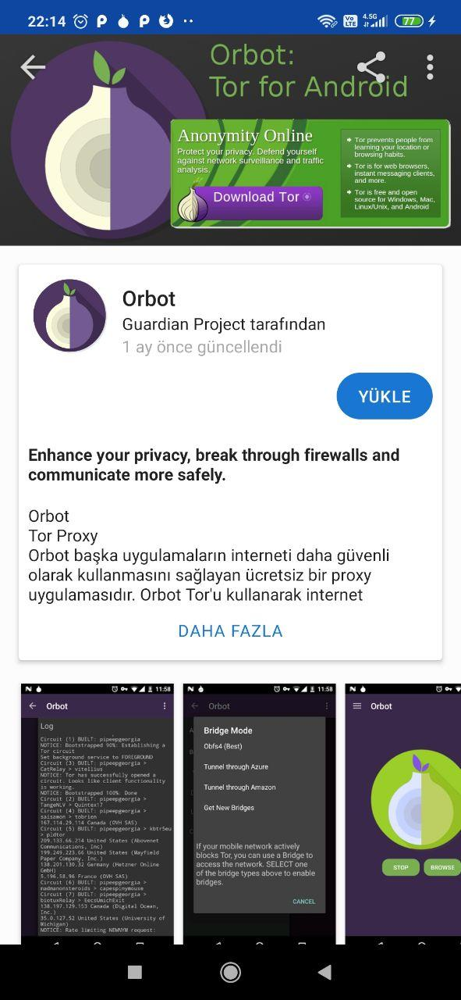

Orbot'u açtığınızda aşağıdaki gibi bir ekran ile karşılaşacaksınız:

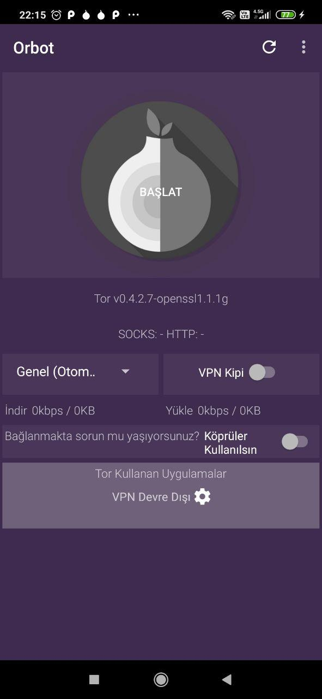

Alt tarafta bulunan "Köprüleri kullan" seçeneğini aktif hale getirin ve seçenekleri yukarıda "Tor bağlantısı sağlanıyor" yazana kadar deneyin (bunun biraz farazi olduğunun farkındayız ancak maalesef ki köprüler bazen çalışmayabiliyor):

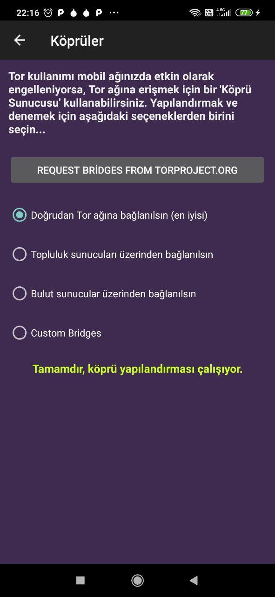

En nihayetinde Tor ağına bağlanmış olacaksınız:

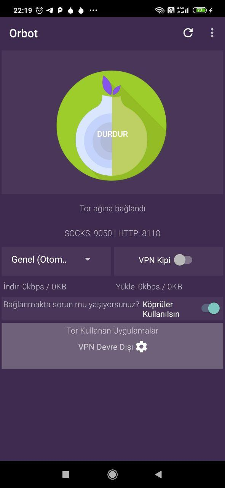

Bu noktada, SOCKS proxy destekleyen uygulamalar için port numarası 9050, HTTP proxy destekleyen uygulamalar için ise 8118'dir.

#### Telegram'ın yapılandırılması

Telegram uygulamasını açın ve soldaki sandviç menüden "Ayarlar" seçeneğine basın:

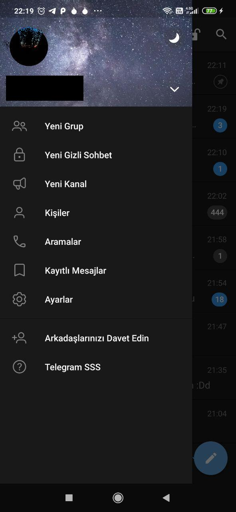

Daha sonra açılan ayarlardan, "Veri ve Depolama" seçeneğine girin:

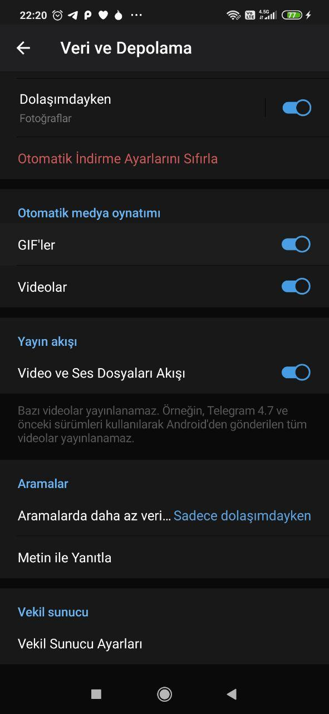

Daha sonra en altta bulunan "Vekil sunucu" ayarlarına girin ve bilgileri aşağıdaki gibi doldurun:

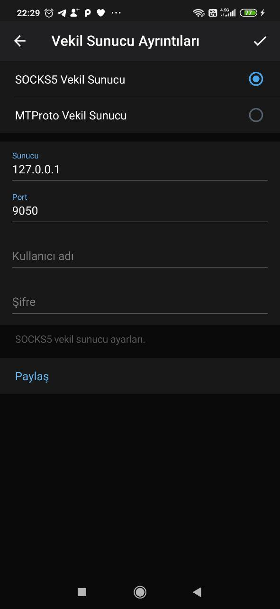

Eklediğiniz vekil sunucunun yanında "Bağlandı" yazıyorsa yapılandırmanız çalışıyordur. Ana ekrana döndüğünüzde, üst tarafta aşağıdaki gibi bir ikon görüyorsanız, Telegram artık Tor ağı üzerinden çalışıyor demektir:

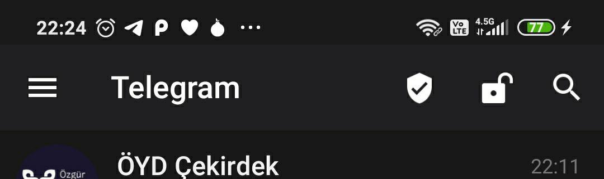

#### Twitter'ın yapılandırılması

Twitter uygulamasına girdiğinizde, sol tarafı çekerek "Ayarlar" menüsüne girin.

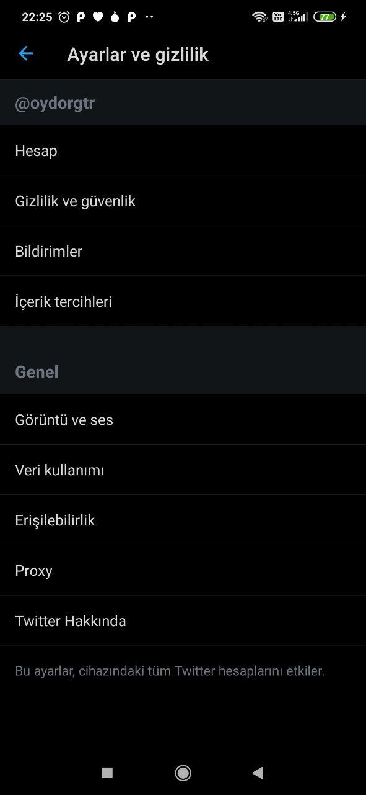

Proxy seçeneğine tıklayın ve bilgileri aşağıdaki gibi ayarlayıp kaydedin.

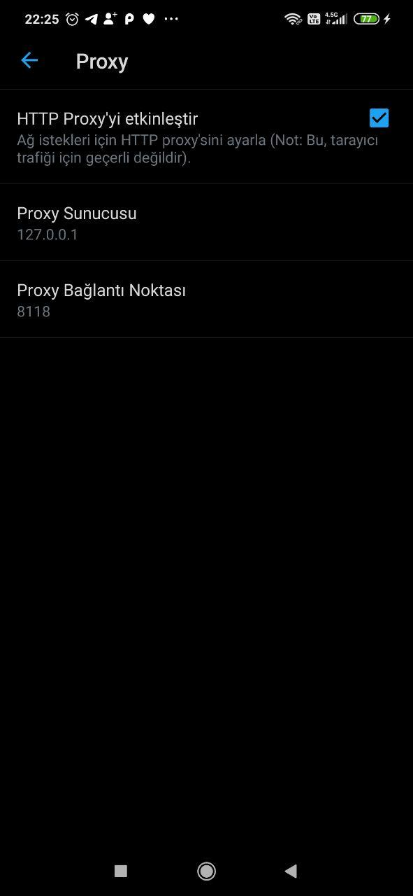

Eğer tweetleri yenileyebiliyorsanız artık Twitter'ı Tor üzerinden kullanıyorsunuz demektir.

## Tor Ağının Zayıf Noktaları

Genel olarak Tor ağı güvenli sayılsa da %100 güvenlik SAĞLAMAYACAKTIR. İlk bağlandığınız Tor düğümü sizin IP adresinizi bilebilir, İnternet'e çıktığınız son Tor düğümü ise nereye bağlandığınızı bilecektir.

**Exit node**, yani bağlandığınız en son Tor düğümü olan bir kişi veya otorite, Tor devrenizi haritalayıp gerçek IP adresinize ve dolayısı ile kimliğinize ulaşabilir.

Bütün bunlar bir yanda dursun;

Ağ dinleme (zehirleme) saldırıları olarak bilinen MITM saldırıları ile Tor ağında giden parolalarınız gibi gizli kalması gereken bilgileriniz, güvenli sandığınız o yolda başkaları tarafından rahatlıkla ele geçirilebilir. Burada toplum yararına yapılan her projedeki gibi sistemin işlemesi için en büyük etkenin **güven** olduğunu görüyoruz.

Bu riskleri olabildiğince minimuma indirgemek için; "**Tor over VPN**" olarak tanımlanan VPN üzerinden Tor ağına girmek gibi yöntemler kullanılmaktadır. Tabii ki bu durumda da herhangi bir VPN otoritesi IP adresinizi açık olarak görebilir. Fakat Tor ağındaki riskleri minimuma indirgemiş olursunuz. Bu konuda da tamamıyla kullanmış olduğunuz VPN otoritesinin bilgilerinizi saklayıp satmadığından bir şekilde emin olmanız gerekmektedir.

Farklı bir seçenek ise kendi sunucunuzu kiralayıp, üzerine bir OpenVPN servisi kurarak kendi VPN'inizi oluşturup onun üzerinden Tor ağına çıkmanız olabilir. Bu konuda Özgür Yazılım Derneği'nin bir projesi olan [Kendi Bağlantım](https://kendibaglantim.org)'ı inceleyebilirsiniz.

## Tor kullanarak açığa çıkan vakalar

Harvard Üniversitesi'nde okuyan bir öğrenci, çalışmadığı vizelerini erteletebilmek amacıyla okuluna Tor ağı üzerinden bomba ihbarında bulunur, fakat yakalanır.

Bunun nedeni ise aslında çok basit. Servis sağlayıcılarınız veya İnternet'e bağlandığınız kafe, üniversite vb. gibi ortak ağlarda, hangi saatte kimin Tor ağına bağlandığı rahatlıkla görülebilir, fakat Tor ağında neler yapıldığı görülemez. Söz konusu öğrenci Tor ağına okulunun ortak ağı üzerinden bağlandığı ve gelen bomba tehdidi de Tor ağından geldiği için; mesajın atıldığı tarihte ve saatte okuldan sadece 1 (bir) bilgisayardan Tor ağına bağlanıldığı fark edilir. Yapılan incelemelerde, mesajın hangi bilgisayardan atıldığı tespit edilir, daha sonrasında kamera görüntülerinden tarih ve saat baz alınarak kimin tarafından kullanıldığı öğrenilir ve ilgili öğrenci yakalanır.
