# VPN (Virtual Private Network)

- [VPN ne işe yarar?](#vpn-ne-işe-yarar)
- [Neden VPN kullanmalıyım?](#neden-vpn-kullanmalıyım)
- [Ücretsiz VPN olur mu?](#Ücretsiz-vpn-olur-mu)
- [VPN hizmeti seçerken nelere dikkat emeliyim?](#vpn-hizmeti-seçerken-nelere-dikkat-etmeliyim)
- [VPN Kurulumu](#vpn-kurulumu)
  - [VPN Kullanım Stratejisi](#vpn-kullanım-stratejisi)
  - [OpenVPN Sunucusu Kurulumu](#openvpn-sunucusu-kurulumu)
  - [İstemci Kurulumu](#İstemci-kurulumu)
    - [GNU/Linux - Masaüstü](#gnulinux---masaüstü)
    - [GNU/Linux - Uçbirim](#gnulinux---uçbirim)
    - [Android](#android)
    - [OpenWRT Yönlendirici](#openwrt-yönlendirici)
      - [Uçbirim ile](#openwrt---uçbirim)
      - [Web arayüzü ile](#openwrt---luci)
- [VPN Bağlantısının Kesilmesi Sorunsalı](#vpn-bağlantısının-kesilmesi-sorunsalı)
  - [GNU/Linux](#gnulinux)
    - [UFW](#ufw)
  - [Android](#android-1)

VPN temel olarak; iki cihazın, yerel ağlarının güvensiz İnternet bağlantısı üzerinden birbirine güvenli şekilde bağlanabilmesi için geliştirilmiş bir teknolojidir. İki bilgisayarın birbirine şifrelenmiş bir kanal üzerinden bağlanmasını sağlar. Temel olarak şirketlerin ağ altyapılarına uzaktan güvenli erişim için tasarlanmış olan VPN'in günümüzde en yaygın kullanımı, kullanıcılarının tehlikeli ağlardan güvenli şekilde İnternet'e erişmesini sağlamaktır.

## VPN ne işe yarar?

VPN temel olarak size şunları sağlar;

* İletişiminizi cihazınız ile VPN sağlayıcınız arasında şifreleyerek gözetime, engele veya değiştirilmeye uğramasına engel olur.

* VPN'e bağlı olduğunuz sürece VPN sağlayıcınızın sunucusundan çıkış yapacağınız için girdiğiniz web siteleri veya kullandığınız hizmetler VPN IP adresinizi göreceğinden, kim olduğunuzu siz belirtmediğiniz sürece bilmeleri zorlaşacaktır.

* VPN kimi koşullar için yeterince anonimlik sağlamamakla beraber, eğer ortak bir VPN sunucusu kullanıyorsanız, bağlı olduğunuz VPN sunucusundaki herkes ile aynı IP adresini paylaştığınızdan kalabalığın içine karışmış olursunuz.

## Neden VPN kullanmalıyım?

VPN kullanmak için çok çeşitli sebepleriniz olabilir;

* Bulunduğunuz ülkeden veya kullandığınız ağdan erişim kısıtlaması olan hizmetlere erişmek istiyorsunuzdur.

* Ağ üzerinden iletişiminizi denetleyen, takip eden, kaydeden kişilere karşı mahremiyetinizi korumak istiyorsunuzdur.

* Bağlı olduğunuz yerel ağ üzerinden size yöneltilebilecek saldırılara karşı korumaya ihtiyacınız vardır.

## Ücretsiz VPN olur mu?

Türkiye'de ve dünyada yaşanan her engelleme ve sansür girişiminde akla ilk gelen çözüm VPN'dir. Neredeyse her tavsiye ise **bedava** VPN hizmetleri üzerinden yürür. Doğal olarak sansür durumunda VPN kullanan çoğu insanın, tek amacı sansürü aşarak ihtiyaç duyduğu bilgiye veya hizmete erişmek ve VPN teknolojisi hakkındaki bilgisi kısıtlı olduğundan, olası tehlikelerin üzerine düşünmediği söylenebilir. Bir VPN hizmet sağlayıcısı, sunucusuna bağlı olduğunuz sürece;

* Sizin IP adresinizi ve buna bağlı olarak konumunuzu bilebilir.

* Ziyaret ettiğiniz web sitelerini ve kullandığınız hizmetleri, [içeriğini bilemese](https://tr.wikipedia.org/wiki/Transport_Layer_Security) bile kaydedebilir.

* Şayet VPN istemcisi bir tarayıcı eklentisi şeklinde kurulduysa, kötücül bir eklenti tüm tarama verisine erişebilir.

* Dikkatli olunmazsa kötücül bir VPN sunucusu iletişimizin arasına girip verilerinizi çalabilir, size istenmeyen reklamlar sunabilir veya cihazınıza zarar vermeye çalışabilir.

Bu sebeplerden ötürü VPN kullanmak hizmet sağlayıcıya bir biçimde güven gerektirir. Daha doğru bir ifade ile VPN; **İnternet servis sağlayıcınıza olan güveninizi VPN sağlayıcınıza aktarır.** Nasıl ki evinizin anahtarını rastgele birine vermiyorsanız İnternet bağlantınızı da rastgele birinin eline vermemeniz gerekir. Bu sebepten ötürü İnternet hizmetlerine ilişkin **para vermiyorsanız ürün sizsiniz** sözüne dayanarak VPN'i satın almanız veya kendi sunucunuzu kurarak kullanmanız gerekir.

Bu duruma istisna sayılabilecek birkaç örnek bulunmakta. Bu istisnalar, dünyada mahremiyet ve dijital hak mücadelesi içinde olan toplulukların ücretsiz hizmetleri ve kimi güvenilir adledilen şirketin giriş seviyesi bedava verdikleri hizmetlerdir. Aşağıdaki liste dahilinde ücretsiz VPN sunan ve genel olarak güvenli görülen kurumları bulabilirsiniz.

[Riseup](https://www.riseup.net/vpn)

[Calyx Institute](https://calyxinstitute.org/projects/digital-services/calyx-vpn)

[ProtonVPN](https://protonvpn.com)

## VPN hizmeti seçerken nelere dikkat etmeliyim?

* **[Özgür yazılım](https://oyd.org.tr/yazilar/ozgur-yazilim/)** kullanmayan hiç bir VPN sağlayıcıya güvenmeyin. VPN ile tüm ağ trafiğinizi teslim ettiğiniz bir şirketin kullandığı yazılımların sizin özgürlüğünüze karşı olması hiç güven telkin eden bir unsur değildir.

* Kayıt tutmama politikası pek çok VPN servisinin iddiasıdır. Bu, sunucularına yapılan bağlantılara ilişkin kayıtların hiç tutulmadığını ifade eder. Elbette geçmişte bunun sadece bir iddia olduğu ve doğrulanamayacağını gösteren sözünü tutmamış [VPN şirketleri](https://www.comparitech.com/blog/vpn-privacy/ufo-vpn-data-exposure/) vardır. Bazı hizmet sağlayıcılar sunucularında sabit sürücü bile bulundurmadıklarını ifade etmektedir. Bu konuda diğer konularda olduğu gibi VPN sağlayıcının sözüne güvenmek zorunluluğu olduğundan daha önce devletlere bilgi sağlayıp sağlamadığına bakılması önemli olabilir. [PureVPN](https://restoreprivacy.com/vpn-logs-lies/) vakası bu konuda incelenmeye değer bir örnek. Daha sonra VPN sağlayıcının geçmişini, kaç yıldır hizmette olduğunu ve birinci elden, bağımsız kullanıcı deneyim ve yorumlarını okumak faydalıdır.

* VPN sağlayıcınızın özgür yazılım olan [OpenVpn](https://openvpn.net/) desteklediğinden ve yapılandırma (config) dosyalarını sizinle paylaştığından emin olun. Bu sayede GNU/Linux ve Android işletim sistemine sahip cihazlarınızda kolaylıkla yerleşik VPN istemcilerini kullanabilirsiniz. Bu imkan aynı zamanda VPN sağlayıcının yazılımına mahkum kalmamanızı da garanti eder.

* ABD, Birleşik Krallık ve Almanya gibi ülkelerin Internet kullanıcılarını gözetlemek ve profillemek için çokça çabaya giriştiği ve yasal(!) imkanları kullanarak pek çok şirketten zorla veri aldığı bilinmektedir. Bu bakımdan VPN sağlayıcınızın bu konuda kötü bir geçmişi olmayan ve hukuki güvenlik bakımından iyi sayılan ülkelerden seçmeniz kesinlikle tavsiye edilir. Hollanda veri merkezlerinin hızından dolayı, İsviçre'de AB hukuk sisteminin dışında ve mahremiyet yanlısı sağlam hukuk sisteminden dolayı tercih edilmektedir.

* VPN sağlayıcınızın mutlaka bağlantı için farklı protokollere izin verdiğinden emin olun. Çoğu VPN engellemesi standart portlar ve protokollere yönelir. Şayet elinizde geniş bir bağlantı imkanı olursa bu tip yasakları aşmanız kolaylaşacaktır. Bunlar arasında en önemlileri [SSL tünelleme](https://en.wikipedia.org/wiki/Secure_Socket_Tunneling_Protocol), [SSH tünelleme](https://en.wikipedia.org/wiki/Tunneling_protocol#Secure_Shell_tunneling) yer almaktadır.

* Herhangi bir bağlantı kısıtlaması özgürlüğünüze karşı bir harekettir. Bu bakımdan bir VPN sağlayıcı sizin torrent kullanmanıza veya indirme hızınıza karışıyorsa hem bir çeşit kayıt tutuyordur hem de bağlantı özgürlüğünüzü sınırlıyordur.

* Bir VPN sağlayıcı sizden kayıt için hiç bir kişisel veri talep etmemelidir. Buna ödeme imkanları arasında kriptoparalar ve posta yolu ile nakit gönderimi gibi anonim seçenekler bulundurmak da dahildir. Nihayetinde VPN sağlayıcınıza güveniyor olacaksınız kimliğiniz için fakat şirkete güvenseniz bile devletler ve kötücül saldırıların ihtimali hala asgari veriyi teslim etmeniz için geçerli gerekçelerdir.

## VPN Kurulumu

### VPN Kullanım Stratejisi

VPN kullanmaya başlamadan önce ihtiyacınız, kullandığınız cihazların durumu ve seçtiğiniz VPN sağlayıcının imkanlarını değerlendirmeniz gereklidir. Her VPN sağlayıcı sınırlı sayıda cihazın anlık bağlantısına izin vermektedir. Bu bakımdan; ne yazık ki basitçe cihazınıza sağlayıcınızın istemcisini kurup kullanmak her ne kadar en kolay seçenek olsa da ihtiyaçlarınızı karşılayamayabilir. Bu bakımdan elinizdekilere bakıp bir değerlendirme yapmalısınız.

Elinizdeki cihazların sayısını ve konumlarını değerlendirin. Mobil cihazları bulundukları ağdan bağımsız olarak VPN'e bağlı kalmalarını isteyeceğinizden bu cihazların doğrudan bağlanmaları için kurulum yapmanız gerekecektir. Şayet ev ve işyeri gibi sabit bir alanda duran cihazları bağlamak veya ağ bağlantınızdaki tüm cihazları korumak istiyorsanız bir [yönlendiriciye](https://en.wikipedia.org/wiki/Router_(computing)) kurulum yapmanız faydalı olabilir. Bir yönlendiriciyi [LibreCMC](https://librecmc.org/), [OpenWRT](https://openwrt.org/) veya [DD-WRT](https://dd-wrt.com/) yükleyerek özgür kılabilir ve üzerinde OpenVPN ile tüm ağınızı kapsayacak şekilde VPN çalıştırabilirsiniz.

Eğer cihazlarınız sınırlı ve belirli bir ağa bağlı değil ise doğrudan VPN sağlayıcınızın sağladığı yazılımları cihazlarınızda çalıştırarak bağlantı kurmak en kolay yol olacaktır.

Bu kurulumun avantajları;

* Cihazınızdaki gerekli ayarlar otomatik olarak yapılabilecektir.
* VPN sağlayıcınızın sunduğu tüm protokol ve sunuculara tek elden kolayca ulaşabilirsiniz.

Dezavantajları ise;

* Fazladan bir yazılımı cihazlarınıza kurma ve çalıştırma zorunluluğu.
* Yazılımın cihaz kaynağınızı kullanması bu sebeple kimi eski donanımlarda çalışmama ihtimali.
* Desteklenmeyen işletim sistemlerine kurulamayacak olması.
* Sistem ayarlarının yapılabilmesi için yazılımın yönetici yetkisi ile çalışmasının gerekmesi.

Diğer seçeneğiniz ise işletim sisteminiz tarafından desteklendiği durumlarda dahili OpenVPN istemcisi ile kurulum yapmaktır. Bu kullanım sistem kaynağınızı daha az kullanacak ve daha birleşik bir deneyim sunacaktır. Lakin ayarların bir kısmını kendiniz yapmak zorunda kalacağınızdan vakit ve emek harcamaya hazır olmanız gereklidir. Bunu VPN sisteminin arkaplanını öğrenmek ve hatalarınızı görmek için bir fırsat olarak düşünebilirsiniz.

### OpenVPN Sunucusu Kurulumu

OpenVPN sunucusu kurulumu için [github.com/Nyr](https://github.com/Nyr) deposunda bulunan ve aktif olarak güncellenen bir bash betiğini kullanabilirsiniz. Bu betik Ubuntu, Debian, Centos veya Fedora dağıtımları üzerinde gerekli yüklemeleri ve ayarları yapıp kullanıma hazır bir OpenVPN sunucusu çalıştırıyor. `wget https://git.io/vpn -O openvpn-install.sh` komutu ile betik çalışma dizinine kaydedilebilir ve `bash openvpn-install.sh` komutu ile çalıştırılabilir. Komutu gerekli paket yüklemelerini yapabilmesi ve ayar dosyalarını oluşturabilmesi için root yetkileriyle çalıştırmamız gerekmekte.

1. Betik ilk olarak sunucunun ip adresslerini listeleyip, OpenVPN sunucusunun kullanması istenen ip adresinin seçilmesini istiyor.
```bash
Which IPv4 address should be used?
     1) 198.51.100.202
     2) 10.0.10.1
IPv4 address [1]:
```
Kullanılmak istenen adres sıra numarasıyla seçilebilir.

2. Ardından OpenVPN'in kullanması istenen protokol soruluyor;
```bash
Which protocol should OpenVPN use?
   1) UDP (recommended)
   2) TCP
Protocol [1]:
```
Yine sadece enter ile önerilen seçeneği onaylayıp UDP kullanılabilir.

3. OpenVPN'in kullanacağı port soruluyor ve ön tanımlı olarak 1194 seçili.
```bash
What port should OpenVPN listen to?
Port [1194]:443
```
Bu aşamada hareket halindeyken istemcilerin dahil olacağı açık ağlarda 1194 portu engellenmiş olabileceğinden https portu olan 443'ü seçmek yerinde bir tercih olabilir.

4. OpenVPN'e bağlanacak istemciler için bir DNS sunucusu seçilmesi istendiğinde öntanımlı olarak sistemin halihazırdaki ayarlarını kullanması yanında kullanımı yaygın olan bazı DNS sunucuları listeleniyor:
```bash
Select a DNS server for the clients:
   1) Current system resolvers
   2) Google
   3) 1.1.1.1
   4) OpenDNS
   5) Quad9
   6) AdGuard
DNS server [1]:
```
5. Son olarak ilk istemci için bir isim girilmesi isteniyor.
```bash
Enter a name for the first client:
Name [client]:
```
Kurulum tamamlandıktan sonra başka istemciler eklemek için betik yeniden çalıştırılabilir.

Gerekli yüklemeler yapıldıktan sonra çalışmakta olan OpenVPN sunucusuna bağlanmak üzere istemci cihaza yüklenmesi gereken ayar dosyasının konumu bildiriliyor `/root/<istemciadı>.ovpn`. Bu dosyayı istemci cihaza kaydedip, istemci programa tanıtmak gerekiyor.

6. Kurulumun ardından betik tekrar çalıştırılırsa yeni bir istemci ekleme, bir istemciyi kaldırma, OpenVPN sunucusunu kaldırma seçenekleri sunuluyor.
```bash
Select an option:
   1) Add a new client
   2) Revoke an existing client
   3) Remove OpenVPN
   4) Exit
Option:
```

### İstemci Kurulumu

#### GNU/Linux - Masaüstü

GNU/Linux dağıtımları Linux çekirdeğinde, doğrudan OpenVPN'i ve artık, daha yeni bir teknoloji olan [Wireguard](https://www.wireguard.com/)'ı desteklemektedir. Masaüstü ortamları da Openvpn istemcisine doğrudan destek vermektedir. GNU/Linux dünyasında çokça masaüstü ortamı olmasından dolayı, rehberimiz en yaygın kullanılan Gnome 3 ile hazırlandı lakin pek çok kullanıcı ayarların kendi cihazlarında da benzer olduklarını görecektir.

1. Öncelikle VPN sağlayıcınızdan ".ovpn" uzantısı ile OpenVPN config dosyasını indirin. Ovpn dosyaları bir metindir ve sunucu ayarları ile bağlanmanız için gereken anahtarı ve sertifikaları içerir. Şayet VPN sağlayıcınız bağlantı için bir kullanıcı adı ve parola gerektiriyor ise bunu da bir kenara not alın.


2. Gnome'un ağ ayarlarına isterseniz sağ üst köşeden açılan menüde **ağ ayarlarına** girerek veya etkinlikler köşesine tıklayarak menüden **ayarlara** girerek ulaşabilirsiniz.

3. Sağda yer alan "+" düğmesine tıklayın. 

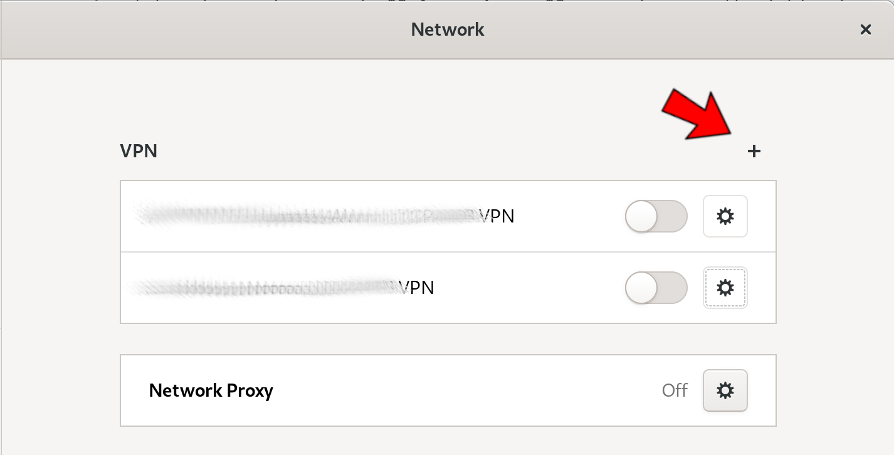

4. Karşınıza çeşitli seçeneklerin sunulduğu "VPN Ekle" penceresi çıkacak. Burada en alttaki "Dosyadan aktar" seçeneğini seçin. `.ovpn` uzantılı VPN dosyasını bulun ve aktarın.

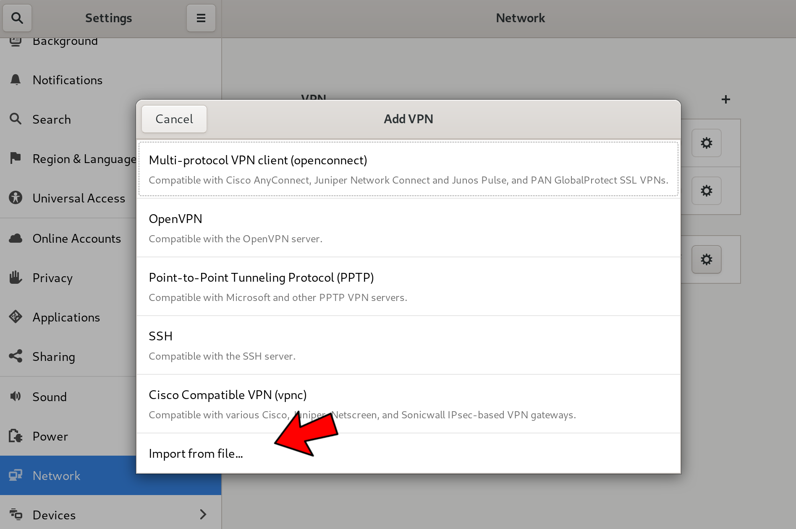

5. Eklediğiniz VPN'in yanındaki düğmeye tıklayarak kullanılabilir hale getirebilirsiniz.

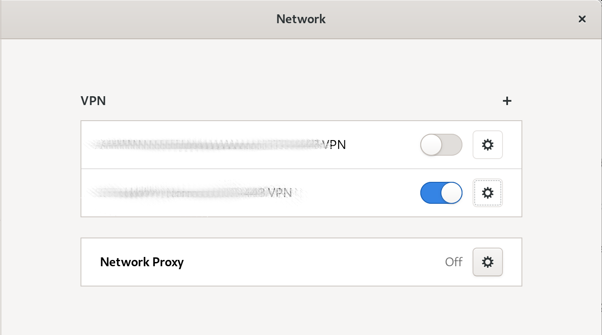

#### GNU/Linux - Uçbirim

1. Kullandığınız GNU/Linux dağıtımının depolsundan *OpenVPN*'i dağıtımınızın paket yöneticisiyle yükleyebilirsiniz.
  - __apt__ paket yöneticisi kullanan dağıtımlarda \(Debian, Trisquel, Linux/Mint, Ubuntu...);
`sudo apt-get install openvpn` 
  - __rpm__ paket yöneticisi kullanan dağıtımlarda \(CentOS, Fedora...) ise;
`sudo dnf install openvpn`
komutu ile OpenVPN'i sisteminize kurabilirsiniz.

OpenVPN'i yüklediğinizde aşağıdaki dizinler oluşur:

`/lib/systemd/system/openvpn-client@.service` (servis dosyası)

`/etc/openvpn/client` ve `/etc/openvpn/server` (ayar dosyaları)

2. VPN sağlayıcınızdan veya OpenVPN sunucunuzdan edindiğiniz **.ovpn** ayar dosyasının uzantısını aşağıdaki komut ile .ovpn'den .conf'a değiştirin:

`mv <istemciAyarlari>.ovpn <istemciAyarlari>.conf`

3. Daha sonra değiştirdiğiniz dosyayı ilgili dizine taşıyın:

`sudo mv <istemciAyarlari>.conf /etc/openvpn/client/<istemciAyarlari>.conf`

OpenVPN'in bu aşamadan sonra VPN sağlayıcınızın ayarlarını tanıyacaktır.

4. OpenVPN'i çalıştırmak için aşağıdaki komutu kullanabilirsiniz;

`openvpn --config <istemciAyarlari>.conf`

Servis olarak başlatmak ve durdurmak için;

`systemctl {start,stop} openvpn-client@<istemciAyarlari>.conf` 

Sistem açılışında çalışması için de;

`systemctl enable openvpn-client@<istemciayarlari>.conf` 

komutları kullanılabilir.

#### Android

Android işletim sistemi 7. sürüm ve sonrasında VPN desteğini işletim seviyesinde sunmaya başlamıştır. Ne yazık ki OpenVPN hala bu seçenekler arasında olmamakla birlikte özgür bir OpenVPN istemcisini Android ayarlarında VPN sağlayıcısı olarak belirlediğinizde sistemle gayet uyumlu çalışmaktadır.

1. [OpenVPN for Android](https://f-droid.org/en/packages/de.blinkt.openvpn/) uygulamasını [F-Droid](https://f-droid.org/en) özgür yazılım deposundan indirin ve cihazınıza kurun.

2. OpenVPN for Android yazılımını çalıştırın ve açılan ekranda sağ üst köşedeki + simgesine tıklayarak ekleme arayüzünü açın.


3. Karşınıza gelen ekrandan **içe aktar** veya **import** düğmesine tıklayarak config dosyasını seçme aşamasına gelin.


4. Açılan dosya yöneticisinden VPN sağlayıcınızdan indirdiğiniz .ovpn dosyasını bulun ve tıklayın.


5. Ertesinde çıkan ekranda config dosyanızın detayları görülecektir. tik işaretine tıklayarak kurulumu tamamlayın.


6. Artık OpenVPN for Android VPN bağlantınızı kurmaya hazır.

Android ayarlarını yaparak sisteminizin VPN bağlantısını korumasını ve kesilmesi durumunda iletişimin de durmasını sağlamanız mümkün. Bunun için:

1. Cihazınızın ayarlarına gidin ve **ağ ve internet** veya **network and internet** ayarlarına girin.

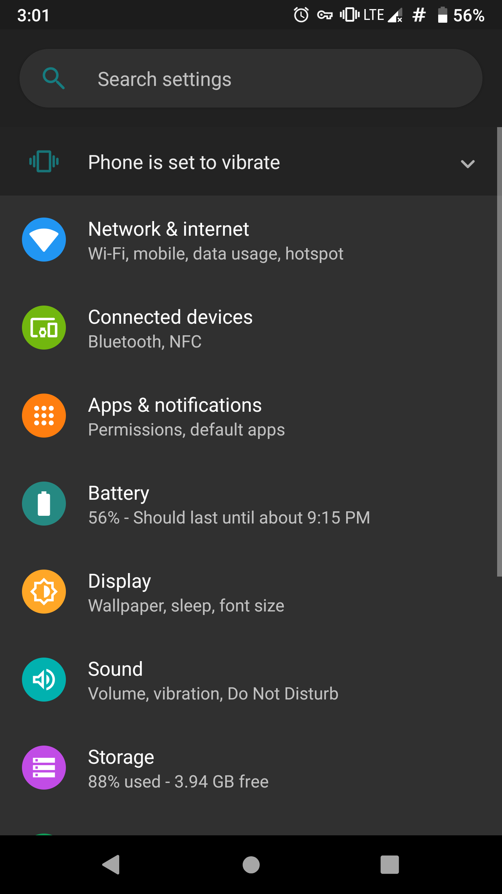

2. VPN ayarlarını muhtemelen en altta bulacaksınız.


3. Karşınıza OpenVPN for Android seçeneği çıkmış olacaktır. Yanındaki dişli simgesine tıklayarak kurulum sayfasını açın.


4. Çıkan ayarlardan **Always-on VPN** veya **sürekli bağlı VPN** ile **Block connections without VPN** veya **VPN kesilince bağlantıları engelle** seçeneklerini etkinleştirin.


#### OpenWRT Yönlendirici

Bir OpenWRT yönlendiriciyi OpenVPN istemcisi olarak ayarlamak için `ssh` ile komut satırı ya da bir Web tarayıcısı ile LuCi arayüzü kullanılabilir.

##### OpenWRT - Uçbirim
OpenWRT yönlendiriciyi OpenVPN istemcisi haline getirmek için `ssh` ile bağlandıktan sonra aşağıdaki işlemler uygulanmalı.

1. Gerekli paket yüklenir;  
```sh
opkg update
opkg install openvpn-openssl
```

2. Firewall ayarları;  
UCI(unifiedConfigurationInterface) kullanılarak ayar dosyasını el ile düzenlemeye gerek duymadan yapılabilir;
```bash
uci rename firewall.@zone[0]="lan"
uci rename firewall.@zone[1]="wan"
uci rename firewall.@forwarding=[0]="lan_wan"
uci del_list firewall.wan.device="tun0"
uci add_list firewall.wan.device="tun0"
uci commit firewall
/etc/init.d/firewall restart
```
3. VPN ayarları;  
VPN sunucusundan edinilen `.ovpn` uzantılı istemci ayarlar dosyasını, openvpn servisinin ön tanımlı ayarlarıyla okuması için uzantısını `.conf`'a dönüştürerek `/etc/openvpn` dizinine yerleştirmek gerekir.
```sh
mkdir -p /etc/openvpn
cp <istemci>.ovpn /etc/openvpn/<istemci>.conf
```
 - VPN servisinin gereğinden fazla yetkiyle çalışmaması için çalışacağı kullanıcı ve grup tanımı, 2. adımda yapılan firewall ayarlarıyla uyumlu olması için de aygıt tanımı aşağıdaki üç satırın _\<istemci\>.conf_'a eklenmesiyle yapılır. Dosyada önceden tanımlanmış _user_, _group_ ve _dev_ ile başlayan satırlar varsa satırbaşlarına '#' eklenerek geçersiz kılınmalı veya silinmeliler.
```sh
user nobody
group nogroup
dev tun0
```
 - VPN sunucusuna bağlanmak için kullanıcı adı ve parola kullanılması gerekiyorsa bunları, üstte kullanıcı adı altta parola olarak iki satır halinde `<istemci>.auth` dosyasına kaydedilmeli ve `<istemci>.conf`'ta bu dosya tanıtılmalı.
```
cat <<EOL|tee /etc/openvpn/<istemci>.auth
KULLANICI_ADI
PAROLA
EOL
cat <<EOL|tee -a /etc/openvpn/<istemci>.conf
auth-user-pass <istemci>.auth
EOL
```
  - İlgili dosya izinlerini sadece root kullanıcısının okuyup yazabileceği hale getirmek yararlı bir pratiktir.  
`chmod -R 600 /etc/openvpn`

4. openvpn servisi yeniden başlatıldığında bağlantı diğer cihazlar için de hazır olacak.  
`/etc/init.d/openvpn restart`  
* VPN bağlantısı kontrol etmek için internette görünen IP adresi komut satırında  
`dig +short myip.opendns.com @resolver2.opendns.com` komutuyla veya bir web tarayıcısında <https://ipleak.net> adresinin ziyaret edilmesiyle öğrenilebilir.

Kaynak: <https://openwrt.org/docs/guide-user/services/vpn/openvpn/client>

##### OpenWRT - LuCi

1. ___Gerekli iki paket yüklenir: openvpn-openssl luci-app-openvpn___  
__System>Software__ sayfasında __Actions: Update lists...__ ile paket listesi güncellendikten sonra __Filter__ kutusu ile arama yapılabilir.  
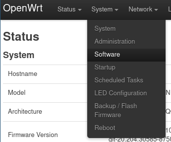 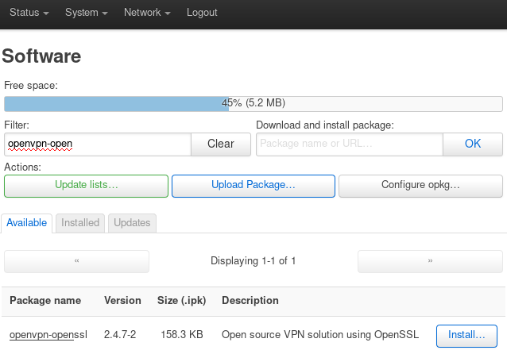
 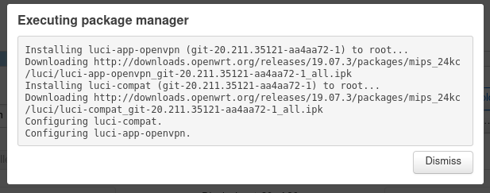
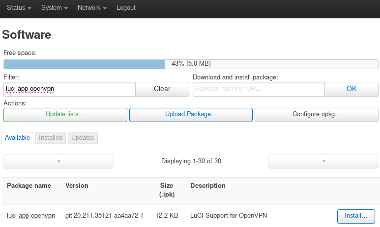  
_luci-app-openvpn_ paketi yüklendikten sonra yönlendiriciye yeniden bağlanıldığında üst menüye _VPN_ başlığı eklenmiş olacaktır.  


2. ___OpenVPN ayarları:___  
__VPN>OpenVPN__ sayfasında __OVPN configuration file upload: Browse__ ile `.ovpn` uzantılı dosya seçilip bağlantıya bir isim verildikten sonra _Upload_ butonu ile dosya yüklenir. Aynı sayfadaki listeye eklenmiş olduğu görülecektir.  
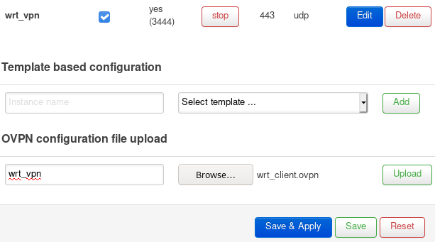
   - OpenVPN sunucusuna kullanıcı adı ve parola ile bağlanılması gerekiyorsa listede bağlantının yanındaki _Edit_ butonuna tıklanarak açılan sayfada alttaki kutuya, parola alt satırda olacak sekilde iki satır halinde yazılır ve üstteki kutuya __auth-user-pass /etc/openvpn/<BAĞLANTI_ADI>.auth__ satırı eklenir.  
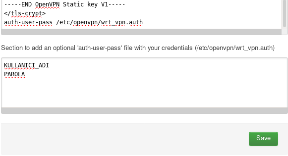

3. ___OpenVPN istemcisini başlatma:___  
__Start__ butonu ile servis başlamazsa önce solundaki __Enable__ kutusunu işaretleyip __Save & Apply__ butonun ile kaydetmek sorunu çözecektir. OpenVPN istemcisinin yönlendirici çalıştırıldığında başlaması ve hep açık kalması için __Enable__ kutusu işaretli olmalıdır.
- Bu aşamada OpenVPN çalıştığında yönlendirici VPN'e bağlı ve ona bağlı diğer aygıtların internet bağlantıları kesilmiş olacak.

4. ___LAN (Yerel ağ) aygıtlarının VPN'e yönlendirilmesi:___  
 Bu işlem için __Network>Interfaces__ veya __Network>Firewall__ sayfalarından biri kullanılılır;  

   4.a. __Network>Firewall__ sayfasıyla: kırmızı ile belirginleştirilmiş __wan__ bölgesinin ayarları __Edit__ butonuyla açılır. Pencerede __Advanced Settings__ sekmesindeki __Covered devices__ aygıt listesinden __tun0__ aygıtı işaretlenir ve kaydedilir.  
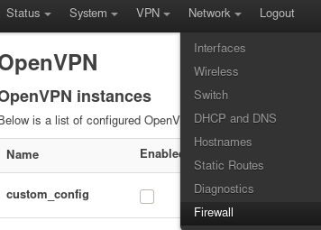

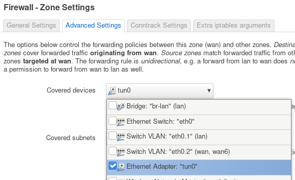  
   4.b. __Network>Interfaces__ sayfasıyla: __Add new Interface__ butonu ile VPN bağlantısı yeni bir arayüz olarak tanımlanır, açılan pencerede  "_name_ = tun0", "_Protocol_ = Unmanaged", "_Interface_ = tun0" olarak doldurulup __Create Interface__ butonuna tıklanır, __General Settings__ sekmesinde __Bring up on boot__ işareti kaldırılır. __Firewall Settings__ sekmesinde __Create / Assign Firewall-zone__ açılır listesinden __wan__ seçilir ve kaydedilir.  


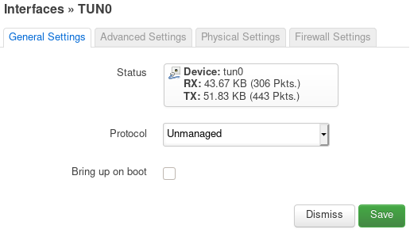
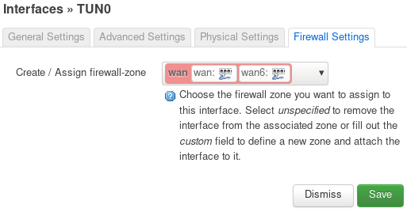

Kaynak: <https://openwrt.org/docs/guide-user/services/vpn/openvpn/client-luci>

## VPN Bağlantısının Kesilmesi Sorunsalı

VPN bağlantısı genellikle sorunsuz şekilde kurulu kalır. Fakat ağ sorunları, İnternet kesintisi veya mobil cihazlarda bağlantı kayıpları VPN bağlantısının kimi zaman düşmesine sebep olur. Bu durumda cihazınızda özellikle bir ayar yapmadıysanız tüm bağlantınız hiç kesintiye uğramadan yerel İnternet bağlantınız üzerinden sürecektir. Bu mahremiyetiniz ve güvenliğiniz için bir sorun oluşturabilir.

### GNU/Linux

GNU/Linux işletim sisteminde firewall kuralları ile cihazınızın İnternet bağlantısını VPN bağlantısına sınırlandırmanız gereklidir. Bunun için sisteminizde kurulu olan dağıtıma bağlı olarak çeşitli imkanlar mümkündür.

#### UFW

Uncomplicated Firewall GNU/Linux dağıtımlarda firewall ayarlarını yapılandırmak için kullanılan grafik arayüzü de bulunan bir firewall yazılımı. VPN bağlantınızın bilgisayarınızdan dışarı tek bağlantı olması için aşağıdaki yönergeyi takip edebilirsiniz.

**IPv6 kullanımı kapatın**

IPv6 kullanımını kapatmanız VPN ayarlarınız açısından tek bir yöne odaklanmanız açısından kolaylık sağlar. Bunun için UFW'nin ayar dosyasında aşağıdaki değişikliği yapın:

`sudo nano /etc/default/ufw` Komutu ile editörde ayar dosyasını açın

IPV6=yes parametresini IPV6=no şeklinde değiştirip, CTRL-X ile kaydederek çıkın.

**UFW'yi devredışı bırakın**

Ayarlarını yapacağımız UFW'yi devredışı bırakmak için aşağıdaki komutu çalıştırın:

`sudo ufw disable`

**Yerel ağ trafiğine izin verin**

Yerel ağ trafiği cihazınızın bağlı olduğu yerel ağ dahilindeki cihazlarla iletişiminiz için gereklidir. Şayet böyle bir ihtiyacınız olmadığını düşünüyorsanız bu aşamayı atlaybilirsiniz lakin neredeyse her bilgisayar kullanımı bu iletişime ihtiyaç duyduğundan aşağıdaki şekilde yerel ağ bağlantılarına izin vermek faydalı olacaktır.

`sudo ufw allow in to 10.0.2.0/24`

`sudo ufw allow in to 192.168.0.0/16`

`sudo ufw allow out to 10.0.2.0/24`

`sudo ufw allow out to 192.168.0.0/16`

**Tüm bağlantıları reddedin**

Firewall ayarının temelinde her bağlantıyı baştan reddetmek ve sadece özellikle belirtilmiş bağlantıları kabul etmek bulunuyor. UFW'nin her türlü bağlantıyı reddetmesi için aşağıdaki komutu çalıştırın:

`sudo ufw default deny outgoing`

`sudo ufw default deny incoming`

**VPN sunucunuza izin verin**

Bu noktada bilgisayarınız yerel ağ dışında hiç bir İnternet bağlantısına izin vermeyecek durumda olmalıdır. VPN sunucunuza bağlanmak için sunucunun giriş adresine UFW'de istisna tanımanız gerekli. Bunun için VPN sunucunuzun IP adresini öğrenmelisiniz. Bu bilgiye Openvpn ayar dosyasını açarak ulaşabilirsiniz. IP adresini öğrendikten sonra aşağıdaki komut ile gerekli istisnayı tanıyın:

`sudo ufw allow out to [sunucu IP adresi]`

**Tüm trafiği VPN'e yönlendirin**

Aşağıdaki komut ile cihazınızdaki tüm bağlantıları VPN'e yönlendirebilirsiniz:

`sudo ufw allow out on tun0 from any to any`

**Gerekli ise İnternet'ten size ulaşılmasına izin verin**

Eğer İnternet üzerinden cihazınıza ulaşılması gerekli ise VPN bağlantısı üzerinden gelen bu taleplere aşağıdaki komut ile izin verebilirsiniz:

`sudo ufw allow in on tun0 from any to any`

**UFW'yi çalıştırın**

`sudo ufw enable`

### Android

Eğer Android sürümünüz sistem çapında VPN ayarları desteklemiyor ise OpenVPN for Android'in bağlantısı kesildiği durumda cihazınızın bağlantısını kontrol etmek için [AfWall](https://f-droid.org/en/packages/dev.ukanth.ufirewall/) yazılımını kullanabilirsiniz. Bu yazılımı çalıştırmak için cihazınızın rootlu olması gerekmektedir. Afwall kullanmanın bir diğer avantajı da cihazınızdaki hangi yazılımın İnternete erişip erişmeyeceğini ve erişecekse hangi kanal üzerinden olacağını belirtebiliyor olmanız.

Şayet Android sürümünüz işletim sistemi seviyesinde VPN istemcisi kontrolü imkanı sağlıyor ise rehberin Android kurulum başlığındaki önergeler yeterli işlev gösterecektir.

---
Kaynaklar;  
- <https://github.com/Nyr/openvpn-install.git>  
- <https://kendibaglantim.com>
- <https://openwrt.org/docs/guide-user/services/vpn/openvpn/client>
