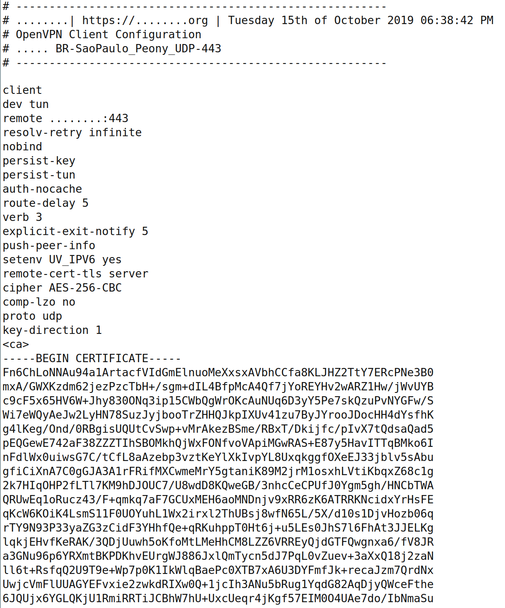
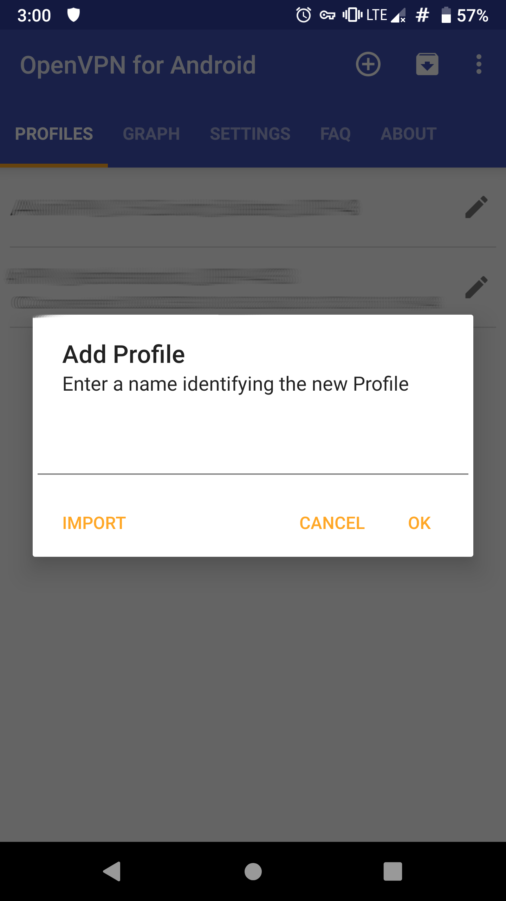
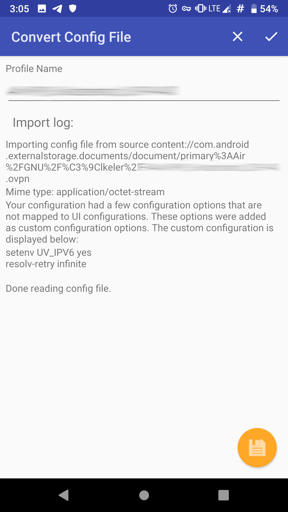
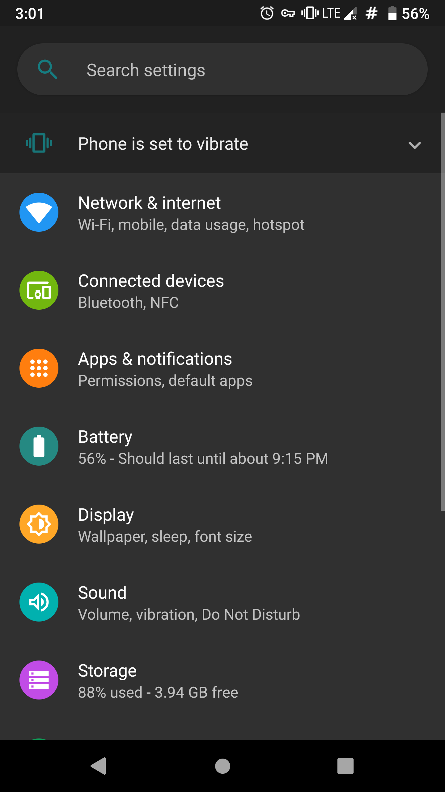
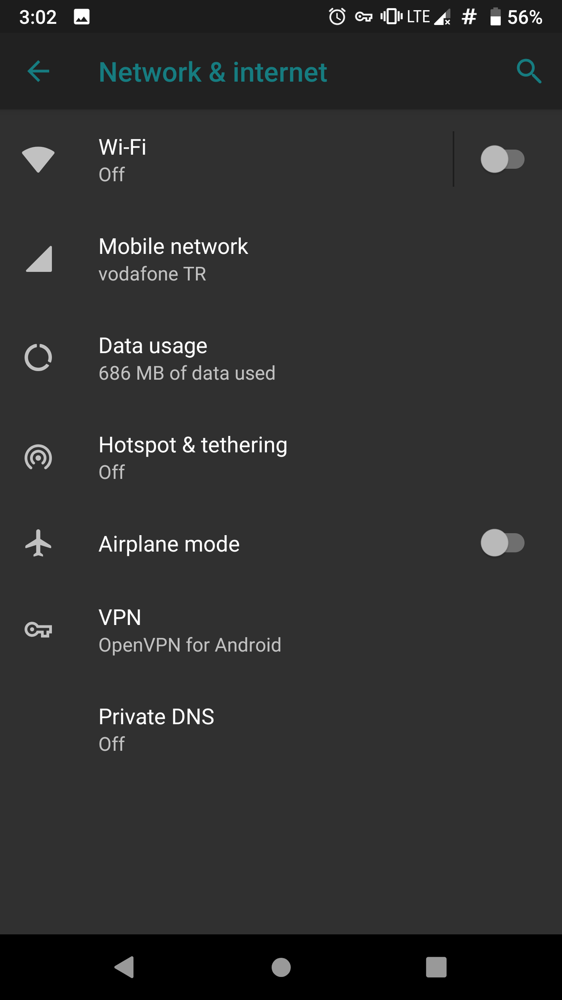
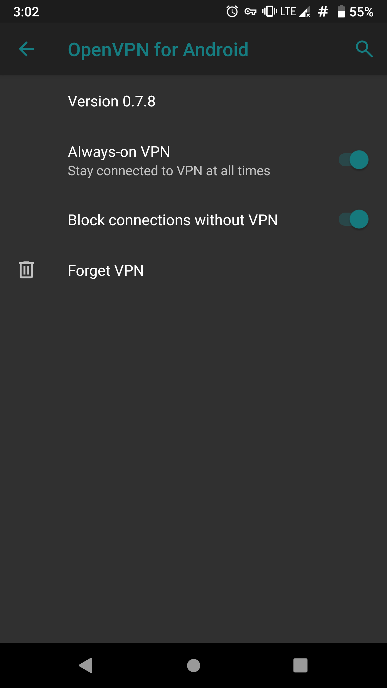

# VPN (Virtual Private Network)

VPN temel olarak iki yerel ağ üzerinde güvensiz İnternet bağlantısı üzerinden birbirine güvenli şekilde bağlanabilmesi için geliştirilmiş bir teknolojidir. Basitçe iki bilgisayarın birbirine şifrelenmiş bir kanal üzerinden bağlanmasını sağlar. Temel olarak şirketlerin ağ altyapılarına uzaktan güvenli erişim için tasarlanmış olmasına rağmen günümüzde en yaygın kullanımı kullanıcıları tehlikeli ağlardan güvenli şekilde İnternet'e erişmesini sağlamak üzerinedir.

## VPN ne işe yarar?

VPN temel olarak size şunları sağlar;

* İletişiminizi cihazınız ile VPN sağlayıcınız arasında şifreleyerek gözetime, engele veya değiştirilmeye uğramasına engel olur.

* VPN'e bağlı olduğunuz sürece sağlayıcınızın sunucusundan çıkış yapacağınız için girdiğiniz web sayfaları veya kullandığınız hizmetler VPN IP adresinizi göreceğinden kim olduğunuzu siz belirtmediğiniz sürece bilemeyecektir.

* VPN kimi koşullar için yeterince anonimlik sağlamamakla beraber, bağlı olduğunuz VPN sunucusundaki herkes ile aynı IP adresini paylaştığınızdan kalabalığın içine karışmış olursunuz.

## Neden VPN kullanmalıyım?

VPN kullanmak için çok çeşitli sebepleriniz olabilir;

* Bulunduğunuz ülkeden veya kullandığınız ağdan erişim kısıtlaması olan hizmetlere erişmek istiyorsunuzdur.

* Ağ üzerinden iletişiminizi denetleyen, takip eden, kaydeden kişilere karşı mahremiyetinizi korumak istiyorsunuzdur.

* Bağlı olduğunuz yerel ağ üzerindne size yöneltilebilecek saldırılara karşı korumaya ihtiyacınız vardır.

## Ücretsiz VPN olur mu?

Türkiye'de ve dünyada yaşanan her engelleme ve sansür girişiminde akla ilk gelen şey VPN idir. Neredeyse her tavsiye ise "bedava" VPN hizmetleri üzerinden yürür. Doğal olarak çoğu insanın sansür durumunda tek amacı sansürü aşarak ihtiyaç duydukları bilgiye veya hizmete erişmek olduğundan ve VPN teknolojisi hakkında kısıtlı bilgiye sahip olmalarından dolayı, olası tehlikelerin üzerine düşünmedikleri söylenebilir. Bir VPN hizmet sağlayıcısı ona bağlı olduğunuz sürece;

* Sizin IP adresinizi ve buna bağlı olarak konumunuzu bilebilir.

* Ziyaret ettiğiniz web sitelerini, kullandığınız hizmetleri [içeriğini bilemese](tls.md) bile kaydedebilir.

* Şayet tarayıcı eklentisi şeklinde VPN istemcisi kurulduysa kötücül bir eklenti tüm tarama verisine erişebilir.

* Dikkatli olunmazsa kötücül bir VPN sunucusu iletişimizin arasına girip verilerinizi çalabilir, size istenmeyen reklamlar sunabilir veya cihazınıza zarar vermeye çalışabilir.

Bu sebeplerden ötürü VPN kullanmak hizmet sağlayıcıya bir güven gerektirir. Daha doğru bir ifade ile VPN **İnternet servis sağlayıcınıza olan güveninizi VPN sağlayıcınıza aktarır.** Nasıl ki evinizin anahtarını rastgele birine vermiyorsanız İnternet bağlantınızı da rastgele birinin eline vermemeniz gerekir. Bu sebepten ötürü İnternet hizmetlerine ilişkin **para vermiyorsanız ürün sizsiniz** sözüne dayanarak VPN'i satın almanız veya kendi sunucunuzu kurarak kullanmanız gerekir.

Bu duruma istisna sayılabilecek birkaç örnek bulunmakta. Bu istisnalar, dünyada mahremiyet ve dijital hak mücadelesi altında olan toplulukların ücretsiz hizmetleri ve kimi güvenilir adledilen şirketin giriş seviyesi bedava verdikleri hizmetlerdir. Aşağıdaki liste dahilinde ücretsiz VPN sunan ve genel olarak güvenli görülen kurumlaır bulabilirsiniz.

[Riseup](https://www.riseup.net/vpn)
[Calyx Institute](https://calyxinstitute.org/projects/digital-services/calyx-vpn)
[ProtonVPN](https://protonvpn.com)


## VPN hizmeti seçerken nelere dikkat etmeliyim?

* **[Özgür yazılım](https://oyd.org.tr/yazilar/ozgur-yazilim/)** kullanmayan hiç bir VPN sağlayıcıya güvenmeyin. VPN ile tüm ağ trafiğinizi teslim ettiğiniz bir şirketin kullandığı yazılımların sizin özgürlüğünüze karşı olması hiç güven telkin eden bir unsur değildir.

* Kayıt tutmama politikası pek çok VPN servisinin iddiasıdır. Bu, sunucularına yapılan bağlantılara ilişkin kayıtların hiç tutulmadığını ifade eder. Bazı hizmet sağlayıcılar sunucularında sabit sürücü bile bulundurmadıklarını ifade etmektedir. Bu konuda diğer konularda olduğu gibi VPN sağlayıcının sözüne güvenmek zorunluluğu olduğundan daha önce devletlere bilgi sağlayıp sağlamadığına bakılması önemli olabilir. [PureVPN](https://restoreprivacy.com/vpn-logs-lies/) vakası incelemeye değer bir örnek bu konuda.

* VPN sağlayıcınızın özgür yazılım olan [OpenVpn](https://openvpn.net/) desteklediğinden ve yapılandırm(config) dosyalarını sizin ile paylaştığından emin olun. Bu sayede GNU/Linux ve Android işletim sistemi sahip cihazlarınızda kolaylıkla yerleşik VPN istemcilerini kullanabilirsiniz. Bu aynı zamanda VPN sağlayıcının yazılımına mahkum kalmamanızı da garanti eder.

* ABD, Birleşik Krallık ve Almanya gibi ülkelerin Internet kullanıcılarını gözetlemek ve profillemek için çokça çabaya giriştiği ve yasal(!) imkanları kullanarak pek çok şirketten zorla veri aldığı bilinmektedir. Bu bakımdan VPN sağlayıcınızın bu konuda kötü bir geçmişi olmayan ve hukuki güvenlik bakımından iyi sayılan ülkelerden seçmeniz kesinlikle tavsiye edilir.

* VPN sağlayıcınızın mutlaka bağlantı için farklı protokollere izin verdiğinden emin olun. Çoğu VPN engellemesi standart portlar ve protokollere yönelir. Şayet elinizde geniş bir bağlantı imkanı olursa bu tip yasakları aşmanız çok kolaylaşacaktır. Bunlar arasında en önemlileri [SSL tünelleme](https://en.wikipedia.org/wiki/Secure_Socket_Tunneling_Protocol), [SSH tünelleme]https://en.wikipedia.org/wiki/Tunneling_protocol#Secure_Shell_tunneling) yer almaktadır.

* Herhangi bir bağlantı kısıtlaması özgürlüğünüze karşı bir harekettir. Bu bakımdan bir VPN sağlayıcı sizin torrent kullanmanıza veya indirme hızınıza karışıyorsa hem bir çeşit kayıt tutuyordur hem de bağlantı özgürlüğünüzü sınırlıyordur.

* Bir VPN sağlayıcı sizden kayıt için hiç bir kişisel veri talep etmemelidir. Buna ödeme imkanları arasında kriptoparalar ve posta yolu ile nakit gibi anonim seçenekler bulundurmak da dahildir. Nihayetinde VPN sağlayıcınıza güveniyor olacaksınız kimliğiniz için fakat şirkete güvenseniz bile devletler ve kötücül saldırıların ihtimali hala asgari veriyi teslim etmeniz için geçerli gerekçelerdir.

## VPN Kurulumu

### VPN Kullanım Stratejisi

VPN kullanmaya başlamadan önce ihtiyacınız, kullandığınız cihazların durumu ve seçtiğiniz VPN sağlayıcının imkanlarını değerlendirmeniz gereklidir. Her VPN sağlayıcı sınırlı sayıda cihazın anlık bağlantısına izin vermektedir. Bu bakımdan; ne yazık ki basitçe cihazınıza sağlayıcınızın istemcisini kurup kullanmak her ne kadar en kolay seçenek olsa da ihtiyaçlarınızı karşılayamayabilir. Bu bakımdan elinizdekilere bakıp bir değerlendirme yapmalısınız.

Elinizdeki cihazların sayısını ve konumlarını değerlendirin. Mobil cihazları bulundukları ağdan bağımsız olarak VPN'e bağlı kalmalarını isteyeceğinizden bu cihazların doğrudan bağlanmaları için kurulum yapmanız gerekecektir. Şayet ev ve işyeri gibi sabit bir alanda duran cihazları bağlamak veya ağ bağlantınızdaki tüm cihazları korumak istiyorsanız bir [yönlendiriciye](https://en.wikipedia.org/wiki/Router_(computing)) kurulum yapmanız faydalı olabilir. Bir yönlendiriciyi [LibreCMC](https://librecmc.org/), [OpenWRT](https://openwrt.org/) veya [DD-WRT](https://dd-wrt.com/) yükleyerek özgür kılabilir ve üzerinde OpenVPN ile tüm ağınızı kapsayacak şekilde VPN çalıştırabilirsiniz.

Eğer cihazlarınız sınırlı ve belirli bir ağa bağlı değil ise doğrudan VPN sağlayıcınızın sağladığı yazılımları cihazlarınızda çalıştırarak bağlantı kurmak en kolay yol olacaktır.

Bu kurulumun avantajları;

* Cihazınızdaki gerekli ayarlar otomatik olarak yapılabilecektir.
* VPN sağlayıcınızın sunduğu tüm protokol ve sunuculara tek elden kolayca ulaşabilirsiniz.

Dezavantajları ise;

* Fazladan bir yazılımı cihazlarınıza kurma ve çalıştırma zorunluluğu.
* Yazılımın cihaz kaynağınızı kullanması bu sebeple kimi eski donanımlarda çalışmama ihtimali.
* Desteklenmeyen işletim sistemlerine kuramayacak olmak.
* Sistem ayarlarının yapılabilmesi için yazılımın yönetici yetkisi ile çalışmasının gerekmesi.

Diğer seçeneğiniz ise işletim sisteminiz tarafından desteklendiği durumlarda dahili OpenVPN istemcisi ile kurulum yapmaktır. Bu kullanım sistem kaynağınızı daha az kullanacak ve daha birleşik bir deneyim sunacaktır. Lakin ayarların bir kısmını kendiniz yapmak zorunda kalacağınızdan vakit ve emek harcamaya hazır olmanız gereklidir.

### OpenVPN Sunucusu Kurulumu

OpenVPN sunucusu kurulumu için [github.com/Nyr](https://github.com/Nyr) deposunda bulunan ve aktif olarak güncellenen bir bash betiğini kullanacağız. Bu betik Ubuntu, Debian, Centos veya Fedora dağıtımları üzerinde gerekli yüklemeleri ve ayarları yapıp kullanıma hazır bir OpenVPN sunucusu çalıştırıyor. `wget https://git.io/vpn -O openvpn-instal.sh` komutu ile betik çalışma dizinine kaydedilebilir ve `bash openvpn-install.sh` komutu ile çalıştırılabilir. Komutu gerekli paket yüklemelerini yapabilmesi ve ayar dosyalarını oluşturabilmesi için root yetkileriyle çalıştırmamız gerekmekte.

1. Betik ilk olarak sunucunun ip adresslerini listeleyip, OpenVPN sunucusunun kullanması istenen ip adresinin seçilmesini istiyor.
```bash
Which IPv4 address should be used?
     1) 198.51.100.202
     2) 10.0.10.1
IPv4 address [1]:
```
Kullanılmak istenen adres sıra numarasıyla seçilebilir.

2. Ardından OpenVPN'in kullanması gereken protokol soruluyor;
```bash
Which protocol should OpenVPN use?
   1) UDP (recommended)
   2) TCP
Protocol [1]:
```
Yine sadece enter ile önerilen seçeneği onaylayıp UDP kullanılabilir.

3. OpenVPN'in kullanacağı port soruluyor ve ön tanımlı olarak 1194 seçili.
```bash
What port should OpenVPN listen to?
Port [1194]:443
```
Bu aşamada hareket halindeyken istemcilerin dahil olacağı açık ağlarda 1194 portu engellenmiş olabileceğinden https portu olan 443'ü seçmek yerinde bir tercih olabilir.

4. OpenVPN'e bağlanacak istemciler için bir DNS sunucusu seçilmesi istendiğinde öntanımlı olarak sistemin halihazırdaki ayarlarını kullanması yanında kullanımı yaygın olan bazı DNS sunucuları listeleniyor:
```bash
Select a DNS server for the clients:
   1) Current system resolvers
   2) Google
   3) 1.1.1.1
   4) OpenDNS
   5) Quad9
   6) AdGuard
DNS server [1]:
```
5. Son olarak ilk istemci için bir isim girilmesi isteniyor.
```bash
Enter a name for the first client:
Name [client]:
```
Kurulum tamamlandıktan sonra başka istemciler eklemek için betik yeniden çalıştırılabilir.

Gerekli yüklemeler yapıldıktan sonra çalışmakta olan OpenVPN sunucusuna bağlanmak üzere istemci cihaza yüklenmesi gereken ayar dosyasının konumu bildiriliyor `/root/<istemciadı>.ovpn`. Bu dosyayi istemci cihaza kaydedip, istemci programa tanıtmak gerekiyor.

6. Kurulumun ardından betik tekrar çalıştırılırsa yeni bir istemci ekleme, bir istemciyi kaldırma, OpenVPN sunucusunu kaldırma seçenekleri sunuluyor.
```bash
Select an option:
   1) Add a new client
   2) Revoke an existing client
   3) Remove OpenVPN
   4) Exit
Option:
```

### Istemci Kurulumu
#### GNU/Linux

GNU/Linux dağıtımları Linux çekirdeğinde doğrudan Openvpn ve daha yeni bir teknoloji olarak artık [Wireguard](https://www.wireguard.com/) desteklemektedir. Masaüstü ortamları da Openvpn istemcisine doğrudan destek vermektedir. GNU/Linux dünyasında çokça masaüstü ortamı olmasından dolayı en yaygın kullanılan Gnome 3 ile rehberimiz hazırlandı lakin pek çok kullanıcı ayarların kendi cihazlarında da benzer olduklarını görecektir.

1. Öncelikle VPN sağlayıcınızdan .ovpn uzantısı ile OpenVPN config dosyasını indirin. ovpn dosyaları bir metindir ve sunucu ayarları ile bağlanmanız için gereken anahtarı içerir. Şayet VPN sağlayıcınız bağlantı için bir kullanıcı adı ve parola gerektiriyor ise bunu da bir kenara not alın.



2. Gnome'un ayarlarına isterseniz sağ üst köşeden açılan menüde **ağ ayarlarına** girerek veya etkinlikler köşesine tıklayarak menüden **ayarlara** girerek ağ ayarlarına girin.

3. Ağ ayarlarından

#### Terminal'den Istemci Kurulumu

GNU/Linux dağıtımlarının depolarında *OpenVPN* paket olarak bulunuyor, dağıtımınızın paket yöneticisiyle yükleyebilirsiniz. Debian veya Ubuntu tabanlı bir dağıtım kullanıyorsaniz;<br>
`sudo apt install openvpn` komutu ile OpenVPN'i yüklediğinizde  
`/lib/systemd/system/openvpn-client@.service` servis dosyası ve ayarlar için 
`/etc/openvpn/client` ve `/etc/openvpn/server` dizinleri oluşuyor. VPN sağlayıcınızdan veya OpenVPN sunucunuzdan edindiğiniz **istemciAyarlari.ovpn** ayar dosyasını `/etc/openvpn/client/istemciAyarlari.conf` biçiminde uzantısını değiştirip taşıyarak OpenVPN'in bu ayarları tanımasını sağlayabilirsiniz.
  OpenVPN'i çalıştırmak için;<br>
`openvpn --config <istemciAyarlari>.conf` komutu kullanılabilir,<br>
servis olarak başlatmak ve durdurmak için;<br>
`systemctl {start,stop} openvpn-client@<istemciAyarlari>.conf` komutu,<br>
sistem açılışında çalışması için de;<br>
`systemctl enable openvpn-client@<istemciayarlari>.conf` komutu kullanılabilir.

#### Android

Android işletim sistemi 7 sürüm ve sonrasında VPN desteğini işletim seviyesinde sunmaya başlamıştır. Ne yazık ki OpenVPN hala bu seçenekler arasında olmamakla birlikte özgür bir OpenVPN istemcisini Android ayarlarında VPN sağlayıcısı olarak belirlediğinizde sistemle gayet uyumlu çalışmaktadır.

1. [OpenVPN for Android](https://f-droid.org/en/packages/de.blinkt.openvpn/) uygulamasını [F-Droid](https://f-droid.org/en) özgür yazılım deopsundan indirin ve cihazınıza kurun.

2. OpenVPN for Android yazılımını çalıştırın ve açılan ekranda sağ üst köşedeki + simgesine tıklayarak ekleme arayüzünü açın.


3. Karşınıza gelen ekrandan **içe aktar** veya **import** düğmesine tıklayarak config dosyasını seçme aşamasına gelin.



4. Açılan dosya yöneticisinden VPN sağlayıcınızdan indirdiğiniz .ovpn dosyasını bulun ve tıklayın.


5. Ertesinde çıkan ekranda config dosyanızın detayları görülecektir. tik işaretine tıklayarak kurulumu tamamlayın.



6. Artık OpenVPN for Android VPN bağlantınızı kurmaya hazır.

Android ayarlarını yaparak sisteminizin VPN bağlantısını korumasını ve kesilmesi durumunda iletişimin de durmasını sağlamanız mümkün. Bunun için:

1. Cihazınızın ayarlarına gidin ve **ağ ve internet** veya **network and internet** ayarlarına girin.



2. VPN ayarlarını muhtemelen en altta bulacaksınız.



3. Karşınıza OpenVPN for Android seçeneği çıkmış olacaktır. Yanındaki dişli simgesine tıklayarak kurulum sayfasını açın.


4. Çıkan ayarlardan **Always-on VPN** veya **sürekli bağlı VPN** ile **Block connections without VPN** veya **VPN kesilince bağlantıları engelle** seçeneklerini etkinleştirin.



#### Yönlendirici

[Bu bölüme katkı verebilirsiniz](https://git.oyd.org.tr/oyd/guvenlik)

## VPN Bağlantısının Kesilmesi Sorunsalı

VPN bağlantısı genellikle sorunsuz şekilde kurulu kalır. Fakat ağ sorunları, İnternet kesintisi veya mobil cihazlarda bağlantı kayıpları VPN bağlantısının kimi zaman düşmesine sebep olur. Bu durumda cihazınızda özellikle bir ayar yapmadıysanız tüm bağlantınız hiç kesintiye uğramadan yerel İnternet bağlantınız üzerinden sürecektir. Bu mahremiyetiniz ve güvenliğiniz için bir sorun oluşturabilir.

### GNU/Linux

GNU/Linux işletim sisteminde firewall kuralları ile cihazınızın İnternet bağlantısını VPN bağlantısına sınırlandırmanız gereklidir. Bunun için sisteminizde kurulu olan dağıtıma bağlı olarak çeşitli imkanlar mümkündür.

#### UFW

Uncomplicated Firewall GNU/Linux dağıtımlarda firewall ayarlarını yapılandırmak için kullanılan
 grafik arayüzü de bulunan bir yazılım. VPN kurulumunuzun bilgisayarınızdan dışarı tek bağlantı olması içn aşağıdaki yönergeyi takip edebilirsiniz.

* IPv6 kullanımı kapatın

IPv6 kullanımını kapatmanız VPN ayarlarınız açısından tek bir yöne odaklanmanız açısından kolaylık sağlar. Bunun için UFW'nin ayar dosyasında aşağıdaki değişikliği yapın:

`sudo nano /etc/default/ufw` Komutu ile editörde ayar dosyasını açın

IPV6=yes parametresini IPV6=no şeklinde değiştirip, CTRL-X ile kaydederek çıkın.

* UFW'yi devredışı bırakın

Ayarlarını yapacağımız UFW'yi devredışı bırakmak için aşağıdaki komutu çalıştırın:

`sudo ufw disable`

* Yerel ağ trafiğine izin verin

Yerel ağ trafiği cihazınızın bağlı olduğu yerel ağ dahilindeki cihazlarla iletişiminiz için gereklidir. Şayet böyle bir ihtiyacınız olmadığını düşünüyorsanız bu aşamayı atlaybilirsiniz lakin neredeyse her bilgisayar kullanımı bu iletişime ihtiyaç duyduğundan aşağıdaki şekilde yerel ağ bağlantılarına izin vermek faydalı olacaktır.

`sudo ufw allow in to 10.0.2.0/24`

`sudo ufw allow in to 192.168.0.0/16`

`sudo ufw allow out to 10.0.2.0/24`

`sudo ufw allow out to 192.168.0.0/16`

* Tüm bağlantıları reddedin

Firewall ayarının temelinde her bağlantıyı baştan reddetmek ve sadece özellikle belirtilmiş bağlantıları kabul etmek bulunuyor. UFW'nin her türlü bağlantıyı reddetmesi için aşağıdaki komutu çalıştırın:

`sudo ufw default deny outgoing`

`sudo ufw default deny incoming`

* VPN sunucunuza izin verin

Bu noktada bilgisayarınız yerel ağ dışında hiç bir İnternet bağlantısına izin vermeyecek durumda olmalıdır. VPN sunucunuza bağlanmak için sunucunun giriş adresine UFW'de istisna tanımanız gerekli. Bunun için VPN sunucunuzun IP adresini öğrenmelisiniz. Bu bilgiye Openvpn ayar dosyasını açarak ulaşabilirsiniz. IP adresini öğrendikten sonra aşağıdaki komut ile gerekli istisnayı tanıyın:

`sudo ufw allow out to [sunucu IP adresi]`

* Tüm trafiği VPN'e yönlendirin

Aşağıdaki komut ile cihazınızdaki tüm bağlantıları VPN'e yönlendirebilirsiniz:

`sudo ufw allow out on tun0 from any to any`

* Gerekli ise İnternet'ten size ulaşılmasına izin verin.

Eğer İnternet üzerinden cihazınıza ulaşılması gerekli ise VPN bağlantısı üzerinden gelen bu taleplere aşağıdaki komut ile izin verebilirsiniz:

`sudo ufw allow in on tun0 from any to any`

* UFW'yi çalıştırın

`sudo ufw enable`

### Android

Eğer Android sürümünüz sistem çapında VPN ayarları desteklemiyor ise OpenVPN for Android'in bağlantısı kesildiği durumda cihazınızın bağlantısını kontrol etmek için [AfWall](https://f-droid.org/en/packages/dev.ukanth.ufirewall/) yazılımını kullanabilirsiniz. Bu yazılımı çalıştırmak için cihazınızın rootlu olması gerekmektedir.

Afwall kullanmanın bir diğer avantajı da cihazınızdaki hangi yazılımın İnternete erişip erişmeyeceğini ve erişecekse hangi kanal üzerinden olacağını belirtebiliyor olmanız.

Kaynaklar;  
<https://github.com/Nyr/openvpn-install.git>  
<https://kendibaglantim.com>

