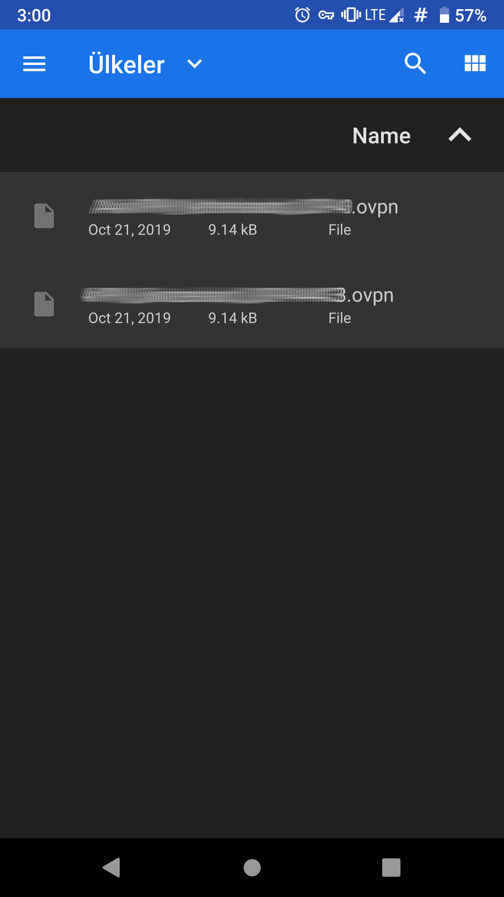
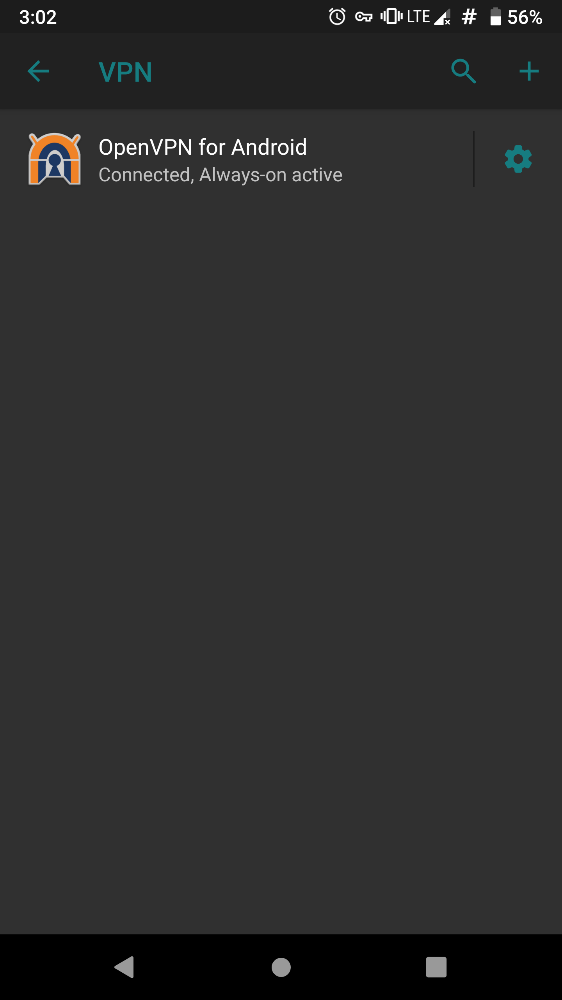

# VPN (Virtual Private Network)

VPN temel olarak iki yerel ağ üzerinde güvensiz İnternet bağlantısı üzerinden birbirine güvenli şekilde bağlanabilmesi için geliştirilmiş bir teknolojidir. Basitçe iki bilgisayarın birbirine şifrelenmiş bir kanal üzerinden bağlanmasını sağlar. Temel olarak şirketlerin ağ altyapılarına uzaktan güvenli erişim için tasarlanmış olmasına rağmen günümüzde en yaygın kullanımı kullanıcıları tehlikeli ağlardan güvenli şekilde İnternet'e erişmesini sağlamak üzerinedir.

## VPN Ne İşe Yarar

VPN temel olarak size şunları sağlar;

* İletişiminizi cihazınız ile VPN sağlayıcınız arasında şifreleyerek gözetime, engele veya değiştirilmeye uğramasına engel olur.

* VPN'e bağlı olduğunuz sürece sağlayıcınızın sunucusundan çıkış yapacağınız için girdiğiniz web sayfaları veya kullandığınız hizmetler VPN IP adresinizi göreceğinden kim olduğunuzu siz belirtmediğiniz sürece bilemeyecektir.

* VPN kimi koşullar için yeterince anonimlik sağlamamakla beraber, bağlı olduğunuz VPN sunucusundaki herkes ile aynı IP adresini paylaştığınızdan kalabalığın içine karışmış olursunuz.

## VPN Neden Kullanmalıyım

VPN kullanmak için çok çeşitli sebepleriniz olabilir;

* Bulunduğunuz ülkeden veya kullandığınız ağdan erişim kısıtlaması olan hizmetlere erişmek istiyorsunuzdur.

* Ağ üzerinden iletişiminizi denetleyen, takip eden, kaydeden kişilere karşı mahremiyetinizi korumak istiyorsunuzdur.

* Bağlı olduğunuz yerel ağ üzerindne size yöneltilebilecek saldırılara karşı korumaya ihtiyacınız vardır.

## Bedava VPN Olur Mu?

Türkiye'de ve dünyada yaşanan her engelleme ve sansür girişiminde akla ilk gelen şey VPN idir. Neredeyse her tavsiye ise "bedava" VPN hizmetleri üzerinden yürür. Doğal olarak çoğu insanın sansür durumunda tek amacı sansürü aşarak ihtiyaç duydukları bilgiye veya hizmete erişme amacı olduğundan ve VPN teknolojisi hakkında kısıtlı bilgiye sahip olmalarından dolayı, olası tehlikelerin üzerine düşünmedikleri söylenebilir. Bir VPN hizmet sağlayıcısı ona bağlı olduğunuz sürece;

* Sizin IP adresinizi ve buna bağlı olarak konumunuzu bilebilir.

* Ziyaret ettiğiniz web sitelerini, kullandığınız hizmetleri [içeriğini bilemese](tls.md) bile kaydedebilir.

* Şayet tarayıcı eklentisi şeklinde VPN istemcisi kurulduysa kötücül bir eklenti tüm tarama verisine erişebilir.

* Şayet dikkatli olunmazsa kötücül bir VPN sunucusu iletişimizin arasına girip verilerinizi çalabilir, size istenmeyen reklamlar sunabilir veya cihazınıza zarar vermeye çalışabilir.

Bu sebeplerden ötürü VPN bir güven gerektirir. Daha doğru bir ifade ile VPN **İnternet servis sağlayıcınıza olan güveninizi VPN sağlayıcınıza aktarır.** Nasıl ki evinizin anahtarını rastgele birine vermiyorsanız İnternet bağlantınızı da rastgele birinin eline vermemeniz gerekir. Bu sebepten ötürü İnternet hizmetlerine ilişkin **para vermiyorsanız ürün sizsiniz** sözüne dayanarak VPN'i satın almanız veya kendi sunucunuzu kurarak kullanmanız gerekir.

## VPN Hizmeti Seçerken Nelere Dikkat Etmeli

* **[Özgür yazılım](https://oyd.org.tr/yazilar/ozgur-yazilim/)** kullanmayan hiç bir VPN sağlayıcıya güvenmeyin. VPN ile tüm ağ trafiğinizi teslim ettiğiniz bir şirketin sizden kullandığı yazılımları sizin özgürlüğünüze karşı olması hiç güven telkin eden bir unsur değildir.

* Kayıt tutmama politikası pek çok VPN servisinin iddiasıdır. Bu sunucularına yapılan bağlantılara ilişkin kayıtların hiç tutulmadığını ifade eder. Bazı hizmet sağlayıcılar sunucularında sabit sürücü bile bulundurmadıklarını ifade etmektedir. Bu konuda diğer konularda olduğu gibi VPN sağlayıcının sözüne güvenmek zorundalığı olduğundan daha önce Devletlere bilgi sağlayıp sağlamadığına bakılması önemli olabilir. [PureVPN](https://restoreprivacy.com/vpn-logs-lies/) vakası incelemey değer olabilir bu konuda.

* VPN sağlayıcınızın özgür yazılım olan [OpenVpn](https://openvpn.net/) desteklediğinden ve config dosyalarını sizin ile paylaştığından emin olun. Bu sayede GNU/Linux ve Android işletim sistemi sahip cihazlarınızda kolaylıkla yerleşik VPN istemcilerini kullanabilirsiniz. Bu aynı zamanda VPN sağlayıcının yazılımına mahkum kalmamanızı da garanti eder.

* ABD, Birleşik Krallık ve Almanya gibi ülkelerin Internet kullanıcılarını gözetlemek ve profillemek için çokça çabaya giriştiği ve yasal(!) imkanları kullanarak pek çok şirketten zorla veri aldığı bilinmektedir. Bu bakımdan VPN sağlayıcınızın bu konuda kötü bir geçmişi olmayan ve hukuki güvenlik bakımından iyi sayılan ülkelerden seçmeniz kesinlikle tavsiye edilir.

* VPN sağlayıcınızın mutlaka bağlantı için farklı protokollere izin verdiğinden emin olun. Çoğu VPN engellemesi standart portlar ve protokollere yönelir. Şayet elinizde geniş bir bağlantı imkanı olursa bu tip yasakları aşmanız çok kolaylaşacaktır. Bunlar arasında en önemlileri [SSL tünelleme](https://en.wikipedia.org/wiki/Secure_Socket_Tunneling_Protocol), [SSH tünelleme]https://en.wikipedia.org/wiki/Tunneling_protocol#Secure_Shell_tunneling) yer almaktadır.

* Herhangi bir bağlantı kısıtlaması özgürlüğünüze karşı bir harekettir. Bu bakımdan bir VPN sağlayıcı sizin torrent kullanmanıza veya indirme hızınıza karışıyorsa hem bir çeşit kayıt tutuyordur hem de özgür bağlantınızı sınırlıyordur.

* Bir VPN sağlayıcı sizden kayıt için hiç bir kişisel veri talep etmemelidir. Buna ödeme imkanları arasında kriptoparalar ve posta yolu ile nakit gibi anonim seçenekler bulundurmak da dahildir. Nihayetinde VPN sağlayıcınıza güveniyor olacaksınız kimliğiniz için fakat şirkete güvenseniz bile devletler ve kötücül saldırıların ihtimali hala asgari veriyi teslim etmeniz için geçerli gerekçelerdir.

## VPN Kurulumu

### VPN Kullanım Stratejisi

VPN kullanmaya başlamadan önce ihtiyacınız, kullandığınız cihazların durumu ve seçtiğiniz VPN sağlayıcının imkanlarını değerlendirmeniz gereklidir. Her VPN sağlayıcı sınırlı sayıda cihazın anlık bağlantısına izin vermektedir. Bu bakımdan; ne yazık ki basitçe cihazınıza sağlayıcınızın istemcisini kurup kullanmak her ne kadar en kolay seçenek olsa da ihtiyaçlarınızı karşılayamayabilir. Bu bakımdan elinizdekilere bakıp bir değerlendirme yapmalısınız.

Elinizdeki cihazların sayısını ve konumlarını değerlendirin. Mobil cihazları bulundukları ağdan bağımsız olarak VPN'e bağlı kalmalarını isteyeceğinizden bu cihazların doğrudan bağlanmaları için kurulum yapmanız gerekecektir. Şayet ev ve işyeri gibi sabit bir alanda duran cihazları bağlamak veya ağ bağlantınızdaki tüm cihazları korumak istiyorsanız bir [yönlendiriciye](https://en.wikipedia.org/wiki/Router_(computing)) kurulum yapmanız faydalı olabilir. Bir yönlendiriciyi [LibreCMC](https://librecmc.org/), [OpenWRT](https://openwrt.org/) veya [DD-WRT](https://dd-wrt.com/) yükleyerek özgür kılabilir ve üzerinde OpenVPN ile tüm ağınızı kapsayacak şekilde VPN çalıştırabilirsiniz.

Eğer cihazlarınız sınırlı ve belirli bir ağa bağlı değil ise doğrudan VPN sağlayıcınızın sağladığı yazılımlar var ise bunları cihazlarınızda çalıştırarak bağlantı kurmak en kolay yol olacaktır. 

Bu kurulumun avantajları;

* Cihazınızdaki gerekli ayarlar otomatik olarak yapılabilecektir.
* VPN sağlayıcınızın sunduğu tüm protokol ve sunuculara tek elden kolayca ulaşabilirsiniz.

Dezavantajları ise;

* Fazladan bir yazılımı cihazlarınıza kurma ve çalıştırma zorunluluğu.
* Yazılımın cihaz kaynağınızdan kullanması bu sebeple kimi eski donanımlarda çalışmama ihtimali.
* Desteklenmeyen işletm sistemlerine kuramayacak olmak.
* Sistem ayarlarının yapılabilmesi için yazılımın yönetici yetkisi ile çalışmasının gerekmesi.

Diğer seçeneğiniz ise işletim sisteminiz tarafından desteklendiği durumlarda dahili OpenVPN istemcisi ile kurulum yapmaktır. Bu kullanım sistem kaynağınızı daha az kullanacak ve daha birleşik bir deneyim sunacaktır. Lakin ayarların bir kısmını kendiniz yapmak zorunda kalacağınızdan vakit ve emek harcamaya hazır olmanız gereklidir.

### GNU/Linux

GNU/Linux dağıtımları Linux çekirdeğinde doğrudan Openvpn ve daha yeni bir teknoloji olarak artık [Wireguard](https://www.wireguard.com/) desteklemektedir. Masaüstü ortamları da Openvpn istemcisine doğrudan destek vermektedir. GNU/Linux dünyasında çokça masaüstü ortamı olmasından dolayı en yaygın kullanılan Gnome 3 ile rehberimizi hazırladık lakin pek çok kullanıcı ayarların kendi cihazlarında da benzer olduklarını görecektir.

1. Öncelikle VPN sağlayıcınızdan .ovpn uzantısı ile OpenVPN config dosyasını indirin. ovpn dosyaları bir metindir ve sunucu ayarları ile bağlanmanız için gereken anahtarı içerir. Şayet VPN sağlayıcınız bağlantı için bir kullanıcı adı ve parola gerektiriyor ise bunu da bir kenara not alın.

2. Gnome'un ayarlarına isterseniz sağ üst köşeden açılan menüde **ağ ayarlarına** girerek veya etkinlikler köşesine tıklayarak menüden **ayarlara** girerek ağ ayarlarına girin.

3. Ağ ayarlarından

### Android

Android işletim sistemi 7 sürüm ve sonrasında VPN desteğini işletim seviyesinde sunmaya başlamıştır. Ne yazık ki OpenVPN hala bu seçenekler arasında olmamakla birlikte özgür bir OpenVPN istemcisini Android ayarlarında VPN sağlayıcısı olarak belirlediğinizde sistemle gayet uyumlu çalışmaktadır.

1. [OpenVPN for Android](https://f-droid.org/en/packages/de.blinkt.openvpn/) uygulamasını [F-Droid](https://f-droid.org/en) özgür yazılım deopsundan indirin ve cihazınıza kurun.

2. OpenVPN for Android yazılımını açlıştırın ve açılan ekranda sağ üst köşedeki + simgesine tıklayarak ekleme arayüzünü açın.

3. Karşınıza gelen ekrandan **içe aktar** veya **import** düğmesine tıklayarak config dosyasını seçme aşamasına gelin.

4. Açılan dosya yöneticisinden VPN sağlayıcınızdan indirdiğiniz .ovpn dosyasını bulun ve tıklayın.

5. Ertesinde çıkan ekranda config dosyanızın detayları görülecektir. tik işaretine tıklayarak kurulumu tamamlayın.

6. Artık OpenVPN for Android VPN bağlantınızı kurmaya hazır.

Android ayarlarını yaparak sisteminizin VPN bağlantısını korumasını ve kesilmesi durumunda iletişimin de durmasını sağlamanız mümkün. Bunun için:

1. Cihazınızın ayarlarına gidin ve **ağ ve internet** veya **network and internet** ayarlarına girin.

2. VPN ayarlarını muhtemelen en altta bulacaksınız.

3. Karşınıza OpenVPN for Android seçeneği çıkmış olacaktır. Yanındaki dişli simgesine tıklayarak kurulum sayfasını açın.

4. Çıkan ayarlardan **Always-on VPN** veya **sürekli bağlı VPN** ile **Block connections without VPN** veya **VPN kesilince bağlantıları engelle** seçeneklerini etkinleştirin.

### Yönlendirici

[Bu bölüme katkı verebilirsiniz](https://git.oyd.org.tr/oyd/guvenlik)

## VPN Bağlantısının Kesilmesi Sorunsalı

VPN bağlantısı genellikle sorunsuz şekilde kurulu kalır. Fakat ağ sorunları, İnternet kesintisi veya mobil cihazlarda bağlantı kayıpları VPN bağlantısının kimi zaman düşmesine sebep olur. Bu durumda cihazınızda özellikle bir ayar yapmadıysanız tüm bağlantınız hiç kesintiye uğramadan yerel İnternet bağlantınız üzerinden sürecektir. Bu mahremiyetiniz ve güvenliğiniz için bir sorun oluşturabilir.

### GNU/Linux

GNU/Linux işletim sisteminde firewall kuralları ile cihazınızın İnternet bağlantısını VPN bağlantısına sınırlandırmanız gereklidir. Bunun için sisteminizde kurulu olan dağıtıma bağlı olarak çeşitli imkanlar mümkündür.

#### Iptables

Bir uçbirim çalıştırarak aşağıdaki komutları sırası ile belirtilen yerlere VPN sunucunuzun bilinen giriş IP adresini ekleyerek çalıştırın çalıştırın:

`sudo iptables -A INPUT -i lo -j ACCEPT`
`sudo iptables-A INPUT -s 255.255.255.255/32 -j ACCEPT`
`sudo iptables-A INPUT -s 192.168.0.0/16 -d 192.168.0.0/16 -j ACCEPT`
`sudo iptables-A INPUT -s 10.0.0.0/8 -d 10.0.0.0/8 -j ACCEPT`
`sudo iptables-A INPUT -s 172.16.0.0/12 -d 172.16.0.0/12 -j ACCEPT`
`sudo iptables-A INPUT -p icmp -m icmp --icmp-type 8 -j ACCEPT`
`sudo iptables-A INPUT -m state --state RELATED,ESTABLISHED -j ACCEPT`
`sudo iptables-A INPUT -i tun+ -j ACCEPT`
`sudo iptables-A INPUT -j DROP`
`sudo iptables-A FORWARD -i tun+ -j ACCEPT`
`sudo iptables-A FORWARD -j DROP`
`sudo iptables -A OUTPUT -d **[VPN SUNUCUSU IP ADRESİ]** -j ACCEPT`
`[üstteki satırı diğer sunucular için tekrar edin]`

[Bu bölüme katkı verebilirsiniz](https://git.oyd.org.tr/oyd/guvenlik)

#### Ufw

[Bu bölüme katkı verebilirsiniz](https://git.oyd.org.tr/oyd/guvenlik)

### Android

Eğer Android sürümünüz sistem çapında VPN ayarları desteklemiyor ise OpenVPN for Android'in bağlantısı kesildiği durumda cihazınızın bağlantısını kontrol etmek için [AfWall](https://f-droid.org/en/packages/dev.ukanth.ufirewall/) yazılımını kullanabilirsiniz. Bu yazılımı çalıştırmak için cihazınızın rootlu olması gerekmektedir.

Afwall kullanmanın bir diğer avantajı da cihazınızdaki hangi yazılımın İnternete erişip erişmeyeceğini ve erişecekse hangi kanal üzerinden olacağını belirtebiliyor olmanız.
