# andOTP ile OTP Kurulumu

<!-- toc -->

[andOTP](https://github.com/andOTP/andOTP) Android işletim sisteminde kullanılabilen özgür bir OTP yazılımıdır. [F-droid](https://f-droid.org/en/packages/org.shadowice.flocke.andotp/) aracılığı ile kurabileceğiniz andOTP'yi [Freeotp ve Freeotp+](https://search.f-droid.org/?q=freeotp&lang=en) yazılımlarından ayıran şifreli veri tabanı, [GPG şifreleme](../yazisma_guvenligi/gpg/gpg.md) ve anahtar dışa aktarım gibi daha gelişmiş özellikleridir. Bu bakımdan andOTP neredeyse tüm OTP yazılımları gibi işlev görse de kullanım özellikleri bakımından daha ileri seçenekler sunmaktadır.

## Kurulum

andOTP'yi tüm Android yazılımı dağıtan depolarda bulmanız mümkündür. Tavsiyemiz özgür [F-droid](../cihaz_guvenligi/yazilim_guvenligi.md) deposundan kurulumunuzu yapmanızdır. Bunun için:

F-droid'de `andOTP` ismini aratıp `install(yükle)` seçeneği ile kurulumunuzu başlatın ve çıkan ekranda tekrar yükleye basarak kurulumunuzu tamamlayın.

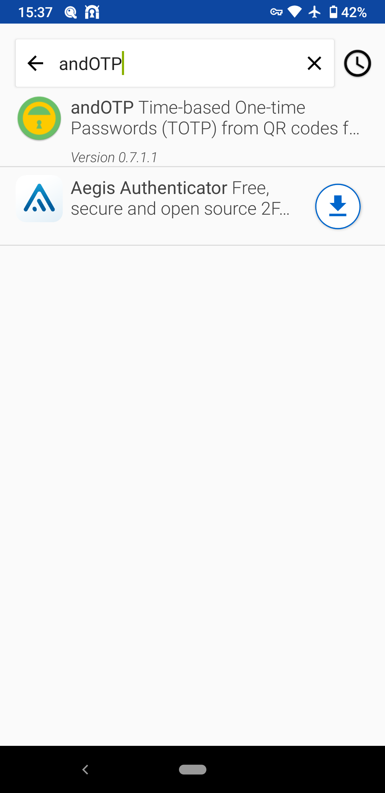
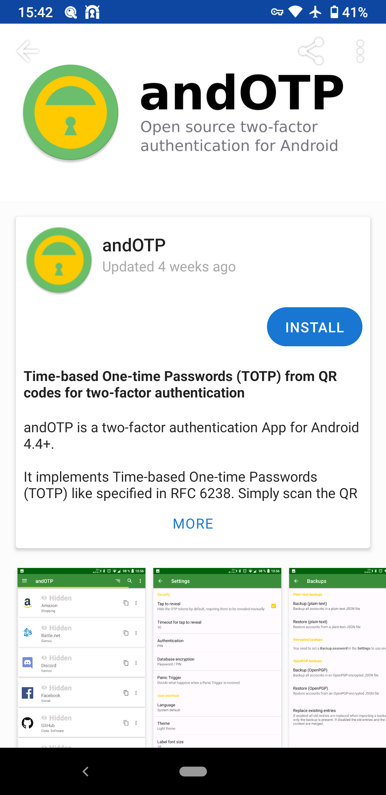
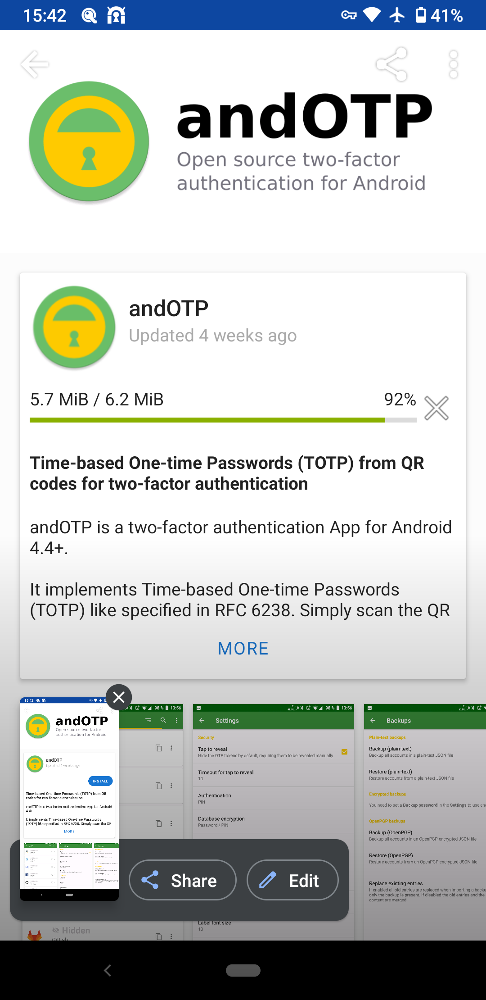
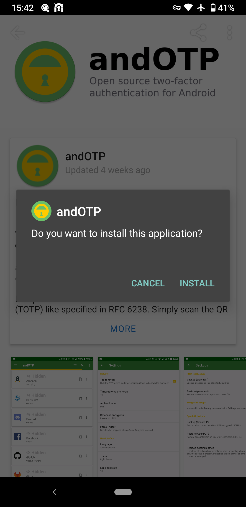

andOTP'yi çalıştırdığınızda sizi bir kurulum ekranı karşılayacaktır.

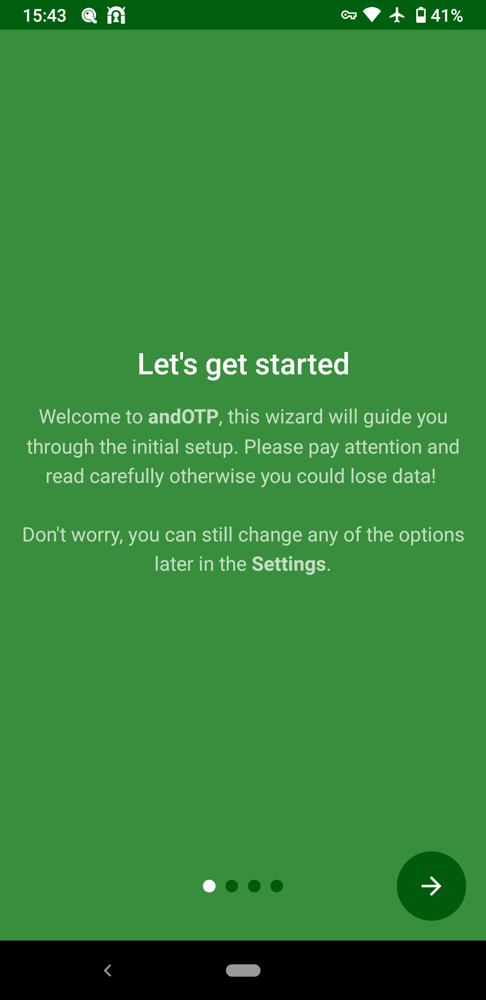

andOTP'nin ayarlarından ilk belirlemeniz gereken veritabanının nasıl şifreleneceğidir. Bu noktada modern Android destekleyen cihazlarda `parola` ve `anahtar deposu (keystore)` şeklinde iki adet seçenek vardır. Keystore desteklenen cihazlarda donanımsal kriptografik bir aracın şifreleme anahtarlarını yönetmesini sağlar. Bu hem özgür olmayan bir donanıma güveni gerektirmekte hem de andOTP geliştiricisinin ifadesi ile uyumsuzluklarla sonuçlanabilmekte. Bu sebepten `parola` seçeneğini seçerek kuruluma devam edebilirsiniz.

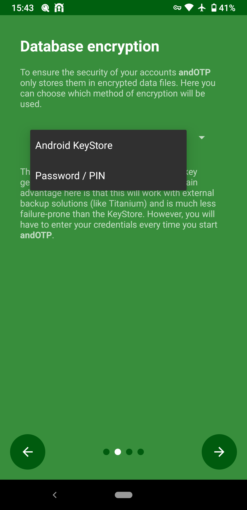

Parolanızı belirlemenizin ardından kurulum işlemi sonlanacak ve andOTP size parolanızı sorarak açılacaktır.

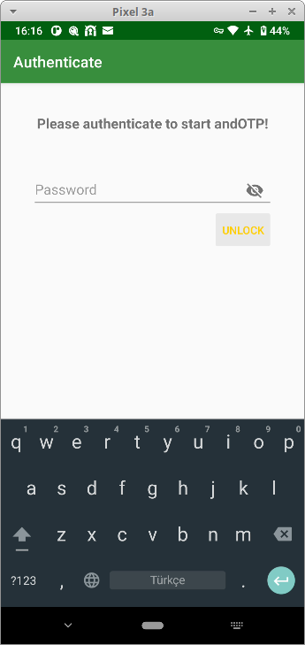
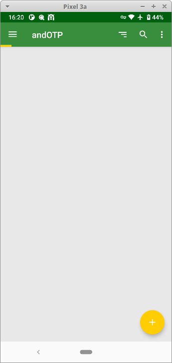

Bir OTP token eklemek için sağ altta bulunan + simgesine tıklayarak kullanılabilecek seçenekleri görüntüleyip seçebilirsiniz.

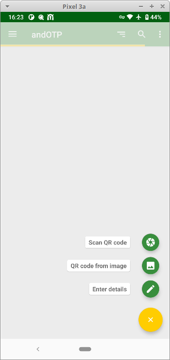

Çıkan seçeneklerden:

* Scan QR code: OTP kullanacağınız hizmetin size gösterdiği karekod'u okutarak gerekli bilgilerin kaydedilmesine yarar.

* QR code from image: Şayet hizmetin sağladığı OTP token karekodu bir fotoğrafta bulunuyorsa bunu gösterip bilgilerin girilmesini sağlar.

* Enter details: OTP token bilgilerinin elle girilmesine imkan verir.

Bu seçeneklerden en yaygın olarak kullanacağınız `scan qrcode` seçeneğidir keza neredeyse OTP imkanı veren her hizmet kolay token ekleme için karekod ile kurulum sırasında kullanıcılarına imkan sağlamaktadır.

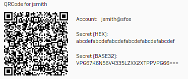

Kameranız ile karekod taramak için ayrı bir yazılıma ihtiyacınız olabilir. Bu noktada yine özgür olan [Binary Eye](https://f-droid.org/en/packages/de.markusfisch.android.binaryeye) veya [Barcode Scanner](https://f-droid.org/en/packages/com.google.zxing.client.android) yazılımlarından birini öneririz.

Karekodu taramanız üzerine OTP token eklenecek ve talebiniz üzerine üretilmeye başlayacaktır. Bu noktadan sonra söz konusu token'e ait hizmeti kullanmak için andOTP'den aldığınız kodu belirtilen süre içinde girmeniz yeterlidir.

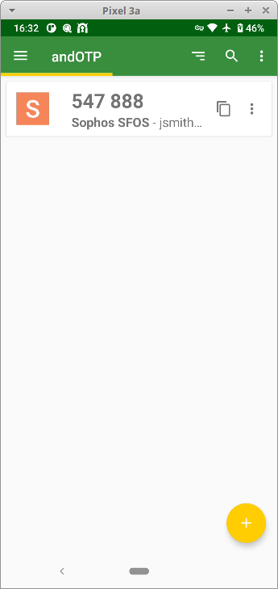

## Ayarlar

andOTP'yi kullanmak için özellikle ayarlarını değiştirmeniz gerekmiyor. Kimi ayarlar ileri kullanım ihtiyaçları için faydalı olabileceğinden göz atmakta fayda vardır.

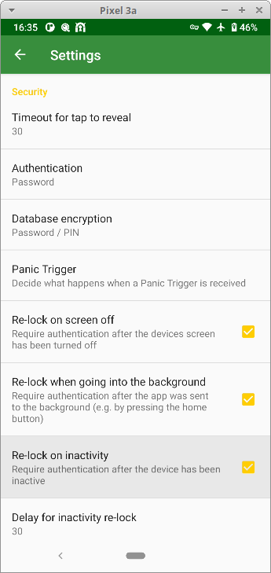
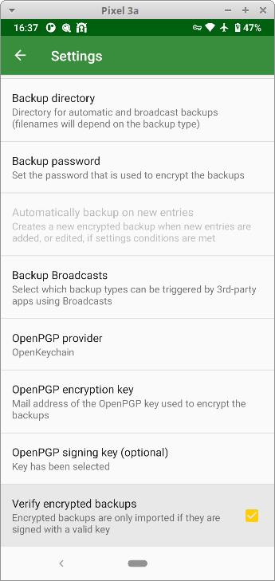

Yukarıdaki şekilde kilitlenme seçeneklerini ayarlamak andOTP'nin tuttuğu sırların korunması için en iyi seçeneği sağlayacaktır. Benzer şekilde söz konusu token'ler hesaplarınıza erişmenizde önemli rol oynayacağı için düzenli yedeklemelerinizi GPG ile şifrelemeniz için gerekli ayarları yaparak yedeklerinizi cihazınızdaki bir dizine kaydedebilir veya Android'in düzenli aldığı yedeklere şifreli şekilde güvenle ekleyebilirsiniz. Bunun için [Openkeychain](https://f-droid.org/en/packages/org.sufficientlysecure.keychain) yazılımına ihtiyacınız olacaktır. [Kullanımı için rehberimize danışabilirsiniz.](../yazisma_guvenligi/gpg/gpg-anahtar-uretimi.md)
