# Bitwarden

<!-- toc -->

[Bitwarden](https://bitwarden.com/) tüm işletim sistemlerinde kullanılabilecek özgür bir parola yöneticisi. Şayet [parola tercihleriniz](parolalar.md) uzak sunucuda eşitleme ihtiyacı doğurdu ve [Pass](pass.md) veya [KeePassXC](keepass.md) gibi offline çözümler size çok karmaşık gelecek ise Bitwarden bizce en iyi tecihlerinizden biri olabilir.

**Not** olarak tekrar belirtmek gerekir ki uzak sunucuda çalışan ve parolalarınızı cihazlarınızdan uzakta saklayan bir sistemin eşitleme veya kolay erişim gibi faydalarını sağlayan bu özellik aynı zaman da daha fazla saldırı imkanını ve güvenlik sorunlarını da yanında getirmekte. Özellikle web'den parolalarınıza erişmek veya ana parolanızı web üzerinden yaratmak en önemli verileriniz işleyecek bir sistemde çok ciddi güven gerektirmekte. Aynı zamanda Bitwarden sizden bir e-posta adresi isteyeceğinen anonimlik elde etmek için çabalamanız gerekecektir.

## Bitwarden kurulumu

### GNU/Linux

Bitwarden diğer parola yöneticilerinden farklı olarak dağıtımların temel yazılım depolarında bulunmamakta. Bu noktada Bitwarden'i kurmak için iki seçeneğiniz bulunuyor:

1. [Bitwarden indirme sayfasından](https://bitwarden.com/download/) cihazınıza uygun olan kurulum dosyasını indirip çalıştırmak. Bu GNU/Linux içn `.AppImage` indirip çalıştırmayı ve indirdiğiniz dosyanın bütünlüğü için sadece web sayfasının bir sertifika otoritesi tarafından verilmiş [TLS](/ag_guvenligi/letsencrypt.md) sertifikasına güvenmeyi gerektirmekte.

2. Kullandığınız dağıtımda `Snap` paket yöneticisi var ise kurulumu bununla yapmak. Bunun için aşağıdaki komutu kullanabilirsiniz:

`sudo snap install bitwarden`

Kurulumun ardından Bitwarden'ı çalıştırdığınızda sizi açılış ekranı ile karşılayacak ve hesabınıza giriş yapmanızı veya yeni bir hesap oluşturmanızı isteyecek.

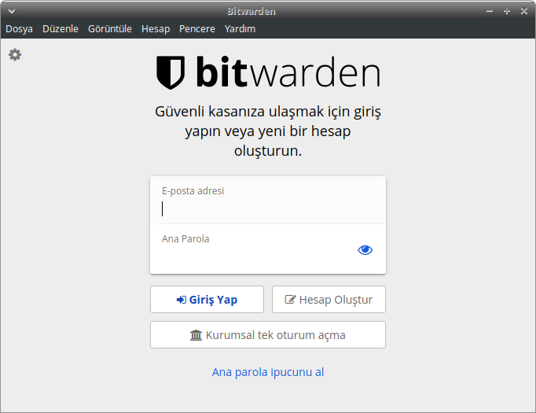

Bitwarden için bir hesap sahibi olmanız gerekli. Bu hesabın parolası ile de parolalarınızın şifreleneceği için bir [Zarola](https://zarola.oyd.org.tr) ile korunması önemli. Aynı zamanda bir e-posta adresini Bitwarden'a vermeniz gerekiyor. Bu noktada anonimliğiniz için kullandığınız geçici bir e-postayı veya bir alias e-posta kullanabilirsiniz. Bitwarden e-postanızla ilgili bir doğrulama yapmadığı için gerçek bir e-posta adresi de gün itibari ile vermeniz gerekmiyor. Bu durumda bir gün parolalarınızı kaybedebileceğiniz gerçeğine de hazırlıklı olmalısınız.

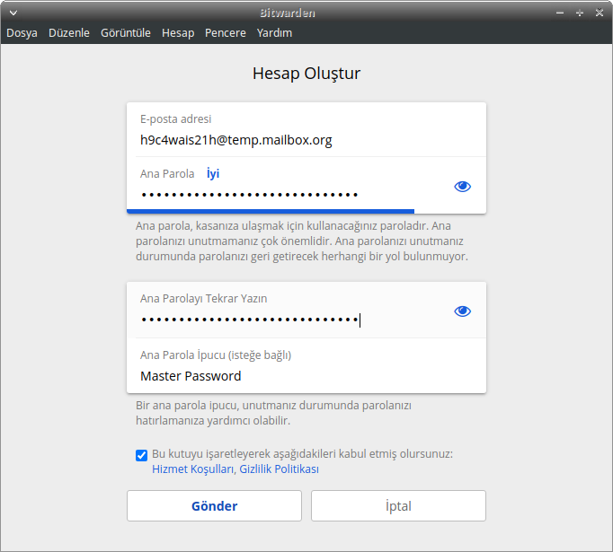

Hesabınızı oluşturup giriş yaptıktan sonra ilk parolanızı oluşturmakla başlayabilirsiniz. Bunun için `Kayıt ekle` veya `+` simgesini kullanabilirsiniz. Bunun ardından gerekli bilgileri doldurmanız için sayfa ile karşılanacaksınız.

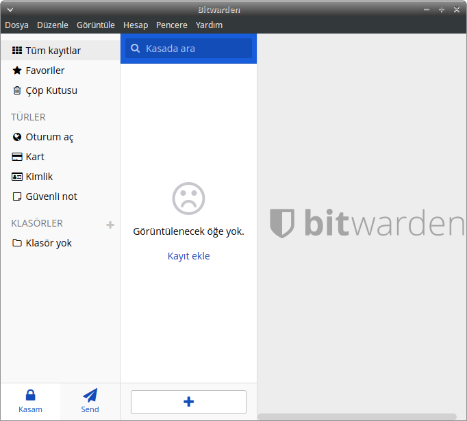

Parola oluşturmak için `Parola` bölümünün sağ tarafındaki yenileme simgesine tıklayarak yeni bir parola üretip bunun parola alanına girilmesini sağlayabilirsiniz.

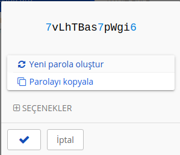
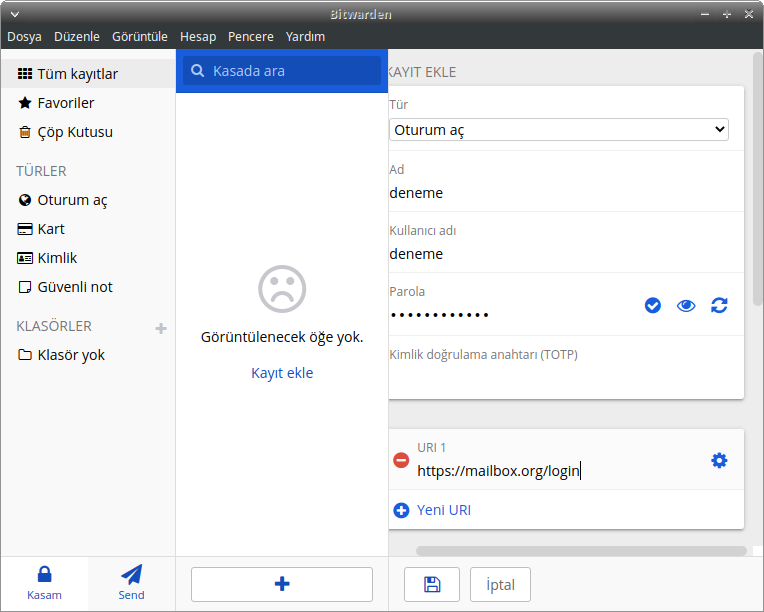
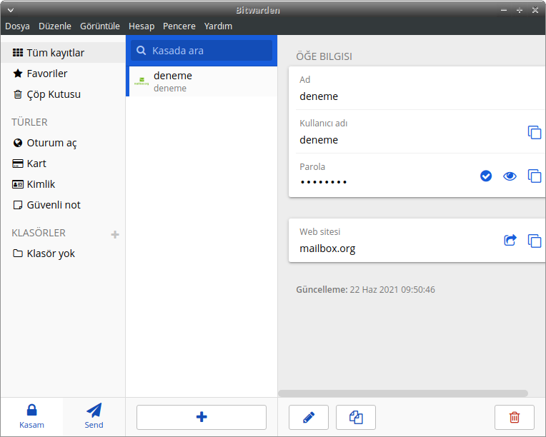

Bitwarden'ın kullanımınıza ilişkin bir grup ayarı bulunmakta. Bunları `Dosya > ayarlar` menüsünden erişebilirsiniz.

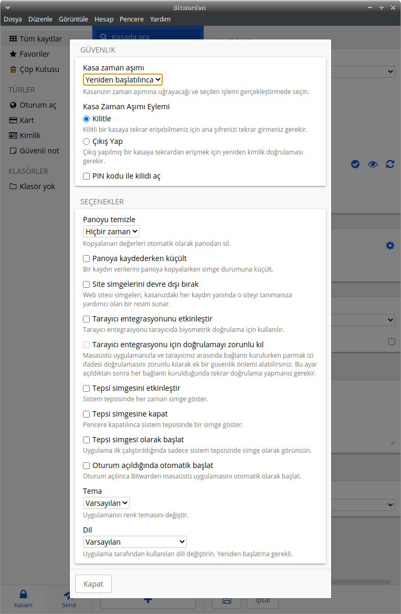

Bu ayarlar arasından güvenliğiniz açısından değerlendirmeniz gereken birkaç seçenek bulunmakta.

* __Kasa zaman aşımı:__ Bitwarden'ın ne süre kullanılmadığında kilitleneceğine dair olan ayardır. Şayet varsayılan `Yeniden başlatılınca` ayarında bırakırsanız bir oturumda Bitwarden'a giriş yaptıktan sonra özellikle kapatmadığınız sürece parolalarınızın erişilebilir oladağı anlamına gelmektedir Bunun yerine **1 veya 5 dakika** gibi kısa bir sürenin seçilmesi tavsiye edilir.

* __Panoyu temizle:__ Kopyaladığınız parolalarınız varsayılan ayarda panodan hiç silinmemekte. Pano erişimi ortak erişime açık bir alan olduğu için bu alanda tutulan parolalarınızın kısa bir süre içinde silinmesi iyi bir pratik olur. Bu sebeple pano temizleme süresini sizin için yeterli olan en kısa şekilde **1 dakika** ve altı olarak ayarlamanız tavsiye edilir.

### Tarayıcı

Bitwarden tarayıcı eklentisini Firefox eklentilerinden indirip kurabilirsiniz. Bitwarden diğer parola yöneticilerinin aksine bilgisayarınızda kurulu bir yazılıma ihtiyaç duymadan doğrudan tarayıcı eklentisi olarak çalışabilmekte.

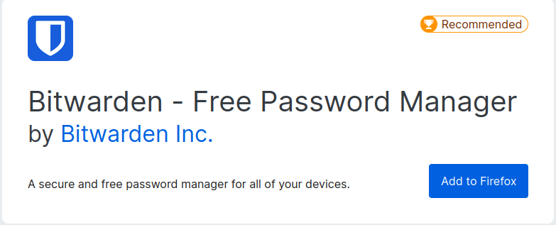

Bitwarden eklentisi açılışında sizden hesabınıza giriş yapmanızı isteyecek. Bir hesabınız yoksa GNU/Linux için takip edilen anlatımla bir hesap oluşturabilirsiniz.

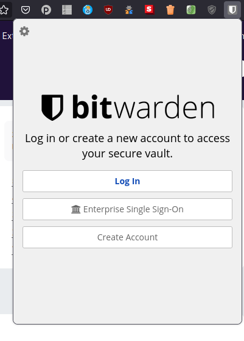
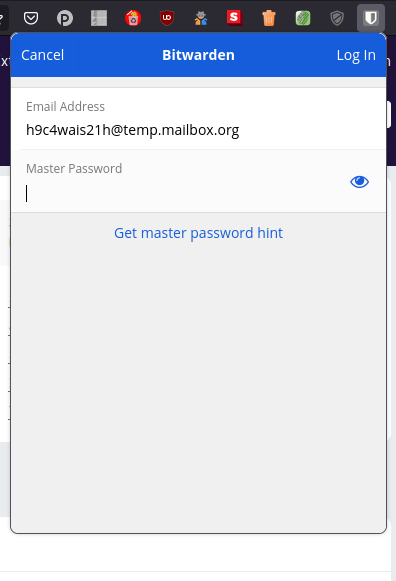

Giriş yapmanızın ardından `My Vault` sekmesinde tüm parolalarınızı görebilir, `Tab` sekmesinde açık olan tarayıcı sayfasına ilişkin URL eşleşmesi bulunan parola önersini görebilir ve ilgili alana bilgilerin yazılmasını sağlayabilirsiniz.

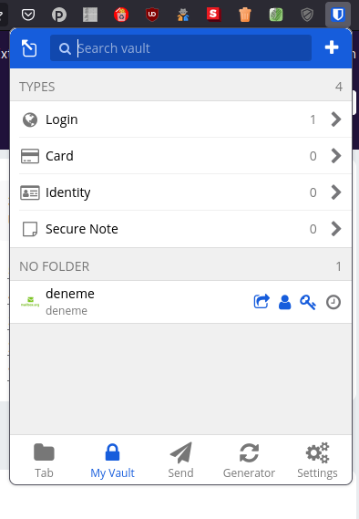
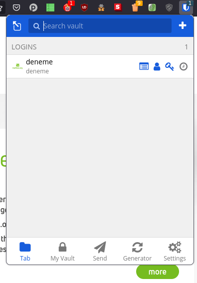

## Android

Bitwarden'i [F-droid](https://f-droid.org) özgür yazılım reposundan bulmanız gün itibari ile özgür olmayan bir Android bağımlılığından dolayı ne yazık ki mümkün değil.  Özgür olmayan yazılım depoları haricinde Bitwarden'i cihazınıza kurmak için iki seçenek bulunmakta.

1. [Bitwarden Github deposundaki imzalı .APK](https://github.com/bitwarden/mobile/releases) dosyasını indirerek cihazınıza elle kurmak ilk seçenek. Burada bulacağınız dosyalar Github'a `0x4AEE18F83AFDEB23` GPG anahtarı ile imzalı yüklenmekte.

2. [Bitwarden'in resmi F-droid deposunu](https://mobileapp.bitwarden.com/fdroid/] cihazınızda kurulu F-droid'de kurmak. Bunun için bağlantıyı takip ettiğinizde karşınıza çıkan karekodu kullanabilir veya URL'yi elle girerek depoyu ekleyebilirsiniz.

Android versiyonun kullanımı da benzer olmakla birlikte hesabınıza giriş yapmakla tüm Bitwarden işlevlerine ve parolalarınıza anında erişebilirsiniz.
