# Haven ile Güvenli Ortam İzlemesi

[Haven](https://guardianproject.info/apps/org.havenapp.main/) [Guardian Project](https://guardianproject.info/) tarafından geliştirilen bir ortam izleme yazılımı. Mahremiyet ve güvenlik konuşulan bir rehberde olmaması gereken bir yazılım gibi görünse de Haven çok özelleşmiş bir sorunu çözmek için geliştirilen bir hayli etkili bir özgür yazılım. Haven çok basitçe bir Android cihazın sensörlerini kullanarak belirli bir alandaki değişiklikleri takip edip gerçekleşen değişiklikleri kaydederek cihazın sahibine haber verebiliyor. Bu ihtiyaç [Evil Maid](https://en.wikipedia.org/wiki/Evil_Maid_attack) tipi saldırılaradn doğmuş durumda. Özetle Haven, cihazlarınızı veya yaşam alanınızı bir otel odası gibi kontrol altında bırakmadan terk ettiğinizde arkadanızda bıraktıklarınıza yapılabilecek müdahalelerden doğabilecek güvenlik açıklarına karşı koymak için tasarlanıyor. Haven kurulu bir cihazı odanızı veya bir eşyanızı gören veya duyan bir noktaya kurulu şekilde bıraktığınızda olağan dışı hareket ve sesleri kaydedip kullanıcısına SMS veya [Signal](../yazisma_guvenligi/signal.md) üzerinden haber verebiiyor.

Haven hala geliştirme sürecinde ve kullanılabilir olmakla birlikte kimi sorunlarla karşılaşmanız mümkün. Lakin çözdüğü sorunun önemi ve özgür bir başka çözümün yokluğunda yukarıda belirtilen bir saldırıyı tehdit modelinde gören kişilerin kullanması için değerlendirilebilir durumda.

## Haven'i yükleyin

Bunun için bir Android mobil cihaza ihtiyacınız olacak. Tercihen ve fiyat/performans açısından [LineageOS](../cihaz_guvenligi/lineageos.md) kurulu kamerası ve mikrofonu çalışan ucuz bir cihaza [F-droid](https://f-droid.org) üzerinden kurulum yapabilirsiniz.

Bunun için öncelikle F-droid ayarlarından The Guardian Project'in deposunu etkinleştirmeniz gerekli.

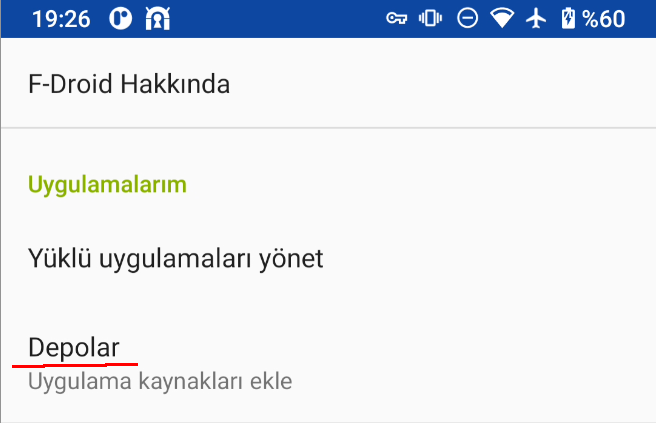

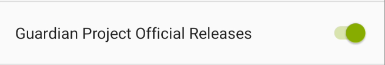

Depo içeriklerini yenilediğinizde Haven yazılımlar arasında listelenecektir.

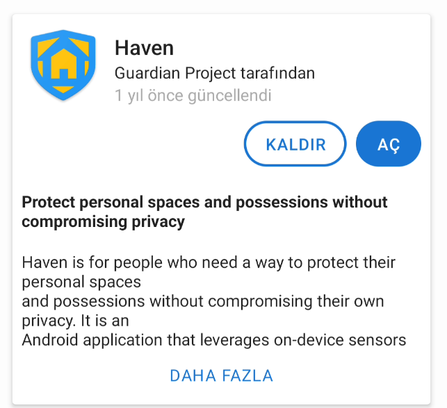

## Haven kullanımı

Haven yaptığı işe göre fazlasıyla kullanımı kolay bir yazılım. Sadece kullanımından önce ortama göre ayarlanması gerekiyor. Tanıtım ekranlarını geçtikten ve Haven'e gerekli sensörler için izin verdikten sonra kamera görüntünüzün olduğu bir başlangıç ekranı ile karşılaşacaksınız. 

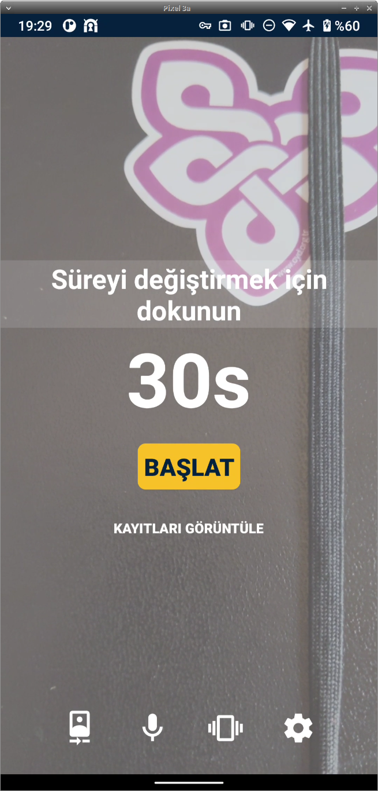

Bu ekranın altında Haven'ın tüm ayarları için bir bar bulunmakta.

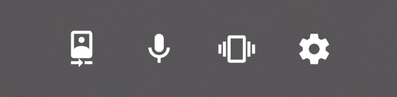

Bu barda sağdan sola olmak üzere;

* __Kamera ayarları:__ Bu bölümden cihazın hangi kamerasının kullanılacağını ve hareket hassasiyetini ayarlayabilirsiniz. Amacınız ayarı hareket sensörünün hareket yakalamadığını göstereceği en düşük sayıya ayrlamak.

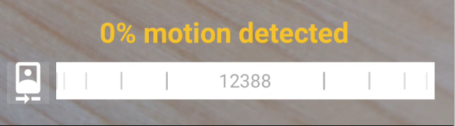

* __Mikrofon ayarları:__ Bu bölümden cihazın mikrofonunun hassasiyetini ayarlayabilirsiniz. Burada önemli olan ortamdaki olağan ses seviyesinin bir miktar üzerine ayarlamak. Keza çok yakın olursa olağan ses artışlarından yanlış alarmlar alma ihtimaliniz var. Çok yüksek belirlemeniz durumunda da gerçekten sessiz bir saldırganı kamera görüşüne girmediği bir durumda kaçırma ihtimaliniz. Kasıtlı olarak beklenebilecek sesleri çıkarıp ayarınızı buna göre belirleyebilirsiniz.

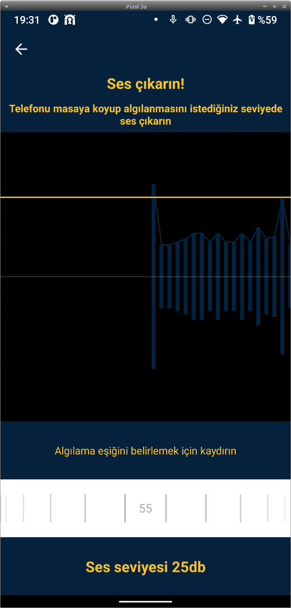

* __Titreşim ayarı:__ Bu bölüm cihazınızdaki jiroskop'un çıktısının hassasiyetini ayarlamakta. Haven cihazınızı hareket ettirilmesi durumunda haberdar olmak istediğiniz bir konuma koyduğunuzda olağan hareket seviyesinin hemen üzerine ayarı getirmelisiniz.

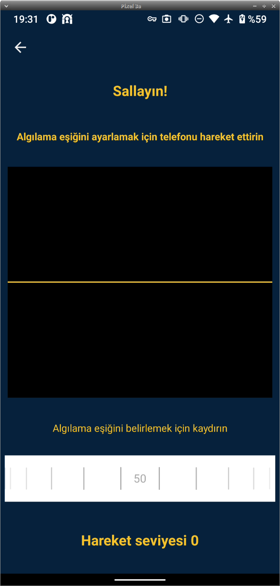

* __Ana ayarlar:__ Haven'in temel ayarlarına, iletişim kurulumlarına erişeceğiniz temel ayar sayfası.

Bu ayarları yaptıktan sonra Haven'ı kullanmak için bir engeliniz kalmıyor. Bunun için Haven yüklü cihazınızı kamerası ve sensörleri etkili olacak şekilde sabit bir noktaya yerleştirip etki alanından çıkacak süreyi ayarlayıp `Başlat` demeniz yeterli.

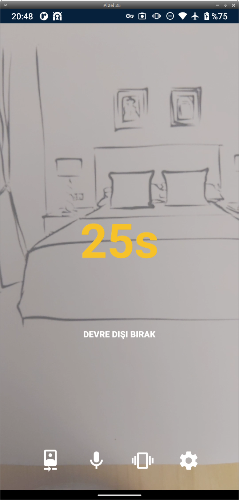

Geri sayım bittikten sonra Haven sensörleri dinleyerek bir değişiklik olması durumunda ilgili sensörün kaydını alacaktır. Bu kamerada hareket görülmesi durumunda fotoğraf veya video, ses duyulması durumunda ses kaydı şeklinde gerçekleşir.

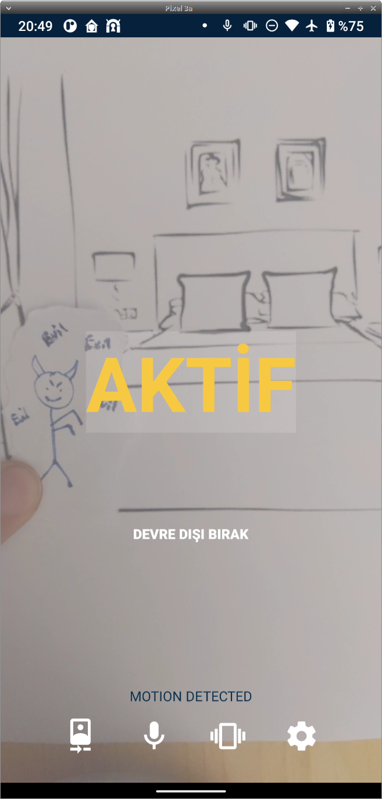

Kayıtları Haven'i devredışı bıraktıktan sonra `kayıtları görüntüle` kısmından inceleyebilirsiniz.

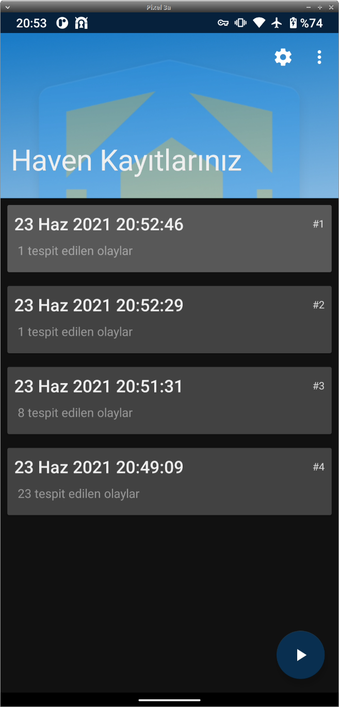

### Bildirim ve uzak erişim

Haven takip ettiği olayları sadece kaydetmek değil aynı zamanda size göndermek imkanına da sahip. Bunun için iki yol bulunmakta. Biri [Signal](../yazisma_guvenligi/signal.md) kullanarak diğeri de [TOR](../ag_guvenligi/tor.md) üzerinden bir web sunucusu açıp buraya uzaktan erişmenize imkan sağlayarak. Signal seçeneği Signal kullanılmayan bir telefon numarası gerektirmekte, TOR seçeneği de düzenli bir internet bağlantısını. Bu ayarları Haven'in genel ayarlarından yapabilirsiniz.

TOR kullanmak için yine The Guardian Project'in TOR istemcisi olan [Orbot](https://guardianproject.info/apps/org.torproject.android/) yazılımına ihtiyacınız olacak. Benzer şekilde F-droid'den indirebileceğiniz bu yazılım Haven'a TOR hidden service açma imkanı sağlayacaktır. Bunun ardından ayarlarda `wyig5ig2zamghhn.onion:8888` benzeri bir adres görülecek. [Tor Browser](../ag_guvenligi/tor.md) ile bu adrese girerek Haven'in kayıtlarına uzaktan belirleyeceğiniz parola ile erişebilirsiniz.

### Telemetri

Haven çalıştığını düzenli aralıklarla bildirebilmekte. Bu sayede siz yokken sessiz kalan cihazınızın aslında kapanmadığını bilebilirsiniz. Bunun için ayarlardan `Heartbeat Alert` seçeneğini açmalısınız.

### Video kaydı

Haven kamera kayıtlarını video olarak gerçekleştirebilmekte. Bu özelliklik biraz sorunlu olmakla birlikte cihazınızda çalışıp çalışmadığını deneyebilirsiniz. Bunun için ayarlardan `Video Settings` kısmından `Video Monitoring` seçeneğini açmalısınız.

### Batarya optimizasyonu

Android, ekran kapandıktan sonra çalışan yazılımları durdurarak batarya tasarrufu yapabilmekte. Bunun Haven'ı etkilememsi için ` Disable Battery Optimization` seçeneğinden Haven için istisna tanımlamanız gerekli.
