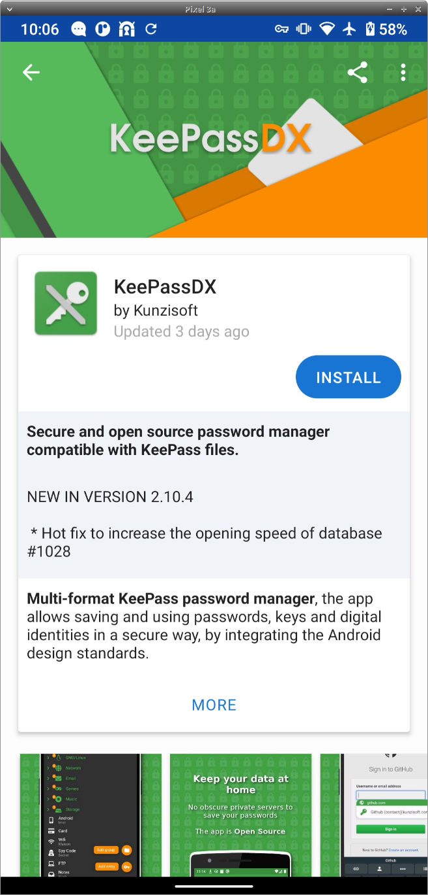

# KeepassXC

KeepassXC, uzun zamandır özgür yazılım olarak hayatını sürdüren ve tercih edilen bir parola yöneticisi olan Keepass'ın son üyesi. Keepass tüm işletim sistemlerinde desteklenmekte ve kullandığı veritabanı yaygın olarak başka alternatif parola yöneticileri tarafından da kabul edilmekte. Aynı zamanda pek çok parola yöneticisinde olmayan güvenlik tedbirlerini de dahili olarak desteklemekte. Arayüzü biraz eskimiş olsa da uzun süredir var olan ve güvenilir bir araç olarak güvenliğinize çokça katkı sunabilir.

## KeepassXC kurulumu

### GNU/Linux

KeepassXC neredeyse her dağıtımın paket depolarında bulunmakta. Kurulum yapmak için dağıtımınıza uygun olarak aşağıdaki komutu kullanabilirsin.

Debian tabanlı dağıtımlarda: `sudo apt-get install keepassxc`

RPM tabanlı dağıtımlarda: `sudo yum install keepassxc`

* **NOT:** Dağıtımınızın deposundaki yazılım güncel sürümün arkasından geliyor olabilir. Bu durumda tarayıcı eklentisi ile çalışma sıkıntısı çekmeniz muhtemel. Bunu aşmak için [KeePassXC indirme sayfasından](https://keepassxc.org/download/#linux) diğer kaynakları kullanabilirsiniz.

Kurulum işleminin tamamlanması ardından KeepassXC'yi çalıştırabilirsiniz. KeepassXC ilk açılışında sizi kurulum ekranı ile karşılayacaktır.

Karşılama ekranında birden fazla seçenek ile karşılaşacaksınız. Kurulum ertesinde KeePassXC'nin bir veritabanı bulunmadığından bunu sağlamanız gerekli. Bunun için

* `Yeni veritabanı oluştur` seçeneği ile yeni bir parola veritabanı oluşturmayı seçebilirsiniz.

* `Varolan veritabanını aç` seçeneği ile bir KeePassXC uyumlu veritabanınız var ise bunun bilgisayarınızdaki yolunu göstererek bu aşamayı geçebilirsiniz.

* `KeePass 1'den içe aktar` seçeneği ile eski sürümden kalan bir veritabanını aktarabilirsiniz.

* `CSV'den içe aktar` seçeneği ile bir başka parola yöneticisinden csv çıktısı olarak aldığınız parola tablosunu veritabanı olarak KeePassXC'ye ekleyebilirsiniz.

Şayet zaten KeePassXC kullanıcısı değildiyseniz yeni bir veritabanı oluşturmak üzere `yeni veri tabanı oluştur` seçeneğini seçerek ilerleyin ve karşınıza gelecek ekrandan veritabanınıza bir isim verin.

Daha sonra karşınıza veritabanının şifreleme algoritmasına ilişkin bir sayfa gelecek. Burada `şifre çözme zamanı` olarak belirtilen değer kullanılan algoritmanın ne kadar işlemsel yük getirmesini istediğinize ilişkin. Bu sayede bir saldırganın her olasılığı deneyerek veritabanını açma ihtimalini daha da pahalı kılabilirsiniz. Elbette bu sizin de veritabanı deşifre sürenizi aynı oranda uzatacağı için önerilen değeri koruyabilir veya belirli oranda daha yüksek bir değer atayabilirsiniz. Şayet teknik olarak hangi algoritmaların kullanılacağını seçmek isterseniz `Gelişmiş Ayarlar` düğmesi ile bu ayarlara ulaşabilirsiniz.

Veritabanınızın güvenliğine ilişkin kararları bir sonraki sayfada vermeniz gerekecek. Bunlardan en temeli parola belirlemek. Parola yöneticileri ve genel olarak temel güvenlik araçlarındaki yetkilendirmelerde her zaman olduğu gibi bir [Zarola](https://zarola.oyd.org.tr) oluşturarak veritabanınızı bu parola ile korumanızı hararet ile öneriyoruz.

KeePassXC'nin veritabanını korumak için gelişmiş imkanlardan da faydalanabilirsiniz.

* **Anahtar Dosyası:** Veritabanını deşifre edebilmek için hem parolayı hem de KeePassXC'nin oluşturacağı anahtar dosyasını sunmanız gerekir. Bu anahtarı oluşturmak için `Anahtar Dosası Ekle` seçeneğini seçip `oluştur` düğmesi ile yeni bir dosya oluşturabilirsiniz. Bu dosyayı parolanız kadar iyi korumanız gerekmekte aksi halde tüm parolalarınızı kaybedebilirsiniz. En iyi seçenek bir kopyayı USB bellekte diğerini güvendiğiniz bir başka alanda saklamak. Bunun için [GPG anahtarı kağıt yedek rehberimizden](/yazisma_guvenligi/gpg/paperbackup.md) yararlanabilirsiniz.

* **Yubikey:** Yubikey güvenlik anahtarı ile veritabanını güvene alabilirsiniz. Bunun için [Yubikey 2FA](yubikey_2fa.md) imkanına sahip olan bir cihazda bu işlemi gerçekleştirirken `Yubikey ekle` seçeneğini seçip ardından uygun slotu seçerek işlemi tamamlayabilirsiniz. Bunu yapmanız durumunda her veritabanı işlemi için Yubikey ile Challange-response işlemini tamamlamanız gerekeceğinden Yubikey'iniz olmadan veritabanını açma imkanınız olmaz. Anahtar dosyası gibi Yubikey'inizi de kaybetmemeye de dikkat etmelisiniz. **Unutmayın ki** Yubikey sadece bilgisayarda kullanılabilir olduğundan Android veya Yubikey'in gerekli sürücülerinin olmadığı cihazlarda oluşturacağınız veritabanını kullanılmaz kılacaktır.

Veritabanı ile ilgili işlemleri tamamladıktan sonra KeePassXC'nin ana ekranı karşınıza gelecektir. Bu boş ekrana yeni bir parola eklemek için üst çubuktaki anahtar ve `+` simgesine tıklayarak yeni bir parola eklemek için gereken arayüzü açabilirsiniz.

Gerekli alanları doldurduktan sonra parolanızı kaydedebilirsiniz. KeePassXC'nin parola oluşturma alanında bir üreteci bulunmamakta bunun için menü barında `Araçlar` bölümünden `Parola Oluşturucu` sekmesini seçerek rastgele bir parola oluşturmak için gereken sayfayı açıp oluşturduğunuz parolayı kopyalayarak parola bölümüne girmeniz gerekmekte.

Bu noktadan sonra kaydettiğiniz parolaları üzerine tıklayarak gerekli detaylarını kopyalayabilir ve düzenleyebilirsiniz. Her KeePassXC'yi kapattığınızda veya veritabanını kilitlediğinzizde kurulum aşamasında belirlediğiniz değerler ile tekrar deşifre etmeniz gerekecektir.

### KeePassXC-Browser Firefox eklentisi

KeePassXC-Browser eklentisi ile kaydettiğiniz parolaları tarayıcınızda kullanmanız mümkün. Bunun için [KeePassX-Browser eklentisini](https://addons.mozilla.org/en-US/firefox/addon/keepassxc-browser/) Firefox'a kurmanız gerekli.

Eklentinin KeePassXC veritabanına ulaşabilmesi için bilgisayarınızda kurulu KeePassXC'den `Tarayıcı Tümleşmesi` seçeneğinin etkineştirilmesi gerekiyor. Bunun için KeePassXC'yi açıp ` Araçlar > Ayarlar > Tarayıcı Tümleşmesi` sekmesine gelip üst bölümde bulunan `KeePassXC tarayıcı entegrasyonunu etkinleştir` seçeneğini seçmeniz ve ardından listelenen tarayıcılar arasından kullandığınız tarayıcıyı işaretlemeniz gerekli.

**NOT:** Şayet KeePassXC'yi Snap gibi dağıtımınızın deposundan farklı bir kaynaktan kurduysanız aralarındaki iletişimi sağlamak için bir betik çalıştırmanız gerekli. Bunun için [KeePassXC indirme sayfasına](https://keepassxc.org/download/#linux) bakınız. Tarayıcı eklentisi eski bir sürüm ile çalışmayı reddedebilir.

Bu ayarın yapılması ardından KeePassXC tarayıcı eklentisinden veritabanına bağlanmayı talep edip bu bağlantıya bir isim verin. Ardından şayet veritabanınızda girdiğiniz parolaların kullanılacağı sayfaların URL'lerini girdiyseniz eklenti bu web sayfalarında otomatik olarak size giriş bilgilerini doldurmayı teklif edecektir.

## Android

KeePassXC ile ürettiğiniz parolaları Android cihazınızda kullanmak için [KeePassDX](https://www.keepassdx.com/) yazılımını kullanabilirsiniz. Bu yazılımı [F-droid özgür yazılım deposunda](https://f-droid.org) bulabilirsiniz.

KeePassDX açılış ekranında sizden var olan bir veritabanını göstermenizi veya yeni bir tanesini oluşturmanızı isteyecektir. Varsa kopyaladığınız veritabanınızı gösterebilir veya yeni bir taneyi parolasını 

Veritabanını oluşturduktan sonra ilk parola girişinizi yapabilirsiniz.

Parolanızı oluşturmanızın ardından ana ekranda eklediğiniz parolaları görebilirsiniz. Parolaya erişmek ve kopyalayabilmek için istediğiniz kaydın üzerine tıklamanız gerekli. Tıklamanız üzerinde giriş yaptığınız detaylar ve kopyalama seçeneği ortaya çıkacaktır.

KeePassDX'in Android'e özel ayarları bulunuyor. Bunlardan en önemlisi parola yöneticisi dışındaki tarayıcıda veya yazılımlarda bu parolaların kullanılmasının otomatize edilmesi. KeePassDX açısından bunu sağlamanın iki yolu bulunuyor. Birincisi KeePassDX'in `Magikeyboard` isimli klavyesi. Bu klavye aracılığı ile Android'in her noktasında parolalarınıza erişip doldurmak mümkün oluyor. İkinci seçenek ise Android'in yerleşik `otomatik doldurma ayarlarını` kullanmak.

