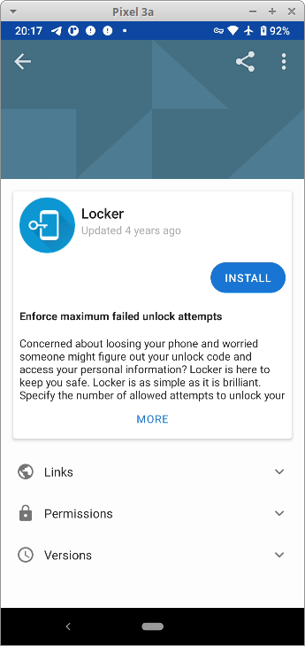
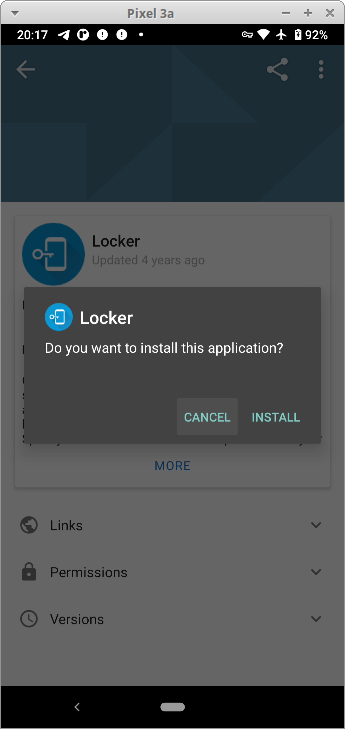
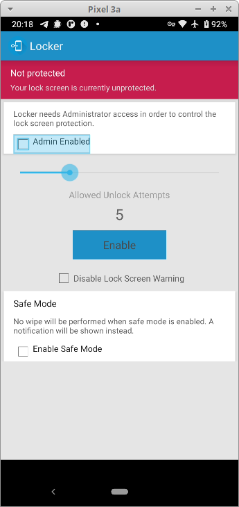
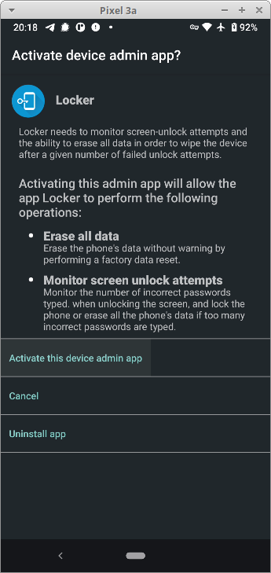
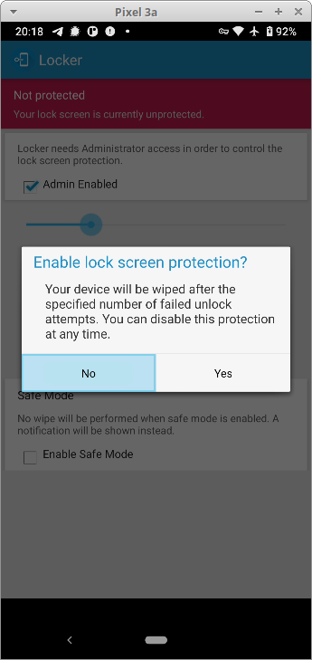
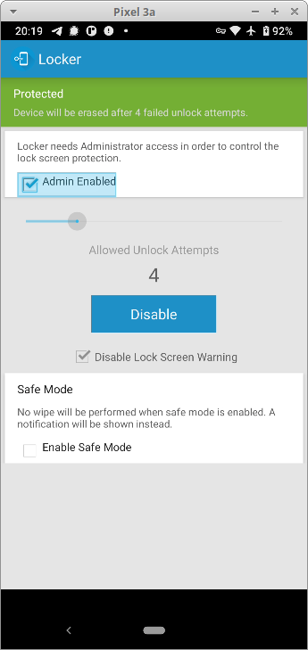

# Locker ile Ekran Kilidi Güvenliği

[Locker](https://f-droid.org/en/packages/net.zygotelabs.locker/) Android cihazlarda ekran kilidinizin deneme sayısını belirleyip bu sayının aşılması durumunda cihazınızdaki tüm verileri silmeye yarayan basit bir yazılımdır.

Locker'i özgür uygulama deposu [F-droid](https://f-droid.org) aracılığı ile cihazınıza kurabilirsiniz. Locker'i çalıştırdığınızda sizi gayet basit bir ekran ile karşılayacaktır.

Kurulumun ardından Locker'i çalıştırıp ekrana gelen ayarları yapmaya başlayabilirsiniz.

İlk olarak `admin enabled` seçeneğini işaretleyerek işletim sisteminizde Locker'e yönetici yetkisi vermeniz gerekli. Bu seçenği işaretlemenizle birlikte cihazınız sizden bu konuda yetki talep edecektir.

Yetki ardından ayarları dilediğiniz gibi yapabilirsiniz. Ana ekrandan kaç deneme ertesinde cihazın sıfırlanacağını belirledikten sonra `Disable Lock Screen Warning' seçeneğini seçerek ana ekranda cihazın kendini sıfırlayacağına dair uyarı çıkmasını engelleyebilirsiniz. Bu seçenek bir arkadaşınızın laf olsun diye cihazınızı sıfırlamasına karşı uyarı gösterecek olsa da saldırganın durumdan haberdar olup denemelerini durdurmasına da sebep olacağından kullanım koşuluna göre değerlendirilmesi gereklidir.

Gerekli ayarların yapılması ardından `Enable` düğmesine basarak korumayı devreye alabilirsiniz.

Bu noktadan sonra ekran kilidinizde belirlediğiniz sayıda hata oluşması durumunda cihazınız içindeki tüm verileri silerek sıfırlanacaktır. İstenmeyen bir durumun gerçekleşmesine karşı dikkatli olmanız ve düzenli olarak yedek almanız şiddetle önerilir.
