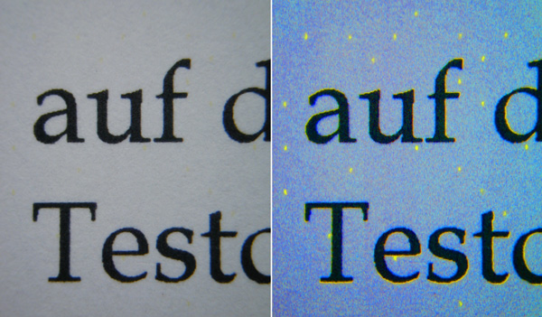

# Yazıcılarınızdaki tehlike: Machine Identification Code

Yazıcınızdan çıktı aldığınız bir kağıdın, sizi takip etmek için kullanılabileceği fikri sanki Hollywood filmlerinden bir sahne gibi duyuluyor olabilir, ancak içinde yaşadığımız dünyada artık bu da mümkün olabiliyor.

Xerox ve Canon tarafından 80’li yıllarda geliştirilen Machine Identification Code (MIC), yazıcıdan çıkan her kağıda ilk bakışta gözle görülemeyen bir grup nokta çizerek daha sonrasında ilgili kağıdın kaynağının tespit edebilmesini sağlayan bir teknolojidir. Asıl amacının banknot sahteciliğine karşı bir önlem olduğu ifade edilen MIC, uzun yıllar açığa çıkmamış, ilk defa 2004 yılında  Hollanda hükumetinin bir grup kalpazanı tespit etmek için bu teknolojiyi kullanmasıyla bilinir hale gelmiştir. Aynı yıl PC World dergisi bu sistemin uzun yıllardır sahte para basan kişileri tespit etmek için kullanıldığını açıklamıştır.

2005 yılında [Electronic Frontier Foundation](https://eff.org), birçok kişiden topladığı örnekleri bir araya getirerek MIC’nin nasıl çalıştığını çözmüş ve pek çok yazıcı üreticisi tarafından bu sistemin kullanıldığını ortaya çıkartmıştır. Sistemin devletler ve şirketler tarafından tam olarak nasıl ve ne şekilde kullanıldığı hakkında hala çok fazla bilgi yoktur, ancak 2015 yılında yine EFF tarafından, tüm büyük renkli yazıcı üreticilerinin devletlerle yazıcı çıktılarının izlenebilir olmasını sağlamak üzere gizli bir anlaşma yaptıkları iddia edilmiştir.

Bu sistemde, alınan her çıktının üzerine yazıcının modeline bağlı olarak belirli bir düzende sarı renkli noktalar yerleştirilir. Bu noktalar normal şartlarda gözle görülmez, ancak çok yüksek çözünürlükte tarayıcılar sayesinde veya morötesi ışık altında görünebilir hale gelirler. [CCC](https://ccc.de) tarafından, bırakılan kodun teoride 64 bayt veri depolayabildiği ifade edilmiştir.

Günümüzde bu sistemi tam olarak hangi üreticilerin hangi modellerinde kullandığı yayınlanmamıştır.

Bu sistem sayesinde, devletler ve sisteme erişimi olan tüm taraflar yazıcılardan alınan çıktıları takip edebilmektedir. Bu durum, belge sızdıran kişiler ve muhalifler için bir tehdit unsuru olabilir. Yazıcınızdan aldığınız bir çıktı, bir gün bazı kesimlerin hoşuna gitmeyebilir ve kolayca tespit edilebilirsiniz.

MIC’den korunmak için, alacağınız yazıcının ilgili özelliği ihtiva edip etmediğini kontrol edebilirsiniz. [H-Node](https://h-node.org) isimli web sitesi, özgür yazılımlarla çalışan donanımların listelendiği bir dizindir. Burada yazıcılar bölümündeki her yazıcı için ilgili teknolojiyi ihtiva edip etmediği bilgisine yer verilmiştir.

Ayrıca 2018 yılında Dresden Teknik Üniversitesi’ndeki bir grup bilim insanı tarafından geliştirilen [deda](https://github.com/dfd-tud/deda) aracı, yazıcınızdan çıkan kağıtlardaki MIC verisini anonimleştirebilmekte ve bu yolla güvenliğinizi ve mahremiyetinizi sağlayabilmektedir.

----

© 2020 Özcan Oğuz - CC BY-SA [Orijinal kaynak](https://www.dijitalguvenlik.org/makale/donanimlarinizdaki-tehlikeler-guvenlik-ve-mahremiyet/)