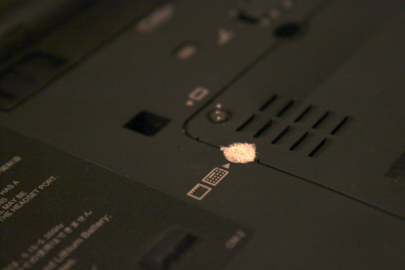
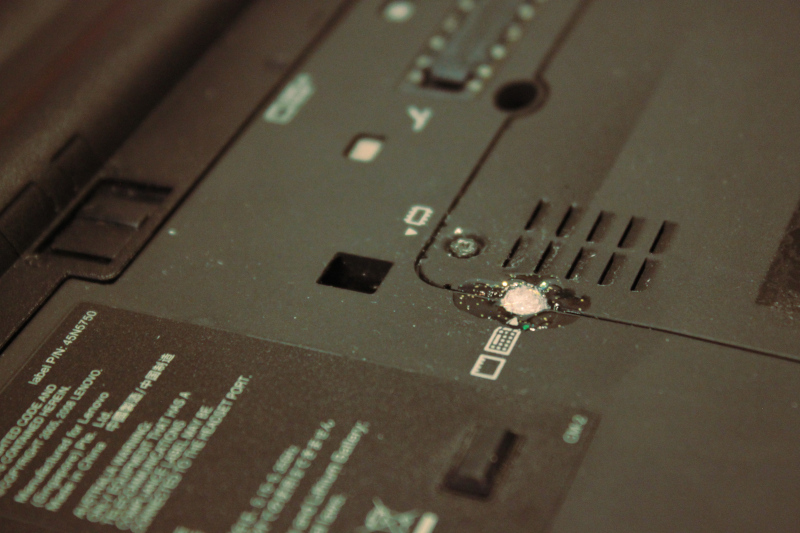

# Simli Oje ve Entropi ile Fiziki Cihaz Güvenliği

<!-- toc -->

[Fiziksel güvenlik](fiziki_guvenlik.md) cihazların güvenliğinin sağlanması açısından ciddi bir endişe olarak var olmakta. Her ne kadar [boot güvenliği](cihaz_guvenligi/boot_guvenligi.md) veya [şifreleme](cihaz_guvenligi/cihaz_sifreleme.md) gibi yazılımsal kaynaklı güvenlik tedbirleri kimi saldırıları engelleyebilecek olsa da fiziken cihaza yerleştirilecek bir cihaz aracılığı ile gerçekleştirilebilecek saldırılara karşı çok az koruma sağlamaktadır.

Fiziki tedbirlerin amaçlarından biri de kullanılan cihazlara yapılabilecek fiziki müdahalelerin nasıl engellenebileceği veya yapılan müdahalelerin nasıl fark edilebileceğinden oluşmakta. Keza donanıma yapılan bir müdahalenin doğrulanması kimi zaman imkansıza yakın olabilecek olduğundan pratik olarak soruna getirilebilecek en iyi çözüm müdahalenin olmadığından emin olmaktan geçmekte.

Bu açıdan cihazların göz önünden ayrılmaması en önemli tedbir olsa da günlük yaşantımızda bunun mümkün olmadığı pek çok durum söz konusudur. Masaüstü bilgisayarlar bulundukları yerde kalmak, kimi kısıtlı alanlara girilirken mobil cihazların terk edilmesi zorundadır. Bu gibi durumlarda söz konusu fiziki alanların güvenliği ve bu alanlarda cihazlara erişimi olanlara olan güven endişenin temelini oluşturmakta. Keza bir cihazın açılıp gerekli değişikliklerin yapılması çok fazla vakit istememekte ve yeterince istekli bir saldırgan pek çok olağan tedbiri aşmaya imkan sahibidir.

## Sim ve Entropi

Bir cihazın açılıp açılmadığını öğrenmeye yakın zamanlara kadar en hevesli kişiler bize chazları çoğunlukla kaçamak garantiler kapsamında satan şirketlerdi. Cihazların çeşitli alanları üzerinde, çoğunlukla bir vida veya kapağın eşiğinde bulunan "açılırsa garanti kapsamı biter" kapsamındaki etiketler, "tamper evident" yani emniyet etkietleri bu amaç doğrultusunda kullanılmaktadır. Bu etiketler çeşitli mekanik ve kimyasal yöntemlerle etiketin açılıp kapandığını belli eden özelliklerle donatılmakla olağan kullanıcı için belli etmeden müdahaleyi çok zorlaştırmaktadır.

")

Lakin sizi, bilgisayarınızı ve kullandığınız etiketi bilen veya dünyadaki her güvenlik etiketinden bir tane bulundurmaya gücü yetecek bir saldırgan için bu etiketlerin bir engel teşkil ettiği söylenemez. Keza bilgisayarınızdaki etiket çıkarılıp yerine aynısından bir tane yapıştırılmış olursa cihazınıza müdahale edildiğine dair nasıl bir izlenim edinilebilir? Güvenlik etiketleri seri üretim ürünler olmakla belirli bir tasarımda ve topluca üretilmekteler. Bu etiketleri fiziki özelliklerini belirli kıldığından iki etiket arasındaki fark da felsefi düzeyde kalmaktadır.

Belirlenebilirlik bir sorun olduğu zaman çözüm neredeyse her zaman belirlenemezlikle yani [entropi](https://en.wikipedia.org/wiki/Entropy_(statistical_thermodynamics)) ile çözülmektedir. [Parolalarınızı koruyan](beseri_guvenlik/parolalar.md) entropi ile aynı kapsamda cihazınızı koruyacak etkiet de entropiden faydalanır. Şöyle ki; şayet bir saldırgan dünyada seri üretimde bulunan veya özel ürettirmiş olsanız bile bilgi sahibi olduğu bir etiketten yaptırabilir lakin tamamen rastgele olan bir etiketten üretmesi çok ama çok zordur.

Bu sorunun çözümü olarak [Chaos Computer Club'ın](https://www.ccc.de/en/club) [30c3](https://media.ccc.de/v/30C3_-_5600_-_en_-_saal_1_-_201312301245_-_thwarting_evil_maid_attacks_-_eric_michaud_-_ryan_lackey) konferansında eric Michaud ve Ryan Lackey tarafından yapılan sunumda neredeyse her kozmetik dükkanında bulunabilecek simli oje önerilmektedir. Fikir ojenin içerdiği simlerin her boyamada tamamen rastgele sonuçlar vermesine dayanmaktadır. Bu şekilde cihazın vidalarına ve/veya portlarına yapılan mühürler daha sonra kontrol edilerek bozulup bozulmadığından görece emin olunabilmektedir. Keza aynı şekilde mührü oluşturmak veya bir iz bırakmadan çıkarıp yerine takmak pek kolay bir iş değildir.

## Simli oje ile mühür oluşturmak

Cihazlarınızın güvenliğini simli oje ile sağlamak için öncelikle doğru ojeyi bulmanız gereklidir. Bu olağan ojeler gibi kişisel bir tercihten ziyade içindeki sim ve özellikleri ile ilgili. Kullanacağınız ojenin aşağıdaki özellikleri göstermesine dikkat etmelisiniz.

1. Simler homojen olmamalıdır.
2. Simler gözle seçilebilecek büyüklükte olmalıdır.
3. Mümkün ise farklı renk ve şekillerde simler içermelidir.
4. Ojenin sıvısının şeffaf olması tercih sebebidir.

Bu şekilde ojeniz daha fazla belirsizlik içerecek ve inceleme için daha elverişli olacaktır.

Ojenizi edindikten sonra aşağıdaki adımlarla başlayabilirsiniz.

### Cihazınızda uygun yeri belirleyin

Güvenliğinden endişe ettiğiniz cihazınızın sökülebilir kısımlarını çıkarmak için mutlaka müdahale edilmesi gereken yerleri tespit edin. Bu cihazın ortalarında olan bir vida olabileceği gibi bir kapağın eşiği veya cihazın her vidası olabilir. Bu incelemeyi yaparken veri yönünden kritik görünmese de cihazın içine bağlı ekran gibi diğer alanları da dahil etmeye dikkat edin. Şayet port girişlerini de kapatmak isterseniz bunları bir cins bant ile kapatıp bantların köşelerinden taşacak şekilde mühürleyebilirsiniz.

Aşağıdaki cihaz ve konumları değerlendirmeniz önerilir.

* Kritik alanlardaki vidalar
* HDD ve RAM kapakları
* Cihazın kasasının birleşme noktaları
* Portlar
* USB belleklerin girişleri
* Taşınabilir donanımların birleşim yerleri

### Mühürlenecek alanı temizleyin

Ojenin iyice tutunabilmesi uygulanacağı alanın temizliğine bağlı. Bu bakımdan toz, yağ, parmakizi gibi kirleticiler mühürün dayanıklılığına etki edecektir. Temizlik için alkol içeren bir çözelti veya aseton kullanabilirsiniz. Aynı zamanda mühürü ileride çıkarmak ve cihazınıza zarar gelmemesi arzunuz ise cihazın üzerinde kaplama olmayan bir alan tercih etmeniz önerilir.

Şayet mühürün dayanıklılığına ciddi bir yatırım yapmak istiyorsanız uygulama alanını zımparalayarak tutunmayı arttırabilirsiniz ama pek çok durum için bu aşırı olacaktır. Aynı zamanda vida delikleri derin olan cihazlarda deliği bir kağıt veya pamuk ile kapatmak ojenin içeri kaçmasını engelleyecektir.

### Ojenizi sürün

Uygulama alanına simli ojenizi damlatarak veya bolca sürerek uygulayın. Burada amaç birleşik ve parçalı olmayan kalın bir tabaka elde etmek. Ojenizden yeterince simin yüzeye aktarıldığından emin olun. İşlemin ertesinde ojeye kuruması için yeterli süreyi tanıyın.

### Mühürlerin fotoğrafını çekin

Her ne kadar simleri ve konumlarını hatırlayabileceğinizi düşünseniz de gerekli olan güvenlik payı en küçük değişikliklerin fark edilebilmesini gerektirmekte. Bu amaçla yaptığınız her mührün iyi aydınlatılmış bir ortamda bulanık olmayan yakın bir fotoğrafını çekin.

Bu fotoğrafları yanınızdan ayırmayacağınız bir aygıt üzerinde depolamanız gerekmekte. Bu amaçla elinizden alınmayacağı bir koşulda telefonunuzu kullanmanız mümkündür. Daha iyi bir seçenek artık fazlasıyla ucuz ve küçük olan [microSD](https://en.wikipedia.org/wiki/SD_card#Micro) hafıza kartına bu fotoğrafları koyup üzerinizde dikkat çekmeyecek bir yerde bulundurabilirsiniz.

### GPG anahtarınızı hazırlayın

Bu aşama zorunlu olmasa da yapacağınız mührü kontrol etmek için kullanacağınız fotoğrafların değiştirilmediğinden emin olmanın tek yolu kriptografik olarak imzalamaktan geçmektir. Bu hem fotoğrafları içeren aygıtın kontrolünü kaybetmeniz durumunda önem taşır hem de uzun vadede bu mührü korumanızı kolaylaştırır.

GPG ve kullanımı size yabancı konular ise [GPG rehberimizden](yazisma_guvenligi/gpg/gpg.md) faydalanabilirsiniz.

## Mührün kontrol edilmesi

Bir tehlikenin atlatılması ertesinde mühürün bütünlüğünü kontrol etmek için, benzer ışık koşullarında tekrar fotoğraflayıp iki fotoğraf arasında gidip gelerek benzerliğini gözle doğrulayabilirsiniz.
