# Pass - Standart Unix Parola Yöneticisi

<!-- toc -->

[Pass](https://www.passwordstore.org/) 700 satır bash betiği ile yazılmış inanılmaz basit ve etkili bir parola yöneticisi. Parolaları üst verileri ile birlikte ev dizini altında [GPG](/yazisma_guvenligi/gpg/gpg.md) ile şifreleyerek saklamakta. Bir uçbirim yazılımı olmakla birlikte hem Android hem de GNU/Linux için grafik önyüzü ve Firefox tarayıcı etklentisi bulunmakta. Şayet GPG kullanıyorsanız Pass'ten daha basit ve etkili bir parola yöneticisi bulmak zor.

## Pass kurulumu ve kullanımı

### GNU/Linux

Pass'i kurmak için aşağıdaki komutu kullanabilirsiniz:

Debian tabanlı dağıtımlarda: `sudo apt-get install pass`

RPM tabanlı dağıtımlarda: `sudo yum install pass`

Şayet Pass'ı terminalden kullanmayı tercih etmezseniz grafik arayüz olarak QtPass'ı kurmalısınız. Bunun için:

Debian tabanlı dağıtımlarda: `sudo apt-get install qtpass`

RPM tabanlı dağıtımlarda: `sudo yum install qtpass`

Kurulumun tamamlanması ardından `QtPass` çalıştırdığınızda ilk kurulum için gerekli ayarların yapılmasına başlanacaktır. Bu ayarlardan ilki kullanılacak GPG anahtarının belirlenmesi. Pass bunun için GNU/Linux dağıtımınızın kullandığı GPG yazılımını kullanacağından gizli anahtarınızın üretilmiş ve kullanıma hazır olarak bulunması gerekmekte. Bir GPG anahtarı oluşturmak için [kolay GPG anahtar üretimi rehberinden](/yazisma_guvenligi/gpg/gpg-anahtar-uretimi.md) yardım alabilirsiniz.

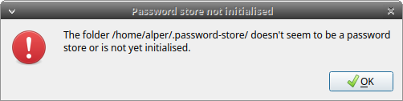

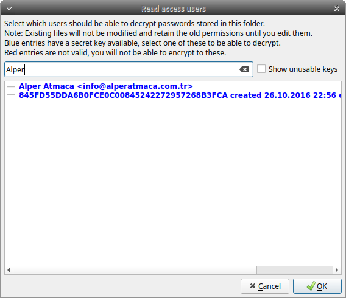

Anahtar seçiminizi yaptıktan sonra Pass'ın genel ayarları ile karşılanacaksınız. Burada yapmanız gereken en temel tercih hangi sistem araçlarını parola yöneticisi olarak kullanacağınız. QtPass pass kullanmak yerine yerel araçları da aynı amaçla özgüleyebilmekte. Fakat Pass bu tercihler arasında en sorunsuzu olacağından karşınıza gelen menüden Pass'ı seçmeniz önerilir.

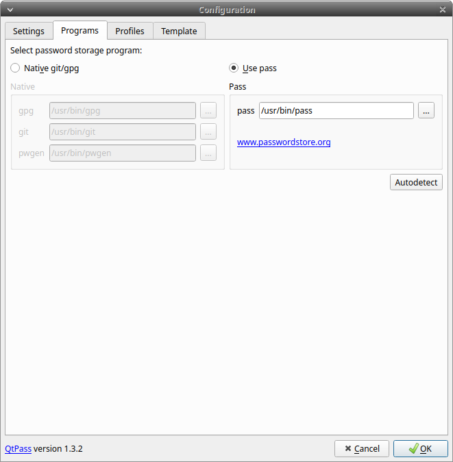

Aynı penceredenin `settings` kısmında QtPass'ın genel ayarlarını bulabilirsiniz. Burada gelen varsayılan ayarlar kullanılması en iyi seçenekleri ifade ediyor. Şayet parola üretiminden veya pano seçeneklerinden değiştirmek istedikleriniz var ise özel ihtiyaçlarınız için bu bölümden yapabilirsiniz. Buradaki önemli seçeneklerden bir tanesi `Git` seçeneği. Bu seçenek parolalarınızın bulunduğu dizini bir git reposu ile eşitlemeye yaramakta ve birden fazla cihaz ile eş olarak parolalarınızı kullanabilmenize imkan vermekte. Şayet parolalarınızı şifreli olarak uzak bir sunucuda tutmak konusunda tehdit modeliniz açısından bir sıkıntı yoksa bu seçenek en kolay eşitlemeyi size sağlayacaktır. Ayarları tamamlamanız üzere QtPass'ın ana ekranı karşınıza gelecektir.


Buradan parola dizininizde yeni dizinler açabilir ve bu dizinlere yeni parolalar ekleyebilirsiniz. Sağ üst sekmeden `+` simgesi bulunan sayfa düğmesinden yeni parola ekleyebilirsiniz. QtPass size ilk olarak parolanızı tutacak dosyanın adını soracaktır. Şayet buraya bir web hizmetinin parolasını kaydedecekseniz alan adında geçen bir kelimeyi yazmak tarayıcı eklentisinin otomatik olarak bu parolayı size önermesini sağlayacaktır.

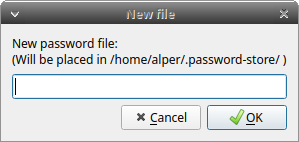

Oluşturacağınız parolayı ve diğer bilgileri girmek üzere karşınıza gelecek ekranda çeşitli kısımlar bulunmakta.

* __Parola:__ Bu bölüm bariz olduğu şekilde parolanızı içerecek. Buraya belirli bir parolayı elle girebileceğiniz gibi `Generate` düğmesi ile ayarlarda belirlediğiniz parametreler kapsamında rastgele bir parola oluşturmanız da mümkün.

* __Login:__ Bu bölüme parolanın girileceği hesaba ilişkin kullanıcı adını girebilirsiniz.

* __url:__ Şayet bir web hizmetinde kullanılacak ise bu parola tarayıcı eklentisinin giriş yapmak üzere takip edeceği URL'i buraya girebilirsiniz.

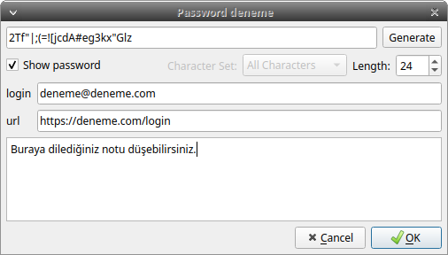

Parolayı kaydetmeniz üzerine parolanız verdiğiniz isimle birlikte ana ekranda yerini alacaktır. Üzerine tıkladığınızda QtPass size GPG parolanızı soracak ve başarılı bir şekilde girmeniz üzerine sağ tarafta parolaya ilişkin detaylar belirecektir.


### Passff Firefox tarayıcı eklentisi

Günümüz kullanıcılarının neredeyse tüm parolalarını bir web hizmeti için oluşturduğu düşünüldüğünde kullandığınız tarayıcıdan parola yöneticinize erişmeniz neredeyse bir gereklilik sayılmakta. [Passff](https://github.com/passff/passff#readme) bir firefox eklentisi olarak Pass ile birlikte çalışabilmekte. Bu eklentiyi kurmadan önce eklenti ile pass arasında iletişim için kullanılacak betiği indirip Firefox'a eklemeniz gerekiyor. Bunun için aşağıdaki komutu çalıştırabilirsiniz:

`curl -sSL github.com/passff/passff-host/releases/latest/download/install_host_app.sh | bash -s -- firefox`

İşlemin başarılı olması durumunda aşağıdaki çıktıyı alacaksınız. Şayet bir hata alırsanız sisteminizde `curl` ve `python` paketlerinin yüklü olduğundan emin olun.

```
Python 3 executable located at /usr/bin/python3
Pass executable located at /usr/bin/pass
Installing Firefox host config
Native messaging host for Firefox has been installed to /home/alper/.mozilla/native-messaging-hosts.
```

Host betiğini kurduktan sonra Firefox için [Passff](https://addons.mozilla.org/en-US/firefox/addon/passff/) eklentisini kurun. 

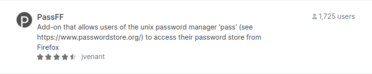

Kurulumun ardından Firefox çubuğunda yer alacak passff simgesinden parolalarınızı görebilir ve kullanabilirsiniz.

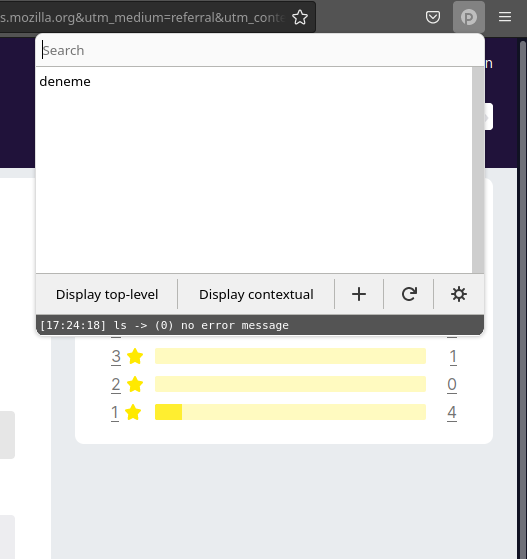

## Android

Pass'i Android'de kullanmak muhtemelen en kolay seçenek olabilir. Bunun için [Openkeychain](https://www.openkeychain.org/) yazılımını cihazınıza kurmuş ve GPG anahtarınızı kullanılabilir kılmış olmanız gerekli. Bunun için [GnuPG Anahtar Üretimi](/yazisma_guvenligi/gpg/gpg-anahtar-uretimi.md) rehberinden destek alabilirsiniz.

Pass'i kullanabilmek için [Password Store](https://github.com/zeapo/Android-Password-Store#readme) yazılımını cihazınıza kurmanız gerekli. Password Store'u [F-droid özgür yazılım deposunda](https://f-droid.org) bulabilirsiniz.

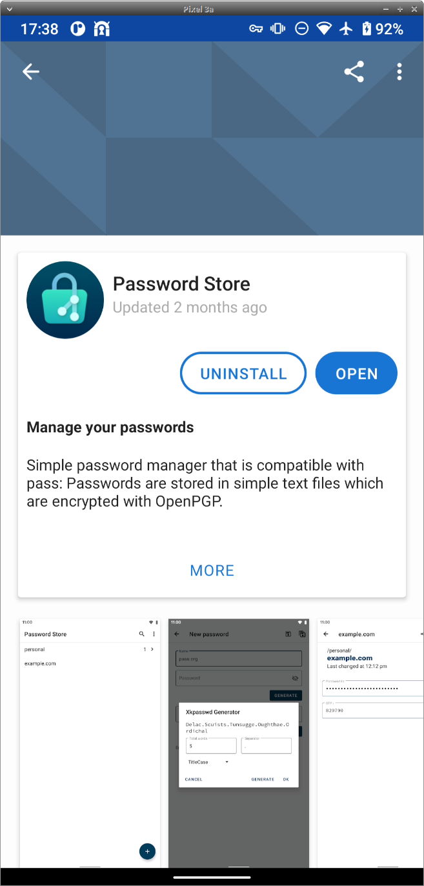

Kurulumun ardından Password Store sizi kurulum ekranı ile karşılayacaktır.

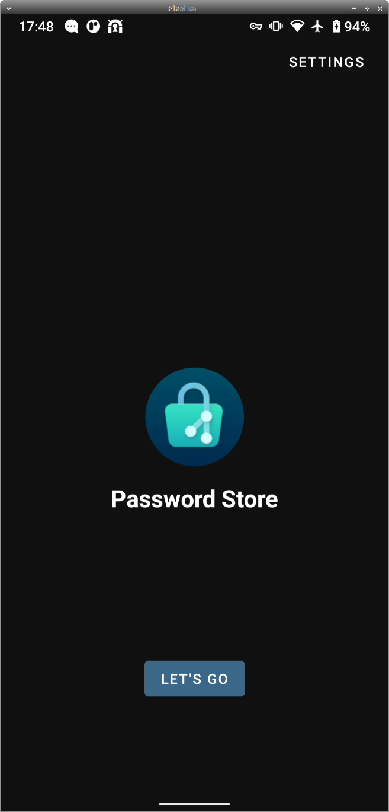

İlk yapmanız gereken tercih Password Store'u bir git reposu veya yerel bir dizin ile kullanıp kullanmayacağınız. Bu tercihi kendi kullanımınıza göre yapabilirsiniz. Bir git reposu sahibi değilseniz parolalarınızı yerelde tutmak için `create local repo` seçeneğini seçerek ilerleyin.

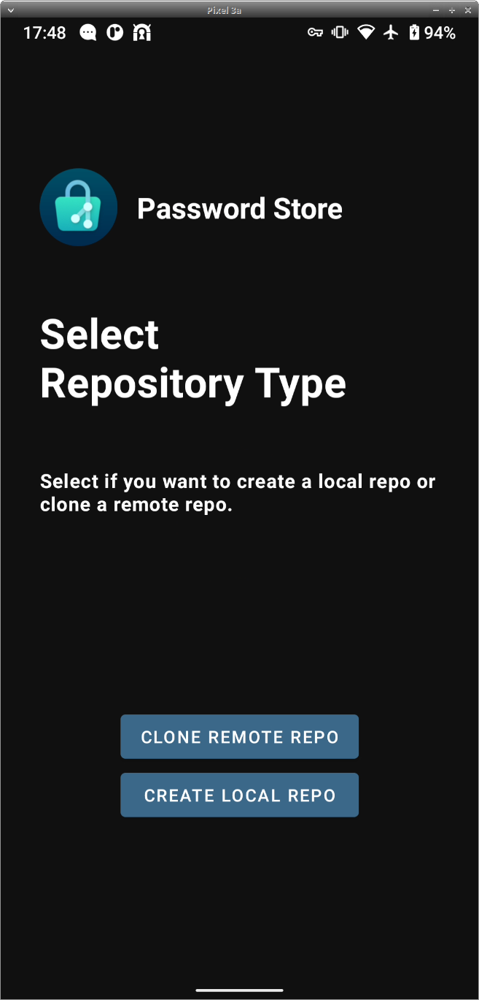

Ardından bu reponun gizli (hidden) mi yoksa açıkta (sd-card) mı olacağını seçmeniz gerekecek. Şayet gizli seçeneği ile ilerlerseniz Password Store kaydedeceğiniz parolaları kendi yetkisi kısıtlanmış alanda tutacaktır. Bu parolalarınızı eşitlemenizi neredeyse imkansız kılacağı gibi yedekleme seçeneklerinizi sadece Android'in kendi sistemine bırakacaktır şayet telefonunuza root erişiminiz yok ise. Şayet yerel depo ile devam edecekseniz önerimiz [Syncthing](https://syncthing.net) ile açık parola dizinini diğer cihazlarınıza eşitlemeniz olacaktır. Syncthing kullanımı için [eşitleme rehberimizden](cihaz_guvenligi/syncthing.md) faydalanabilirsiniz.

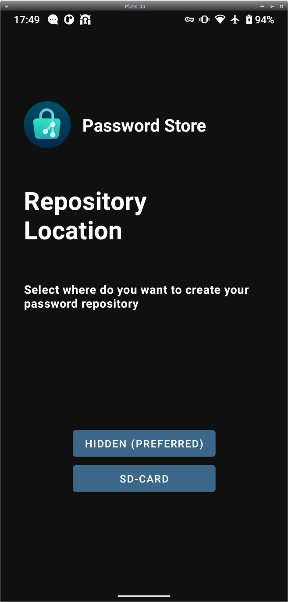

Password store sizi seçiminize ilişkin bir uyarı ile karşılayacak ve ardından parolalarınızın tutulacağı dizini seçmeniz için sizi varsayılan dosya yöneticinize yönlendirecektir.

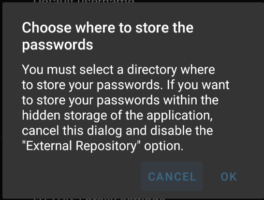
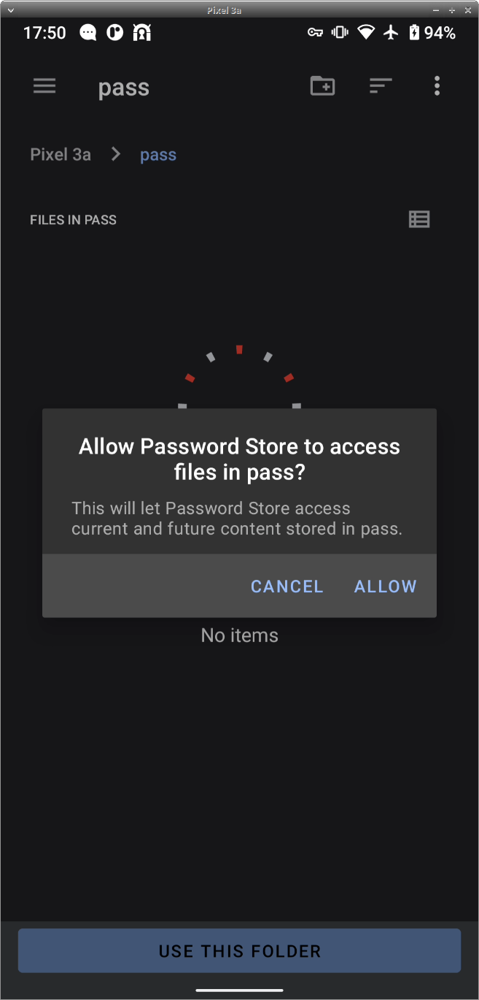

Parolalarınızın duracağı dizini belirledikten sonra ikinci önemli ayar olarak parolalarınızın şifreleneceği GPG anahtarını belirlemeniz gerekiyor. Bu noktada Password Store sizi Openkeychain'e yönlendirecek ve kullanacağınız anahtarı seçmenizi isteyecektir.

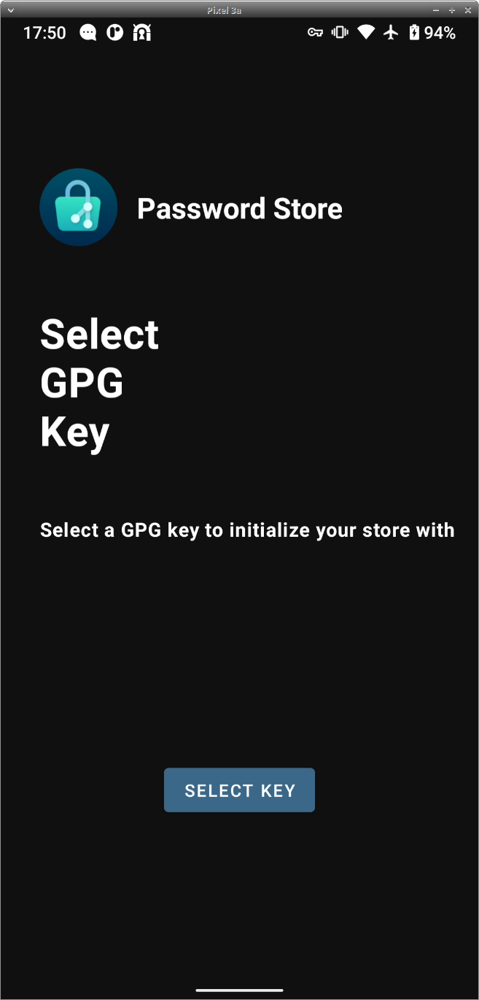
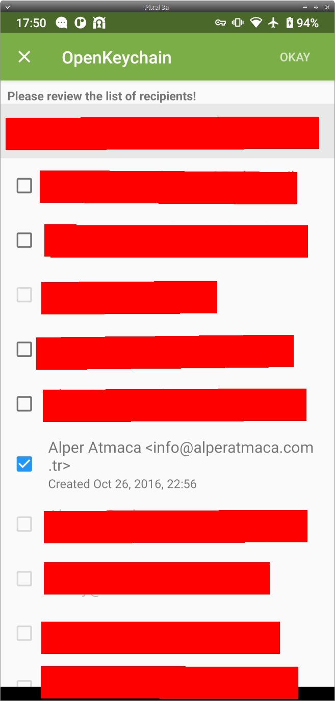

Anahtarınızı belirlemenizin ardından Password Store sizi ana ekranı ile karşılayacaktır. Şayet parolalarınızı bilgisayarınızdan yerel dizine aldıysanız parolalarınız burada listeli olacaktır. Aksi halde ilk parolanızı oluşturmak için alt sağ tarafta bulunan `+` simgesine basarak `yeni parola` seçeneğini seçebilirsiniz.

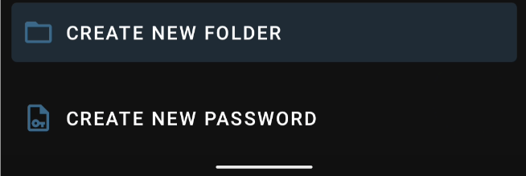
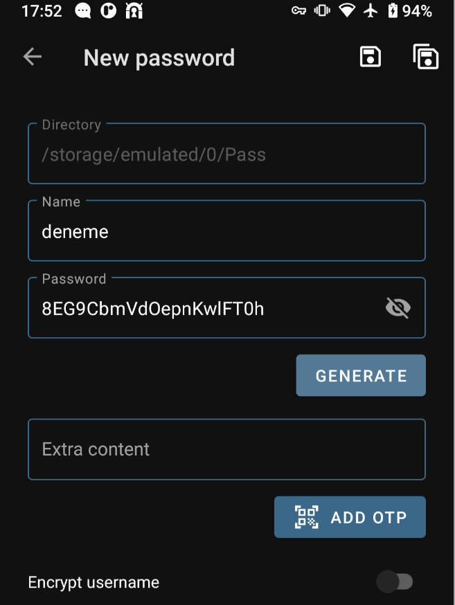

Yeni bir parola üretmek için `Generate` düğmesini kullanıp karşınıza gelecek seçeneklerden parolanızın gerekli olan niteliklerini seçerek ilerleyebilirsiniz.

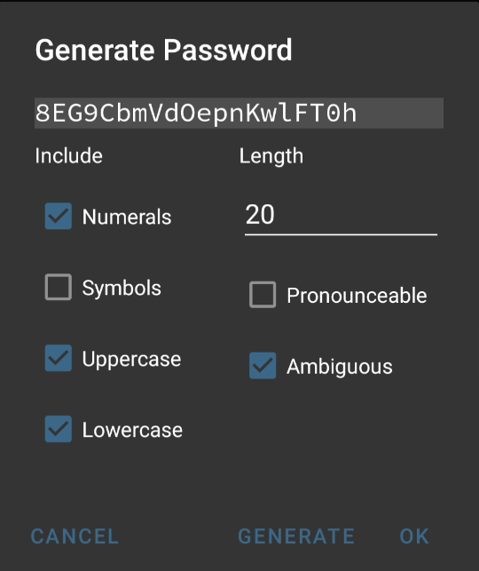

Şayet her şey yolunda gittiyse ilk ürettiğiniz parola listede yerini alacaktır.

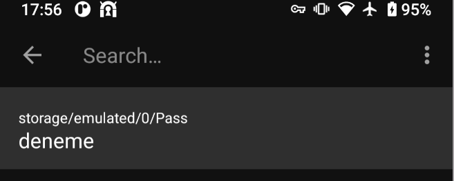

Parolanızı kullanmak üzere üzerine dokunduğunuzda, Password Store dosyanın deşifresi için Openkeychain'e istek gönderecek ve daha önce parolanızı girip hafızaya almadığınız durumda GPG anahtarınızın parolasını soracaktır. GPG anahtarınızın başarılı işleminden sonra parolanız kopyalanarak kullanımınıza sunulur.

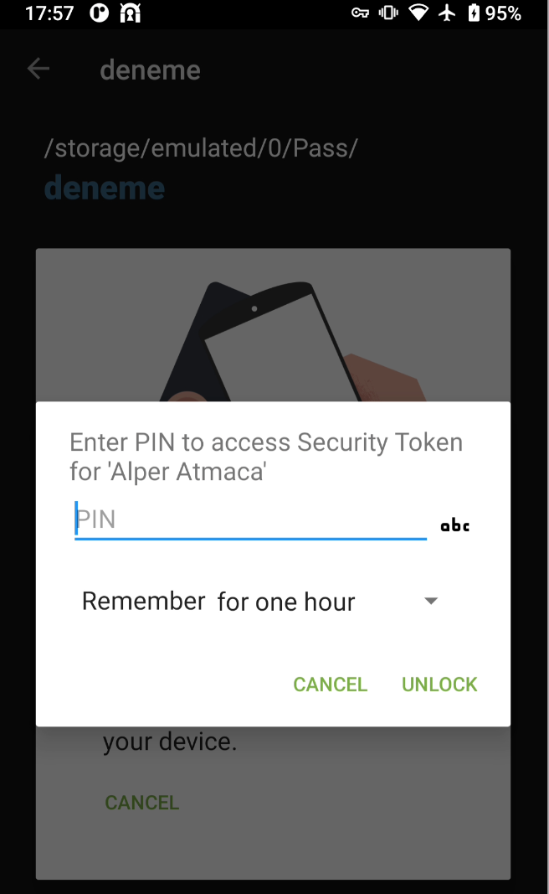

Şayet Android işletim sisteminiz ile Password Store'u birleşik bir şekilde kullanmak isterseniz Android 11 ile birlikte gelen `Autofill` imkanından yararlanabilirsiniz. Bunun için cihazınızın ayarlarından `settings > system > Languages & input > Autofill service` sırasını takip ederek Password Store'a buradan yetki verebilirsiniz. Bu ayarı yaptığınızda Android'in parola girilmesi gerektiğini düşündüğü her yerde buna ilişkin olarak Password Store'dan uygun isimli parolayı doğrudan çekip doldurması mümkün olacaktır.

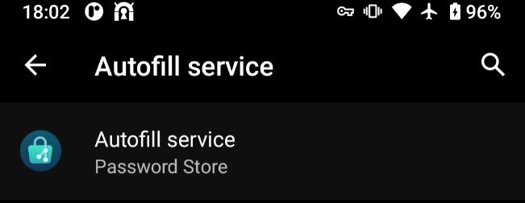
