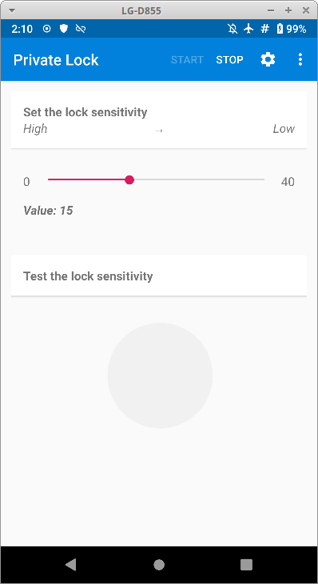
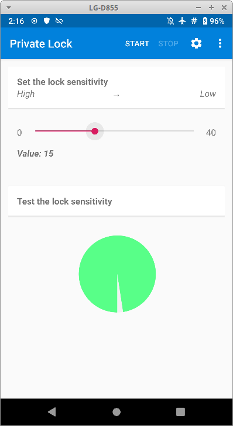
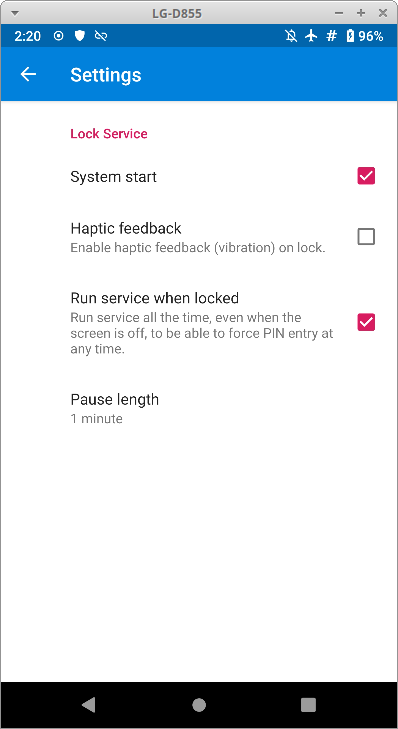

# Private Lock ile Kapkaç Önlemi

Günümüzde neredeyse yaşam zorunluluğu haline gelmiş mobil cihazlardan olan akıllı telefonlar, en önemli verilerimizi tuttuğumuz araçlar konumundalar. Bu durum söz konusu cihazları ciddi bir mahremiyet ve güvenlik riski haline de getirmekte.

Mobil cihazlar, çalınma ve kaybolma riski içinde kullanıldıklarından [şifreleme](cihaz_guvenligi/cihaz_sifreleme.md) neredeyse zaruri bir güvenlik tedbiri. Lakin bilgisayarlara nazaran mobil cihazlar neredeyse hiç kapatılmadığından şifreleme anahtarları sürekli olarak RAM üzerinde durmakta ve ekran kilidinin açık olduğu her an cihazın içeriğindeki neredeyse tüm bilgiler cihazı elinde tutanın insafına kalmakta.

Bu tehlikenin gerçekleşme riski teorik bir tartışma değil. [Birleşik Krallık'ta bir polis teşkilatı yasal olarak bir zanlıya kapkaç yaparak](https://www.bbc.com/news/uk-38183819) söz konusu imkanın gerçek hayatta kullanımının mümkün olduğunu herkse göstermiş bulunuyor. Buna telefonu elinizden alıp akla hayale gelmeyecek şeyler yapabilecek yakınlarınız ve arkadaşlarınızı da eklerseniz konuya karşı tedbir almak yerinde görülebilir.

## Private Lock

[Private Lock](https://github.com/wesaphzt/privatelock) [F-droid](https://f-droid.org) yazılım deposunda bulunabilecek özgür bir yazılım olarak cihazınızın elinizden kapılması veya düşürülmesi gibi ani hızlanmalarda ekranını kitleyerek güvenlik sağlıyor.

Öncelikle F-droid üzeriden Private Lock uygulamasını indirerek cihazınıza kurun ve çalıştırın. Kısa bir tanıtımın ardından aşağıdaki basit ekran ile karşılaşacaksınız.

Private Lock fazlasıyla basit bir yazılım. 0-40 arasında derecelendirilen değer cihazınızdaki jiroskop sensörüne bağlı olarak hangi kuvvetlerde cihazınızın kilitleneceğini belirlemekte. Hemen altta bulunan dairede ise cihazınızın sensöründen o anda gelen tepkinin değeri verilmekte. Dairenin tamamen yeşil olması durumunda telefonunuz kilitlenmekte. 0 ile 40 arasındaki dereceyi ayarlayarak telefonunuzun içine düşebileceği fiziki koşulları deneme yolu ile uygun ayarı bulmanız gerekli. Bir arkadaşınızdan telefonu elinizden olabildiğince nazik şekilde habersiz kapmasını isteyin. Telefonunuz kilitleninceye kadar ayarı uygun şekilde düzenleyin.

**NOT:**Ayarı çok düşük yapmanız durumunda olağan kullanımlar sırasında da can sıkıcı kilitlenmelerle karşılaşabilirsiniz.

## Ayarlar

Private Lock çok karmaşık işlevler sunan bir yazılım olmadığından ayarlar bölümünd sadece dört tane seçene bulabilirsiniz.

* **System start**: Cihazınız açıldığında Private Lock'ın başlamasını sağlayacaktır.

* **Haptic feedback**: Cihazınızın kilitlendiğini bir titreşim ile size bildirilmesini sağlar.

* **Run service when locked**: Ekran kilidi devrede iken de kilitleme işlevinin etkin olmasını sağlayarak ekran kilidini her an devreye sokulmasını sağlar.

Ayarları dilediğiniz gibi yapabilirsiniz. Tavsiyemiz "system start" ile "run service when locked" seçeneklerinin işaretli olmasıdır.

## Dikkat edilmesi gerekenler

1. Private Lock kusursuz değildir. Kimi zaman istenmeyen zamanlarda kilitleme yapabileceğinden bununla biraz yaşamanız gereklidir.

2. Aynı sebepten Private Lock gerçekten gerektiğinde çalışmayabilir. Keza jiroskop her zaman doğru değer ölçemediği gibi yaşanan kapkaç olayının şiddeti duruma etki edecektir. Bu özellikle ayarın gereğinden yüksek yapıldığı durumlar için geçerlidir.

3. Private Lock sürekli olarak jiroskop sensörünü dinleyeceği için cihazınızın şarjından bir miktar tüketecektir. Kullanılan cihazlarda bu belirgin olmamakla birlikte dikkat edilmesi gerekebilir.

