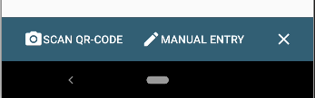
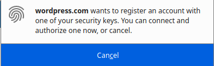

# Yubikey ile 2FA Kurulumu

[Yubikey](https://yubico.com) çok amaçlı kriptografik bir güvenlik anahtarıdır. Günümüzde en yaygın kullanılan cihaz olmakla pek çok hizmet tarafından desteklenmekte ve fazlasıyla kullanım alanı bulmakta. Yubikey Neo'dan sonra özgür donanımları terk eden Yubico artık özel mülk sistemler üretmekte ve bu konuda bir [açıklamaları bulunmakta.](https://www.yubico.com/blog/secure-hardware-vs-open-source/)

Yubikey'in en yaygın kullanımlarından biri çevrimiçi hizmetlerde ikinci faktör olarak kullanımıdır. Bu amaçla Yubikey'ler birden fazla sistemi desteklemektedir.

* [TOTP](https://en.wikipedia.org/wiki/Time-based_One-time_Password_Algorithm): En yaygın kullanılan 2FA sistemi olarak zamana dayalı 6 haneli kod üretimine dayanır. Bu sistem [akıllı mobil cihazlarda](andotp.md) kullanabildiği gibi Yubikey üzerinde de kullanılabilmekte.

* FIDO U2F: [FIDO U2F](https://www.yubico.com/authentication-standards/fido-u2f/) Yubico ile Google tarafından geliştirilmiş bir 2FA teknolojisidir. Pek çok servis tarafından desteklenmekle, Yubikey üzerindeki sabit bir kriptografik anahtarın hizmetlere tanıtılması ile anahtarın kullanıldığı cihazlardan tek tıklama ile giriş imkanı sağlar.

* OTP: Yubikey'in sahip olduğu özel anahtara bağlı olarak usb üzerinden klavye gibi cihaza yazdırdığı bir kod aracılığı ile kullanılan 2FA uygulaması. Yubikey sunucusu tarafından doğrulama yapılması ile kullanılmakta fakat son kullanıcı için çok yeri olduğu söylenemez.

## Yubikey 2FA Tercihi

Hangi sistemi kullanacağınızın tercihi çoğunlukla size değil hizmet aldığınız şirkete kalmakta. Bu bakımdan hala çoğunluktaki hizmet sağlayıcıların 2FA desteklemediği öngörülürse destekleyen hizmetlerin tercihi hangi yöndeyse o imkanı kullanmanız biraz zorunlu gibi.

Bu bakımdan en çok kullanılan sistem TOTP olmakta. Keza hem akıllı mobil cihazlarda hem de Yubikey gibi kriptografik donanımlarda kullanılabildiğinden yaygın erişim imkanı hizmet sağlayıcılar için kullanımını makul kılmakta. Bugün neredeyse herkes bir çeşit mobil cihaz sahibi olduğundan [soft token](https://en.wikipedia.org/wiki/Software_token) kullanımı yaygın. Yubikey ile söz konusu kullanımı daha güvenli gerçekleştirmeniz mümkün.

U2F ise daha yeni bir teknoloji olmakla birlikte yaygınlık kazanmakla birlikte daha seyrek görülen bir sistem. Kurulumu ve kullanımı OTP'ye göre çok daha kolay olmakla birlikte özel bir donanım gerektirmesi yaygınlığını etkilemekte. Aynı zamanda giriş için kullanılan donanıma kesin suretle bağlı bir anahtarı kullandığından hem daha güvenli hem de yedekleme yapamadığınızdan kaybetmeniz durumunda sıkıntı doğurabilmekte.

## TOTP kurulumu

### Bilgisayar üzerinden

#### Uçbirim ve Ykman ile

Bilgisayar üzerinden Yubikey ile OTP kullanımınını hem uçbirimden hem de grafik arayüz üzerinden gerçekleştirmek mümkün. Gerekli işlemleri yerine getirebilmek için aşağıdaki komut ile bilgisayarınıza ihtiyaç duyulacak yazılımları yükleyebilirsiniz:

Debian : `sudo apt-get install yubikey-manager yubikey-personalization yubikey-personalization-gui`

RPM : `sudo yum install yubikey-manager yubikey-personalization yubikey-personalization-gui`

Gerekli yazılımları elde ettikten sonra OTP kullanacağınız hizmetin ayarlarına gelip muhtemelen `güvenlik` adı altında bulacağınız çift aşamalı yetkilendirme (Two Factor authentication veya 2FA) bölümüne gelip söz konusu güvenlik tedbirini etkinleştirin. Bu rehberde [Protonmail](/yazisma_guvenligi/protonmail.md) kullanılmıştır.

OTP soft token olarak mobil cihazlarda kullanılması düşünüldüğünden bir karekod şeklinde hizmet sağlayıcı tarafından sunulacaktır. Bu karekod aslında paylaşılan sırrı ve süre ile kritopgrafik ayarlara ilişkin detaylar içermekte. Bu bilgileri elle de girmek mümkün ki bilgisayarda bu şekilde yapılması gerekli. Elle giriş seçeneğini seçerek gerekli detaylara ulaşabilirsiniz.


`ykman` Yubikey'leri uçbirimden kullanmaya ve programlamaya yaran bir yazılım. Bu yazılım ile hizmet sağlayıcı tarafından verilen bilgileri cihaza işlenebilmekte. Bunun için aşağıdaki komutu kullanabilirsiniz.

`ykman oath add [token'e vermek istediğiniz isim]`

Uçbirim sizden hizmet sağlayıcının verdiği sırrı isteyecektir. Bunu girmeniz üzerine OTP token Yubikey'e eklenir.

```
Enter a secret key (base32):AUVROVQ4NDQGYRNC56WBTUKAYELPP43V
```
Yukarıdaki seçenek en yaygın kabul gören standartları kullandığından çoğu ayarı varsayılan olarak kabul eder. Bu bakımdan bir OTP token ile ilgili daha fazla ayarı özelleştrmeniz gerekiyor ise `ykman oath -h` ile girilebilecek parametrelere bakabilirsiniz. Lakin aşağıdaki komut çoğu koşulda kullanım ihtiyacına yetecektir.

`ykman oath add --digits [kaç haneli kod üretilecek 6|7|8] ---issuer [hizmet sağlayıcının adı] --period [kaç saniyelik kod üretilecek] [token'e vermek istediğiniz isim]`

Örnekle Protonmail'dan guvenlik@protonmail.com e-postası için OTP ayarlarını yapıldığı varsayılır ise:

`ykman oath add --digits 6 --issuer Protonmail --period 30 guvenlik`

Şayet Yubikey'in kod üretmeden önce düğmesine basılmasını bir güvenlik ihtiyacı olarak isterseniz komutu `-t` parametresi ile verebilirsiniz. Böylece bilgisayarınıza takılı durumda Yubikey'den kod istendiğinde Yubikey sizden onay isteyecektir. Bu cihazdaki her yazılımın siz farkına varmadan kod talep edebilmesinin önüne geçer.

Şayet OTP kodlarınızın Yubikey'i eline geçirenlerde sorunsuzce elde edilmesinin önüne geçmek isterseniz bir pin ile koruma altına alabilirsiniz. Bunun için aşağıdaki komutu kullanıp pin belirleyebilirsiniz.

`ykman oath set-password`

Parola/pin'inizi iki kere girdikten sonra yubikey'den otp token almak için bu bilgiyi sunmanız gerekecektir. Dilerseniz güvendiğiniz cihazlarda bu parolanın hatırlanmasını sağlayabilirsiniz. Bilgisayarınızda bunun için aşağıdaki komutu çalıştırıp pin/parolanızı girin.

`ykman oath remember-password`

Token'i cihaza yazabildiğinizden emin olmak ve kod almak için aşağıdaki komutları kullanabilirsiniz:

Tüm token'ları almak için: `ykman oath code`

Belirli bir token'ı almak için: `ykman oath code [token adı]`

Token'i başarılı şekilde üretebildikten sonra kullandığınız hizmet sağlayıcı sizden her şeyin yolunda olduğunu doğrulamak adına parolanızı ve ilgili token'in geçerli bir çıktısını isteyecektir.


İşlemin başarılı olmasının ertesinde hizmet sağlayıcınız tarafından bir miktar tek kullanımlık parola oluşturulup size sunulacaktır. Bu kodlar OTP olmadan giriş imkanı sağlacığından **dikkatli saklanmalıdır**. Bu kodlar ile şayet cihazınıza erişiminizi kaybederseniz hesabınıza erişim imkanı tanımaktadır. Bunları yazdırıp **güvenli bir yerde** saklamanız önerilir.


#### Grafik arayüz ile

[Bu bölüme katkı verebilirsiniz.](https://git.oyd.org.tr/oyd/guvenlik)

### Mobil cihaz ve NFC ile

İşin gerçeği mobil cihazlarla Yubikey'e OTP kurulumu çok daha kolay gerçekleşiyor. Bu özellikten mobil cihazlarda yararlanmak için Yubikey'inizin NFC desteklemesi veya doğrudan USB portundan cihazınıza bağlanması gerekli. 

OTP kullanımı için cihazınızda [Yubico Authenticator](https://f-droid.org/en/packages/com.yubico.yubioath/) yazılımının yüklü olması gerekli. [F-droid](https://f-droid.org) özgür yazılım deposundan ilgili yazılımı elde edebilirsiniz.


Alt kısımda bulunan `+` simgesine basarak yeni bir token eklemek üzere işleme başlayabilirsiniz. Yubico Authenticator size karekod okutmak veya bilgileri elle girmek üzere iki seçenek sunacaktır. Çoğunlukla bir karekod size sunulacağıdan ilgili seçenek ile işleme devam edin.



Karekodu okutmanız üzerine gerekli bilgiler ekrana doldurulup karşınıza çıkarılacaktır.


`Save` demeniz üzerine yazılım sizden Yubikey'i cihaza okutmanızı isteyecektir.


Şayet Yubikey OTP modülü pin ile korunuyorsa pin girişi talep edilip tekrar yubikey'i okutmanızın ardından token eklenmesi tamamlanacaktır.


Yubikey'inizi cihaza her okuttuğunuzda Yubico Authenticator çalışacak ve size kayıtlı olan OTP kodlarını verecektir.


## U2F kurulumu

FIDO U2F tarayıcı temelli bir yetkilendirme sistemi. Kurulumu kolay olmakla birlikte ileriki zamanlarda bu durum değişebilecek olmakla birlikte daha az hizmet tarafından desteklenmekte. U2F kurulumu destekleyen bir hizmete Yubikey kurulumu yapmak çok basit. Güvenlik ayarlarında güvenlik anahtarı (security token) başlıklı bir bölüm bulunuyor ise Yubikey ile U2F kurulumu yapabilirsiniz.


Kurulumu başlattıktan sonra çeşitli şekillerde sizden Yubikey'inizi bağlamanız ve dokunarak etkinleştirmeniz istenecektir. Bu noktada Firefox size sitenin yetkilendirme talep ettiğine dair bir uyarı çıkaracaktır.




Kaydın başarılı olması üzerine hesabınıza anahtarınız tanımlanacaktır.

Bu durumda kaydettiğiniz yubikey'in kaybolması durumunda **hesabınıza erişemez** hale gelebilirsiniz. Bu neden ile ikinci bir güvenlik tedbirini daha kaydederek bu duruma engel olmanız mümkün. Bunun için [Akıllı cihaz üzerinden OTP kullanımını](andotp.png) tavsiye ederiz.

Yubikey'de U2F yetkilendirmesine pin veya parola ile tedbir koyulamamakta. Bu nedenle Yubikey'inizi elinde bulunduran biri herhangi bir sorun çekmeden ikinci faktör olarak cihazınızı kullanabilir. Bu sebepten **Yubikey'inizi iyi korumanız önerilir.** Bu tehdit modeli sizin için geçerli ise Yubikey ile TOTP OTP kullanımı pin ile korunabildiğinden daha güvenli olacaktır.
