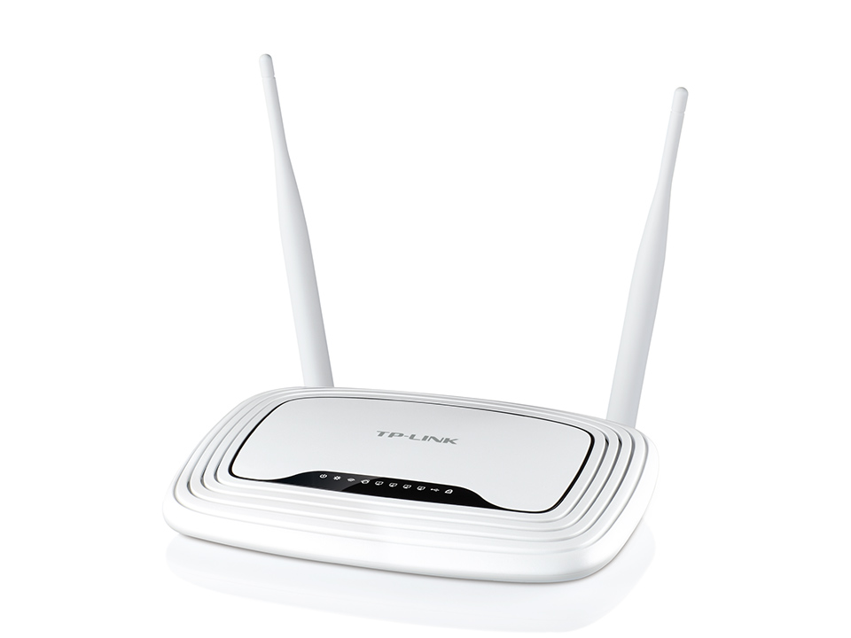
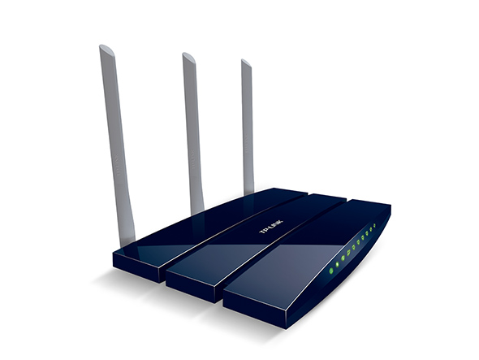
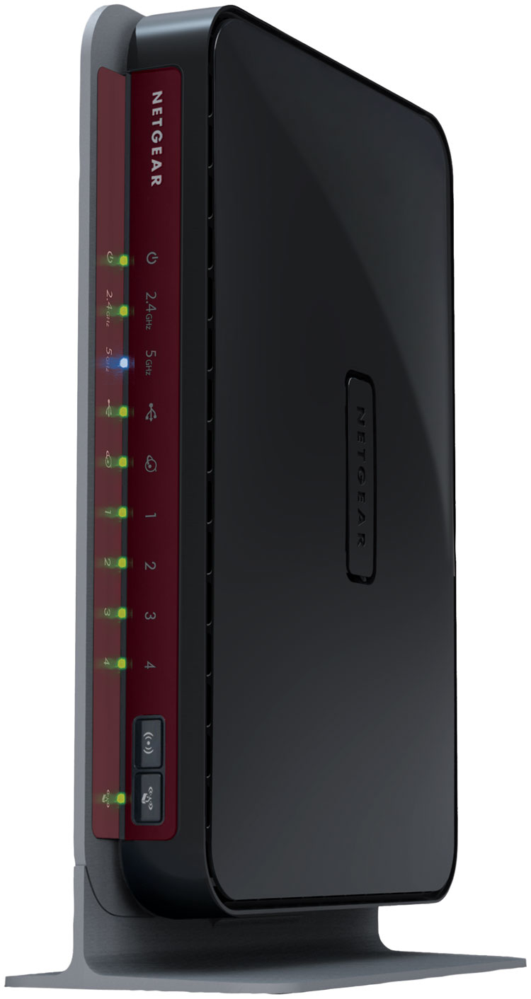
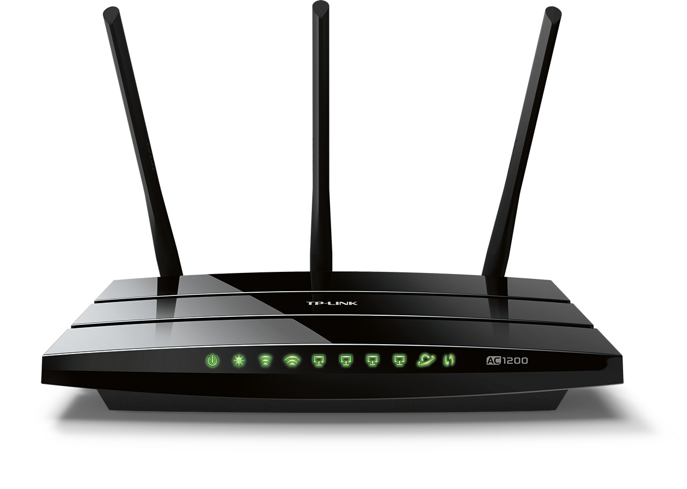
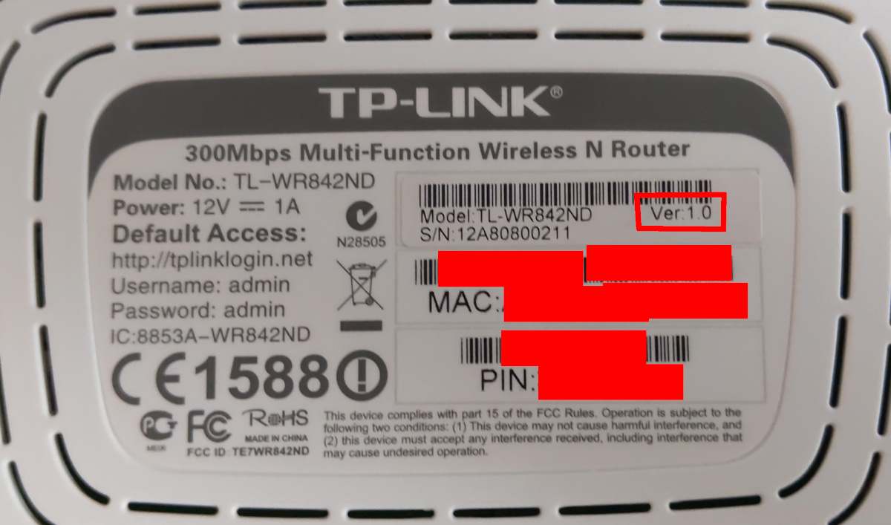
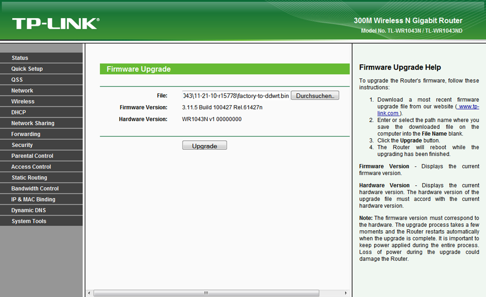
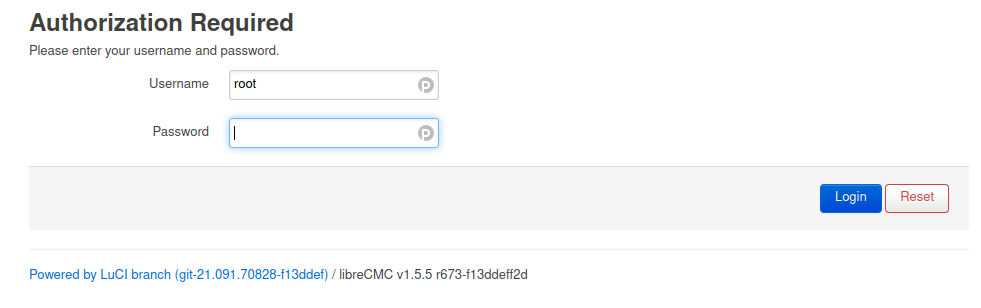
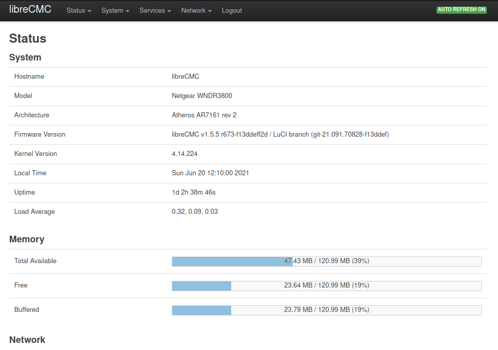

# Özgür Yönlendirici Kurulumu

İnternet erişiminizin ve ağınızın temel yöneticisi olan bu küçük bilgisayarların özgürlüğü diğer donanımlarınızınki kadar önemlidir. Günümüzde yönlendiricilerin güvenliği hem kullanıcıları hem de üreticileri tarafından hep ikincil görülmekte. Yaşam alanlarımızın köşesinde unutulan bu küçük kutular çoğunlukla almadıkları güncellemeler veya yanlış yapılandırmalar ile pek çok güvenlik açığına yol açmaktadır.

Türkiye'de hala DSL çağı sürmekte olduğundan pek çok insan ya internet servis sağlayıcısının sunduğu çoğu zaman kesinlikle güvenlik açığı sayılacak uzaktan erişim imkanı taşıyan modem/yönlendirici birleşimi cihazları kullanmakta. Bu makineler taşıdıkları özgür olmayan modem bileşenleri nedeni ile özgürleştirilememekte ve bir güvenlik sorunu olarak varlıklarını sürdürmekte.

Bu modem cihazlarından fiberoptik bağlantılarının yaygınlaşması ile kurtulanacak olsa da şu anda hala yaygın olarak kullanılan VDSL modemlere bağımlılık bir süre daha süreceğinden bir ev ağını güvenli ve özgür kılmanın en kolay yolu modemin arkasına bir özgür yönlendirici kurarak bu cihaz ile ev ağını oluşturmaktan geçmekte. Bunun için özgür yazılım kurulabilecek bir yönlendiriciye ve seçeceğiniz bir dağıtıma ihtiyaç olacak.

## LibreCMC ve OpenWRT

Bugün yönlendiriciniz için seçebileceğiniz çeşitli firmware seçenekleri mevcut. Bunların pek çoğu artık üreticilerin desteklemediği ve güncellemediği cihazlara yeni özellikler kazandırmak için yapılan çalışmalar. Söz konusu firmware'ler destekledikleri cihazların kullandığı çip setine bağlı olarak kimi zaman zorunluluktan kimi zaman da bu konuda bir tercihleri olmadığından özgür olmayan ve hali ile kaynak kodu belirli olmayan bileşenleri dahil etmekteler. Her bilgisayardaki özgür olmayan yazılımların getirdiği bilinmezlik gibi yönlendiricinizdeki bu özgür olmayan kodlarda güvenliğiniz için bir şüphe oluşturacaktır.

Bu bakımdan elinizdeki cihaza göre tavsiye edilebilecek iki firmware bulunmakta. Bunlardan en önemlisi tamamen özgür yazılım olan [LibreCMC](https://librecmc.org) projesi. Çip seti özgür yazılımlarla kullanılabilen bir grup cihazda çalışan bu firmware'i denemek için desteklenen bir cihazı edinmeniz yeterli. Şayet yeni bir cihaz edinmek bir seçenek değil ise elinizdeki yönlendiricinin [OpenWRT](https://openwrt.org) desteklemesi durumunda olabilecek en özgür sisteme yine sahip olabilirsiniz.

## Özgür yönlendirici seçimi

LibreCMC'nin resmen [desteklediği donanımlardan](https://librecmc.org/fossil/librecmc/wiki?name=Supported_Hardware) haricen [indirme sayfasında](https://librecmc.org/librecmc/downloads/snapshots/v1.5.0a/targets/ath79/generic/) bulunan gayriresmi desklenen cihazlardan birini de seçebilirsiniz. Tavsiye edeceğimiz cihazlar ve özellikleri şu şekilde

* [__TP-Link TL-842ND__](https://librecmc.org/fossil/librecmc/wiki?name=TL_WR842ND)

	- TP-Link TL-842 N veya ND modeli güncel ihtiyaçları karşılayabilecek en düşük kaynak sahibi cihaz. Bir yönlendiriciye sadece en temel özellikleri için ihtiyacınız olmadığı sürece daha üst modellerden birini seçmeniz önerilir.



* [__TP-Link TL-WR1043ND__](https://librecmc.org/fossil/librecmc/wiki?name=TL_WR1043ND)

	- TP_Link TL-1043ND görece kabil bir cihaz olarak bugünün ihtiyaçlarını karşılayabilecek konumda. 5. sürümüne kadar LibreCMC tarafından desteklenmekle birlikte 4. ve 5. sürümlerinin kurulumu için özel ve görece karmaşık süreçler gerekebilmekte. Bu sebepten daha az Flash ROM sahibi olmalarına rağmen önceki sürümleri tercih edilebilir.



* [__Netgear WNDR3800__](https://librecmc.org/fossil/librecmc/wiki?name=WNDR3800)

	- Netgear WNDR3800 LibreCMC'nin resmi olarak desteklediği en güçlü cihaz. Harici anteni olmasa da fazlasıyla iyi kablosuz bağlantı sunmakta ve sahip olduğu fazladan ROM ile yeni yazılımların kurulması için yeterince yere sahip. Türkiye'de bu cihazı bulmak fazlasıyla zor fakat şansınız ve vaktiniz varsa bulduğunuzda kaçırmamanızı öneririz.



* [__TP-Link Archer-C5 ve C7__](https://librecmc.org/librecmc/downloads/snapshots/v1.5.0a/targets/ath79/generic/)

	- LibreCMC yüklenebilecek en güncel cihazlar TP-Link'in Archer serisinin C5 ve C7 modelleri. Bu cihazlar LibreCMC tarafından resmen desteklenmemekte fakat depoda kurulum için gerekli dosyalar bulunmakta. Şayet modern bir yönlendiriciye ihtiyacınız var ise C5 ve C7'yi değerlendirebilirsiniz.



## LibreCMC Kurulumu

### LibreCMC imajını indirin

Seçeceğiniz bir yönlendiriciye LibreCMC kurmak çok kolay bir işlem. Bunun için öncelikle [desteklenen cihazlar](https://librecmc.org/fossil/librecmc/wiki?name=Supported_Hardware) sayfasına gidip elinizdeki cihazın sayfasına girip en altta cihaz sürümüne uygun imajı seçmeniz gerekli. Cihazınızın model numarası ile birlikte versiyonunu da altındaki etikette bulabilirsiniz.



İlk defa üreticinin varsayılan firmware'i yüklü cihaza kurulum yapacaksanız `Factory` ismi ile geçen imajı indirmeniz gerekli. Şayet hali hazırda LibreCMC yüklü bir cihazı güncellemek isterseniz bunun için `Sysupgrade` imajını indirip yüklemeniz gerekecek. `Main` ile `Core` imajlar arasındaki fark cihaza bir grafik arayüz ve asgari yazılımdan fazlasının yüklenip yüklenmemesi. Muhtemelen cihazınızı kullanmak için bir arayüz isteyeceğinizden `Main` imajı tercih etmeniz önerilir.

### LibreCMC imajını doğrulayın

İlgili imajı indirdikten sonra indirdiğiniz imajı doğrulamanız gerekiyor. bunun için her cihazın sayfasının altında hem de imaj reposunda GPG imza dosyaları ile özüt değeler bulunmakta. Doğrulamayı yapmak için `sha256sums` dosyası ile imzayı taşıyan `sha256sums.asc` dosyalarını indirmeniz gerekiyor. Bunun ardından imza denetimi için LibreCMC projesinin GPG anahtarına ihtiyacınız olacak. Tüm imajlar projenin yöneticisi [Robert Call'un DE0A 8D01 5F03 409C F11D AE55 979B 9775 C7D8 655C parmak izine sahip GPG anahtarı](https://librecmc.org/contact.html) ile imzalı. GPG anahtarı nedir imza denetlemesi nasıl yapılır sorularına yanıt bulmak için [GPG rehberine](/yazisma_guvenligi/gpg/gpg.md) başvurabilirsiniz. GPG anahtarını indirip `sha256sums` dosyasının doğruladıktan sonra imajı doğrulamak için `sha256sums` ile imaj dosyasının bir arada durduğu dizinde uçbirimde aşağıdaki komutu çalıştırarak doğrulamayı yapabilirsiniz.

`sha256sum --ignore-missing -c sha256sums`

Komut şayet imza doğru ise aşağıdaki şekilde bir çıktıyı size verecektir:

```
librecmc-ath79-generic-tplink_tl-wr1043nd-v1-squashfs-factory.bin: OK
librecmc-ath79-generic-tplink_tl-wr1043nd-v2-squashfs-sysupgrade.bin: OK
```

### Doğrulanan imajı yükleyin

İmajı indirip doğruladıktan sonra imajı cihaza yükleyebilirsiniz. Bunun için öncelikli olarak yönlendiricinin yönetim paneline erişmeniz gerekiyor. Bunun için bilgisayarınızla yönlendiriciye bağlanmanız gerekiyor. Bunun en kesin yolu bilgisayarınızdan kablo ile LAN portlarından birine bağlanmaktır. Bunun ardından şayet cihazın IP adresi değiştirilmediyse tarayıcınızın adres çubuğna `192.168.1.1` yazarak ilerlediğinizde yönlendiricinin arayüzüne erişebilirsiniz. Panelden ayarlara ulaşmak için kullanıcı adı ve parolayı girmeniz gerekecektir. Şayet cihaz yeni veya sıfırlandı ise standart bilgileri kullanabilirsiniz. Bu bilgiler üreticiden üreticiye değişmekte.

Ayarlara eriştikten sonra sağda bulunan menüden `system tools` sekmesine girip `firmware update` seçeneğini seçin. Ardından imaj dosyasını `File` bölümünden gösterip `Upgrade` düğmesine basarak yükleme işini başlatın. Bir yükleme ekranı ardından yönlendiricinin bağlantısı kesilecek ve ışıkları yanıp sönecektir. Kurulum işlemi tamamlandıktan sonra LibreCMC başlayacaktır.



LibreCMC'nin yönetici paneline ulaşmak için `192.168.10.1` adresine girip kullanıcı adı olarak `root` girip parolayı da boş bırakarak arayüze giriş yapabilirsiniz. 	






