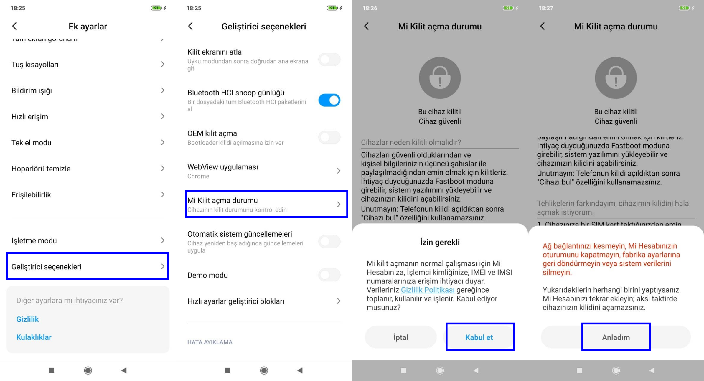
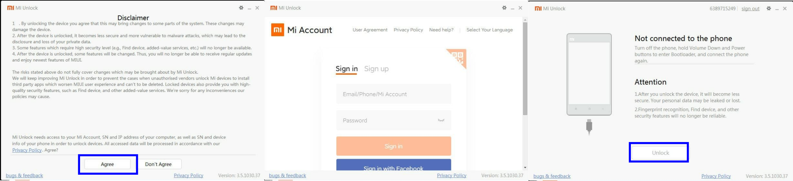
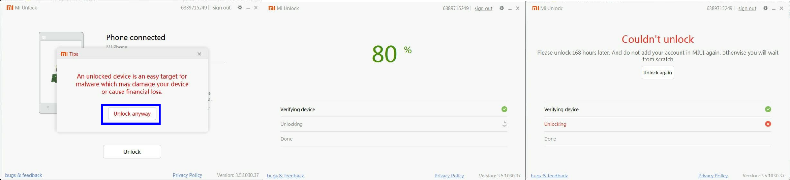
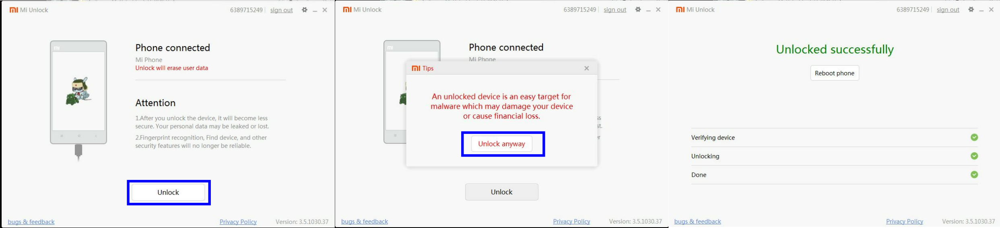
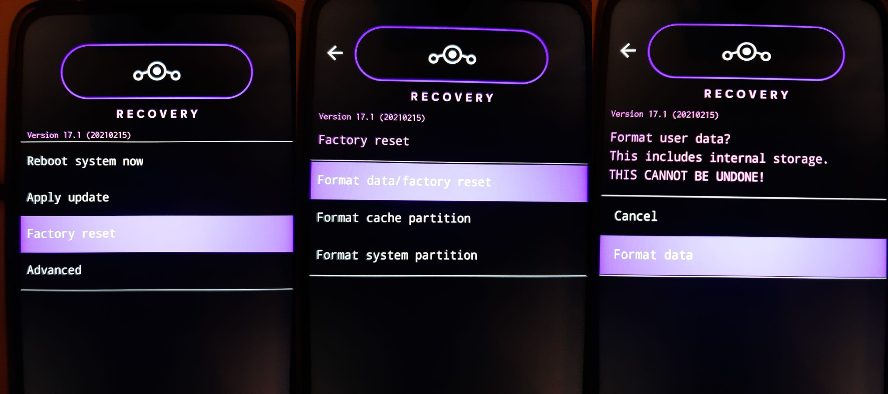
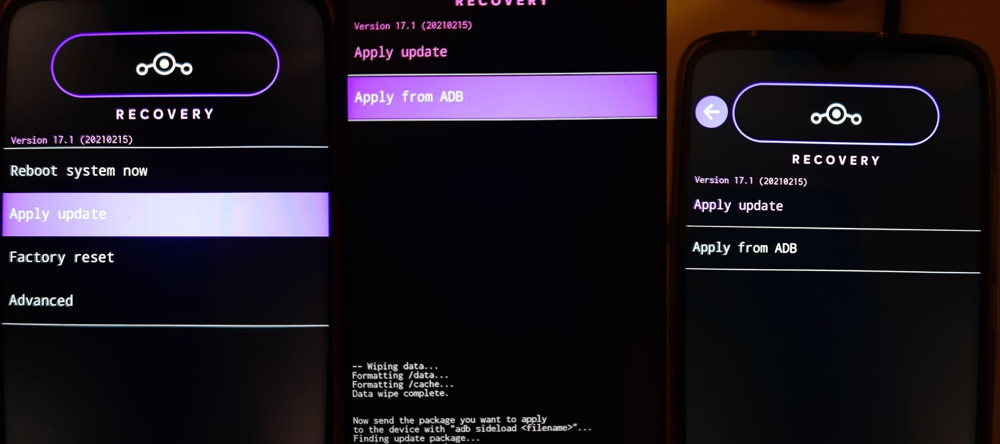
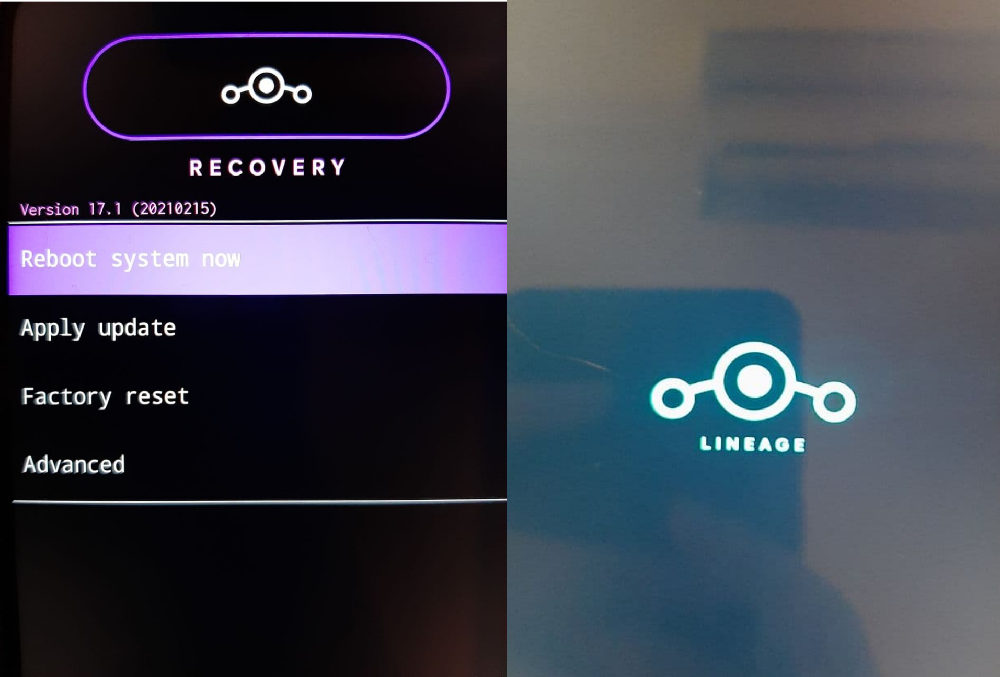

# LineageOS ile Mobil Cihaz Güvenliği

LineageOS, mobile cihazlar için Android tabanli bir işletim sistemidir. Privacy Guard gibi araçlarla verileriniz hakkında azami kontrol sahibi olmanızı sağlar. Her ay güvenlik güncellemeleri gönderen, güvenlik odaklı bir dağıtımdır. Tüm işlemlerin öncesinde şarjınızın %60'ın üstünde olduğundan ve verilerinizi yedeklediğinizden emin olun. İşlem sonunda telefonunuzdaki tüm veriler silinecektir.

_Bu döküman "Xiaomi Redmi 8" cihazına kuruluma göre oluşturulmuştur._

_Rehber boyunca mobil cihazınızı kullandığınız her durumda aşağıdaki başlıktaki adımları yapmılmış olduğunu kontrol edin. Cihazınızı bilgisayara bağladığınızda sizden USB hata ayıklama izni isterse bu izni verin._
## Cihazınızda geliştirici seçeneklerini ve USB hata ayıklamayı aktifleştirin
* Cihazımızın _Ayarlar > Telefon_ Hakkında kısmına girip MIUI sürüm numarasına 8 kere bastıktan sonra _Ayarlar_ menünüzün altına _Geliştirici Seçenekleri_ menüsünün eklendiğini göreceksiniz.
* _Geliştirici seçenekleri_ menüsüne girip _MI Kilit açma durumu_ seçeneğine basın. Hesap ekleyin.
* USB hata ayıklama seçeneğini aktifleştirin.



_Bu aşamadan sonra tekrar hesap eklememeniz gerekmektedir._

## ADB ve Fastboot programlarını kurun

Kurulum için kullanacağımız yazılımlar olan ADB ve Fastboot programlarını cihazınıza kurun. Ubuntu kullanıyorsanız aşağıdaki komutla kurabilirsiniz.

`sudo apt-get install android-tools-adb android-tools-fastboot`

## Bootloader kilidini açın
Bu işlemin tamamlanması için 7 gün beklemeniz gerekmektedir. Bu bölümdeki işlemler için ne yazık ki içinde Windows işletim sistemi çalışan bir cihaza ihtiyacınız olacak. Windows kurulu bilgisayara [MI Unlock Tool'u](https://xiaomitools.com/download/mi-flash-unlock-tool-v3-5-1030-37/) kurunuz. 

### İlk işlemler

* Programı çalıştırın.
* Feragatnameyi kabul edin.
* MI hesabınıza giriş yapın.



* Mobil cihazınızı USB girişinden bilgisayara bağlayıp _ses kısma ve güç butonlarına_ aynı anda basarak boot loader ekranına girin ve kilidi açmak üzere artık tıklanabilir olan _unlock_ butonuna tıklayın.
* Karşınıza gelen güvenlik uyarısını okuyun ve devam etmek istiyorsanız yine de kilidi açmak üzere _unlock anyway_ butonuna tıklayın.
* Yüklenme ekranının ardından 7 gün sonra cihazınızın bootloader kilidinin açılacağına dair bir uyarı göreceksiniz.



_Bu esnada tekrar MI hesabı eklemeyin, aksi halde tekrar beklemek durumunda kalacaksınız._

### 7 gün sonraki işlemler
* Süre dolduktan sonra tekrar Windows cihazınızda kurulu olan _MI Unlock Tool_ programını açın.
* Eğer hesabınıza tekrar giriş yapmanızı istiyorsa, _İlk işlemler_ başlığındaki giriş adımlarını tekrar edin.
* Cihazınızın _ses kısma ve güç butonlarına_ aynı anda basarak boot loader ekranına girin.
* Uyarıları kabul ederek yine de kilidi aç demek için _unlock anyway_ seçeneğine tıklayın. İşlemler sonrasında boot loader kilidiniz açılmış olmalı.



## Fastboot ile Lineage Recovery programını kurun
* Özelleşririlmiş recovery'nin son sürümünü [buradan](https://download.lineageos.org/ginkgo) (.img dosyaları) indiriniz.
* Cihazınızı USB ile bilgisayarınıza bağlayın. Geliştirici modunun açık olduğundan, USB hata ayıklamaya izin verdiğinizden emin olduktan sonra `adb devices` komutuyla cihazınızı görmeniz gerekir.
* Bağlantının sağlandığından emin olduktan sonra `adb reboot bootloader` komutuyla fastboot moduna girin. Bu moda _ses kısma ve güç butonlarına_ aynı anda basarak da girebilirsiniz. 
* Cihazınız fastboot moduna girdiğinde `fastboot devices` komutunu çalıştırdığınızda cihazınızı listelemesi gerekir. Böylece fastboot yazılımının cihazınızı bulduğundan emin oluruz. 
* Ardından `fastboot flash recovery <indirdiğiniz-recovery-imajı>.img` komutu ile recovery imajıyla cihazınızı flaşlayın.
* Kapalı durumdaki cihazınızı _ses açma ve güç butonlarına_ (dikkat edin bu sefer ses açma:)) aynı anda basarak kurtarma modunda açın.

## Kurtarma modunda adb ile LineageOS kurun

* LineageOS kurulum paketini [indirin](https://download.lineageos.org/ginkgo). 
    * Kurulum paketini doğrulamak için doğrulama yazılımını kurunuz.
	```
	git clone https://github.com/LineageOS/update_verifier
	cd update_verifier
	pip install -r requirements.txt
	```

    * `python update_verifier.py lineageos_pubkey /path/to/indirilen_zip` komutu ile indirdiğiniz dosyanın imzasını doğrulayın. Bu işlem sonucunda `verified successfully` çıktısını alıyorsanız imza doğru demektir.
* Ardından kurtarma modundaki cihazınızda _Factory Reset_, sonrasında _Format data/factory reset_ menülerini seçin. Bu işlemin tüm verilerinizi sileceğini göz önünde bulundurarak üçüncü ekranda da _Factory reset_ seçeneğini seçin.



* Fabrika ayarlarına döndürmemizin ardından, imzasını kontrol etmiş olduğumuz LineageOS'u kurmaya hazırız. Ana menüye dönün.
* Bilgisayarınızdan yüklemeyi gerçekleştirmek için mobil cihazınızdaki menüde önce “Apply Update”, ardından “Apply from ADB” seçeneklerini seçin. Sonra bilgisayarınızdan `adb sideload indirdiğiniz_LineageOS_kurulumu.zip` komutuyla kurulumu gerçekleştirin.



Cihazınızı yeniden başlattığınızda LineageOS işletim sisteminin açılış ekranını görüyorsanız kurulum tamamlanmış demektir.



Bu döküman büyük ölçüde [buradaki](https://wiki.lineageos.org/devices/ginkgo/install) resmi rehberi takip etmektedir.

