# Harici Bellekleri Şifrelemek

Harici bellekler ortaya çıktıkları ilk günlerden itibaren giderek hayatımızda daha fazla yer edindiler. Öncelikle görece taşınabilir sabit sürücülerden başlayan taşınabilir kayıt ortamları, [NAND](https://en.wikipedia.org/wiki/NAND_flash_memory) hafıza aygıtlarının yani bugün usb bellek olarak bilinen donanımların yaygınlaşması ile veri taşımanın en pratik yöntemi haline geldiler.

Hem fiyatların azalması hem de kapasitenin geometrik artışı usb bellekleri ve usb harici harddiskleri çok cazip araçlar haline getirmekte. Lakin pek çok önemli verinin taşındığı, saklandığı bu donanımların hayatımıza getirdiği en büyük tehlike yine bu kadar tutulmaları ile aynı olan taşınabilirlikleri. USB hafıza aygıtları; kolaylıkla unutulabilmekte, çalınabilmekte ve gerekirse bir saldırgan tarafından rahatça kurcalanabilmekte. Bu sebepten taşınabilir veri depolama aygıtlarının da şifrelenerek güvenli kılınması gerekli.

## Planlama

Öncelikle usb belleğiniz ile ne yapmak istediğinizi belirlemeniz gerekli. Keza şifrelenmiş verilere belirli işletim sistemlerinde erişmeniz tercih edeceğiniz yönteme göre mümkün olmayabilir. Bu bakımdan cihazınızın dosya sistemini şekillendirmeden önce küçük bir planlama ileride sorun yaşamanızı engelleyecektir.

* Şayet cihazınız ile güvenlik bakımından endişe duymadığınzı film, müzik gibi veriler taşımak niyetiniz var ve bu bölüme kötücül niyetle bir dosya koyulmasından endişe etmiyorsanız belki cihazınızı hiç şifrelememeniz daha kolay bir seçenek olabilir.

* Şayet bir cihazda hem şifreli hem şifresiz veri taşımak istiyorsanız cihazın kurulumundan önce bunu sağlayacak seçenekleri değerlendirmelisiniz.

* Şayet cihazın tamamını şifrelemek ve her türlü erişime engellemek niyetindeyseniz şifrelemeyi bütün alana uygulamak doğru tercih olacaktır.

## Cihazın tamamını şifrelemek

Taşınabilir bellekleri şifrelemek için pek çok seçenek bulunmakta. Bu araçlardan hangisini seçeceğiniz; yazılımın özgürlüğüne, kullanım kolaylığına ve yaygınlığına, geçtiği güvenlik testlerine bağlıdır.

### LUKS

Şifreleme araçları arasında pek azı LUKS kadar bir işletim sisteminde entegre ve sorunsuz çalışmaktadır. [LUKS(Linux Unified Key Setup)](https://en.wikipedia.org/wiki/Linux_Unified_Key_Setup) her GNU/Linux işletim sistemi ile birleşik olarak gelen bir şifreleme aracıdır.

LUKS ile tüm bilgisayarınızın sabit sürücüsünü şifreleyebileceğiniz gibi harici depolama aygıtlarını da bilgisayarınızda kullanmak üzere şifreleyebilirsiniz. Bunun için hem grafik arayüz araçları hem de uçbirim araçlarını kullanabilirsiniz.

#### Gnome-Disks ile LUKS

Gnome-disk yazılımı bilgisayarınızda kurulu dağıtıma göre "Disks" veya "Diskler" adı altında bulunabilir. Her halukarda yazılımı başlatmak için bir uç birime aşağıdaki komutu yazabilirsiniz.

`gnome-disk`

Şayet sisteminizde kurulu değil ise aşağıdaki komutlarla gerekli paketleeri kurabilirsiniz.

`sudo apt-get install cryptsetup gnome-disk-utility`

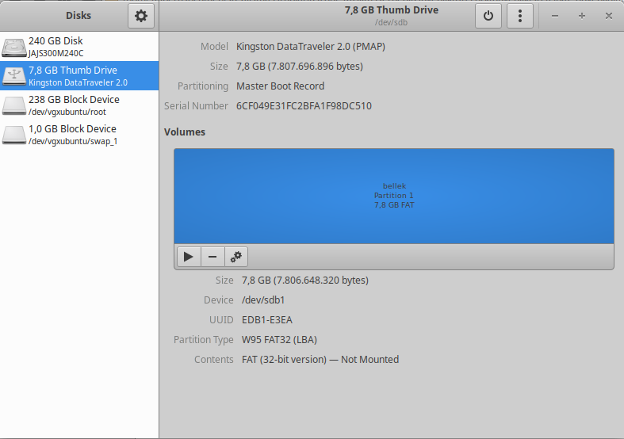

Sol tarafta cihazınıza takılı olan depolama aygıtları listelenecektir. Bu listeden hangi cihazın şifrelemeye niyetlendiğiniz donanım olduğunu seçmelisiniz. Bunu donanım adının taktığınız cihazla aynı olmasından veya çıkardığınız zaman bu listeden eksilmesinden anlayabilirsiniz. Daha emin hareket etmek isterseniz bir uçbirimden aşağıdaki komutu çalıştırıp listeden gerekli bilgiyi alabilirsiniz.

`lsblk`

Uçbirim size aşağıdakine benzer bir tablo döndürecektir. /Boot, / swap ve benzeri bölümlerin bulunduğu cihaz sisteminizdeki hdd olacağından buna **kesinlikle** dokunmamanız önemli. Aşağıdaki tabloya göre `sdb` donanımı hem kapasitesi hem de ismi ile hedefimiz olan donanım olarak görünmekte.

```
sda                      8:0    0 223,6G  0 disk  
├─sda1                   8:1    0   512M  0 part  /boot/efi
├─sda2                   8:2    0     1K  0 part  
├─sda5                   8:5    0   731M  0 part  /boot
└─sda6                   8:6    0 222,4G  0 part  
  └─sda6_crypt         253:0    0 222,3G  0 crypt 
    ├─vgxubuntu-root   253:1    0 221,4G  0 lvm   /
    └─vgxubuntu-swap_1 253:2    0   976M  0 lvm   [SWAP]
sdb                      8:16   1   7,3G  0 disk  
└─sdb1                   8:17   1   7,3G  0 part  
```

Şayet usb aygıtınızı daha önce kullandı iseniz, hem olası sistem arızalarını gidermek hem de aygıt üzerinde kalmış olabilecek verileri yok etmek adına cihazınızı formatlayıp/silmeniz gerekebilir. Bu işlem biraz vakit alacaktır.

**ÖNEMLİ NOT:**NAND hafıza içeren usb bellekler, [SSD](https://en.wikipedia.org/wiki/Solid-state_drive) hafıza aygıtları bir ön işlemci içermekle birlikte [silme emrine uymayabilmektedir.](https://www.usenix.org/legacy/events/fast11/tech/full_papers/Wei.pdf) bu duruma karşı yapılabilecek en iyi silme yöntemi "0" yerine rastgele veri yazmaktır. Gerekli talimatlar için rehberin son bölümüne bakın.

Sağ üst köşeden menüyü açıp "diski biçimlendir" seçeneğini seçin.

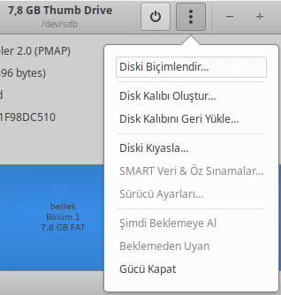

Karşınıza gelecek bölümden aşağıdaki ayarları seçip "biçimlendir" düğmesine basın.

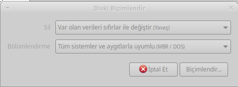

Gnome Disks size işlemi onaylamak isteyip istemediğinizi soracaktır. Bu noktada **doğru aygıt** ile işlem yaptığınızdan emin olun.

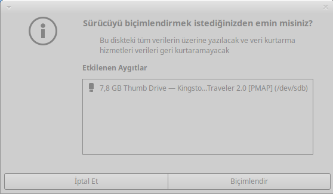

Onayınız ardından anasayfaya dönülecek ve size bir ilerleme çubuğu gösterilecektir. Bu işlemin sonuçlanmasının ardından boş bir bellek elde edeceksiniz.

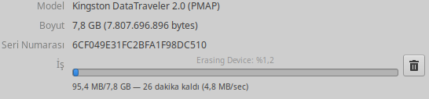

Biçimlendirme işleminin bitmesinin ardından LUKS bölümünün kurulumuna geçilebilir. + simgeleri ile gösterilen düğmeyi tıkladıktan sonra bölüm oluşturma ekranı karşınıza gelecektir.

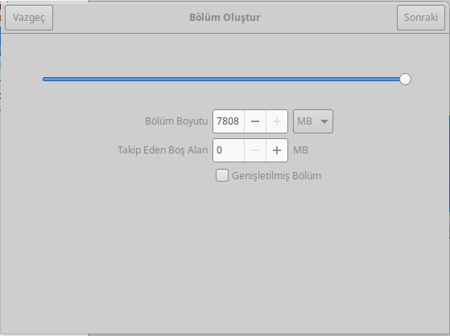

Tüm alanı seçip "sonraki" düğmesi ile ilerleyin.

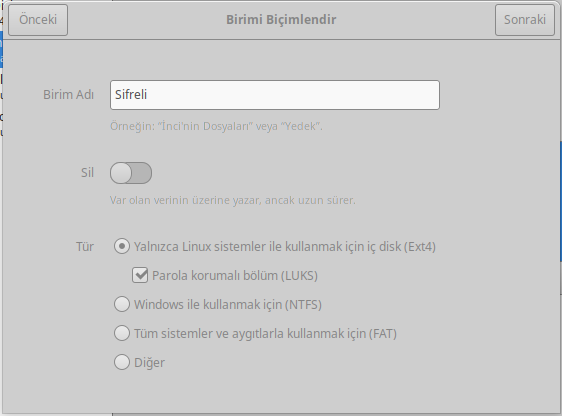

Karşınıza gelen ekrandan yeni biriminize bir isim verip ekran görüntüsündeki gibi ayarları yaparak sonraki tuşu ile ilerleyin.

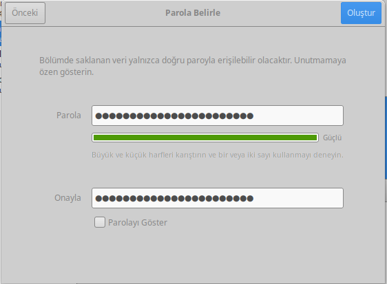

Bu noktada Gnome Disks size parolanızı soracaktır. Bu parola doğrudan şifrelediğiniz verilerin güvenliği olduğundan kullandığınız [parolanın güvenli olmasına](beseri_guvenlik/parolalar.md) özen göstermelisiniz. Yazılımın sunduğu **güvenlik ölçer çok güvenilir değildir**. Bir [Zarola](https://zarola.oyd.org.tr) size güvenlik ve hatırlanabilirlik açısından en iyi sonucu verecektir.

"Oluştur" düğmesine tıklamanız ile Gnome Disks LUKS bölümünüz oluşturmaya başlayacaktır. İşlem bittiğinde anaekranda aşağıdaki görüntü ile karşılacaksınız. Bu noktadan sonra harici depolama aygıtınız kullanıma hazırdır!

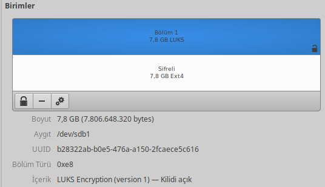

Şayet özellikle değiştirmedi iseniz GNU/Linux cihazınız bu belleği cihazınıza taktığınızda otomatik olarak LUKS bölümünü algılayacak ve açabilmek için size parola soracaktır. Parolayı girmeniz ile birlikte normal bir usb bellek gibi cihazınıza erişebilirsiniz.

#### Uçbirim ile LUKS

Gnome Disks kullanmak istemiyor veya kullanamıyor iseniz aynı işlemleri uçbirimden de yapmanız mümkündür. Bunun için aşağıdaki adımları takip edebilirsiniz.

[Buraya katkı verebilirsiniz](https://git.oyd.org.tr)

### Veracrypt

[Veracrypt](https://en.wikipedia.org/wiki/VeraCrypt), Truecrypt yazılımının devamı olan özgür bir şifreleme aracıdır. [Truecrypt esrarlı ortadan kayboluşu](https://en.wikipedia.org/wiki/TrueCrypt#End_of_life_and_license_version_3.1) ardından özgür bir yazılım olarak hayatına başlayan Veracrypt, tam disk şifreleme, dosya, dizin ve dosya sistemi şifrelemede ender olan bir özellik olarak [inkar edilebilir şifreleme](https://en.wikipedia.org/wiki/Deniable_encryption) imkanı sunmakta. Bu bakımdan kendi başına bir rehber gerektirmekte. 

[Buraya katkı verebilirsiniz](https://git.oyd.org.tr)

## Cihazın bir bölümünü şifrelemek

USB belleğinizin tamamını şifrelemek çoğu zaman bu belleğe güvenli şekilde sadece kendi cihazlarınızdan erişebileceğiniz anlamına gelmekte. Şayet belleğinizi başka amaçlarla da kullanmak istiyorsanız bir tercihiniz cihazınızı kısmen şifreleyip bir kısmını erişilebilir tutmaktan geçebilir.

### LUKS ile kısmi şifreleme

USB belleğinizi iki ayrı bölüme ayırarak bir kısmını LUKS ile şifreleyip bir kısmını açık bırakmak mümkündür. Bu belleğinizin bir kısmını olağan dosya aktarımları için kullanılabilir kılarken aynı aygıtı güvenli şekilde veri bulundurmak için de kullanabileceğiniz anlamına gelir. 

**NOT:**Şifresiz bölümün birinci bölümde olması gereklidir. Aksi halde Microsoft Windows cihazlar aygıtı tanımayacaktır.

Tüm belleğin LUKS ile şifrelendiği şekilde cihazınızı biçimlendirdikten sonra. Bölüm oluşturma aşamasında, LUKS bölümü oluşturmadan önce cihazı iki bölüme bölmek gereklidir. Bunun için biçimsiz sürücüde bölüm oluşturmak içn + simgesine basıp bölümlendirme menüsüne gelin.

Şifresiz önbölüm için tercih ettiğiniz miktarı belirleyip "ileri" tıklayın.

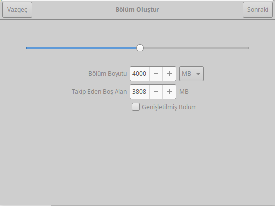

Karşınıza gelen bölümden, şayet tüm cihazlarla uyumluluk istiyorsanız FAT, 4GB ve daha büyük dosyalar depolayacaksanız NTFS seçin.

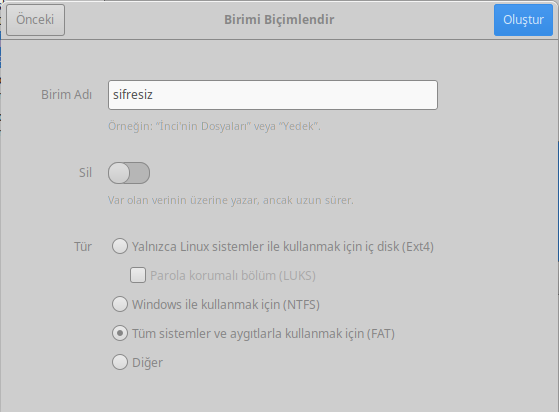

İşlemin tamamlanması sonunda önbölüm ve biçimlendirilmemiş "boş alan" olan iki bölüm oluşacaktır.

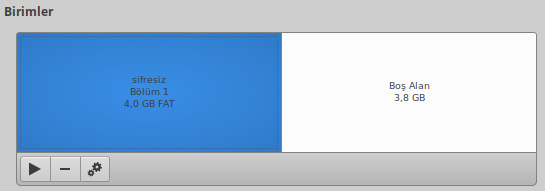

Boş alanı seçip + simgesine basın ve bölüm oluşturma ekranına gelin.


Tüm alanı seçip "sonraki" düğmesi ile ilerleyin.


Karşınıza gelen ekrandan yeni biriminize bir isim verip ekran görüntüsündeki gibi ayarları yaparak sonraki tuşu ile ilerleyin.


Bu noktada Gnome Disks size parolanızı soracaktır. Bu parola doğrudan şifrelediğiniz verilerin güvenliği olduğundan kullandığınız [parolanın güvenli olmasına](beseri_guvenlik/parolalar.md) özen göstermelisiniz. Yazılımın sunduğu **güvenlik ölçer çok güvenilir değildir**. Bir [Zarola](https://zarola.oyd.org.tr) size güvenlik ve hatırlanabilirlik açısından en iyi sonucu verecektir.


"Oluştur" düğmesine tıklamanız ile Gnome Disks LUKS bölümünüz oluşturmaya başlayacaktır. İşlem bittiğinde anaekranda aşağıdaki görüntü ile karşılacaksınız. Bu noktadan sonra harici depolama aygıtınız kullanıma hazırdır!

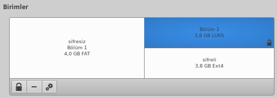

Şayet özellikle değiştirmedi iseniz GNU/Linux cihazınız bu belleği cihazınıza taktığınızda otomatik olarak LUKS bölümünü algılayacak ve açabilmek için size parola soracaktır. Parolayı girmeniz ile birlikte normal bir usb bellek gibi cihazınıza erişebilirsiniz.

### Sirikali ile dizin şifreleme

[Sirikali](https://mhogomchungu.github.io/sirikali/) GNU/Linux işletim sistemleri için yazılmış çeşitli dosya sistemi şifreleme imkanlarını bir arada sunan bir önyüzdür. Bu araç ile uçbirim karmaşasına girmeden cryfs, gocryptfs, encfs gibi araçları kullanmak mümkün. Sirikali ve tüm şifreleme araçlarını kurmak için aşağıdaki komutu bir uçbirimde çalıştırabilirsiniz.

Debian tabanlı işletim sistemlerinde:

`sudo apt-get install sirikali encfs cryfs gocryptfs`

RPM tabanlı işletim sistemlerinde (Fedora, Redhat, Centos):

`sudo yum install sirikali encfs cryfs gocrypt`

Kurulumun ardından Sirikali'yi çalıştırdığınızda aşağıdaki gibi basit bir ekran sizi karşılayacaktır.

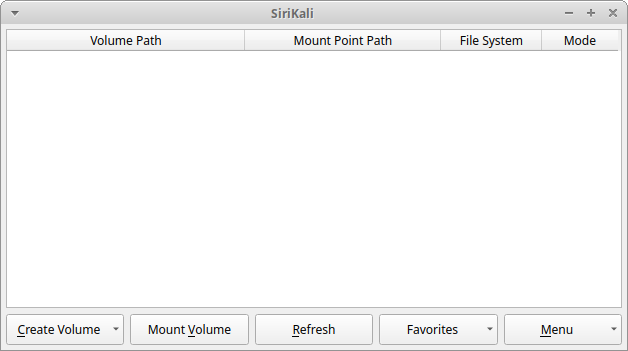

Şifreli bir dosya dizini oluşturmak için "Create Volume" düğmesine tıklayıp çıkan şifreleme araçlarından birini seçmelisiniz. Şifreleme araçları farklı özellikler sunmakla tercihinizi aşağıdaki bilgilere göre yapabilirsiniz:

* CryFS: Görece yeni bir yazılım olmakla birlikte sunduğu özellikler bakımında önem arz ediyor. CryFS dizinde bulunan dosyaları sabit bloklar şeklinde şifrelemekte ve bu sayede dosya düzeni ve üstveriye ilişkin bilgi sızdırmamakta. Bu özellik nedeni ile diğer tercihlere göre daha yavaş çalışması söz konusu.

* gocryptfs: CryFS'nin aksine dizin yapısını ve dosyaları koruyarak şifrelemekte. Bu sayede şifrelenne dizinin birebir bir kopyası oluşturulmakta. Aynı zamanda reverse(ters) mod sahibi olduğu için belirli dizinlerin yedeklenmesinde faydalı olmakta. gocryptfs dosyaların boyutları, oluşturulma zamanları ve dizin hiyerarşisi hakkında üstveriyi korumamakta.

* Encfs: Köklü bir geçmişi olmasına rağmen 2014'te fark edilen açıklarından dolayı kullanılması artık önerilmemekte.

Kullanmak istediğiniz yazılımı seçtikten sonra karşınıza gelen ekranda; şifreli dizinizin ismini, bulunmasını istediğiniz dizini (bu kapsamda usb belleğiniz), yetkilendirmek için kullanacağınız yöntemi (key: parola için) ve parolanızı belirledikten sonra "create" düğmesine basarak dizininizi oluşturabilirsiniz.

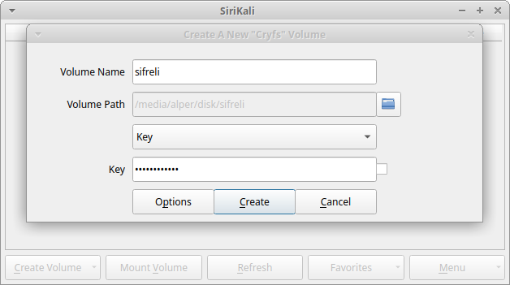

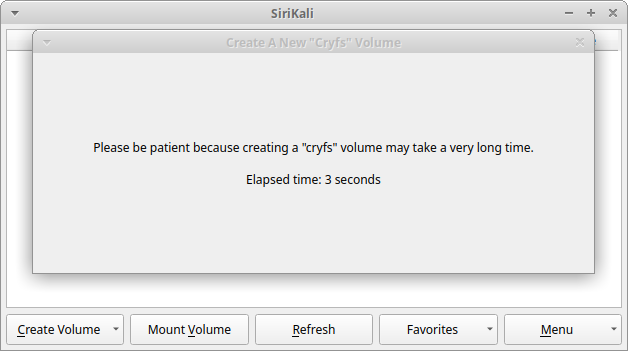

Bir süre sonra SiriKali ana ekranında aşağıdaki şekilde oluşturulmuş dizininizi ve şu anda yüklendiği alanı göreceksiniz.

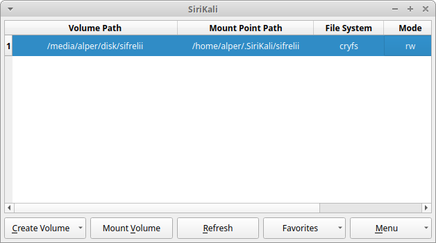

Bağlanan bölümü çıkarmak için satıda sağ tıklayıp "unmount" seçeneğini seçin. Listeden bölümünüz eksilecektir.

SiriKali otomatik olarak ev dizininizin altında .SiriKali isminde bir noktaya yeni bölümünüzü bağlamaktadır. Bu standart noktayı ayarlardan değiştirebilir veya bağlama sırasında başka bir dizin seçebilirsiniz.

USB belleğinizde kurulum sırasında verdiğiniz isimle yeni bir dizin oluştuğunu ve içinde saçma sapan dosyalar bulunduğunu görebilirsiniz. Bu sizin şifreli dosyalarınızın bulunduğu dizindir ve dosyalarınıza erişebilmek için SiriKali'ye bu dizini göstermeniz gerekecektir. Ana ekrandan "mount volume" seçeneğini seçerek işleme başlayın.

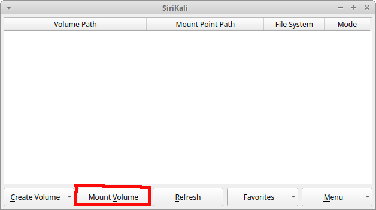

Karşınıza çıkan ekrandan "mount path" bölümüne şifresi çözülecek dosyalarınızın nerede görünmesini istediğinizi belirtin ve parolanızı girerek "open" düğmesi ile bölümü açın.

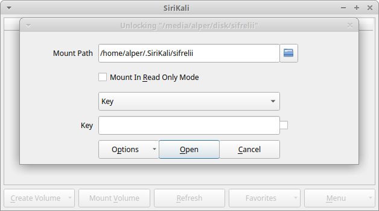

SiriKali'nin kriptografik işlemi yapması bir süre alabilir.

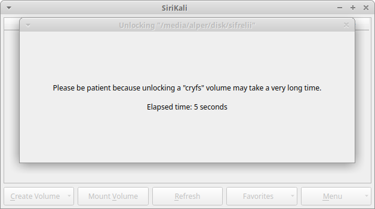

İşlemin bitmesi ile bağlanan dizini açarak karşınıza çıkaracaktır. İşiniz bittiğinde bölümü Sirikali'den çıkarak verilerinizi tekrar şifreli alanın güvenliğine alabilirsiniz.

## İşletim sistemi uyumluluğu

Şifreleme araçları, özellikle özgür ve güvenilir olanlar, ne yazık ki haklı olarak GNU/Linux işletim sistemlerinde bulunmakta ve sadece LUKS gibi çok ender yazılımlar her dağıtımda standart olarak gelmekte. Bu sebepten neredeyse her şifreleme yazılımının bir şekilde kullanılan bilgisayarlara haricen kurulması gerekmekte.

Buna istisna olarak Veracrypt ve [Cryptomator](https://cryptomator.org/) verilebilecekse de çoğu zaman bu yazılımların bir mobil versiyonu usb bellek üzerinde bulundurulmak ve takılan cihazda çalıştırılarak deşifre işleminin gerçekleştirilmesi gerekmekte. Bu hem takılan cihazın yetkisine bağlı olarak işe yaramayabilir hem de bir binary dosyayı USB bellekte sağdan sola taşıyarak güvenlik sorunu yaratılmasına neden olur.

Aynı zamanda güvenilir olmayan cihazlarda hem parolanızı girmek hem de şifreli dosyalarınızı açmak onların güvenliğini ciddi oranda zedeleyecektir. Bu neden ile USB belleğinizde bulunan şifreli dosyalarınızı güvenmediğiniz cihazlarda açmanız önerilmez.

## SSD'ye rastgele veri yazmak

Bir şifreli alan yaratmadan önce bellek üzerine rastgele veri yazmak iki açıdan faydalıdır.

1. Cihazda eskiden kalmış olabilecek verileri imha etmek ve ileride inceleme ile ortaya çıkmasına engel olmak için sadece 0 yazmaktan çok daha etkilidir.

2. LUKS gibi tüm diski kaplayan şifreleme araçlarında şifreli alanın nerede başlayıp nerede bittiğini saklayarak olası bir saldırganın işini zorlaştırır.

Bu işlemi gerçekleştirmek için ne yazık ki uçbirim kullanmanız gerekmekte. Aşağıdaki komut ile uzun sürecek olsa da belleklerinize rastgele veri yazabilirsiniz.

**ÖNEMLi NOT:** Kullanılan aracın adı "dd" idir ve açılımı **Disk Destroyer** idir. Disk yokedicisi adındaki bir yazılımı kullanırken verilerinizi kalıcı olarak kaybedebileceğinizi öngörerek çok dikkatli davranmanız önerilir.

`dd if=/dev/urandom of=/dev/(cihaz adı) bs=4096 status=progress`

## Sıkça Sorulan Sorular

1. Bir marka çok güveli, üç harfli algoritmalı usb bellekler satıyor, bunlar güvenli mi?

Bu tip cihazlar her zaman cihaz üzerindeki bir donanıma bağlı olarak şifreleme yaparlar. Bu kimi tehdit modelleri için yeterli olsa bile bilmediğiniz bir donanıma ve muhtemelen zayıf bir parolanın güvenliğine kalırsınız. Şayet şifreleme sizin için küçük bir önlem ise ve usb belleğinize koşulsuz şartsız her cihazda ulaşmak istiyorsanız bu yolu kullanabilir çok önemli dosyalarınızı ayrıca şifreleyebilirsiniz.

2. Parmakizi ile çalışan bellekler gördüm bunlara ne demeli?

Biyometrik veriler ile şifreleme güvenliği ne yazık ki kabul edilemez. Bu hem biyometrik verilerin düşük güvenlik seviyesinden kaynaklanır hem de bir saldırganın sizi kolaylıkla parmakiziniz için zorlaması veya kandırması mümkündür. Yukarıdaki önerimiz bu durum için de geçerlidir.

3. Şifreleme USB belleğimi eskitir mi?

Hem evet hem hayır. Şifreli cihazın kurulumu sırasında silme, rastgele veri yazmak gibi işlemler özellikle SSD cihazlar üzerinde eskime yaratabilir. Bu işlemleri sıklıkla tekrar etmediğiniz sürece gözle görülebilir bir sorun yaşamamanız gerekir. Özellikle çağdaş kaliteli cihazların hatrı sayılır ilerlemesi ile belki de bunu hiç endişe olarak taşımamalısınız.
