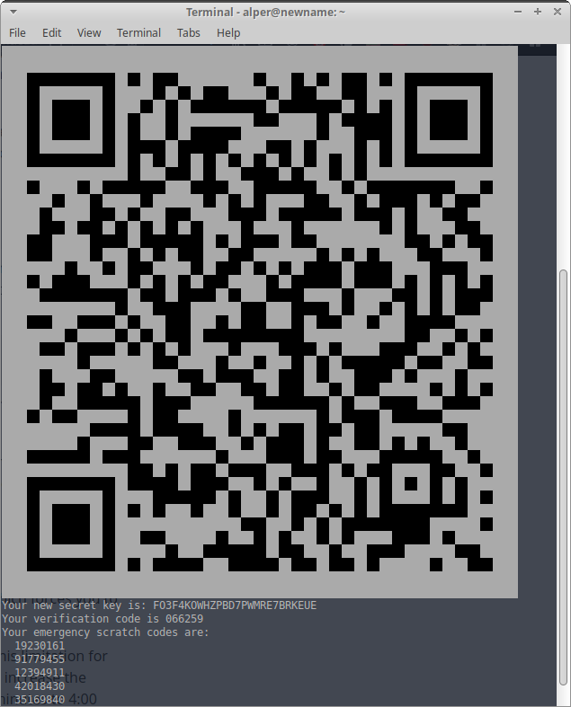

# SSH Erişiminde OTP Kullanımı

[Nextcloud](https://nextcloud.com/) veya [OpenVPN](ag_guvenligi/vpn.md) gibi hizmetleri kişisel kullanımınız için kendiniz barındırıyorsanız veya bir sebepten sunucu yönetimindeyseniz uzak sunucunuzun güvenliği tüm sisteminizin güvenliği anlamına gelmekte.

[SSH güvenliği](ssh.md) cihazınıza uzaktan sistem erişimine tek imkan olduğundan tüm güvenliğin de düğüm noktasını oluşturmakta. SSH kullanımına ilişkin genel tedbirleri aldıktan sonra yetkilendirme bakımından gereklilikleri bir adım daha ileri taşıyarak bir saldırganın sisteminize erişmek için sahip olması gereken kaynakları arttırabilirsiniz. Bu bakımdan SSH anahtarı ve parolanın yanında bir üçüncü faktör olarak [OTP](beseri_guvenlik/2fa.md) kullanmanız mümkün.

OTP gerekliliğini iki şekilde uygulamanız mümkün. Bu SSH kullanımınızı nasıl yönettiğinize bağlı olarak.

1. SSH Anahtarı + parola --> PAM + OTP ile sudo/su yetkilendirmesi

2. SSH Anahtarı + OTP

PAM + OTP ile sudo/su yetkilendirmesi için uzak sunucuda google-authenticator kurulumu yapıp dilediğiniz kullanıcıya PAM üzerinden OTP yetkilendirme zorunluluğu getirebilirsiniz. Yerel bir bilgisayardan farklı olmayan bu işlem için [Google Authenticator ile PAM Rehberimizden](ga_pam.md) yararlanabilirsiniz.

**Buradaki ayarlarda hata yapmanız durumunda sunucuya erişiminizi kaybedebilirsiniz. Çok dikkatli olun**

## SSH girişinde OTP kullanımı

Bu rehberdeki kurulumu takip edebilmek için öncelikle uzak sunucunuzda SSH erişimine sahip olmanız gerekli. Bunun için [SSH güvenliği rehberimizden](ssh.md) yardım alabilirsiniz.

SSH ile sunucuya bağlandıktan sonra aşağıdaki komut ile gerekli paketleri kurun:

Debian:	`sudo apt-get install libpam-google-authenticator`

RPM:	`sudo yum install libpam-google-authenticator`

Google-authenticator'ü yapılandırmak için aşağıdaki komutu yetkilendirmede giriş yaptığınız kullanıcının hesabından çalıştırın:

`google-authenticator`

Ardından Karşınıza gelecek karekodu [andOTP](beseri_guvenlik/andotp.md) ile tarayıp kodu kullanılabilir hale getirin ve acil durum kodlarını güvenli şekilde saklamak üzere yazdırıp kaldırın.



Kalan sorulara evet cevabını verip kurulumu tamamlayın.

## SSH ayarlarının yapılması

SSH girişinde OTP yetkilendirmesi için öncelikle sshd pam modülüne gerekli ayarların girilmesi gerekli. Bunun için dilediğiz bir metin düzenleyci ile veya aşağıdaki şekilde nano ile ilgili dosyayı açın.

`sudo nano /etc/pam.d/sshd`

Ardından açılan dosyanın içinde aşağıdaki şekilde satırı düzenleyin:


```
# PAM configuration for the Secure Shell service

# Standard Un*x authentication.
@include common-auth

auth required pam_google_authenticator.so
```

Bunun ardından aşağıdaki komut ile sshd yapılandırmasına gerekli satırı ekleyin:

`sudo echo ChallengeResponseAuthentication yes >> /etc/ssh/sshd_config`

Son olarak ssh servisini aşağıdaki komut ile yeniden başlatın:

`sudo service ssh restart`

## Yapılandırmanın test edilmesi

**Yukarıdaki ayarlarda bir hata yapmış olmanız durumunda sunuya erişiminizi kaybedebilirsiniz**

Bu sebepten ötürü hali hazırda açık olan ssh erişiminizi açık bırakarak bir başka uçbirimden sunucuya tekrar SSH bağlantısı kurarak OTP kurulumunuzun çalışıp çalışmadığını deneyebilirsiniz.
