## Kolay GPG Anahtar üretimi

<!-- toc -->

E-posta şifrelemeye başlamadan önce bir tane GPG anahtarı sahibi olmanız ve bunu güvenle saklamanız gerekli. GPG anahtarı üretimi kullandığınız donanıma ve işletim sistemine bağlı olarak değişmekte. Şayet tehdit modeliniz yüksek değil, sadece mahremiyetiniz için basitçe yazışmalarınızı şifrelemek istiyorsanız aşağıdaki yöntemleri kullanarak tüm cihazlarınızda hızlı ve görece güvenli şekilde GPG anahtarı oluşturabilirsiniz.

## GNU/Linux -  Windows - macOS

GNU/Linux dağıtımlar için çokça kullanışlı grafik arayüz sunan GnuPG istemcisi bulunmakta. Bu bakımsan KDE masaüstü ortamının anahtar yöneticisi Kleopatra hem platformlar arası olması hem de en geniş yönetim seçeneklerini sunması itibari ile tercih edilebilir.

* Kleopatra'yı yüklemek için aşağıdaki komutları kullanabilir veya dağıtımınızın grafik yükleyicisini kullanabilirsiniz;

Debian/Ubuntu (APT): `sudo apt-get install kleopatra`

Red Hat/Fedora (RPM): `sudo yum install kleopatra`

Microsoft Windows   : [Gpg4win](https://www.gpg4win.org/download.html)

* Kurulum tamamlandıktan sonra Kleopatrayı dilediğiniz şekilde çalıştırın ve anahtarların listelendiği alan ile birlikte Kleopatra sizi karşılayacak.

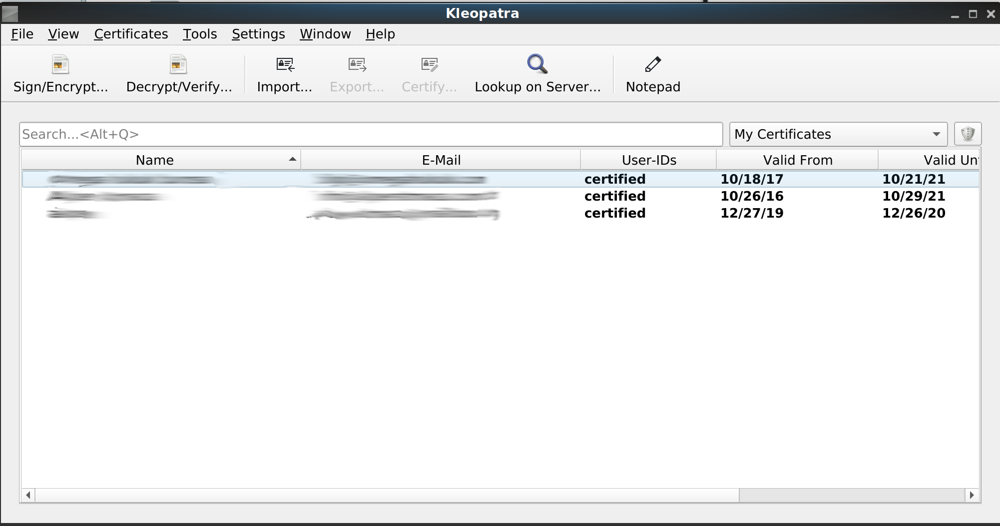

* İlk anahtarınızı üretmek için "File/Dosya" menüsüne tıklayıp "New key pair/Yeni anahtar çifti" seçeneğine tıklayıp anahtar üretme işlemine başlayın. Açılan menüden "Kişisel OpenPGP anahtar çifti üret seçeneğini tıklayıp" devam edin.

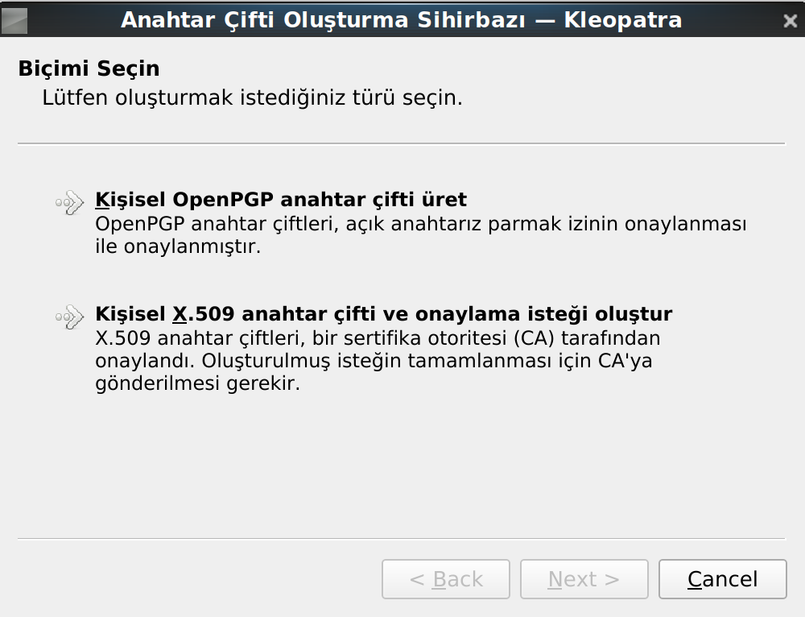

* Kleopatra size isminizi ve e-posta adresinizi soracaktır. Burada doğru bilgiler vermek zorunda değilsiniz. __Lakin__ GnuPG insanların kimliklerini oluşturmak ve buna güven duyulmasını sağlamak amacı ile kullanılmaktadır. Bu anahtar sizin kimliğinizi ve sizi tanıyan insanların size güvenmesi demek olacağından bu anahtarla yapacağınız işlemlerin size ait olduğunu kanıtlamanızı sağlar. Bu sebep ile gerçek bilgiler kullanmanızı öneririz. **Her halükarda** dilediğiniz bu bilgileri değiştirmenize engel olan bir durum yok.

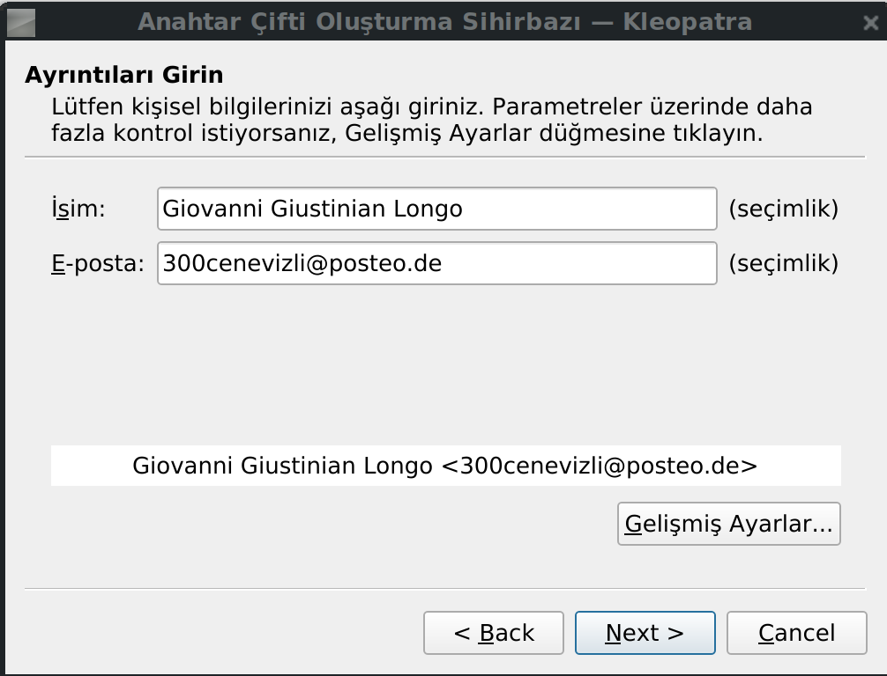

* 'Gelişmiş Ayarlar' tıklandığında üretilecek anahtarınıza ilişkin birtakım teknik veriler karşınıza çıkacaktır. "Anahtar Malzemesi" olarak garipçe çevrilmiş bölümde kullanılacak anahtarın tipi ve boyutu girilmekte. RSA standart olmakla anahtar boyutunu en yüksek olan **4096** bit'e yükseltmeniz anahtarınızın geleceği için **hararetle** tavsiye edilir. Şayet anahtarınız ile [SSH](https://en.wikipedia.org/wiki/Secure_Shell) kullanma arzunuz varsa şu aşamada "Yetkilendirme/Authentication" kutusunu işaretleyerek devam edebilirsiniz. Geçerlilik süresi ise anahtarınızı kaybetmeniz durumunda belirli bir tarihten sonra anahtarınızın kendiliğinden kullanılmaz olmasını sağlar. O tarih geldiğinde anahtarınızı tekrar yenileyebilirsiniz. Tercihen **2-3** yıl seçmeniz önerilir.

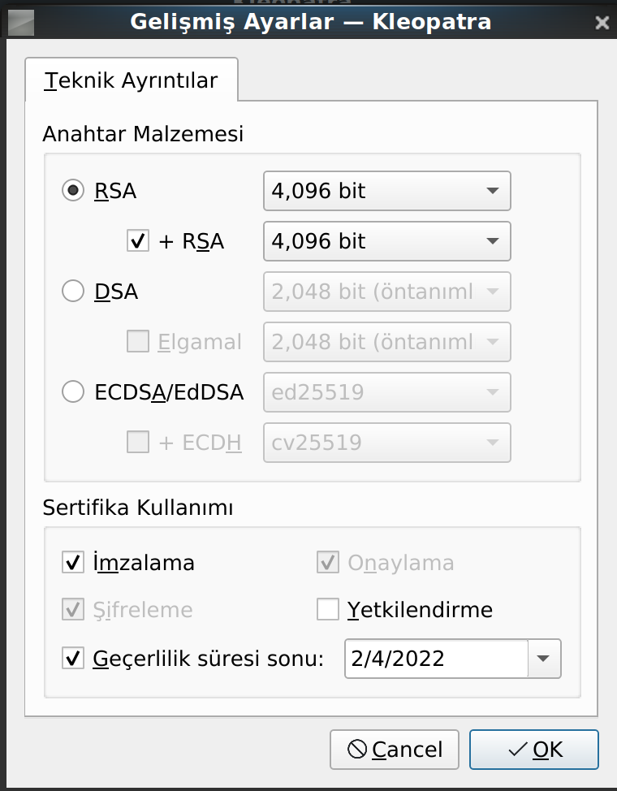

* "Oluştur" düğmesine bastığınızda Kleopatra size parola soracaktır. Bu parola anahtarınızın şifrelenmesi için kullanılacak olup **tüm anahtarınızın güvenliğinden sorumludur.** Hali ile burada bir [**zarola**](https://zarola.oyd.org.tr) kullanmanız **hararetle tavsiye edilir.**

* Parolanızı girmenizin ertesinde, cihazınızın kapasitesine ve [rastgelelik](https://en.wikipedia.org/wiki/Randomness) kaynağına bağlı olarak birkaç dakika alabilir. Bundan sonra anahtarınız hazırlanmış olacaktır.

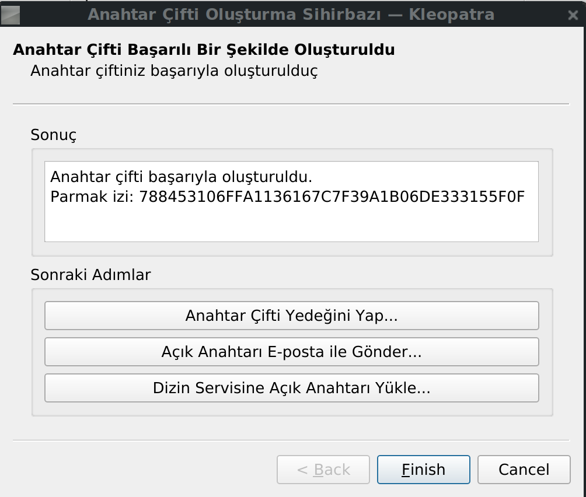

* Bu aşamada anahtarınızın yedeğini alabilir ve [anahtar yönetimi](anahtar-saklama.md) tavsiyelerimize göre anahtarınızın yedeğini alabilirsiniz.

* Şayet anahtarınızı e-posta yazışması için kullanılmasını istiyorsanız, bu aşamada "Dizin Servisine Açık Anahtarı Yükle" seçeneğine tıklayarak anahtarınızı anahtar sunucularına gönderek herkes tarafından size şifreli e-posta atılabilmesini sağlayabilirsiniz.

__ÖNEMLİ NOT:__ Anahtar sunucusuna yüklediğiniz anahtarlar **SONSUZA** kadar sunucularda kalacaktır. Bu bakımdan anahtarınızı kullanacağınızdan ve/veya anahtarı iptal etmek için gerekenlere sahip olduğunuzdan emin olmadan anahtarı sunuculara göndermeyin. Gizli anahtara ve parolasına veya bir iptal sertifikasına sahip değilseniz sunucudaki anahtarlar son kullanma tarihine kadar geçerli kalır.

# Android

Android işletim sistemlerinde GnuPG kullanmak neredeyse diğer tüm imkanlardan daha kolay. [OpenKeychain](https://openkeychain.org) [F-Droid](https://f-droid.org) üzerinden indirilebilen özgür bir yazılım olarak kullanışlı arayüzü ve kolay kullanımı ile GnuPG işlemlerinin kolaylıkla yapılabilmesine ve anahtar yönetimine imkan sağlıyor.

* Android mobil işletim sistemleri için [OpenKeychain](https://openkeychain.org) yazılımını [F-Droid](https://f-droid.org) reposundan veya özgür olmayan bir başka repodan indirerek telefonunuza kurun.

* OpenKeychain sizi şirin asma kilit karakteri ile karşılayacak ve anahtar kullanımı için seçenekler sunacaktır. Buradan "Anahtarımı oluştur" seçeneğini seçerek ilerleyin.

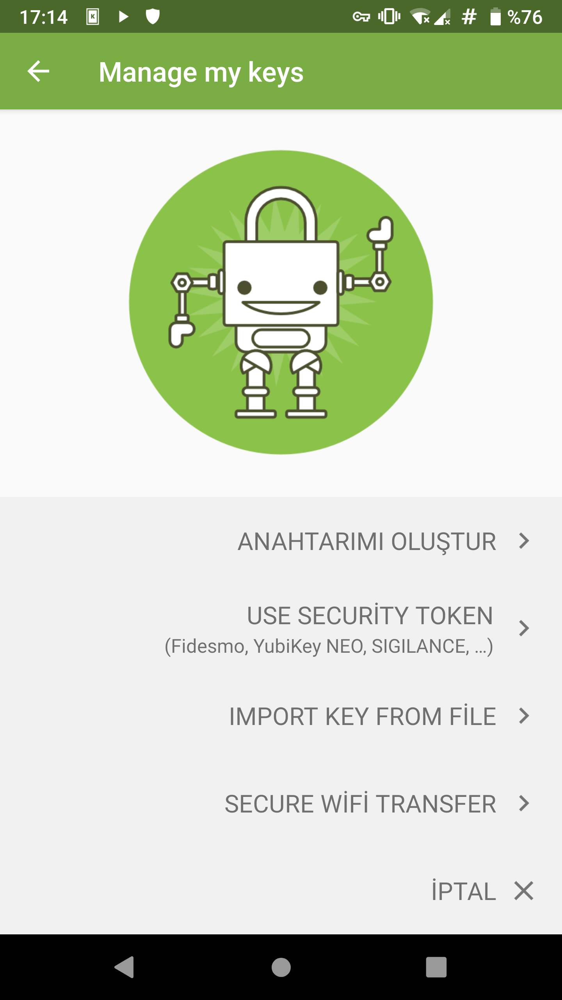

* OpenKeychain size adınızı veya rumuzunuzu soracaktır. Burada doğru bilgiler vermek zorunda değilsiniz. __Lakin__ GnuPG insanların kimliklerini oluşturmak ve buna güven duyulmasını sağlamak amacı ile kullanılmaktadır. Bu anahtar sizin kimliğinizi ve sizi tanıyan insanların size güvenmesi demek olacağından bu anahtarla yapacağınız işlemlerin size ait olduğunu kanıtlamanızı sağlar. Bu sebep ile gerçek bilgiler kullanmanızı öneririz. **Her halükarda** dilediğiniz bu bilgileri değiştirmenize engel olan bir durum yok.

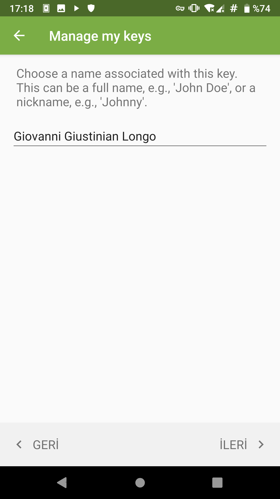

* Bir sonraki aşamada OpenKeychain sizden e-posta adresinizi ve varsa başkaca e-posta adreslerinizi girmenize imkan verecektir. Buraya GnuPG anahtarınızı kullanmak istediğiniz e-posta adreslerini girin. Gerekirse ileride yenilerini ekleyebilir veya çıkartabilirsiniz.

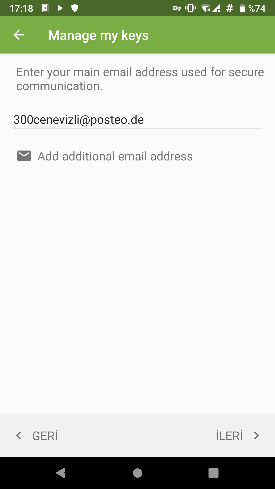

* Anahtarınızı oluşturmadan önce, isminiz ve e-postanızın gösterildiği aşamada anahtarınızı "Anahtar sunucusuna gönder" (Publish on keyserver) seçeneği görülecektir. Şayet anahtarınızı e-posta yazışması için kullanılmasını istiyorsanız bu seçeneği işaretleyerek devam edebilirsiniz.

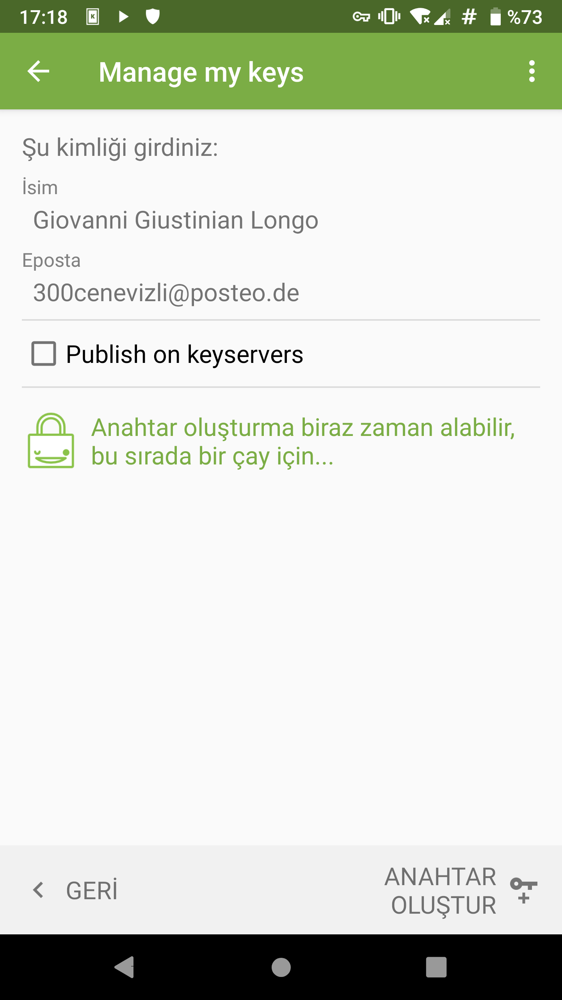

__ÖNEMLİ NOT:__ Anahtar sunucusuna yüklediğiniz anahtarlar **SONSUZA** kadar sunucularda kalacaktır. Bu bakımdan anahtarınızı kullanacağınızdan ve/veya anahtarı iptal etmek için gerekenlere sahip olduğunuzdan emin olmadan anahtarı sunuculara göndermeyin. Gizli anahtara ve parolasına veya bir iptal sertifikasına sahip değilseniz sunucudaki anahtarlar son kullanma tarihine kadar geçerli kalır.

* Anahtarınızı üretmeye geçmeden, sağ üst köşede bulunan menüden "Anahtar yapılandırmasını değiştir" seçeneğini seçerek anahtarınızın bazı standart ayarlarını değiştirmek isteyebilirsiniz.
**Parola:** OpenKeychain üretilen anahtarlara bir parola ile korumamaktadır. Bu sebepten bir [**zarola**](https://zarola.oyd.org.tr) ile anahtarınızı şifrelemenizi öneririz.
**Alt Anahtarlar:** OpenKeychain standart olarak en yüksek güvenlikteki anahtar boyutu olan 4096 bit kullanmamakta. Bunu şifreleme hızı için yapsa da uzun vadede kullanacağınız anahtarlarınızın boyutunun 4096 bit olması uzun vadede faydalı olabilir. Dilerseniz bu aşamada SSH gibi yetkilendirme sistemlerinde kullanılmak üzere başkaca bir alt anahtar daha ekleyebilirsiniz.

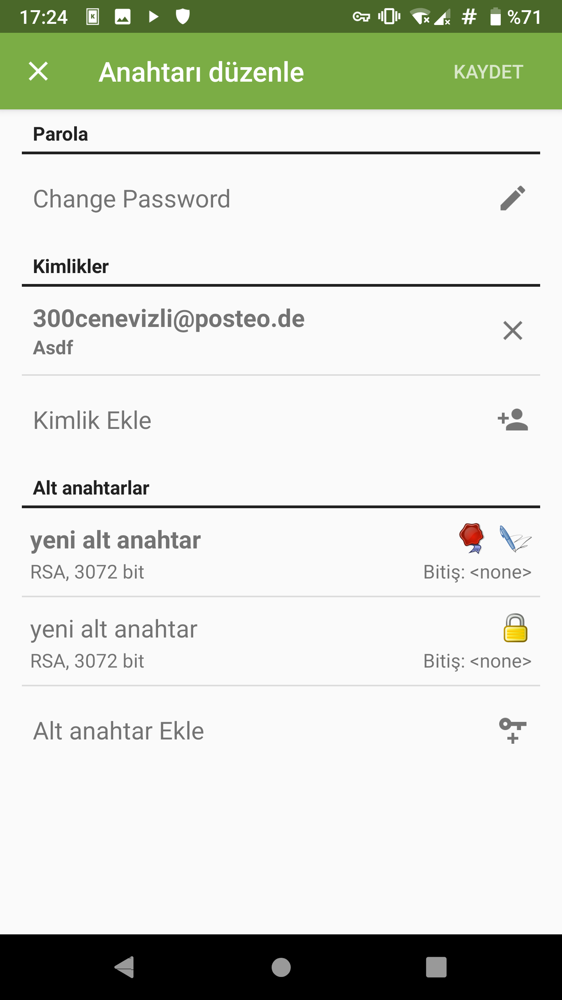

* Anahtar oluştur düğmesine tıklayarak anahtarınızı oluşturmaya başlayabilirsiniz. Cihazınız gerekli sihirli işlemleri yaptıktan sonra OpenKeychain'in ana sayfasında kişisel anahtarınız ile karşılaşacaksınız.

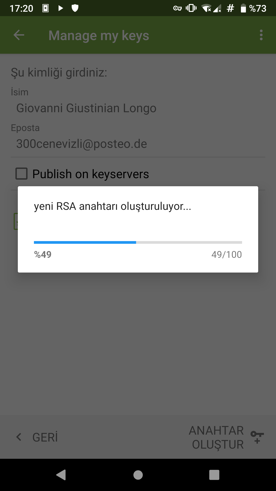
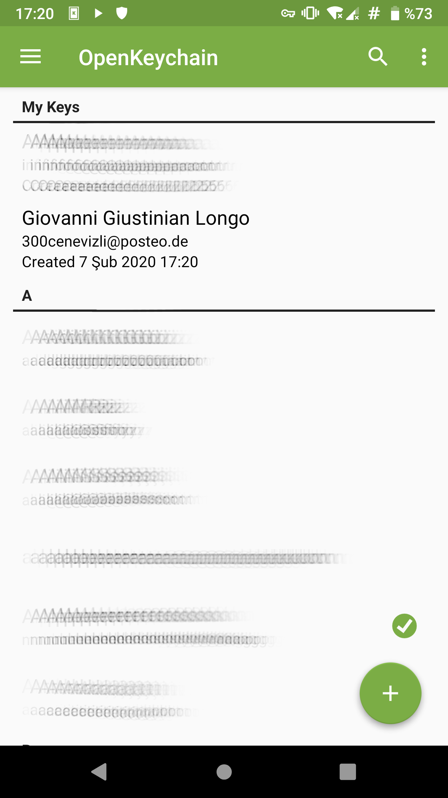

Tebrikler artık kullanılabilir bir GnuPG anahtarınız var! Artık hem e-postalarınızı hem de dosyalarınızı şifreleyebileceğiniz dünyaca güvenilen bir yazılımı kullanabilir konumdasınız. Bu bilgiyi çevrenizle paylaşın ve onların da kendi anahtarlarını üretip sizinle iletişime geçebilmesine yardımcı olun.
