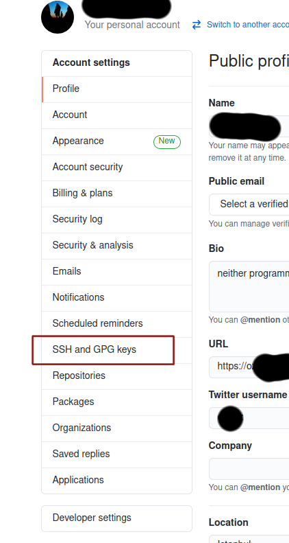
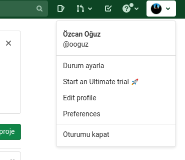
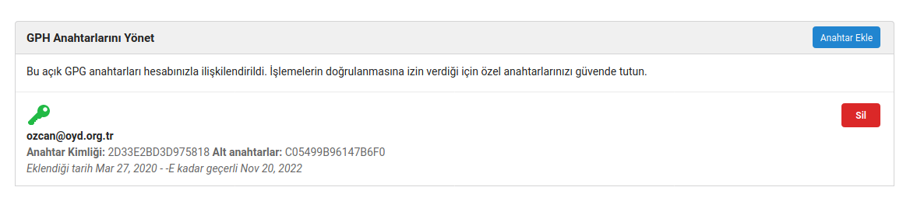

# GnuPG ile Git kullanımı

GnuPG'nin en önemli özelliklerinden biri, imzalama yoluyla bütünlük ve kimlik doğrulaması yapılabiliyor olmasıdır. Bu özelliğinden yararlanmak için GnuPG, Git ile entegre edilebilmekte ve Git commit'leri GnuPG anahtarıyla imzalanabilmektedir. Pek çok Git önyüzü dahili olarak GnuPG destekler.

Git commit'leri GnuPG ile imzalandığında ilgili kodu yazan kişinin gerçekten istenen kişi olduğu doğrulanmış olur ve böylece projeye istenmeyen kodların sokulması veya olası bir giriş bilgilerinin çalınması durumunda projenin sabote edilmesi engellenir.

## GitHub'a GnuPG anahtarının eklenmesi

GitHub üzerinde GnuPG ile imzalanmış commit'lerin gözükmesi için öncelikle GitHub hesabınıza GnuPG anahtarınızı eklemeniz gerekir. Bunun için hesabınıza giriş yaptıktan sonra, sağ üst köşedeki profil fotoğrafınıza tıklayıp, "Settings"e basın.


Ardından açılan ayarlar sayfasında sağdaki menüde bulunan "SSH and GPG Keys" sayfasına gidin. 



Bu sayfada yer alan "New GPG Key" butonuna basın ve çıkan kutuya GnuPG **açık anahtarınızı** (public key) yapıştırın. Açık anahtarınızı anahtar sunucularından kolayca kopya-yapıştır yapabilir ya da `gpg --export --armor <key-id> | xclip` komutunu çalıştırdıktan sonra orta fare tuşuyla yapıştırabilirsiniz. Ardından "Add GPG Key" butonuna tıklayın.


Parolanızı girdikten sonra anahtarınız GitHub hesabınıza eklenecektir.


Bu noktadan itibaren artık depolara attığınız commitler aşağıdaki gibi doğrulanmış olarak gözükecektir.


## GitLab'a GnuPG anahtarının eklenmesi

GitLab'a giriş yaptıktan sonra sağ üst köşedeki profil fotoğrafınıza tıklayıp "Preferences" seçeneğini seçin.



Ardından açılan ayarlar sayfasında sağ tarafta bulunan "GPG Anahtarları" bağlantısına tıklayın.


Gelen sayfada bulunan kutuya GnuPG **açık anahtarınızı** (public key) yapıştırın ve "Anahtar ekle" butonuna basın.


Parolanızı girdikten sonra eklenmiş anahtarı görebilirsiniz.


Bu noktadan itibaren artık commitleriniz aşağıdaki gibi doğrulanmış olarak görünecektir:


## Gitea'ya GnuPG anahtarının eklenmesi

Gitea'ya giriş yaptıktan sonra sağ üst köşedeki profil fotoğrafınıza tıklayın ve açılan menüde "Ayarlar" butonuna basın.


Ardından açılan ayarlar sayfasında yukarıdaki barda yer alan "SSH/GPG Anahtarları" bağlantısına tıklayın.


Açılan sayfada "GPG Anahtarlarını Yönet" kısmından "Anahtar ekle" butonuna basın, aşağıda çıkan kutuya **açık anahtarınızı** (public key) yapıştırın.


Parolanızı girdiğinizde anahtarınız eklenmiş olacaktır.



Bu noktadan itibaren imzalanmış commitleriniz aşağıdaki gibi görünecektir:


## Git ile commitlerin imzalanması

Git commitlerinizi GnuPG ile imzalamak için öncelikle Git yapılandırmasına imzalama yapacağınız anahtarın ID'sini vermeniz gerekir. GnuPG anahtarınızın ID'sini öğrenmek için aşağıdaki komutu çalıştırabilirsiniz:

`gpg --list-secret-keys --keyid-format LONG`

Şu şekilde bir çıktı almanız gerekir:

```
sec>  rsa4096/2D33E2BD3D975818 2017-11-21 [SCA] [son kullanma tarihi: 2022-11-20]
      D854D9D85CB4910704BD9C5B2D33E2BD3D975818
      Kart seri no. = 0006 09717516
uid                 [   son  derece   ] Özgür Yazılım Derneği <bilgi@oyd.org.tr>
ssb>  rsa4096/C05499B96147B6F0 2017-11-21 [E] [son kullanma tarihi: 2022-11-20]
```

Burada yer alan `2D33E2BD3D975818` anahtar ID'nizdir.

Aşağıdaki komutu çalıştırarak GnuPG anahtarınızı Git yapılandırmasına ekleyebilirsiniz:

`git config --global user.signingkey 2D33E2BD3D975818` _(kendi anahtar ID'nizle değiştirmeyi unutmayın)_

GnuPG anahtarınız Git yapılandırmanıza eklenmiş oldu. Bu noktadan itibaren, commit atarken `-S` parametresi verdiğinizde commitiniz imzalanacaktır. Örneğin:

`git commit -S -m "Fix #41"`

Eğer tüm commitlerinizin varsayılan olarak imzalanmasını istiyorsanız aşağıdaki komutu çalıştırabilirsiniz:

`git config --global commit.gpgsign true`

Eğer imzalama yapmaya çalıştığınızda GnuPG hata veriyorsa, `gpg` yerine `gpg2` kullanıyor olma ihtimaliniz vardır. Bunu çözmek için aşağıdaki komutu kullanabilirsiniz:

`git config --global gpg.program gpg2`


