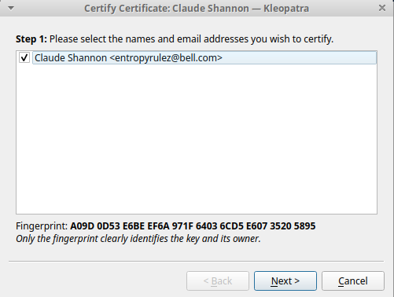

# Kleopatra ile GPG İşlemleri

[Kleopatra](https://kde.org/applications/en/utilities/org.kde.kleopatra) tüm işletim sistemleri ile kullanılabilir bir GPG önyüzüdür. [Kolay GPG anahtar üretimi](gpg-anahtar-uretimi.md) rehberinde kullanılan bu yazılım aynı zamanda GPG ile yapılabilen kimi kriptografik işlemleri de kullanıcılarına sunmaktadır.

Kleopatra'yı yüklemek için aşağıdaki komutları kullanabilir veya dağıtımınızın grafik yükleyicisini kullanabilirsiniz;

Debian/Ubuntu (APT): `sudo apt-get install kleopatra`

Red Hat/Fedora (RPM): `sudo yum install kleopatra`

Microsoft Windows   : [Gpg4win](https://www.gpg4win.org/download.html)

## Şifreleme ve İmzalama

Kleopatranın ana ekranından `İmzala/Şifrele ve/veya Doğrula` düğmesi veya `Dosya/İmzala/şifrele ve/veya Doğrula` sekmesi üzerinden şifreleme ve/veya imzalama işlemine başlayabilirsiniz. Kleopatra size öncelikli olarak hangi dosyaya işlem yapmak istediğinizi soracaktır ve ardından size seçenekleri gösterecektir.

Bu bölüm üç temel bölüme ayrılmıştır:

* İmzalama

- Dosyayı imzalamak için ilk bölümdeki kutunun seçilmesi ve sahip olunan özel anahtarlardan birinin yanda bulunan menüden seçilmesi gereklidir. Önünüzdeki pencereden sadece imzalama seçeneği seçili olur ise şifreleme yapılmadan sadece dosyaya ilişkin bir imza dosyası oluşturulacak ve aynı dizine .sig uzantısı ile kaydedilecektir.

* Şifreleme

- Dosyayı asimetrik şifrelemek için "Başkası içn şifrele" seçeneği seçilerek buraya umumi anahtarlar arasında bulunan bir anahtarın ismi veya e-posta adresi girilmeldir. Şayet bu aşamada "Benim için şifrele" seçeneğini seçer iseniz şifrelenen dosyayı daha sonra tekrar açmanız mümkün olur. Aksi takdirde şifrelenen dosya bir daha sadece şifrelenen kişi tarafından açılabilecekir.

- Şayet şifrelemeyi bir parola ile simetrik olarak yapmak isterseniz "Parola ile şifreleme" kutusunu seçerek ilerlemeniz mümkündür. Şayet hem üst bölümde asimetrik şifrelemeyi hemde parola ile şifrelemeyi seçerseniz dosya her iki türlü de açılabilecektir.

* Çıktı (Dosya/Dizin seçimi)

- Çıktı Kleopatranın size ilk aşamada sorduğu dosyadır.

## Anahtar yönetimi

Kleopatra ana ekranında cihazda bulunan tüm GPG anahtarlarını listeler. Bu listenin kapsamını arama barının sağ tarafındaki menüden değiştirebilirsiniz.

Anahtar yönetimine ilişkin ayarlara erişmek için ilgili anahtara çift tıklayın veya sağ tıklayıp menün en altındaki "ayrıntılar" sekmesini seçin. 

### Anahtar imzalama

Anahtarı, kendinize ait bir anahtar ile imzalamak için görülen e-posta adresine sağ tıklayıp "onayla" seçeneğini seçin. Alternatif olarak bu işlemi ana menüde yine ilgili anahtarın üstüne sağ tıklayıp "onayla" seçeneğini seçerek de gerçekleştirebilirsiniz. Seçiminizi yaptıktan sonra karşınıza imza sayfası çıkacaktır.

İmza sayfasından "next" düğmesi ile devam edip imza seçeneklerinin listeleneceği bölüme geçebilirsiniz.

Bu bölümde iki tercihiniz bulunmakta:

* Sadece benim için onayla: Cihazınızın yerel güven veri tabanına bu anahtarın güvenlilir olduğunu kaydedecektir. Bu güven ilişkisi bu anahtara sahip olan başkaları tarafından görülmeyecektir.

* Görebilen herkes için onayla: Bu seçenek anahtarı kriptografik olarak imzalayacak ve anahtarın sizdeki kopyasını elde eden herkes tarafından doğrulanabilecektir. Şayet "sunucuya gönder" seçeneğini seçer iseniz imzalanmış anahtarı sunucuya yükleyerek bu güven ilişkisini tüm dünya ile paylaşabilirsiniz.

**ÖNEMLİ NOT:**Sunucuya gönderilen bilgiler daha sonra silinemez sadece geri alınabilir. İmzanızı sunucu ile paylaşırsanız duyduğunuz güveni ve ilişkiyi herkes ile paylaşmış olursunuz. Bu imzayı daha sonra geri alabilirsiniz ama imzanın bir zamanlar var olduğu her zaman sunucuda kayıtlı kalır.

### E-posta adresi ekleme

Her yeni e-posta ile yeni bir anahtar oluşturmanız gerekmemekte. Bu sebeple yeni edindiğiniz bir e-posta adresinin bu anahtar ile kullanılabileceğini belirtmek için anahtarınızın kimlikleri arasında yeni bir e-posta adresi ekleyebilirsiniz. Bunun için "E-posta adresi ekle" düğmesine tıklayın. Karşınıza gelen sayfaya e-posta adresini girip ekleme işlemini tamamlayabilirsiniz.

Tercihen bir yorum veya farklı bir isim girmek için "gelişmiş" seçenekleri açıp ekleme işlemini bu şekilde de yapabilirsiniz.

### Parola değiştirme

Anahtarınızın parolasını kötü bir çeviri ile "Parola metnini değiştir" düğmesi aracılığı ile değiştirebilirsiniz. Bu düğmeyi tıklamanız üzere Kleopatra size şu anda kullandığınız parolayı soracak ve ardından yenisini girmenizi isteyecektir.

### İptal sertifikası oluşturma

Anahtarınızın kontorlünü bir gün parolasını unutmanız veya anahtar dosyasını kaybetmeniz gibi bir sebeple yitirmeniz durumuna karşı bir iptal sertifikası oluşturabilirsiniz. İptal sertifikası bir anahtar gibi sunucuya yüklendiğinde ilgili olduğu anahtarı kullanılmaz olarak işaretlemeye yarar. Kısa bir anahtara benzeyen bu dosyayı kötü günlere karşı üretip bir kenara koymanız önerilir. Bunun için [kağıt yedek](paperbackup.md) rehberindeki yöntem önerilir.

Anahtarınıza ilişkin iptal sertifikasını "iptal sertifikası oluştur" düğmesine tıklayıp kaydedilmesini istediğiniz ismi açılan pencerede belirleyerek oluşturabilirsiniz.

### Anahtarın vadesini değiştirmek

GPG anahtarları belirli bir süre sonra kullanılmaz olarak işaretlenebilirler. Bu anahtarın kontrolünü kaybetmeniz durumunda yenileme işlemini yapamamanız sonucunda gerçekleşir. Bu süreyi dilediğiniz gibi ayarlayabilirsiniz. Bir veya iki yıl uygun bir süre olarak öngörülebilir.

Ayarı yapmak için "bitiş tarihi" sütünunun yanındaki düğmeyi kullanarak açılan takvimden yeni tarih belirleyebilirsiniz.

### İmzaları incelemek

GPG anahtarları başka kullanıcıların anahtarları imzalanarak güven ağı oluşturulur. Bu imzaları görerek anahtara imza atan diğer anahtarları incelemek için "Certification" düğmesini tıklayarak ilgili bölümü açmanız mümkündür.

## Umumi anahtarı dışa çıkartmak

Kleopatra ana menüsünde bir anahtarın üzerine sağ tıklayı "Dışa aktar" seçeneğini seçerek umumi anahtarı bir dosyaya kaydetmek mümkündür. Bu sayede anahtar şifreleme yapmak üzere dağıtılabilir ve e-posta gibi iletişim araçları ile paylaşılabilir.

## Özel anahtarı dışarı çıkartmak

Umumi anahtar gibi özel anahtar da aynı menüden "Gizli anahtarı dışa aktar" seçeneği ile bir dosyaya kaydedilebilir. Kleopatra sizden bu işlemi gerçekleştirmek için anahtarın parolasını talep edecektir.

**ÖNEMLİ NOT:** Özel anahtar güvenliğiniz için çok önemlidir. Bu anahtarı ele geçiren bir kişi sizi taklit edebilir ve şifrelediğiniz dosyaları açabilir. Bu sebeple bu anahtarı kimse ile paylaşmamalı ve anahtar dosyalarını çok dikkatli saklamalısınız.

## Sunucuya anahtar göndermek

Hem kendi umumi anahtarınızı hem de diğer umumi anahtarları, anahtar sunucularına göndermeniz mümkündür. Bunu bir anahtarı imzaladığınızda veya anahtarınızda değişiklik yaptığınızda değişikliklerinizi ilan etmek için yapmalısınız. Bir anahtarın üstüne sağ tıkladıktan sonra açılan menüden "sunucuya gönder" seçeneği ile işlemi gerçekleştirebilirsiniz.

Kleopatra haklı olarak aşağıdaki uyarıyı karşınıza çıkaracaktır. Uyarıyı dikkate alarak hareket etmeniz tavsiye edilir.

## Sunucuda anahtar aramak

Kleopatra ile bir e-postaya ait anahtarı anahtar sunucularında arayabilirsiniz. Bunun için Kleopatra'da Dosya menüsünden "sunucuda ara" seçeneğini seçip karşınıza gelen ekrande isim veya e-posta adresi ile arama yapıp dilediğiniz anahtarı "içeri aktar" düğmesi ile indirebilirsiniz.

Kleopatra herkese açık sunuculardan indireceğiniz bir anahtarın ismi yazan kişiye veya e-postaya ait olmadığına dair haklı bir uyarıyı size gösterecektir. Bu uyarıya uygun olarak anahtarlarınızı belirtilen şekillerde doğrulamanız veya imza kontrolü yapmanız önerilir.

