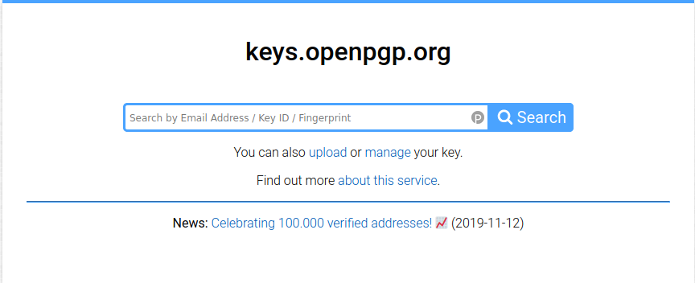
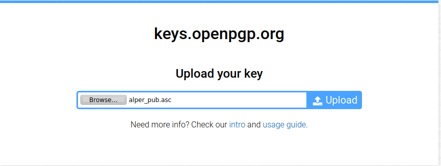
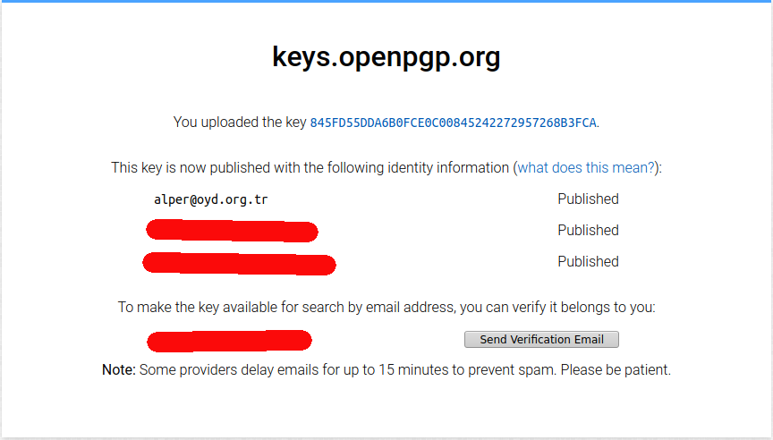

# Web Key Directory ile GPG Anahtarı Paylaşımı

GPG ile e-posta şifrelemenin bugüne kadar en dertli görülen ve eleştirilen yönü yazışılan kişilerin anahtarlarının güvenli şekilde bulunması ve kullanılması olmuştur. Keza [güven ağı(WOT)](wot.md); kullanıcıların bilinçli olarak birbirlerinin anahtarlarını imzalamalarını ve sunuculara yüklemesini, bu ağa dahil olmayan birinin de anahtarı bilinçli bir çaba ile kimi zaman karmaşık süreçlerden geçerek bulması, indirmesi ve kullanmasını gerektirmekte. Hala bu güven ağı sistemi kullanıcıya en fazla özerkliği veren en dağıtık güven sistemi olmakla birlikte anahtar keşfinin zorluğu kimi zaman e-postaların şifreli olması ile olmaması arasındaki farkı belirlemekte.

[Web Key Directory(WKD)](https://wiki.gnupg.org/WKD) yeni bir anahtar keşif yöntemi olarak GPG kullanımını çok kolay ve otomatize bir hale getirmeyi hedeflemektedir. WKD basit bir mantığa dayanır: her e-posta adresinin bir alan adı vardır; örneğin, "@oyd.org.tr". Bu alan adını tarafından işaret edilen sunucuda belirli bir dizinin altında GPG anahtarının bulunması durumunda WKD destekleyen e-posta istemcileri ve hizmet sağlayıcıları bir e-posta adresine ait anahtarı otomatik olarak elde edebilmekte. Bu sayede kullanıcıya sadece e-posta adresini yazmak ve "şifrele" demek kalmakta.

## WKD Kurulumu

### Openpgp.org aracılığı ile

Eğer alan adınıza ait bir sunucunuz yok ise bir alan adı kaydı girerek keys.openpgp.org sunucularının anahtarınızı talep edenlere sunmasını sağlayabilirsiniz. Bunun için öncelikle anahtarınızı openpgp.org sunucularına yüklemelisiniz.

**NOT:** keys.openpgp.org anahtar sunucuları klasik güven ağının temeli olan sunucu federasyonuna kapalıdır. [Bu güvenilirlik, kötüye kullanımı engellemek ve mahremiyet gerekçeleri ile temellendirilmektedir.](https://keys.openpgp.org/about/faq) Bu sebepten Openpgp.org sunucularındaki anahtarlar diğer sunucularla eşitlenmez.

**NOT2:** Aynı zamanda bu anahtar sunucusu anahtar talepleri üzerinden yazışma trafiğinizin üstverisine erişebilir. Bu sebepten bir mahremiyet endişesi doğmaktadır.

Alan adınızın ayarlarından aşağıdaki şekilde bir CNAME kaydı girmelisiniz:

`openpgpkey.(alanadınız)   CNAME   wkd.keys.openpgp.org`

DNS ayarlarında CNAME kaydını "tip" olarak adlandırılan bölüme girmelisiniz. "Name" yani isim bölümüne "openpgpkey(alanadı)" şeklinde (ör:openpgpkey.oyd.org.tr) giriş yapmalısınız. "Target" yani hedef olarak adlandırılan alana da "wkd.keys.openpgp.org" girişi yapılmalı.

Bu ayarı gerçekleştirdikten sonra DNS yöneticinizin yenileme süresine bağlı olarak DNS yönlendirmeniz yapılacaktır. Bunu denetlemek için aşağıdaki komutu uçbirimde çalıştırabilirsiniz.

`drill openpgpkey.(alanadınız)`

Şayet "ok" cevabı alırsanız DNS kaydınız sorunsuz şekilde çalışmaktadır.

DNS kaydının ardından [openpgp.org](https://keys.openpgp.org) sunucusuna anahtarınızı yüklemeniz gereklidir. Bunun için öncelikle umumi anahtar dosyanızı çıkartmanız gereklidir. Bu konuda yardım almak için [Uçbirimde GPG işlemleri](ucbirim_gpg.md) ve [Kleopatra GUI ile GPG işlemleri](gui_gpg.md) rehberlerinden yardım alabilirsiniz.

Anahtarınızı yüklemek için sunucunun web sayfasındaki upload(yükle) bağlantısına tıklayıp anahtarınızı yükleyebilirsiniz.

Anahtarınızı yüklemenizin ardından openpgp.org sizden anahtarınızda bulunan e-posta adreslerine bir doğrulama e-postası atarak sizden doğrulama talep edecektir.

Bu işlemleri gerçekleştirmeniz ardından anahtarınız sunucuda listelenmeye başlayacaktır. Tek yapmanız gereken açılış ekranındaki arama barından **tam e-posta** adresi ile arama yapmak.

### Kendinize ait sunucunuzda

[Buraya katkı verebilirsiniz](https://oyd.org.tr)

## WKD destekleyen e-posta sağlayıcılar

Giderek yaygınlık kazanmakta olan WKD kimi e-posta sağlayıcılar tarafından otomatik olarak desteklenmeye başlamıştır. Aşağıdaki e-posta sağlayıcıların [gnupg.org](https://wiki.gnupg.org/WKD) listesinde WKD desteklediği belirtilmiştir.

[Posteo](https://posteo.de)

[Protonmail](https://protonmail.com)

[netzguerilla](https://netzguerilla.net/)
