# Kmail ile GPG Şifreli E-posta

<!-- toc -->

Kmail GNU/Linux dağıtımlarında yaygın olarak kullanılan KDE masaüstü ortamının e-posta istemcisidir. KDE'nin diğer e-posta istemcilerine göre avantajı herhangi bir eklenti veya ayar gerektirmeden GPG desteği vermesi. Bu bakımdan GPG şifreli imzalamaya bilgisayar üzerinden giriş yapmanın en kolay yolu sayılabilir.

## Kmail kurulumu

Kmail'i bilgisayarnıza işletim sisteminizin paket yöneticisinden kolaylıkla kurabilirsiniz. Şayet KDE masaüstü ortamını kullanmıyorsanız KDE'ye özel birtakım bağımlılıkları da indirmeniz ve kurmanız gerekeceğinden kurulum boyutunuz bir miktar büyüyebilir.

Bilgisayarınıza Kmail kurulumu yapmak için:

Debian tabanlı dağıtımlarda

`sudo apt-get install kmail`

RPM tabanlı dağıtımlarda (fedora, centos)

`sudo yum install kmail`

Kurulum tamamlandıktan sonra Kmail cihazınızda çalışmaya hazır olacaktır.

## Kmail Sihirbazı

Kmail ilk açılışta kurulum sihirbazı başlatacaktır. Bu sihirbaz ile yeni bir e-posta hesabı ekler iken bu hesaba ilişkin bir GPG kurulumu da yapılacaktır. Kuruluma e-posta hesabınızın bilgilerini girmek ile başlayabilirsiniz. Şayet e-posta sağlayıcınız Mozilla veri tabanında bulunursa otomatik olarak ayarları yapılacaktır.

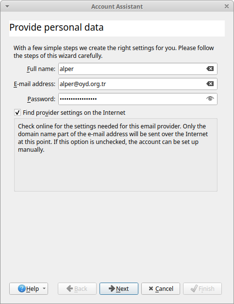

Şayet işletim sisteminizde hali hazırda girdiğiniz e-posta adresine ait bir GPG anahtarı var ise Kmail otomatik olarak bunu bulacak ve size ilişkilendirilmek üzere gösterecektir.

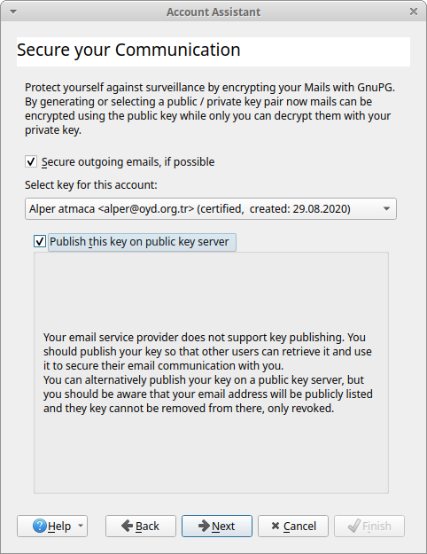

Bir GPG anahtarınız yok ise Kmail size bir anahtar oluşturmayı veya var olan bir anahtarı içe aktarmayı önerecektir.

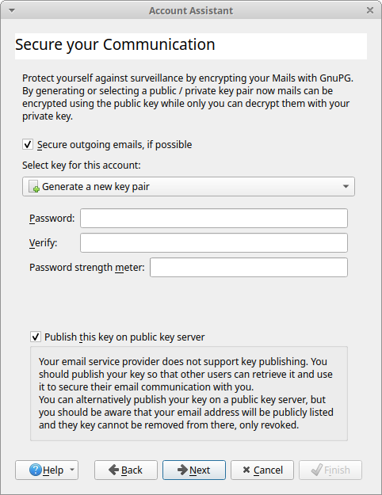
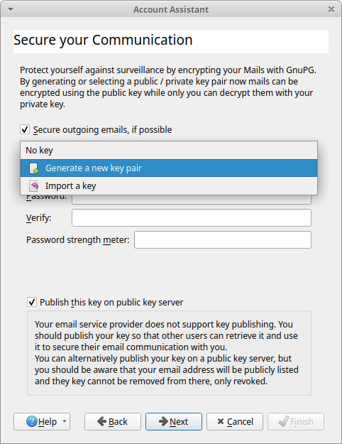

Bir parola belirleyip anahtar kurulumunuzu "next" tuşu ile ilerleyerek başlatabilirsiniz. GPG anahtarınızın güvenliği bu parolaya bağlı olacağı ve e-postalarınızı okumak için bu parolayı belirli aralıklarla girmeniz gerekeceğinden hem güvenli hem de hatırlanabilir bir parolaya ihtiyacınız bulunmakta. Kmail bu noktada bir parola gücü ölçeri bulunduruyor olsa da bu parolanızın güvenliği konusunda çok kısıtlı bir görev görebilir. GPG parolası olarak [**Zarola**](https://zarola.oyd.org.tr) kullanmanız hararetle tavsiye edilir.

**ÖNEMLİ NOT:** Şayet bu anahtarı kullanmaya ve saklamaya hazır değilseniz veya sadece bir deneme yapıyorsanız paroladan sonra gelen "publish this key on public key server" tıkını kaldırmanız önerilir. Keza sunucuya yüklenen GPG anahtarları bir daha silinemez sadece iptal edilebilir. Bu konuda detaylı bilgi almak için [GPG rehberine](gpg/gpg.md) danışabilirsiniz.

Ayarlarınızı tamamladıktan ve anahtarınızı belirledikten sonra Kmail sunucu ayarlarınızın bulunamamış olması durumunda yapmanız için aşağıdak seçenekler sunacaktır. Buradan Generic IMAP veya POP3 tercih edilebilir.

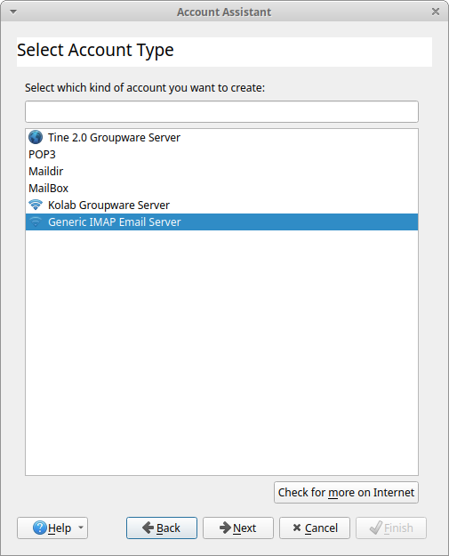

Sunucu adresleri girildikten sonra "next" düğmesi ile devam edebilirsiniz.

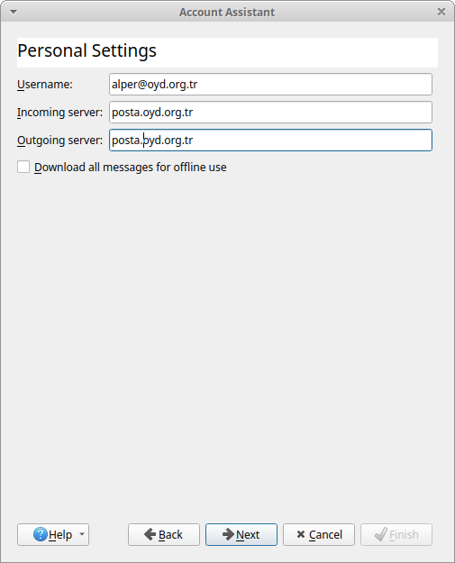

Her şey yolunda giderse kurulumunuz başarılı olarak tamamlanacak ve Kmail'in anasayfasına dönebileceksiniz.

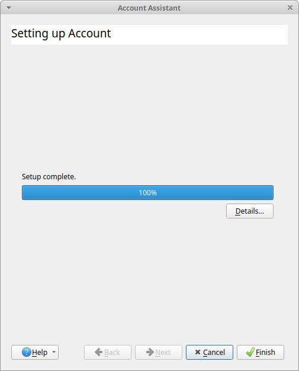

## Kmail ile şifreli e-posta atmak

Kmail kurulumu tamamlandıktan sonra GPG ile e-posta atmaya ve almaya hazırsınız demektir. Bunun için yeni bir eposta açın.

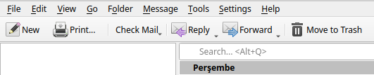

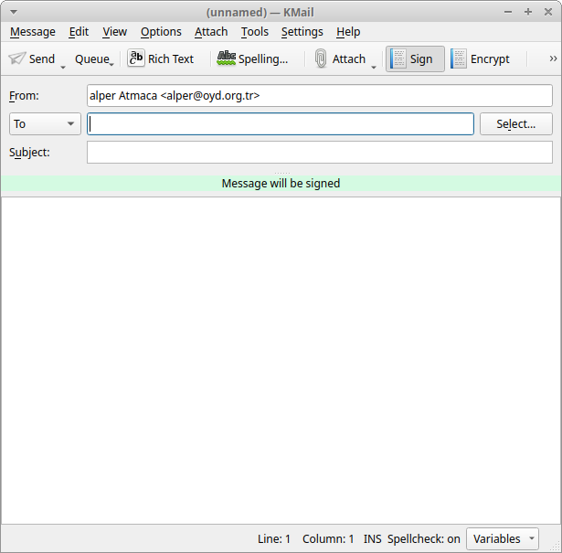

Karşınıza gelecek yeni mesaj ekranında şifreleme hali hazırda açık olacaktır. Şayet GPG anahtarlığınızda ilişkilendirilmiş bir e-posta adresini alıcı olarak girerseniz otomatik olarak Kmail e-postayı şifreleme seçeneğini de açacaktır.

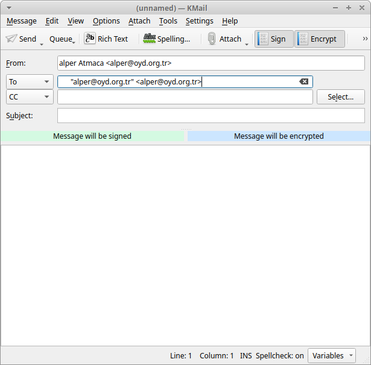

Şayet GPG anahtarı yönetimi konusunda yardım ihtiyacınız var ise yine bir KDE yazılımı olan [Kleopatra ile GPG işlemleri](gpg/gui_gpg.md) rehberinden yardım alabilirsiniz. 

Gönder demeniz ile birlikte e-postanız şifrelenip imzalanarak karşı tarafa gönderilecektir.

## Şifreli e-postayı açmak

Kmail şifreli gelen e-postaları otomatik olarak deşifre etmeyi önerecektir. "Decrypt" seçeneğini seçmeniz üzerine Kmail parolanızı size soracak ve ardından e-postayı deşifre edecektir.

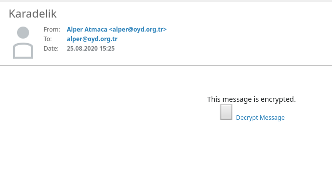
