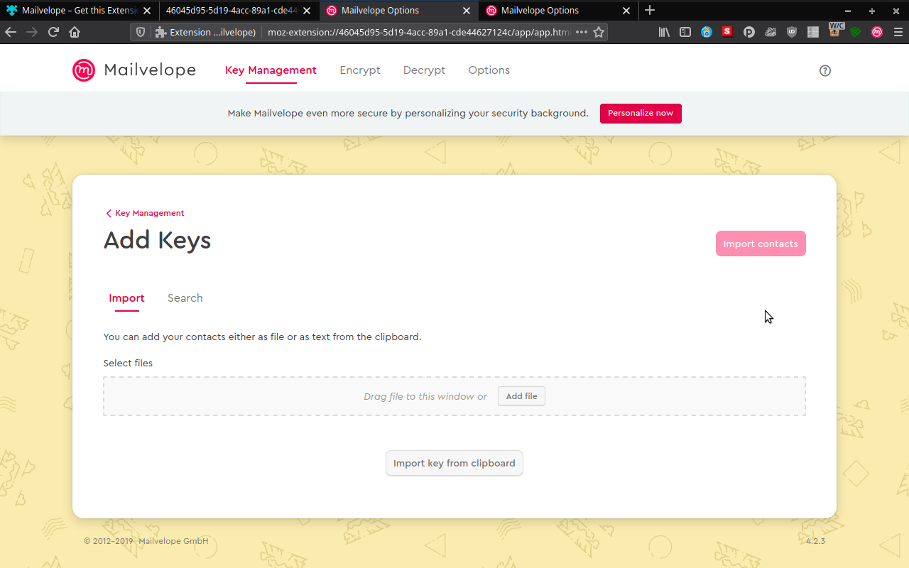
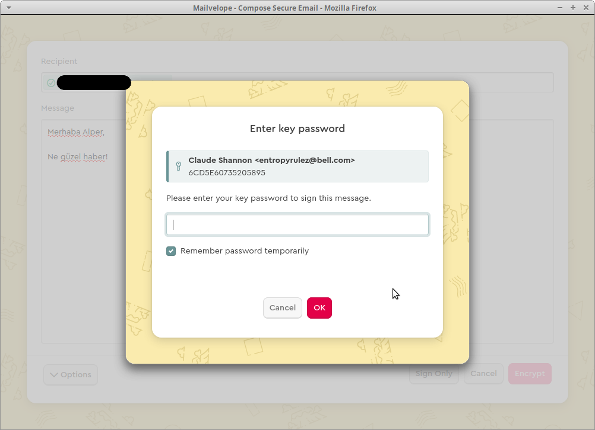

# Mailvelope ile Webmail Üzerinde Şifreleme

Mailvelope özgür bir tarayıcı eklentisi olarak webmail olarak tarayıcı üzerinde kullanılan e-posta hizmetleri ile GPG şifreli e-postalaşmaya imkan sağlar. Mailvelope kullanarak e-posta kullanım alışkanlıklarınızda fazla değişikliğe gitmeden güvenli yazışma yapmaya kolaylıkla başlayabilirsiniz.

Her halukarda şifreli e-posta kullanmanın görece en güvensiz yolunun bir tarayıcı eklentisi kullanmak olduğunu belirtmek gereklidir. Bu yöntem ile sizin ile iletişiminiz arasında fazlasıyla yazılıma güven duymanız gerekmektedir. Tarayıcınız, eklenti ve kullandığı diğer sistemler diğer şifreleme yöntemlerine göre daha geniş bir saldırı alanına sahiptir. Bu bakımdan basitçe mahremiyetinizi korumaktan fazlasına ihtiyacınız var ama görece sorunsuz bir şifreleme istiyorsanız [Thunderbird ve Enigmail](thunderbird_enigmail.md) ile şifrelemeyi tercih edebilirsiniz.

## Mailvelope kurulumu

Başlangıç olarak Mailvelope'u tarayıcınıza bir eklenti olarak kurmalısınız. Bunun için tarayıcınızın sağladığı eklenti yöneticisinden arama yaparak ilgili bağlantı aracılığı ile kurulumu kolaylıkla gerçekleştirebilirsiniz.

Kurulumun ardından Mailvelope sizi şifreleme için gerekli kurulumu tamamlamak üzere menüsüne yönlendirecek sayfayı açacaktır. "Let's start" düğmesi ile ayarları yapmaya başlayabilirsiniz.

Açılan ilk sayfa sizi anahtar üretmek veya var olan anahtarınızı içe aktarmak için gerekli iki temel ayarı içermektedir. Şayet bir anahtarınız yok ise burada hızlıca üretebilir veya [Kolay GPG anahtarı üretimi](gpg/gpg-anahtar-uretimi.md) ile daha gelişmiş seçeneklerle [İleri GPG anahtarı üretimi](gpg/gpg_gelismis_anahtar_uretimi.md) rehberlerimizden faydalanıp ürettiğiniz anahtarı daha sonra Mailvelope'a aktarabilirsiniz.

Bir GPG anahtarınız olduğu varsayımı ile bu anahtarı içe aktarmak için `Import Key` düğmesine tıklayarak anahtar yönetimine gidin.

Açılan anahtar yönetimi sayfasında hem umumi hem özel anahtarların yüklenmesi mümkündür. Bu aşamada kendi özel anahtarımızı yükleyeceğimiz için `Add file` seçeneğini seçip anahtar dosyasını bulunduğu dizinden seçin. Gelen başlıktan doğru anahtarı yüklediğinize emin olup "confirm" düğmesine tıklayarak onaylayın.

Anahtarın başarılı şekilde içe aktarılması durumunda Mailvelope sizi bir başlıkla bilgilendirecektir.

Bu noktadan sonra Mailvelop'da bir özel anahtarınız bulunmakla size gelen şifreli e-postaları açmaya hazırsınız.

## E-posta alan adının yetkilendirilmesi

Mailvelope hangi alan adlarında çalışacağına dair izin istemektedir. şayet önceden e-posta hizmet sağlayıcı olarak Mailvelope tarafından tanınan e-postalardan birini kullanmıyorsanız (ör: Riseup) e-postanıza tarayıcınızdan gidiğinizde Mailvelope'ı bu alan adına yetkilendirmeniz gereklidir.

Bunu yapmanın en kolay yolu e-postanıza girip Mailvelope eklenti simgesine tıklayıp "Authorize this domain" tuşu ile alan adını yetkilendirmektir.

## Gelen şifreli e-postayı açmak

Size gelen şifreli e-postaları Mailvelope bu aşamadan sonra otomatik olarak algılayacaktır. Gelen bir e-postayı açtığınızda Mailvelope şifreli veriyi görecek ve size bu mesajı görmek isteyip istemediğinizi soracaktır. "Show message" düğmesi ile mesajı görüntülemeyi seçin ve ardından gerekiyor ise anahtarınızın parolasını girin.

## Şifreli e-posta göndermek

### Yazışılacak kişinin umumi anahtarını bulmak

İlk e-postanızı aldıktan sonra sıra şifreli olarak cevap vermekte. Bunu yapmadan önce yazışmak istediğiniz kişiye ait umumi anahtarı Mailvelope'a göstermeniz gereklidir. Mailvelope otomatik anahtar tanıma seçeneklerine sahip olmadığından bunu her kişi için en az bir kere tekrar etmeniz gerekli.

Mailvelope eklenti sembolünden "keyring(anahtarlık)" simgesine tıklandığında anahtar yönetimine ulaşılır. Buradan "import" seçeneğine tıklayarak bir anahtar eklemek mümkündür.

Şayet kişi size anahtar dosyasını e-posta ekinde gönderdi veya siz bu anahtarı [başka yollardan](gpg/ucbirim_gpg.md) elde ettiyseniz ilgili dosyayı bu aşamada gösterip eklemeniz mümkündür. Aksi halde bir [anahtar sunucusunda](https://en.wikipedia.org/wiki/Key_server_(cryptographic)) arama yaparak anahtarı bulabilirsiniz. Bunun için "search" sekmesine gelip arama bölümüne girin.

Arama tuşuna basmanızla Mailvelope standart [Ubuntu anahtar sunucusunda](https://keyserver.ubuntu.com) aramaya yaparak sonuçlar size gösterecektir. Anahtar sunucularındaki anahtarların doğruluğunu belirleyen bir otorite olmadığından buradaki **anahtarların doğruluğuna şüphe ile yaklaşmalısınız**. Bir kişinin adı e-posta adresi ile herkes bir anahtar oluşturup sunuculara yükleme imkanına sahiptir. Bu neden ile anahtarı ilgili kişiden doğrulamalı veya [güven ağı](gpg/ucbirim_gpg.md) ile bu doğrulamayı sağlamalısınız.

İlgili anahtarı bulduktan sonra anahtarın ID'si üzerine tıklayarak anahtarı görüntüleyebilirsiniz. Mailvelope otomatik olarak anahtarı algılayacak ve eklemeniz için size simge gösterecektir.

### E-posta şifrelemek ve göndermek

Yazışacağınız kişinin e-postasına ait umumi anahtarını bulup ekledikten sonra o kişiye şifreli ve imzalı bir e-posta atmaya hazırsınız demektir. Bunun için normalde e-posta yazmak için ne yapıyorsanız onu yapın ve düzenleme sayfasına gelin. Bu aşamada yeni bir simgeyi fark etmeniz gereklidir. Bu simge ile Mailvelope size şifreli e-posta atma imkanı sağlamaktadır.

Simgeye tıklamanız üzerine Mailvelope yeni bir sayfa açarak size e-postanızı yazma imkanı tanıyacaktır.

Mesajınızı ve göndermek istediğiniz kişinin e-posta adresini girdikten sonra "Encrypt" düğmesine basmanız üzerine Mailvelope mesajınızı şifreleyip imzalayacaktır. Bunun işlemi gerçekleştirmek için sizden parola istemesi muhtemeldir. Ardından mesaj alanına geri döndüğünüze şifreli mesajınızı göreceksiniz.

Artık e-postanızı güven içinde gönderebilirsiniz.

## Mailvelope ayarları

Mailvelope güvenlik ve mahremiyetiniz açısından önemli olabilecek bir grup basit ayar sunmaktadır. Mailvelope'u uzun vadeli kullanmaya hazırlanmadan önce bu ayarları gözden geçirip değerlendirmeniz önerilir.

Genel ayarlar altında "would you like to sign all emails?" ile giden tüm e-postalarınızı şifreleme seçeneğini açmanız önerilir. Bu sayede hem sizin GPG kullandığını bilmediğiniz biri size şifreli mesaj atabilir hem de e-postanın bütünlüğünü garanti altına alabilirsiniz.

Güvenlik ayarları birkaç temel güvenlik seçeneği içermekte. 

* Bunların arasında anahtarınızın parolasının hatırlanması ve hatırlanacak sürenin girileceği alan bulunmaktadır. Bu süreyi görece kısa tutmanız veya hiç kullanmamanız önerilir. Kullanım alışkanlıklarınıza göre bu süreyi dilediğiniz gibi ayarlayabilirsiniz.

* En altta bulunan "OpenPGP settings" altındaki seçenek gönderilen iletilerde şifreleme için Mailvelope kullanıldığının belirtilmesine ilişkindir. Alıcınız veya diğer üçüncü kişi için bu bilginin bir önemi olmadığından ve sizin hakkınızda gereksiz bir bilgiyi üçüncü kişilere aktardığından bu seçeneğin işaretlenerek mahremiyetinizi koruyabilirsiniz.

