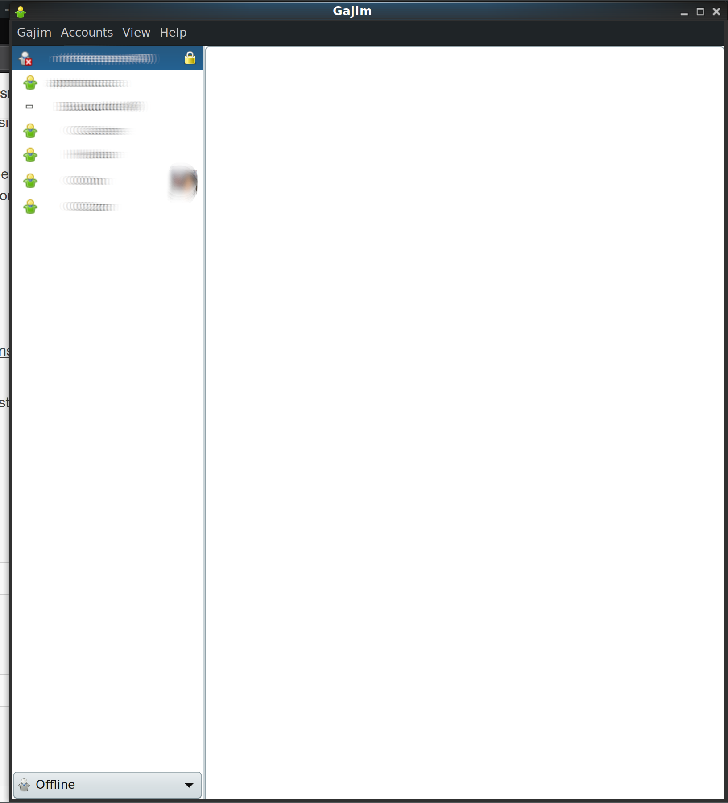
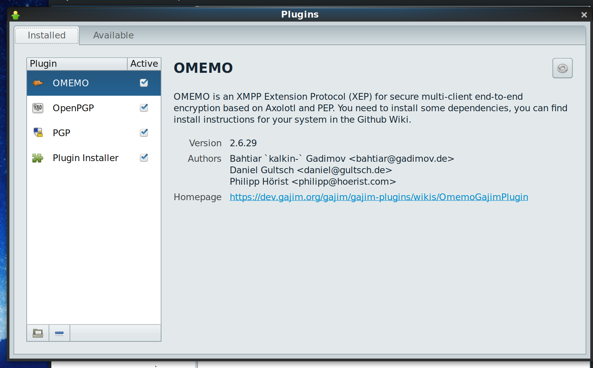
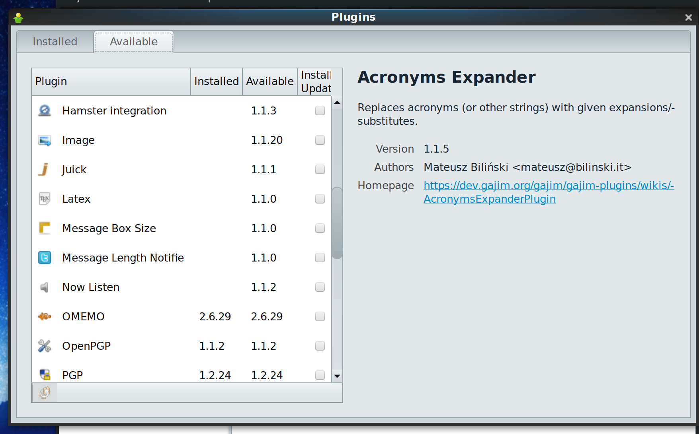
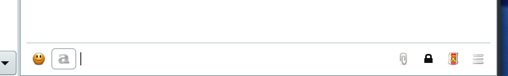
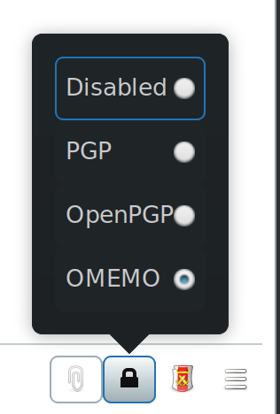
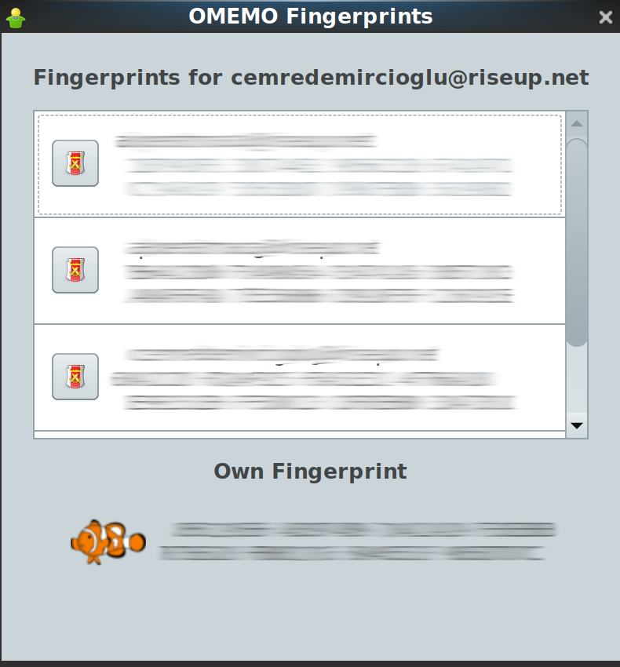

# OMEMO

## OMEMO’ya Giriş

[OMEMO](https://conversations.im/omemo/) mesajlaşmanın baştan sona(end-to-end) şifrelenmesini sağlar. [OTR](otr.md) ile pratik olarak ayrılan modern ihtiyaçlara yönelik özellikleri mevcuttur. 

* __Şifreleme__ Bütün şifreleme cihazınızda gerçekleşir. Sohbet güvenli olmayan ağlar ve hizmet sağlayıcılar üzerinden yapılsa bile başkaları tarafından okunması engellenir.
* __Doğrulama__ Konuştuğunuz kişilerin cihazlarının aynı cihaz olduğunu doğrulama.
* __Perfect forward secrecy (mutlak gizlilik)__ Eğer özel anahtarlarınızın kontrolünü kaybederseniz önceki herhangi bir sohbetiniz ifşa olmaz.
* __İnkar Edilebilirlik__ Gönderdiğiniz mesajlar sizin tarafınızdan gönderildiğine ilişkin üçüncü kişilerce anlaşılabilecek bir emare taşımaz. Herhangi biri sohbetin bitimi ertesinde mesajları sizden gelmiş gibi gösterebilir. Bununla birlikte, sohbet sırasında sizin iletişimde olduğunuz kişi gördüğü mesajların doğrulanmış ve değiştirilmemiş olduğundan emindir.

## OTR ile OMEMO'nun farkı

OTR ile OMEMO'yu ayıran iki önemli fark vardır.

* OTR herkesin şanslı iseler bir bilgisayarı bulunduğu ve "online" olmanın istisna olduğu bir zamanda tasarlanmış bir yazılım. Bu sebeple anlık olarak iki cihaz arasında, oturum sırasında iletişim kurmaya imkan vermekte. Hali ile bugün alışılan grup yazışmalarının yapılması mümkün değil. OMEMO ise grup yazışmalarına imkan tanımakta.

* OTR iki cihazın da oturum başlangıcında İnternet'e bağlı olmalarını gerektirmekte. Bu sebepten offline olarak atılan mesajların alıcısına ulaşması mümkün olmamakta. OMEMO ise çift anahtarlama imkanı ile offline olarak atılan mesajların sunucuda belirli bir süre saklanarak daha sonra bağlanan alıcısına gönderilmesine imkan veriyor.

* OTR insana dayalı bir güven sistemine sahip. İnsanların kişisel olmayan cihazları kullanmalarının çok yaygın olduğu dönemde iletişimde bulundukları kişilerin gerçekten iddia ettikleri kişi olduklarını doğrulanması elzem görülmüş. Bugün ise herkes kişisel cihaz sahibi ve cihazları kriptografik anahtarlar aracılığı ile doğrulamak çok daha kolay bir yöntem olduğundan OMEMO tarafından cihaza güven prensibi kabul edilmiştir.

## OMEMO'yu Yükleme

### GNU/Linux

Şu anda GNU/Linux sistemlerde [tam işlevsellikle](https://omemo.top/) çalışan en iyi yazılım [Gajim](https://gajim.org/) Pidgin için geliştirilen OMEMO eklentisi hala geliştirme aşamasında bulunduğundan sağlıklı olarak kullanılması pek mümkün değil gün itibari ile.

#### Bir uçbirim açın veya Alt+F2’ye basın ve çalıştırın:

Debian ve Ubuntu (APT):
`sudo apt-get insall gajim gajim-omemo`
Red Hat ve Fedora (RPM):
`sudo dnf insall gajim`
`sudo dnf copr enable philfry/gajim`
`dnf install python3-axolotl python3-axolotl-curve25519 python3-qrcode`

Bu aşamadan sonra Gajim'i sisteminizde OMEMO eklentisi ile çalıştırabiliyor olacaksınız.

OMEMO eklentisini etkinleştirmek için Gajim menüsünden plugins (eklentiler) kısmına girin.

Ertesinde available (indirme) sekmesinden OMEMO eklentisini indirip kurabilir ve yüklenenler sekmesinden etkinleştirebilirsiniz.

### Android

[F-Droid](https://f-droid.org/) veya bir başka kaynaktan [Conversations](https://conversations.im/) indirin. Conversations'nın [Pix-Art](https://github.com/kriztan/Pix-Art-Messenger) gibi başka forkları da olmasına rağmen özellikle onları tercih etmenizi gerektirecek bir sebep olmadıkça Conversations en iyi tercih olacaktır.

### Mac

Pidgin isimli yazılımı yükleyip, Pidgin için OMEMO eklentisi olan [lurch](https://github.com/gkdr/lurch)'u üzerine kurarak OMEMO'yu kullanabilirsiniz. Ayrıca Gajim'in [rehberini](https://dev.gajim.org/gajim/gajim/-/wikis/Gajim-0.16-MacOS) takip edebilirsiniz. (_lurch hala geliştirilme aşamasında olan deneysel bir eklentidir._)

## Hesabınıza giriş yapın veya yeni hesap oluşturun

Şayet bir sunucuda XMPP hesabınız var ise kullanıcı adı ve parolasını girerek bağlantı sağlayabilirsiniz. Şayet bir XMPP hesabınız yok ise XMPP istemcileri hesap eklerken "bu sunucuda hesap aç" anlamında bir seçeneği işaretleyerek girdiğiniz bilgilerle, bu özelliği kullanan sunucularda kullanıcı oluşturma imkanı vermekte.

Aşağıdaki sunucuları tercihinizde değerlendirebilirsiniz;

[Calyx Institute](https://www.calyxinstitute.org/) - Çok geniş bir XMPP kullanıcı kitlesine hizmet veren bir dernektir. Dijital haklar alanında çalışmalar sürdüren derneğin XMPP sunucusu anonim kayıt kabul ediyor.
Kayıt için (kullanıcı adı)@jabber.calyxinstitute.org alan adı kullanılabilir.

[Conversations](https://conversations.im/#xmpp) - Conversations yazılımının kendi sunucusu. Şayet özgür yazılıma destek olunmak istiyorsanız ücretli bu hizmeti tercih edebilirsiniz. İlk altı ay ücretsiz kullanım imkanı vermekte.

[Riseup](https://www.riseup.net) - Riseup teknoloji kolektifinin ücretsiz hizmetlerinden biri de XMPP. Doğrudan kayıt imkanı vermediği için bir Riseup hesabı sahibi olmanızı gerektiriyor. Riseup'ın amacı dünyada mücadele gösteren topluluklara ve kişilere teknolojik destek vermek olduğundan ve sadece bağış ile ayakta kaldıklarından ya bağış yapmak ya da kaynaklarını kullanmak konusunda dikkatli olmak gereklidir.

## Rehbere Arkadaş Ekleme

* Arkadaş eklemek için, ana Gajim penceresinden Accounts (Hesaplar) > Add Contact (kişi ekle) seçin.

* Kendi hesabınızı seçtiğinizden ve doldururken arkadaşınızın kullanıcı adını doğru yazdığınızdan emin olun. Arkadaşlarınızı kategorize etmek üzere grup oluşturma seçeneğiniz bulunmakta.

* Add (Ekle) ’e tıklayın.

* Arkadaşlarınız eklendiğinde sohbet etmeye uygun bir şekilde ana Pidgin penceresinde görünecekler. Sohbeti başlatmak için listeden arkadaşınızın kullanıcı adına çift tıklayabilirsiniz.

## Arkadaşları Doğrulama

OMEMO ile yazışmaya başlamak için öncelikle konuşma penceresinde mesaj kutusunun yanındaki asma kilit sembolünden OMEMO'yu seçmekle başlayın.

Daha sonra ilk mesajınız ile karşı tarafın OMEMO anahtarı sunucudan çekilecek ve size güvenip güvenmediğiniz sorulacak. Bu ekranda size ait tüm cihazların anahtarları ile karşı tarafın kullandığı tüm anahtarlar listelenecektir.

Sertifika simgesine tıklayarak tüm anahtarlara olan güveninizi işaretleyebilir anahtarları silebilirsiniz. Anahtarları doğrulamak için konuştuğunuz kişi ile ikinci farklı bir kanaldan tercihen sesli iletişim ile karşılaştırma yapabilir veya yan yana geleceğiniz bir anı bekleyebilirsiniz. Mümkün olduğu sürece anahtarlara **asla** körlemesine güvenerek yazışma yapmayın.
