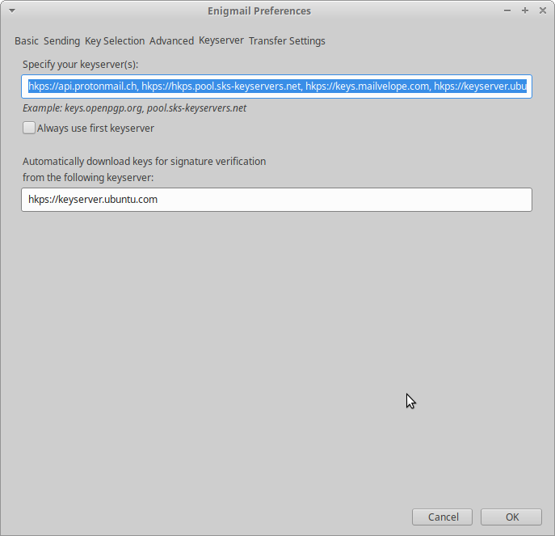
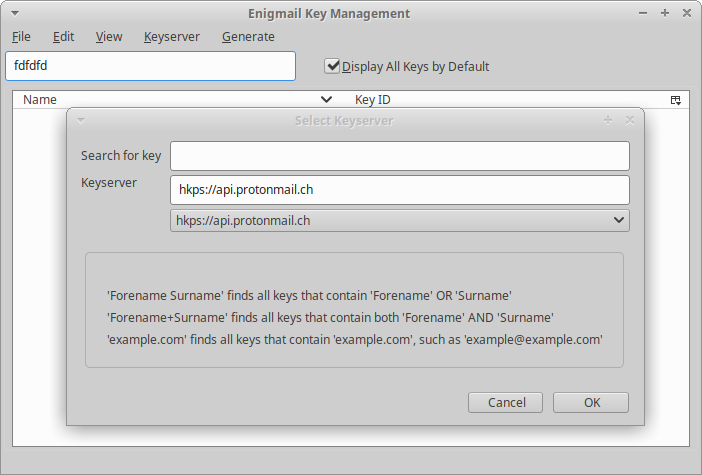
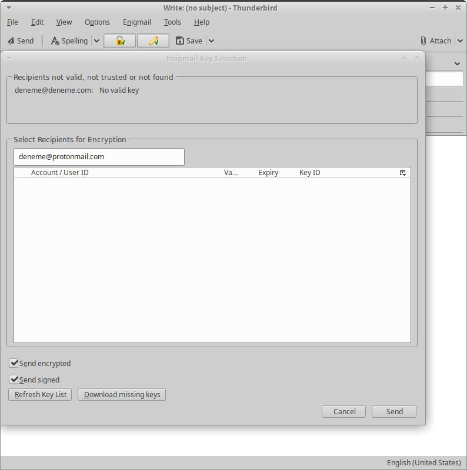
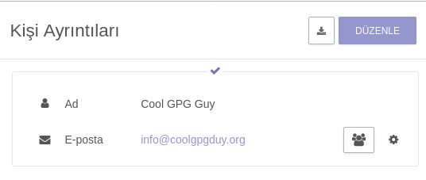
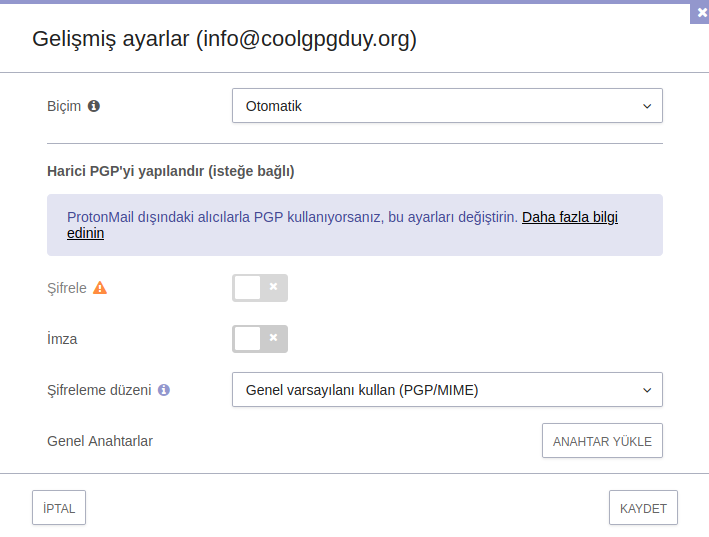

# Protonmail ile GnuPG Kullanımı

## Protonmail nedir?

[Protonmail](https://protonmail.com) şifreli bir e-posta hizmetidir. Güvenlik rehberinin detaylıca incelediği şifreli e-posta hizmet sağlayıcıları arasında Protonmail'i ayıran özellik GnuPG şifrelemenin hizmetin temelinde olmasıdır. Bu Protonmail kullanıcılarının Protonmail dışındak diğer e-posta adreslerine GnuPG şifreli e-posta atabilmelerini ve diğer e-posta adreslerinden GnuPG şifreli e-posta alıp tarayıcıdan okuyabilmelerine imkan veriyor. Bu bakımdan Protonmail kullanıcıları uçtan uca şifrelemeye sadece Protonmail kullanıcıları arasında değil tüm GnuPG kullanıcıları arasında sahip oluyorlar.

Protonmail kullanmak elde edebileceğiniz en güvenli GnuPG kurulumu değildir. Protonmail'e her girdiğinizde tarayıcınıza gelen javascript kodunu doğrulamanız mümkün değildir. Protonmail'in istemcileri de ne yazık ki hala özgür değil. Bunun tek istisnası smtp ile Protonmail hesabınıza bağlanmanızı sağlayan [köprü(bridge)](https://protonmail.com/bridge) yazılımı. Her ne kadar Protonmail size yukarıdaki gerekçeler ile en iyi sonucu vermeyecek de olsa, pek çok Protonmail kullanıcısı ile çokça tehdit modeline yeterli güvenli yazışma yapmak ve gerekirse diğer GnuPG kullanıcıları ile yazışmanız çok kolay. Karar size kalmış.

## Protonmail'e GnuPG ile E-posta Atmak

GnuPG şifrelemesi yapmak için ilk gereken şey yazışacağınız Protonmail adresine ait anahtarı elde etmek. Bunun için;

* Yazıştığınız kişiden anahtarını e-posta ekine koymasını isteyebilirsiniz. Bu durumda gelen anahtarı import edip hiç sorun çekmeden kullanmaya başlayabilirsiniz.

* E-posta şifreli ise arkanıza yaslanıp şifreli cevap verebilirsiniz. Keza Enigmail otomatik olarak şifreli gelen e-postanın anahtarını bulacaktır.

* Protonmail anahtar sunucusundan ilgili anahtarı çekebilirsiniz.

### Protonmail Anahtar Sunucusundan Anahtar Çekmek

Anahtar sunucuları GnuPG kullanımının temel araçlarından biri. Bir firhist olan bu sunuculardan Protonmail'de sadece kendi anahtarlarını içerecek şekilde bir tane bulunduruyor. Protonmail'in sunucusu diğer sunucularla eşitlenmediğinden sadece bu sunucuya tam Protonmail adresi ile istek atarak cevap almanız mümkün.

Uçbirimde:

`gpg --search --keyserver hkps://api.protonmail.ch [aradığınız adres]`

şeklinde arama yapabilirsiniz. Adresi doğru girdi iseniz bir tane anahtar size önerilecektir. 1'e basıp ilgili anahtarı indirebilirsiniz.

Şayet Thunderbird/Enigmail ikilisini kullanacaksanız birden fazla imkanınız bulunuyor. Bunlardan ilki, özellikle Protonmail adresleri ile sıkça yazışacaksanız, Protonmail anahtarsunucusunu Enigmail'in ayarlarından anahtar sunucuları listesine eklemektir. Bunu yapmanın güzel tarafı Enigmail şayet anahtarını bilmediği bir Protonmail adresi görür ise bunun anahtarını otomatik olarak indirip şifreleme seçeneğini açacaktır.

Şayet e-posta yazma ekranında hızlıca bunu yapmaya karar verirseniz, Enigmail sekmesinden anahtar yönetimi (key management) kısmına tıklayıp anahtar sunucusu (keyserver) kısmına Protonmail'in sunucu adresini girip doğrudan arama yapma seçeneğini seçebilirsiniz.

Şayet e-postanızı göndermeden önce şifreleme seçeneğini açarsanız, Enigmail anahtarı olmayan Protonmail adresinin anahtarını göstermenizi sizden isteyecektir. Bu noktada eksik anahtarları indir (download missing keys) seçeneğini tıklayıp anahtar yönetimi sayfasından bir üstteki adımı takip ederek işleminizi bitirebilirsiniz.

Tebrikler, bir Protonmail kullanıcısına tek seçeneklerinin Protonmail olmadığını göstermiş oldunuz. Protonmail'e atacağınız e-postaların ekine açık anahtarınızı eklemeniz veya e-postayı şifreli atmanız durumunda Protonmail sadece **web** istemcisinden otomatik olarak şifreli yanıt atacaktır. Android ve OS istemcilerde sorun çıktığı görülmüştür. Hali ile yazıştığınız kişiyi bu konuda bilgilendirmeniz önerilir. Sizin açık anahtarınızı Protonmail hesaplarında sizin adınıza eklemeleri gereklidir sorunsuz bir iletişim için.

## Protonmail'den Diğer Adreslere GnuPG Şifreli E-posta Atmak

Protonmail'den GnuPG kullanan bir başka adrese şifreli e-posta atmak için öncelikli olarak ilgili e-postanın açık anahtarını yazışmak istediğiniz kişinin adına rehberinize eklemeniz gerekli.

Şayet GnuPG kullanan kişi size ilk mesajı imzalı ve açık anahtarı ekli attıysa "Bu ileti, henüz güvenilmeyen bir genel anahtar tarafından imzalanmıştır." ibaresi çıkacak ve yanında güven anahtarı düğmesi olacaktır. Bu özetle kişinin anahtarını kendi anahtarınızla imzalamanız ve otomatik olarak kişinin açık anahtarının adına eklenmesi ile gelecek yazışmaları otomatik olarak GnuPG şifreli yapacaktır.

Şayet gelen e-posta şifreli veya imzalı değilse ya da siz ilk şifreli e-postayı atacaksanız öncelikle rehberinizden şifreleme yapmak istediğiniz kişinin paneline gelin ve küçük dişli şekliyle ifade edilen gelişmiş ayarları açın.

Daha sonra açılan ayarlardan anahtar yükle seçeneğini seçerek ilgili kişinin anahtar dosyasını yükleyin ve şifrele ve imzala düğmesini aktif hale getirin.

Bundan sonra kişiye atacağınız e-postalar kişinin GnuPG anahtarı ile şifrelenecek ve imzalanacaktır.

## Gelişmiş Seçenekler

Protonmail çeşitli GnuPG işlemlerini yapmak için kullanıcılarına seçenekler sunmaktadır. Bunlar arasında:

* Gönderiye açık anahtar eklemek
* Gönderiyi imzalamak
* Her gönderiye açık anahtar eklemek

### Gönderiye Açık Anahtar Eklemek ve İmzalamak

Protonmail'den bir dış adrese yazışma yaparken yeni ileti ekranının konu başlığından sonraki satırında sağ taraftaki ok işaretinden açılan menü aracılığı ile ilgili iletiyi imzalayabilir ve açık anahtarınızı iletiye ekleyebilirsiniz. Bu yazdığınız kişi GnuPG kullanıyor ise sizden gelen e-postanın değiştirilmediğini bilebilir ve size atacağı cevabı kolaylıkla şifreleyebilir.

### Her Gönderiye Açık Anahtar eklemek ve İmzalamak

Bunun için Protonmail hesabınızın ayarlarına girip güvenlik sekmesinin altında bulunan "Harici PGP ayarları" bölümünden imzalama ve açık anahtar ekleme seçeneklerini etkinleştirin. Aynı bölümde "Adres Doğrulama" seçeneğini de göreceksiniz. Bu ayar ile iletişimde olduğunuz GnuPG kullanıcılarının anahtarlarını imzalama seçeneğine kavuşursunuz. Bu hem protonmail'in doğru anahtarı size sunduğuna güven duymadan anahtar doğrulaması yapmanızı sağlar hem de konuştuğunuz harici GnuPG kullanıcıları ile güven ilişkinizi sağlar.
