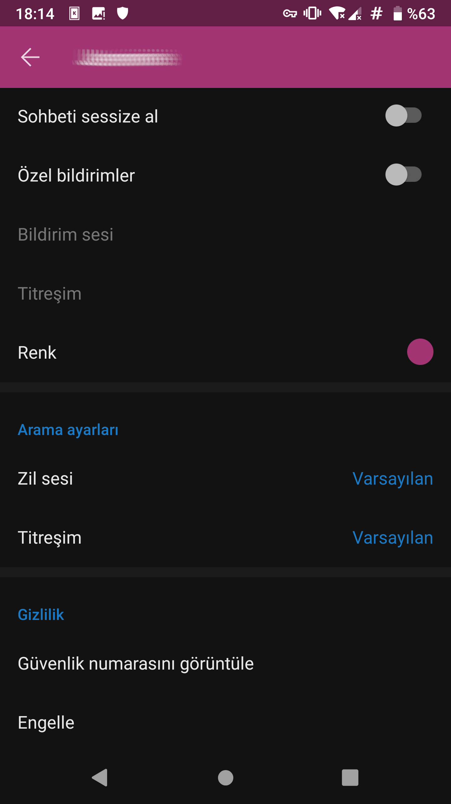
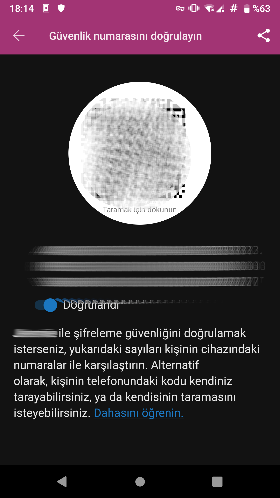

# Signal

[Signal App](https://www.signal.org) Android, GNU/Linux, iOS ve Windows cihazlarda çalışan, OTR'nin takipçisi olan [OMEMO](https://conversations.im/omemo/) protokolüne benzer bir yapı ile çalışan bir anlık yazışma yazılımıdır. [Open Whishper Systems](https://en.wikipedia.org/wiki/Open_Whisper_Systems) tarafından geliştirilen yazılım pek çok güvenlik uzmanı tarafından başarılı bulunmaktadır. 

## Avantajları

* __Şifreleme__ Signal, tüm yazışma ve görüşmeleri cihazınızda konuştuğunuz kişiye özel ürettiği anahtar ile şifreler. Bu sayede yazışmanın gönderildiği aşamada ne ağı takip edenler ne de Signal'in kendi sunucuları yazışmalarınızın içeriğine ulaşamaz.
* __Bütünlük__ Signal kullanırken eğer konuştuğunuz kişiler ile *güvenlik numaranızı* bir karekodu taratarak veya parmak izini karşılaştırarak doğrularsanız iletişimizde araya kimsenin girmediğine emin olabilirsiniz. Signal bu numaranın bir sebeple değiştiği durumlarda belirgin şekilde kullanıcılarını uyararak güvenliğin eksildiğini bildirir.
* __Perfect forward secrecy (mutlak gizlilik)__ Eğer özel anahtarlarınızın kontrolünü kaybederseniz önceki herhangi bir sohbetiniz ifşa olmaz.

## Dezavantajları

* __Cihaza güven__ Signal protokolü OMEMO gibi *cihaza* güven taşıdığı için o cihazı kullanan bir başkası ise o *kişiyi* doğrulamanın OTR gibi bir imkanı yoktur.
* __Federasyon eksikliği__ Signal'in arkasında bulunduğu Whisper Systems ve Moxie Merlinspike Signal sunucularını [federasyona](https://en.wikipedia.org/wiki/Fediverse) açmayacağına dair kesin bir duruş sergilemektedir. Bu bakımdan ileride Whisper Systems ortadan kalkar veya hizmetlerini vermek konusunda kısıtlamalara giderse Signal kullanıcıları çaresiz kalacaktır.
* __Anonim olmaması__ Signal anonim olarak kullanılabilecek bir yazılım değildir. Kurulumu sırasında kullanıcılarından SMS alabilecek bir telefon numarası talep etmekte ve kullanıcının arkadaşlarını rehberinde bulunan telefon numaraları aracılığı ile bulmaktadır. Her ne kadar signal telefon numaralarını doğrudan sunucusuna yüklemese de bir kullanıcı kimliğini veya telefon numarasını koruyarak bir başka Signal kullanıcısı ile görüşemez. Kimi basın çalışanlarının yaşadığı gibi bu durum kimi zaman tehlike yaratabilir.

## Signal nasıl kurulur?

### Mobil Platformlar

Android veya IOS çalıştıran cihazlarda Signal kullanmak, herhangi bir yazılımı kurmak kadar kolaydır. Playstore veya Appstore'dan arama yapıp Signal'i kurabilirsiniz. 

Bu şekilde kurulum yaptığınız durumda Signal'in Google'ın bildirim ve harita hizmetlerine ait bağımlılıklarını içeren versiyonunu kuracağınızı aklınızda bulundurmalısınız. Ne yazık ki Signal bu bağımlılıkları kullanmakta israr ettiği ve belirli yazılım özgürlüklerini göz ardı ettiğinden F-droid depolarında yer bulmamakta. Bu yüzden Android versiyonunun [APK](https://signal.org/android/apk/) kurulum dosyasını indirmelisiniz. **MUTLAKA** indirdiğiniz dosyanın parmak izi doğrulamasını yapın. Bunun için bir GNU/Linux bilgisayarda uç birimde aşağıdaki komutu çalıştırarak Signal'in indirme sayfasında verdiği parmak izi karşılaştırılabilir;

`keytool -list -printcert -jarfile [apk'nın yolu]`

Kurulum bir kere güvenli şekilde tamamlandıktan sonra Signal kendisini düzenli olarak güncelleyecektir.

### GNU/Linux

Signal kendi [web sayfasında](https://signal.org/download/#linuxModal) Debian tabanlı dağıtımlar için kurulum dosyasını sunmaktadır.

Flatpak kullananlar dağıtımlarından bağımsız olarak Signal masaüstü istemcisini sistemlerine Flatpak repolarından kolaylıkla kurabilirler.

## İpuçları ve Öneriler

* Signal mahremiyet vaadeden bir platform değildir. Tüm kullanıcılarını, kimliklerine sıkı sıkıya bağlı ve anonimlikten uzak cep telefonu numarası ile tanımlar. Telefon numarası anonimliğin güvenlik için gerektiği durumlarda ciddi tehlikeli bir veridir. Bu bakımdan Signal'den beklentiniz anonimlik olmamalıdır.

* Signal'i kullandığınız kişiler ile anahtarlarınızı doğrulamazsanız şifrelemenin güvenliğini ciddi miktarda zayıflatmış olursunuz. Bu tip saldırılar hem [devletler tarafından](https://yro.slashdot.org/story/18/11/07/2156241/police-decrypt-258000-messages-after-breaking-pricey-ironchat-crypto-app) hem de kötücül amaçlı bireyler tarafından gerçekleştirilebilmekte. Konuşma penceresinde kişi ismine tıkladıktan sonra açılan menünün en altında "Güvenlik numarasını görüntüle" bölümündeki numaraları **SIGNAL HARİCİ** bir kanaldan doğrulayabilir. Yanyana iken gösterilen karekodu taratarak doğrulama yapabilirsiniz.

* Sesli aramalarınızı da Signal aracılığı ile yapabilirsiniz. Bu size olağan aramalara göre çok daha yüksek mahremiyet sağlayacaktır. Çevreniz ile kullanmanız önerilir. Bazı kullanıcılar VPN ile signal kullanırken ses bağlantı sorunları yaşayabilmektedir.

* Signal ve geliştiriciliğini yapan [Open Whisper Systems](https://signal.org/) pek özgürlük taraftarı değildir. Moxie Merlinspike, özgür olan signal'in Google servisleri içermeyen [LibreSignal forkunu yasal tehditler](https://github.com/LibreSignal/LibreSignal/issues/37#issuecomment-217211165) ile ortadan kaldırmıştır. Hali ile Signal bir gün kullanıcılarına sırtını dönerse Signal'i kendi sunucunuz ile kullanmak için çokça çaba harcamanız ve bağlantılarınızı kaybetmeniz olasıdır.
