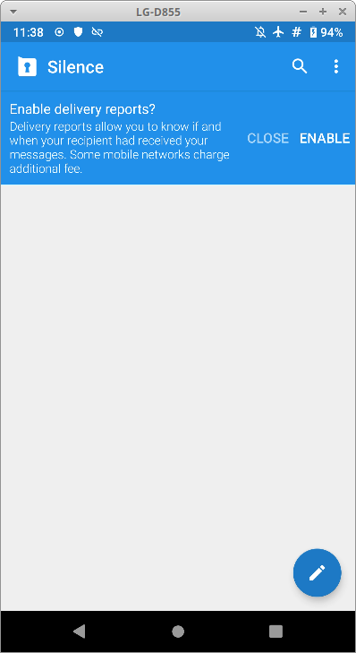
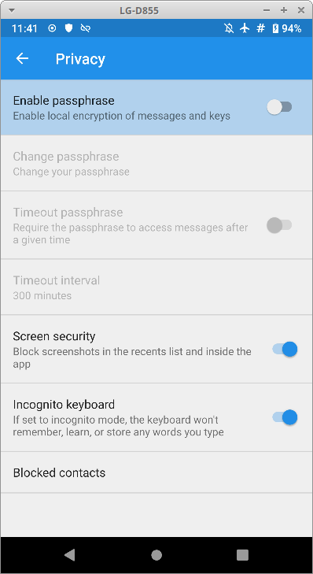

# Silence ile SMS Şifreleme

<!-- toc -->

## SMS'ler neden şifrelenmelidir?

[SMS veya kısa mesaj servisi](https://en.wikipedia.org/wiki/Short_Message_Service) cep telefonlarına gelen ilk yazılı iletişim sistemidir. Bu amaçla günümüzde artık kişiler arasındaki iletişim için pek kullanılmasa da GSM sistemleri tarafından hala desteklenmekte ve [2FA](/beseri_guvenlik/2fa.md) için sıklıkla kullanılmaktadır.

SMS'ler operatörlerin elinde bulunan anahtarlarla telefon ile baz istasyonu arasında şifrelenmektedir. Lakin anahtar kullanıcının kontrolünde olmadığından uçtan uca şifrelemenin sağlayacağı güvenliği veya operatör ile uyması gereken kanunlara karşı mahremiyeti sunamayacaktır. [Aynı zamanda GSM ağındaki SMS şifrelemenin dayanıklılığı da şüphelidir.](https://www.schneier.com/blog/archives/2019/11/eavesdropping_o_8.html)

## SMS şifreleme gerekli midir?

Çoğu günümüz kullanıcısının SMS'i unuttuğu düşünüldüğünde SMS'in gerekliliği veya zaten kullanılmayan bir şeyin şifrelenmesi sorgulanabilir. SMS'i mobil cihazlarla iletişimimiz yönünden önemli kılan bir özelliği vardır: İnternet gerektirmemesi. Mobil İnternet iletişiminin veya genel olarak İnternet erişiminin kesildiği, engellendiği veya bulunulan alan dolayısı ile mümkün olmadığı durumlarda SMS kullanılabilir tek yazılı iletişim sistemidir. Aynı zamanda sesli aramaya göre çok daha az bant genişliği kullandığından afetlerde veya baz istasyonu kapasitesinin dar olduğu bölgelerde başarılı şekilde kullanılabilmektedir.

Bu sebepte ötürü SMS ile şifreli yazışma yapabilmek kimi olasılıklarda yapılabilecek tek şifreli iletişim olabilir. Bu sebepten SMS şifrelemeye bugünden başlanması ve hazır tutulması sadece günlük mahremiyetinizi ve güvenliğinizi arttırmaz aynı zamanda olası bir durumda iletişiminizi güvenli tutmaya imkan sağlar.

## SMS nasıl şifrelenir?

SMS temelde mesaj başına 160 karakter metin aktarımı sağlar. Bu bakımdan haricen şifrelenmiş bir veriyi mesaj olarak göndermenizde bir engel yoktur. Dilerseniz [GPG](yazisma_guvenligi/eposta-sifreleme.md) ile bir mesajı şifreleyip SMS ile uzun da olsa göndermeniz mümkündür. Bu yöntem kesinlikle pratik olmamakla birlikte gerektiğinde kullanılabilir.

[Silence](https://silence.im/) özgür bir Android yazılımı olarak SMS şifrelemeyi neredeyse sorunsuz şekilde gerçekleştirmektedir. [F-droid](https://f-droid.org) üzerinden indirebileceğiniz yazılım cihazınızın standart SMS yazılımının yerine geçer ve hem şifreli hem şifresiz SMS'lerinizi Silence aracılığı ile kullanabilirsiniz. Silence ile diğer SMS yazılımları arasındaki farkı anlamak neredeyse mümkün değildir.

## Silence ile SMS şifreleme

Silence'i kurup ilk çalıştırdığınızda sizi bir kurulum sihirbazı ile karşılayacaktır. Devam (continue) diyerek devam edin.

Açılış ekranı geldiğinde üst çubukta telefonunuzda daha önce bulunan SMS'leri kendi bünyesine eklemek isteyip istemediğinizi soracaktır. Evet demeniz durumunda SMS'lerinize erişmek için yetki isteyecek ve olumlu cevaplamanız üzerine var olan mesajlarınızı indirecektir.

Sonrasında size gelen mesajlara iletildi raporu gönderip gördermemek konusunda izninizi isteyecektir. Bu karar mahremiyet beklentinize göre cevaplamalısınız. İletim raporları mesaj atanlara cihazınızın açık ve mesajın iletildiğini bildireceğinden sosyal/güvenlik sorunları yaratabilir.

Ardından Silence sizi ana ekranı ile baş başa bırakacaktır. Bu noktadan sonra kimi ayarlara müdahale edebilir ve yazılımı tanımaya başlayabilirsiniz. Ana ekrande 3 adet düğme bulunur.

Menüye tıkladığınızda sizi aşağıdaki seçenekler karşılar.

İçe ve dışa aktarım ayarları (import/export) Silence'ın kullanımında önemlidir. Bu ayarlardan Silence'da bulunan SMS'lerinizi yedekleyebilir ve yedeklerinizi daha sonra geri alabilirsiniz. Yedeklerinizi şifreli almanız güvenliğiniz için önerilir veya şifresiz yedeklerinizi alıp daha sonra şifreleyebilirsiniz. [Cihazınıza olan güveniniz bu kararınızda etkili olacaktır.](/cihaz_guvenligi/mobil_cihazlar.md)

Mahremiyet (privacy) ayarları da Silence'ın kullanımına ilişkin önemli ayarları içerir. Bu menüde yapabileceğiniz en önemli ayar bir parola ile Silence'ın anahtar ve SMS'lerinin bulunduğu veri tabanını şifrelemektir. Bunun için parolayı etkinleştir (enable passphrase) seçeneğine tıkladıktan sonra gelen bölüme [bir parola yöneticisinden aldığınız](/beseri_guvenlik/parolalar.md) rastgele parolayı veya bir [Zarola](https://zarola.oyd.org.tr) girerek kurulumu sonlandırabilirsiniz.

Menü de "kimlik anahtarınız" (Your Identity Key) menüsünde, Silence'ın SMS'lerinizi şifrelemekte kullandığı anahtarın parmak izini bulabilirsiniz. Bu parmak izi sizi tanımlamakta ve Silence ile şifreli yazıştığınız kişiler bu anahtara güvenmektedirler. Bu kimlik bilgisini web sitenizde yayınlayabilir, çevrenize çeşitli kanallardan duyurabilirsiniz. Böylece size ilk defa şifreli SMS atacaklar yazışmanın güvenli olduğunu doğrulayabilir. Bu anahtar telefonunuzu değiştirmeniz, yeniden kurmanız veya Silence'ı yedeklemeden kaldırmanız durumunda **kaybolacaktır.** Bu neden ile şifreli bir yedeği dışa aktarıp güvenli şekilde saklayarak anahtarınızı koruyabilirsiniz.

Şifreli yazışma yapmak için ana ekrandan yeni mesaj düğmesine basıp gelen listeden Silence kullandığını bildiğiniz birini seçin ve yeni bir yazışma başlatın.

Karşınıza gelen ekranda kişinin isminin yanında bulunan açık konumdaki asma kilit sembolüne tıklayın ve ardından "Güvenli oturum başlat" (start secure session) düğmesine tıklayın.

Gelen soruyu "evet" olarak cevaplamanız durumunda Silence karşı tarafa anahtar değişimi için bir SMS gönderecektir. Konuşmak istediğiniz kişi Silence kullanıyor ise kendisine sizin onun ile güvenli oturum başlatmak istediğinize dair bir bildirim düşecektir. Kişinin bu bildirimi olumlu cevaplaması ile size anahtar değişimini tamamlayacak bir SMS gelecek ve kişinin isminin yanındaki asma kilit sembolü kapalı konuma geçecektir.

## Anahtarların doğrulanması

Her uçtan uca şifreleme aracında olduğu gibi Silence kullanırken de konuştuğunuz kişiler ile anahtarlarınızı **mutlaka** doğrulamalısınız. Aksi halde iletişimizin arasına giren kötü niyetli bir kişinin iletişiminizi **[takip edebilir veya dilediği gibi değiştirebilir](https://en.wikipedia.org/wiki/Man-in-the-middle_attack).** Bunu engellemek için konuştuğunuz kişinin bölümüne gelip asma kilit simgesine tıklayıp "verify identity" (kimlik doğrula) bölümünü açıp ilgili alandaki size ve karşı tarafa ait anahtarların doğru olduğunu kontrol etmelisiniz.

Bunu doğrulamayı tercihen sesli bir iletişim kanalı üzerinden yapabilirsiniz. GSM araması yerine [signal](signal.md) veya Jitsi araması yaparak daha güvenli bir doğrulama gerçekleştirebilirsiniz. Her halükarda en iyisi bu karşılaştırmayı yüz yüze yapmaktır. Bu durumda anahtarların göründüğü ekranın sağ üst köşesindeki karekod okutma imkanı çok kolaylık sağlayacaktır. Açılan menüden kendi anahtarınızı karekod olarak göstermeyi veya karşı tarafın karekodunu taramayı seçebilirsiniz.

Bu noktadan sonra Silence anahtar değişimi yaptığınız kişi ile şifreli olarak SMS alıp gönderecektir. Siz ise bu durumu asma kilit sembolünden başka hiçbir noktada fark etmeyecek ve rahatlık içinde iletişiminizi sürdürebileceksiniz.
