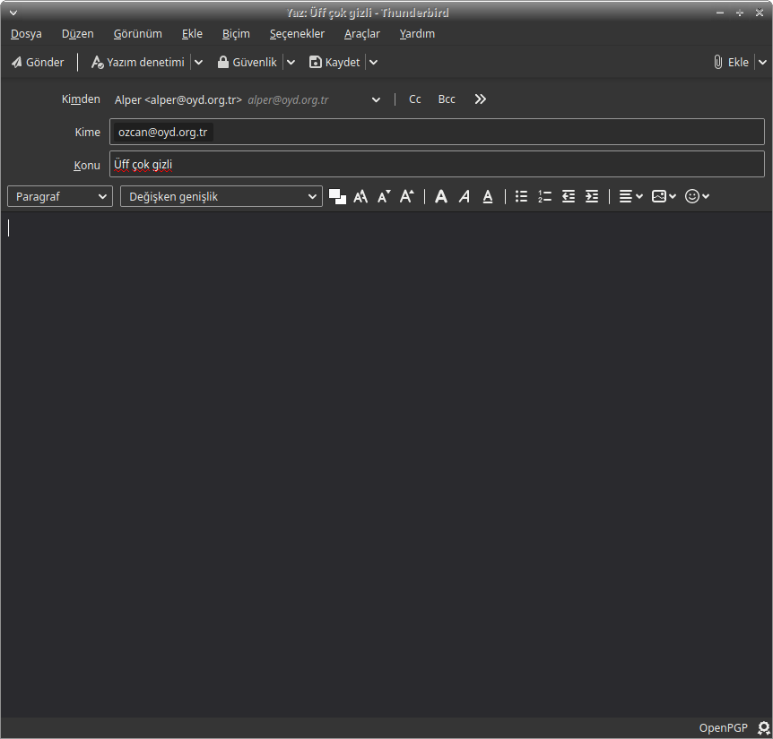

# Thunderbird ile E-posta Şifreleme

[Thunderbird](https://www.thunderbird.net/) [Mozilla Vakfı](https://www.mozilla.org/) tarafından geliştirilen özgür bir e-posta istemcisidir. Aynı zamanda geleneksel olarak GnuPG ile e-posta şifreleme için en çok tercih edilen e-posta istemcisidir. Firefox'un 78. sürümünden önce [Enigmail](https://www.enigmail.net/index.php/en/) isimli eklenti ile şifreleme işlemlerini gerçekleştirilmekte iken yapılan değişiklik ile Enigmail ve Thunderbird bir bütün olarak gelmekte ve şifreleme işlemlerini standart olarak sunmakta.

Enigmail ile Thunderbird'ün birleşmesinden doğan en önemli fark eskiden işletim sisteminin GnuPG altyapısının kullanılmasının terki. Bu bakımdan hali hazırda GnuPG kullanıcısı iseniz var olan anahtar yönetiminizden ayrı bir yönetimi de Thunderbird ile sürdürmeniz gerekecektir. Aynı zamanda Thunderbird [web of trust](yazisma_guvenligi/gpg/wot.md) kullanmamakta. Bu sebeple ayrı bir güven yönetimini de gerektirmekte. Lakin tek dileğiniz şifreli ve güvenli e-posta yazışmasına adım atmak ise Thunderbird ile [anahtar üretiminden](yazisma_guvenligi/gpg/anahtar-uretimi.md) şifreli e-postaya kadar tüm işlemleri kolaylıkla gerçekleştirip hızlıca kullanıma başlayabilirsiniz.

## Thunderbird kurulumu

### GNU/Linux

Thunderbird'ü bilgisayarnıza işletim sisteminizin paket yöneticisinden kolaylıkla kurabilirsiniz.

Bilgisayarınıza Thunderbird kurulumu yapmak için:

Debian tabanlı dağıtımlarda

`sudo apt-get install thunderbird`

RPM tabanlı dağıtımlarda (fedora, centos)

`sudo yum install thunderbird`

Kurulum tamamlandıktan sonra Thunderbird cihazınızda çalışmaya hazır olacaktır.

## Thunderbird ayarları

Thunderbird'ü kurduktan sonra çalıştırmanız üzerine bir e-posta eklemeniz için gereken sihirbaz ile birlikte açılacaktır. Buradan kullanmak istediğiniz e-posta adresinizin hesap bilgilerini ve sunucu ayarlarını girerek kurulumu tamamlayabilirsiniz. Kısa bir süre ardından tüm e-postalarınız listelenecektir.

Sağ bölümden GPG ile şifreli e-posta göndermek istediğiniz hesabınızın üzerine sağ tıklayıp ayarlar seçeneğine tıklayarak kurulum için gereken bölüme gidebilirsiniz.

Açılacak olan ayar penceresinden kullanmak istediğiniz e-postanın altında listelenen uçtan uca şifreleme sekmesine gelip `Anahtar Ekle` seçeneğini seçerek anahtar kurulumu işlemine başlayabilirsiniz.

Karşınıza çıkacak menüde üç seçenek ile karşılaşacaksınız. Şayet bir anahtarınız yok ise bu aşamada oluşturmayı seçebilirsiniz. Bu bakımdan anahtar yönetimi ve güvenliği için şayet çabaya girmeyi değerli görür iseniz [gelişmiş anahtar üretimi rehberimizden](gpg/gpg_gelismis_anahtar_uretimi.md) faydalanabilirsiniz. Aksi halde Thunderbird size kullanılabilir bir anahtarı kolaylıkla oluşturacaktır. Bir anahtarınız var ise bunu Thunderbird'de içe aktarmayı seçebilir veya [Yubikey](https://www.yubico.com/) gibi akıllı bir kartınız varsa onu kullanmayı seçebilirsiniz.

Anahtar oluşturmayı seçtikten sonra karşınıza anahtarınız ile ilgili tercihler gelecektir. Bu tercihler arasında anahtarınızın geçerlilik süresi ile anahtarın üretileceği algoritma bulunmakta. Standart ayarları kullanmanızda bir sakınca bulunmamakla biz anahtarın uzun ömürlülüğü için anahtar boyutunu **4096** bit olarak seçmenizi öneririz. Geçerlilik süresi ise tercihinize kalmış bir durum. Kısa seçmeniz durumunda bu süre içinde anahtarınızı tekrar uzatmak için bir işlem yapmanız gerekir. Her halde bir 3'yıldan daha uzun veya süresiz bir anahtar üretmenizi önermeyiz. Anahtarınızın kontrolünü bir sebepten kaybederseniz anahtarınız **uzun süre veya sonsuza kadar anahtar sunucularında kullanılabilir** kalacaktır.

Thunderbird sizi gerekli entropiyi toplamak için zaman gerekeceğine dair uyaracak ve onaylamanız üzerine anahtar üretimine başlayacaktır.

Anahtarınızın üretilmesi üzerine ana ayarlara dönülecek ve anahtarın başarılı şekilde oluşturulduğu gösterilecektir. Bu noktada anahtarınızı parmakizi ile birlikte görmeniz mümkündür. Anahtarı kullanmak için anahtarınızı seçebilirsiniz.

Eğer anahtarınızın yanındaki oka tıklarsanız anahtarınız ile ilgili daha fazla detayı ve diğer işlemleri yapabilmek için gereken düğmeleri görebilirsiniz. Bu ayarlardan genel GPG işlemlerini yapmanız mümkün. Bu menüdeki önemli seçenek anahtarınızı anahtar sunucusuna gönderme seçeneği. Bunu yapmanızdaki asıl amaç size e-posta atacak diğer kişilerin anahtarınızı bulabilmesi. Şayet bunu yapmamanız durumunda her yazışmada karşı tarafa anahtarınızı göndermeniz ve karşınızdakinin de anahtarı elle yüklemesi gerekliliği doğacaktır. Şayet bu anahtarı kullanmaya ve [korumaya](gpg/anahtar-saklama.md) hazırsanız anahtarınızı sunucuya yükleyebilirsiniz. Unutmayın ki **sunuculara yüklenen anahtarlar bir daha silinemez.** Bu sebeple anahtarınızı dışa aktarıp yedeğini aldığınızdan ve [uygun şekilde sakladığınızdan](gpg/paperbackup.md) emin olun.

Şifreleme tercihi ayarları hemen aşağıda görünecektir. Enigmail ile Thunderbird'ün yeni sürümü arasındaki temel farklılıklardan biri de şifreleme seçeneğinin mümkün olduğu her zaman kullanılmasını seçememeniz. Bu bakımdan şifrelemeyi varsayılan olarak etkinleştirirseniz her şifresiz e-posta atmanızda bilinçli olarak şifrelemeyi kapatmanız gerekir. Aksi durumda da şifreli atmaya niyetlendiğiniz bir e-postayı şifresiz gönderebilirsiniz dalgınlıkla ki bu çok sık yaşanan bir güvenlik ihlali. Bu bakımdan tercih kullanım alışkanlıklarınız ve beklentilerinize kalmakla güvenlik önceliğiniz, yazıştığınız insanlar çoğunlukla GPG kullanıyor veya her şifresiz gönderimde ayarı değiştirmeye hazırsanız şifrelemeyi varsayılan olarak açmanızı öneririz. Aynı zamanda şifrelemeden bağımsız olarak her e-postayı içerik ve bütünlük açısından `Dijital imzamı varsayılan olarak ekle` seçeneği imzalayabilirsiniz.

## Şifreli e-posta gönderimi

Anahtarınızı üretip e-postanız ile ilişkilendirmeniz üzerine ilk şifreli e-postanızı atmaya hazırsınız. Yeni ileti seçeneğini seçtiğinizde açılan pencerede artık bir `Güvenlik` sekmesi bulunacak. E-posta şifreleme işlemlerine ilişkin tercihleri buradan yapabilirsiniz. Şifreli yazışabileceğiniz, anahtarı olan bir arkadaşınızın e-postasını yazıp e-postanızı yazabilirsiniz.

Muhtemelen arkadaşınızın anahtarı Thunderbird'ün anahtarlığında olmayacaktır. Bu sebeple kendisinden anahtarı istemeniz veya anahtar sunucusunda bu anahtarı bulmanız gerekli. Bunun için `Güvenlik` düğmesine basarak durumu inceleyebilirsiniz.

Şayet ihtiyacınız olan anahtar yok ise `Seçilen alıcı için anahtarı yönet...` seçeneğini seçerek anahtar yönetimine girip gerekli işlemlere başlayabilirsiniz.

Açılan sayfadan `Yeni veya güncellenmiş anahtarı keşfet` seçeneğini seçmeniz üzerine Thunderbid anahtar sunucusunda arama yaparak ilgili e-postaya bağlı bir anahtar olup olmadığına bakacak ve sonucu size gösterecektir.

Karşınıza bir veya birden fazla anahtar gelebilir. Unutmayın ki GPG anahtarları merkezi bir otoriteye bağlı olmadığından **herkes dilediği bilgilerle anahtar oluşturup sunuculara yükleyebilir.** Bu durumu aşmanın yolu ulaşmak istediğiniz kişiye anahtar parmakizini sormak veya mümkün ise [web of trust](gpg/wot.md) ile bu doğrulamayı yapmaktır. Tanımadığınız anahtarlara güvenirken bu hususu unutmamanız güvenliğiniz için önemlidir. Anahtara olan güveninizi ekranda çıkan kabul seçeneklerinden belirtebilirsiniz. Bu Thunderbird'ün bu anahtarı kullanıp kullanmamasını belirleyecektir.

Seçimi tamamlamanız üzerine ilgili anahtar indirilecek ve eklenecektir. Ardından anahtarını indirdiğiniz e-posta adresine şifreli e-posta atabilirsiniz. Bunu güvenlik sekmesinden kurulum sırasında varsayılan olarak seçmemiş olmanız durumunda şifreleme yapıp imzalama seçeneğini seçerek gerçekleştirebilirsiniz.

