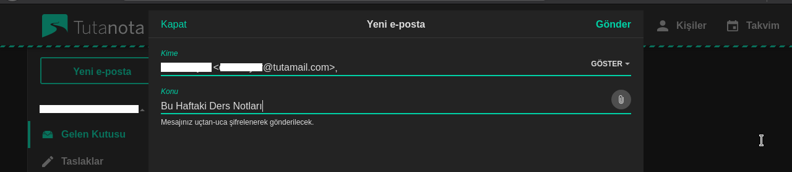
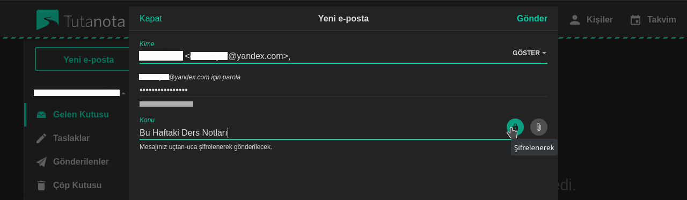
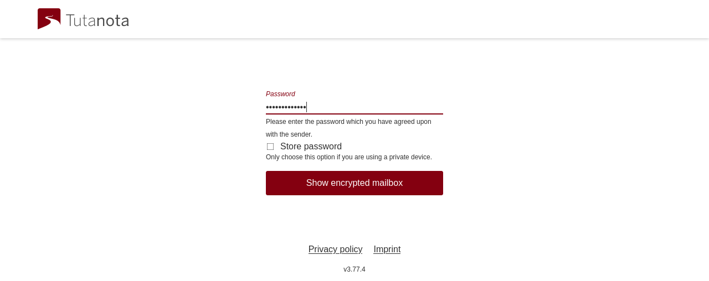
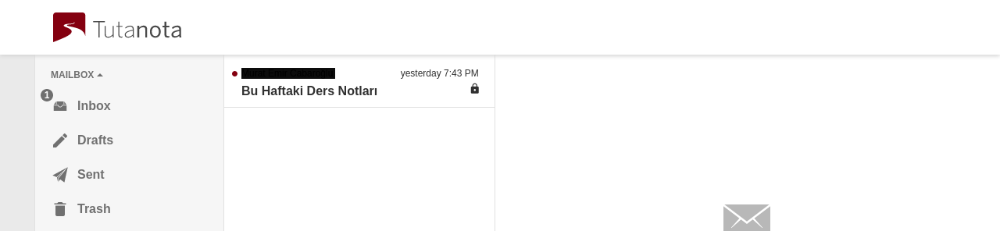
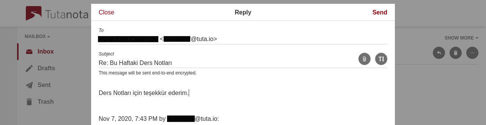
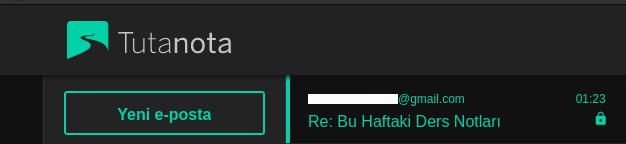

# Tutanota ile Şifreli Yazışma

<!-- toc -->

## Tutanota nedir?

[Tutanota](https://tutanota.com/) şifreli e-posta hizmeti almak için tercih edebileceğiniz servislerden birisi. Tutanota kullanıcıları kendi aralarında varsayılan olarak e-postaları şifrelenerek iletişim kurabilirler. Tutanota kullanmayan birisine şifreli e-posta atmak istediğinizde ise sizin belirleyeceğiniz bir parola ile karşı tarafa e-postanız şifrelenerek gönderilir. Tutanotanın henüz [GnuPG](./gpg/gpg.md) desteği bulunmamakta bu neden ile GnuPG ile şifrelenmiş eposta gönderemez veya alamazsınız. 

Tutanota kendi geliştirdikleri istemcileri ile birlikte kullanılabiliyor. Şifreli e-posta hizmeti veren diğer yerlere göre en önemli avantajı web ve mobil istemcilerinin özgür yazılım olması, bu sayede tutanota mobil istemcisini f-droid üzerinden de [indirebiliyorsunuz]( https://f-droid.org/en/packages/de.tutao.tutanota/ ). Aynı zamanda istemcileri mahremiyet karşıtı bildirim ve captcha hizmetlerini kullanmaz. Geliştirmiş oldukları [bildirim]( https://f-droid.org/en/2018/09/03/replacing-gcm-in-tutanota.html ) ve [captcha]( https://tutanota.com/blog/posts/open-source-email ) altyapılarını kullanarak mahremiyeti ne kadar önemsediklerini aktarıyorlar. Ne yazık ki Tutanota Thunderbird gibi diğer e-posta istemcilerini desteklemiyor ama bunun hakkında çalıştıklarını söylüyorlar.

Tutanota aynı zamanda şifreli adres defteri ve takvim özellikleride sunmakta. E-posta gönderdiğiniz kişiler doğrudan adres defterinize eklenir bu şekilde kolayca hatırlayabilirsiniz. Ayrıca dışarıdan birisine e-posta gönderirken belirlediğiniz parolalarda buraya kayıt edilir. İleride kimin için hangi parolayı kullandığınızı unutmamış oluyorsunuz.

## Tutanota ile şifreli E-posta gönderimi

Tutanota kullanan bir başka kişiye e-posta atmak istediğinizde e-postanız varsayılan olarak şifrelenir. E-postanızı alacak tutanota kullanıcısıda doğrudan e-postanızı görüntüleyebilecek.

## Tutanota ile diğer adreslere şifreli e-posta gönderimi

Tutanota'nın GnuPG desteği bulunmadığından diğer adreslere şifreli olarak ancak sizin belirleyeceğiniz bir parola ile e-posta gönderim sağlanabiliyor. 
Dışarıdan bir kişiye şifreli e-posta atarken dikkat etmeniz gereken kısım gönderi ekranındayken kilit ikonunun seçili olması gerekmekte. İkon seçili iken sizden bu e-posta adresi için bir parola belirlemeniz istenecek sonraki gönderileriniz içinde bu parola adres defterinize kayıt edilmekte. Bu özelliğin dezavantajı ise alıcı kişi için belirlemiş olduğunuz parolayı karşı tarafa farklı yollardan iletmeniz gerekmekte.

Farklı bir adrese şifreli e-posta gönderdiğiniz zaman tutanota konu alanınıda şifrelemekte bu sayede karşı tarafın sunucuları e-postanızın üst verisi dışında başka bir veriye erişemez. Göndermiş olduğunuz e-posta karşı tarafın gelen kutusunda yukarıdaki gibi görünecek. Alıcının gönderinizi okuyabilmesi için öncelikle e-posta içerisinde yer alan bağlantıya tıklaması yada web tarayıcısında adres çubuğuna bağlantıyı yapıştırması gerekmekte.

Alıcı e-posta içerisinde yer alan bağlantıyı açtıktan sonra sizin ona iletmiş yada iletecek olduğunuz parolayı ilgili alana girerek e-postanızı görüntüleyebilir. Alıcı dilerse dilerse sizin ona vermiş olduğunuz parolayı sonraki okumalar ve yanıtlamalar için kayıt edebilir. Siz parolayı değiştirmediğiniz sürece iletişiminiz aynı parola ile şifrelenecektir. Parolanın güvenliği tamamen kişinin sorumluluğundadır.

Alıcı almış olduğu parolayı doğru şekilde girdikten sonra e-postayı okuyabilir.

Alıcı dilerse e-postanızı yanıtlayarak iletişimi şifreli bir şekilde devam ettirebilir. Siz yada karşı taraf gönderilen e-posta akışını silene kadar akış devam edebilir. E-posta akışı silindikten sonra karşı taraf parolayı bilse dahi içeriğe erişemez.

Karşı taraf e-postanızı yanıtladığında sizin gelen kutunuzda bu şekilde görüntülenecek. Gönderilen yada alınan bir e-postanın tutanota üzerinde şifrelenmiş yada şifrelenmemiş olduğunu küçük kilit ikonu sayesinde anlayabilirsiniz.

