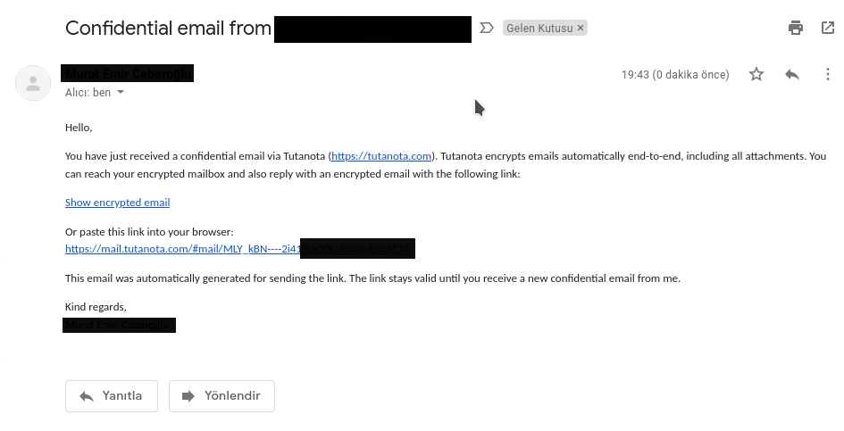

# Tutanota ile Şifreli Yazışma

## Tutanota nedir?

[Tutanota](https://tutanota.com/) şifreli e-posta hizmeti almak için tercih edebileceniz servislerden birisi. Tutanota dışında olan birisine şifreli e-posta atmak istediğinizde sizin belirleyeceğiniz bir parola ile karşı tarafa e-postanızı şifreleyerek gönderir. Bunun haricinde tutanota kendi hesapları arasındaki tüm yazışmalar varsayılan olarak şifreli olarak iletilmektedir. Tutanotanın henüz gpg desteği bulunmamakta bu neden ile gpg ile şifrelenmiş eposta gönderemez veya alamazsınız. 

Tutanota kendi geliştirdikleri istemcileri ile birlikte kullanılabiliyor. Diğer şifreli e-posta hizmeti veren servislere göre en önemli avantajı web ve mobil istemcilerinin özgür yazılım olması, bu sayede tutanota mobil istemcisini f-droid üzerinden de [indirebiliyorsunuz]( https://f-droid.org/en/packages/de.tutao.tutanota/ ). Aynı zamanda istemcileri mahremiyet karşıtı bildirim ve captcha servislerini kullanmaz geliştirmiş oldukları [bildirim]( https://f-droid.org/en/2018/09/03/replacing-gcm-in-tutanota.html ) ve [captcha]( https://tutanota.com/blog/posts/open-source-email ) altyapılarını kullanarak mahremiyeti ne kadar önemsediklerini aktarıyorlar. Ne yazık ki Tutanota Thunderbird gibi diğer e-posta istemcilerini desteklemiyor ama bunun hakkında çalıştıklırını söylüyorlar.

Tutanota aynı zamanda şifreli adres defteri ve takvim özellikleride sunmakta. E-posta gönderdiğiniz kişiler direk adres defterinize eklenir bu şekilde kolayca hatırlayabilirsiniz. Ayrıca dışarıdan birisine e-posta gönderirken belirlediğiniz parolalarda buraya kayıt edilir ileride kim için hangi parolayı kullandığınızı unutmamış oluyorsunuz.

## Tutanota ile şifreli E-posta gönderimi

Tutanota kullanan bir başka kişiye e-posta atmak istediğinizde varsayılan olarak e-postanız şifrelenir fazladan bir iş yapmanıza gerek kalmamakta. E-postanızı alacak tutanota kullanıcısı da herhangi bir girdide bulunmadan e-postanızı görüntüleyebilecek.

## Tutanota ile diğer adreslere şifreli e-posta gönderimi

Tutanota'nın gpg desteği bulunmadığından diğer adreslere şifreli olarak ancak sizin belirleyeceğiniz bir parola ile e-posta gönderim sağlanabiliyor. Dışarıdan bir kişiye şifreli mesaj atarken kilit ikonunun seçili olduğundan emin olmanız yeterli ardından parola kutucuğuna o kişiye özel bir parola ile girebilirsiniz. Sonradan aynı kişiye atacağınız diğer e-postalarda bu parola ile şifrelenecektir. Bu özelliğin dezavantajı ise karşınızdaki kişi için belirlemiş olduğunu parolayı alıcıya farklı yollardan iletmeniz gerekmekte.

Farklı bir adrese e-posta gönderdiğinizde tutanota konu alanınıda şifrelemektedir bu sayede karşı tarafın sunucuları e-postanızın üst verisi dışında başka bir veriye dahi erişemez. Karşı tarafın alacağı e-posta aşağıdaki gibi görünecektir, alıcı e-posta içerisinde yer alan url'e tıklayarak yada web tarayıcısında adres çubuğuna yapıştırarak e-postanızı görüntülemek için gereken ekrana yönlendirilecek.

Alıcı e-posta içerisinde yer alan urlyi açtıktan sonra sizin ona iletmiş yada iletecek olduğunuz parolayı ilgili alana girerek göndermiş olduğunuz e-posta içeriğini görüntüleyebilir. Alıcı dilerse dilerse sizin ona vermiş olduğunuz parolayı sonraki okumalar ve yanıtlamalar için kayıt edebilir. Siz parolayı değiştirmediğiniz sürece iletişiminiz aynı parola üzerinden gerçekleşecektir. Parolanın güvenliği tamamen kişinin sorumluluğundadır.

Alıcı almış olduğu parolayı doğru şekilde girdikten sonra e-postayı okuyabilir.

Alıcı dilerse e-postanızı yanıtlayarak iletişimi şifreli bir şekilde devam ettirebilir taki siz yada karşı taraf gönderilen e-posta akışını silene kadar. E-posta akışı silindikten sonra karşı taraf parolayı bilse dahi içeriğe erişemez.

Karşı taraf e-postanızı yanıtladığında sizin gelen kutunuzda bu şekilde görüntülenecek. Gönderilen yada alınan bir e-postanın tutanota üzerinde şifrelenmiş yada şifrelenmemiş olduğunu küçük kilit ikonu sayesinde anlayabilirsiniz.

